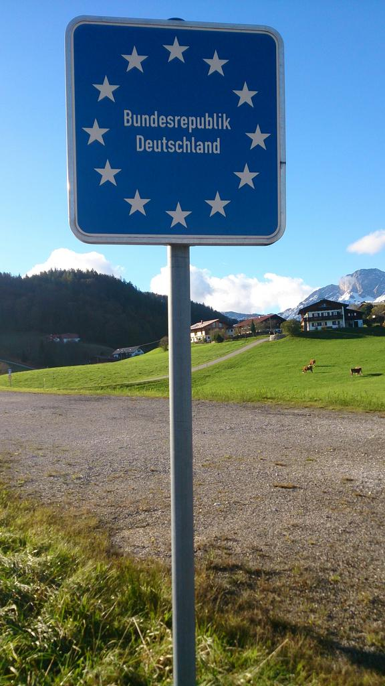
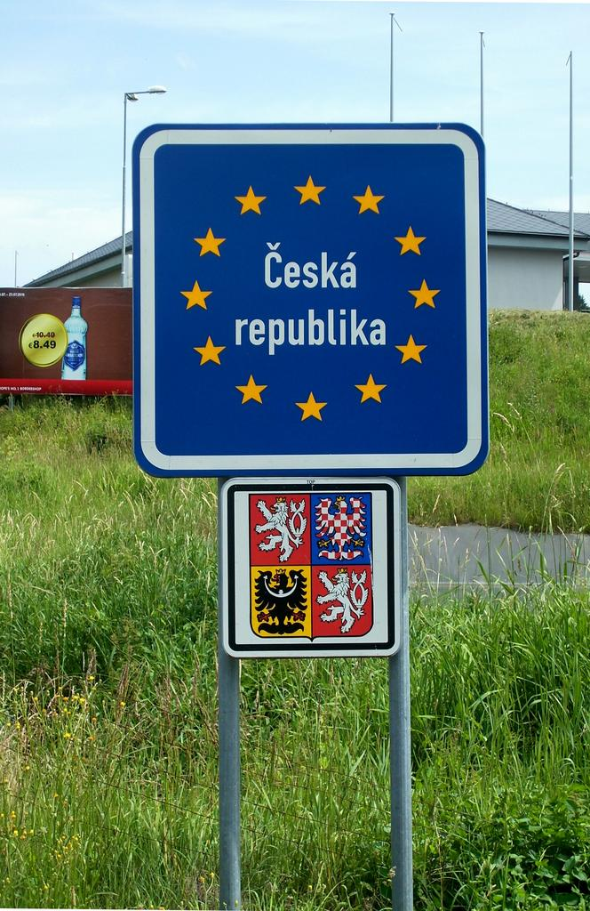
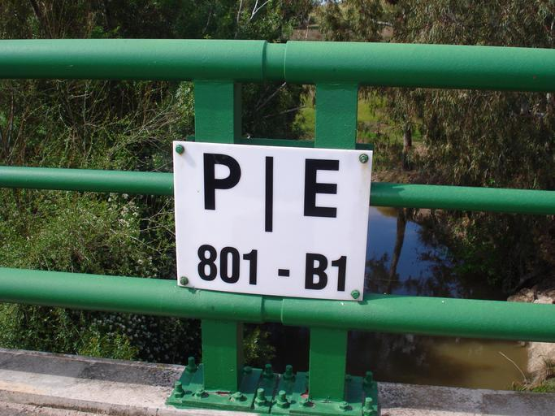

    <h2 class="section-title">{}</h2>
    <ul class="rule-list">
        <li>Negara-negara Uni Eropa sering kali memasang rambu biru di perbatasan mereka.</li>
    </ul>

{}
Anda bisa melihat tanda biru di perbatasan{}.
{}

{}
Terkadang, ada gedung bea cukai dan polisi di perbatasan.
{}

<iframe src="https://www.google.com/maps/embed?pb=!4v1694939272677!6m8!1m7!1s2uxfcCp6uidNx2oYQVCSWw!2m2!1d42.4590981018757!2d2.864144052109467!3f172.86730464981395!4f5.506100536325874!5f0.4000000000000002" width="600" height="350" style="border:0;" allowfullscreen="" loading="lazy" referrerpolicy="no-referrer-when-downgrade"></iframe>

{}
Jalan dan jembatan mungkin memiliki nama negara dan garis batas yang tertulis di atasnya.
{}

