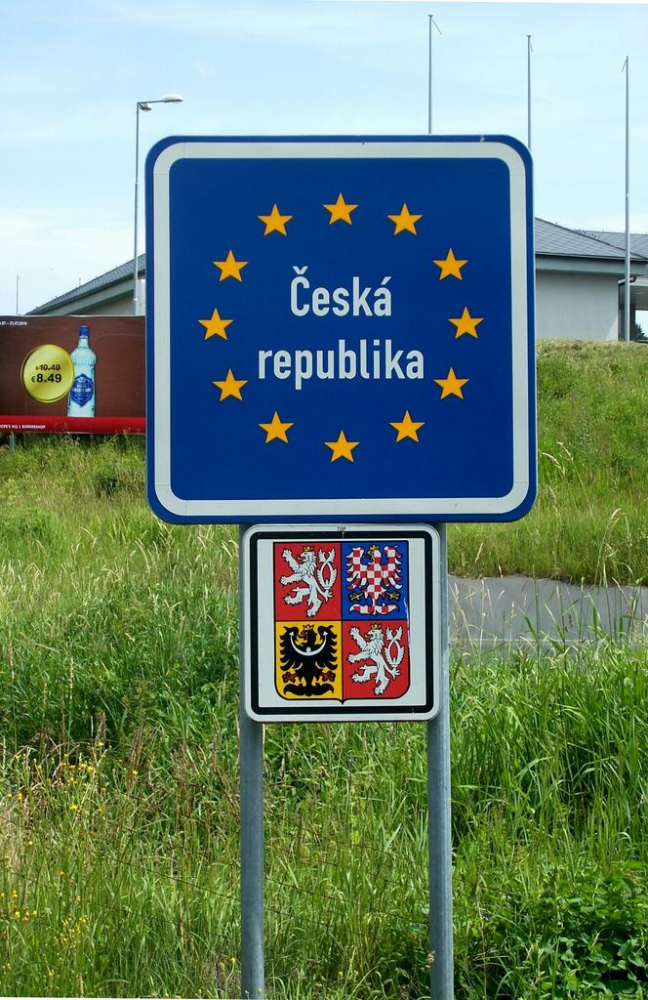
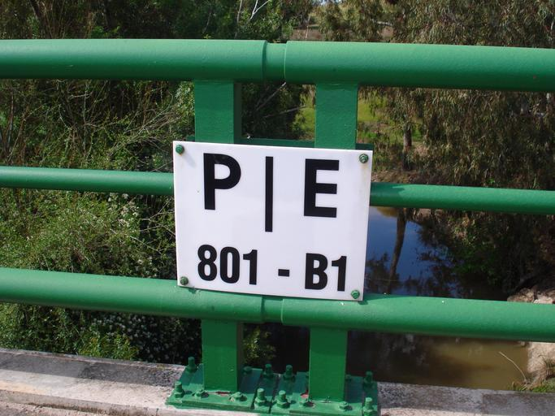
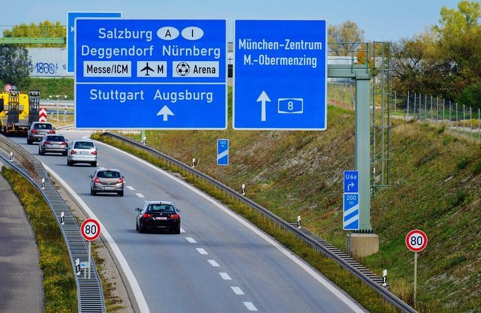
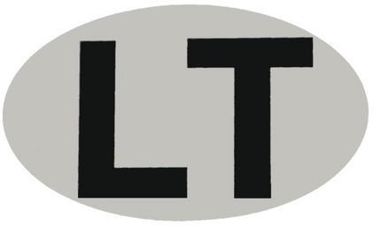

{}
国境によくある青い看板{}
{}

{}
税関や警察署の建物がある。
{}

<iframe src="https://www.google.com/maps/embed?pb=!4v1694939272677!6m8!1m7!1s2uxfcCp6uidNx2oYQVCSWw!2m2!1d42.4590981018757!2d2.864144052109467!3f172.86730464981395!4f5.506100536325874!5f0.4000000000000002" width="600" height="350" style="border:0;" allowfullscreen="" loading="lazy" referrerpolicy="no-referrer-when-downgrade"></iframe>

{}
道路や橋に国名や境界の線が書かれている。
{}

{}
国境を超えた先の都市名が書いてある看板では楕円型のマークが書いてあることが多い。楕円型のマークは車にも付いている{}。
{}

