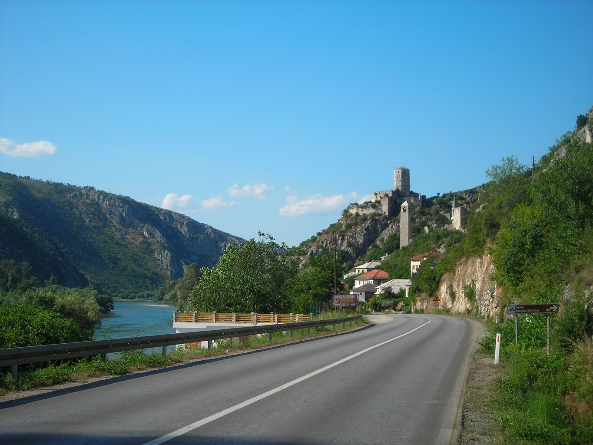
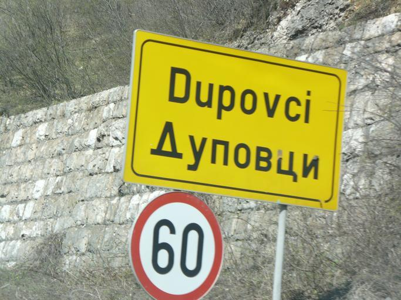
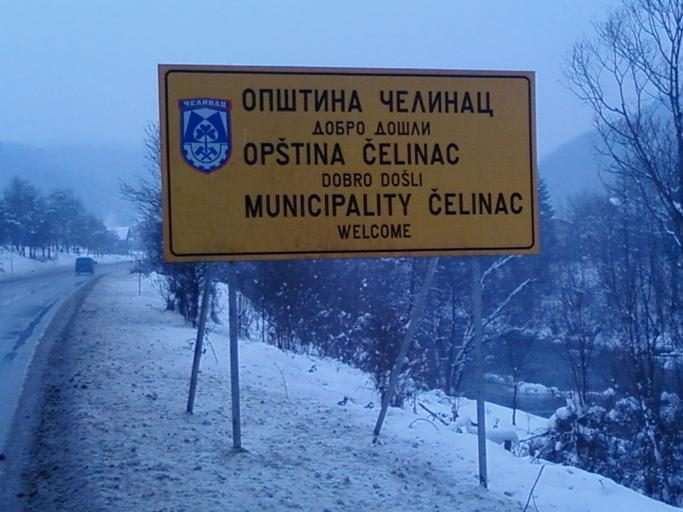

    <h2 class="section-title">{}</h2>
    <ul class="rule-list">
        <li>Per Februari 2024, Street View resmi belum tersedia</li>
        <li>Domainnya adalah .ba</li>
        <li>Guardrail di Bosnia dan Herzegovina serta negara-negara sekitarnya berbentuk sudut tajam</li>
    </ul>

{}
{}
{}
Guardrail dan bollard yang ditemukan di negara-negara sekitarnya.
{}

{}
Tanda jalan dengan dua bahasa sering ditemukan.
{}

{}
{}
