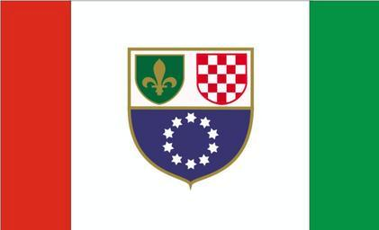
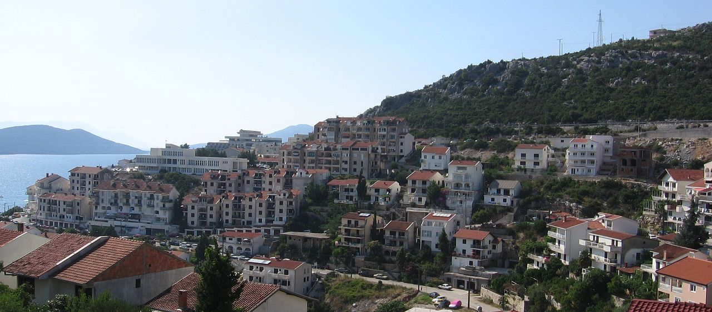

    <h2 class="section-title">{}</h2>
    <ul class="rule-list">
        <li>ボスニア・ヘルツェゴビナ連邦とスルプスカ共和国のふたつの構成体からなる国</li>
        <li>車は右側通行</li>
        <li>ドメインは.ba</li>
    </ul>

{}
{}
{}
周辺国にもある角張ったガードレール{}とボラード{}がある。周辺国のボラード・ガードレール・横断歩道標識が混ざって出現するので注意。
{}

{}
{}に似たマイルストーンの看板が見つかる。道路番号も描いてある{}。
{}

{}
{}平野部に見られるレンガ造りの家がよく見つかる。青色の消火栓も一般的なのでクロアチアと間違えないようにしたい。
{}

{}
{}

    <h2 class="section-title">{}</h2>
    <ul class="rule-list">
        <li>デイトン合意（ボスニア・ヘルツェゴヴィナ和平一般枠組み合意）で定められた二つの行政区分がある
            <ul>
                <li>クロアチア人およびボシュニャク人が主体のボスニア・ヘルツェゴビナ連邦
                    <ul>
                        <li>家の表札などは<b>ラテン文字</b>がメイン{}</li>
                        <li>青・黄色の旗を掲げている家が見つかる{}</li>
                        <li>市外局番が061 / 062 / 063{}</li>
                    </ul>
                </li>
                <li>セルビア人が主体のスルプスカ共和国
                    <ul>
                        <li>家の表札などは<b>キリル文字</b>がメイン{}</li>
                        <li>スルプスカ共和国の国章が見つかる{}</li>
                        <li>赤・青・白の横縞の三色旗を掲げている家が見つかる{}</li>
                        <li>市外局番が065 / 066{}</li>
                        <li>でかい標識を見かける頻度が高い{}</li>
                    </ul>
                </li>
                <li>2言語看板の片方の言語がスプレーで塗りつぶされていたり破壊されていることがある{}。{}のコルシカ島でも似たような現象が見られる。</li>
            </ul>
        </li>
        <li>ディナル・アルプス山脈が国を遮り、南部は標高が高く険しい地形が多い
            <ul>
                <li>北部平野{}</li>
                <li>ディナル・アルプス山脈{}</li>
                <li>南部{}、ネレトヴァ川の河口近くは地中海性気候っぽさを感じる{{% ref "https://ja.wikipedia.org/wiki/%E3%83%8D%E3%83%AC%E3%83%88%E3%83%B4%E3%82%A1%E5%B7%9D" "ネレトヴァ川" %}}</li>
            </ul>
        </li>
    </ul>

{}
{}
{}
行政区分によって使われている言語や掲げられている旗の種類が異なる。
{}

{}
{}
{}
南部にはディナル・アルプス山脈が広がり標高が2000mを超える地域もある。北部は大陸性気候だが、南部の海に近いエリアは地中海性気候となっている。
{}

By <a href="//commons.wikimedia.org/wiki/User:DzWiki" title="User:DzWiki">DzWiki</a>, <a href="https://creativecommons.org/licenses/by-sa/3.0" title="Creative Commons Attribution-Share Alike 3.0">CC BY-SA 3.0</a>, <a href="https://commons.wikimedia.org/w/index.php?curid=14548527">Link</a>

{}
{}

    <h2 class="section-title">{}</h2>
    <ul class="rule-list">
        <li>Bjelašnica山は標高1500mあたりに森林限界があり木が生えていない</li>
        <li>同国でアドリア海に面する唯一の自治体であるNeumがある</li>
    </ul>

{}
{}
{}
Bjelašnica山は標高1500mあたりに森林限界があり、標高が高いエリアには木が生えていない{}{{% ref "https://en.wikipedia.org/wiki/Bjela%C5%A1nica#Climate_and_vegetation" "Bjelašnica" %}}。気候区分としてはアルプス ツンドラ気候（ET）に属している。
{}

{}
{}
{}
海に面しているが大きな港があるわけではない。通り看板にNeumと書かれているので、見つけたら簡単にピンポイントできる{}。
{}

{}
{}