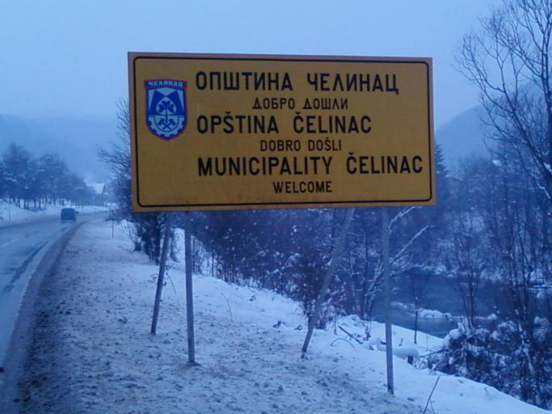

    <h2 class="section-title">{}</h2>
    <ul class="rule-list">
        <li>2025年3月時点では国境付近のごく僅かの場所にストリートビューがある{}</li>
        <li>ドメインは.ba</li>
        <li>ボスニア・ヘルツェゴビナとその周辺のガードレールは角張っている</li>
    </ul>

{}
{}
{}
周辺国にもある角張ったガードレール{}とボラード{}がある。
{}

{}
２言語の看板が見つかる。
{}

{}
{}