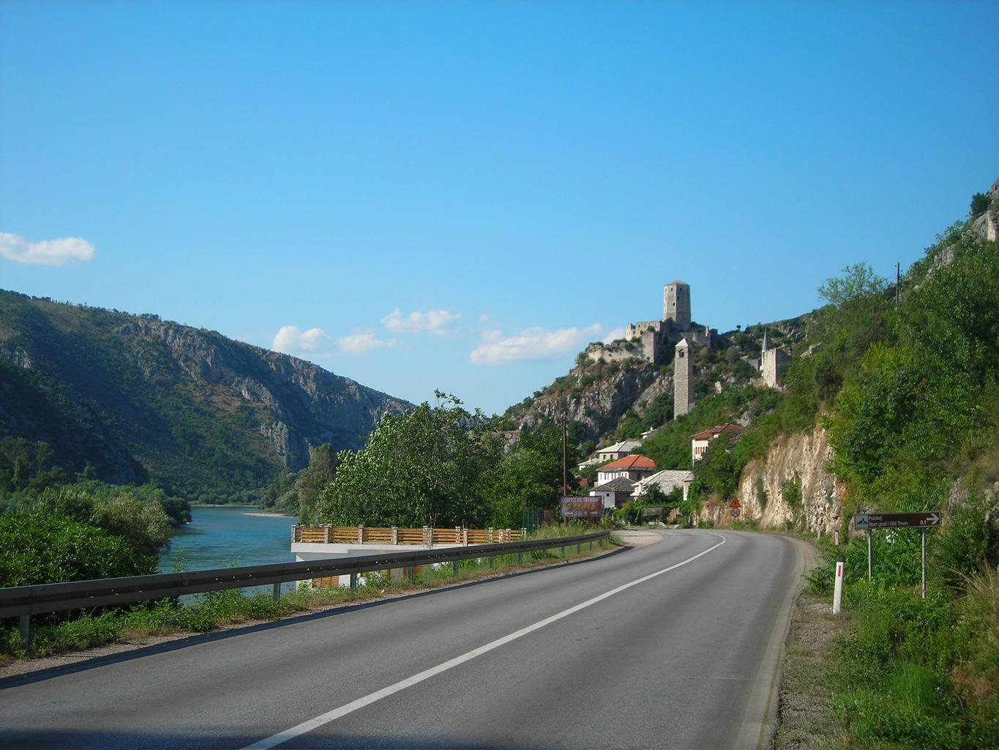
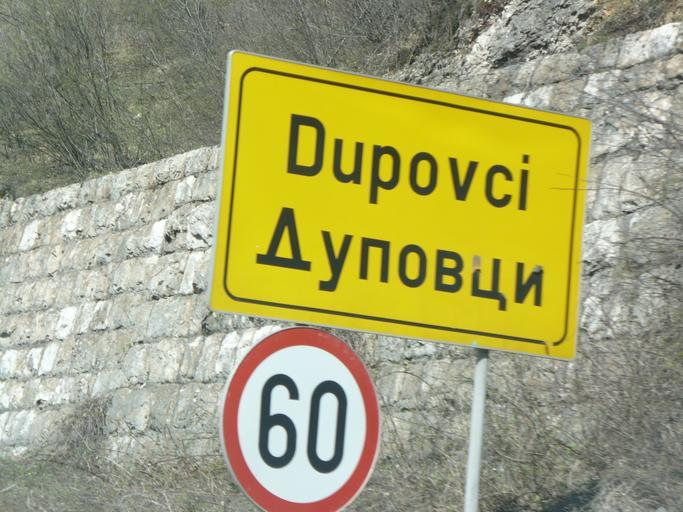

    <h2 class="section-title">{}</h2>
    <ul class="rule-list">
        <li>Em março de 2025 o Street View cobre apenas trechos muito curtos próximos à fronteira{}</li>
        <li>O domínio utiliza .ba</li>
        <li>Na Bósnia e Herzegovina — e também nos países vizinhos — os guarda-corpos costumam ser bem angulosos</li>
    </ul>

{}
{}
{}
Os guarda-corpos angulosos{} e os balizadores{} também aparecem nos países vizinhos.
{}

{}
É comum encontrar placas bilíngues.
{}

{}
{}
