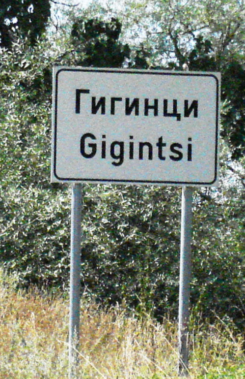
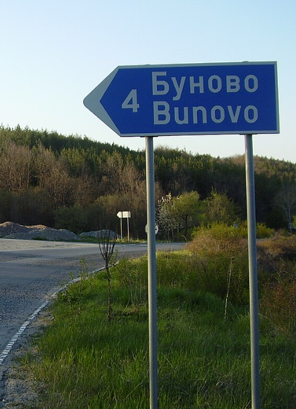
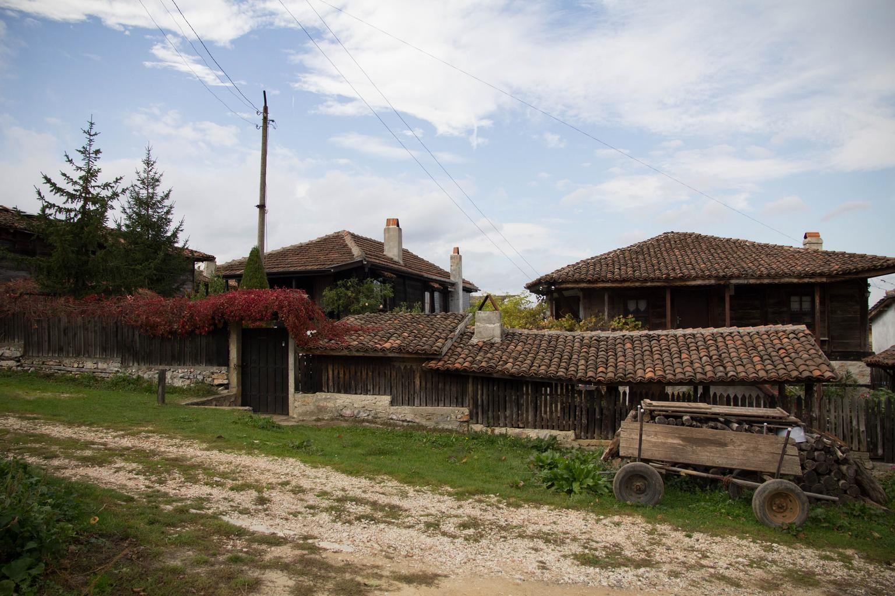
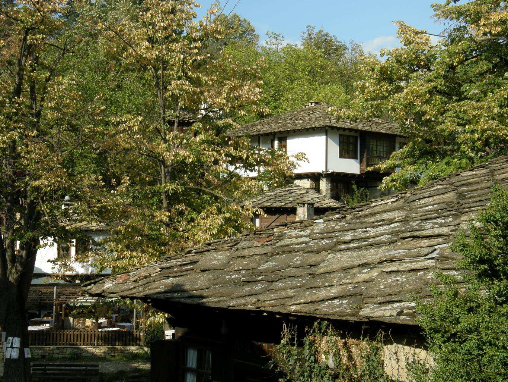
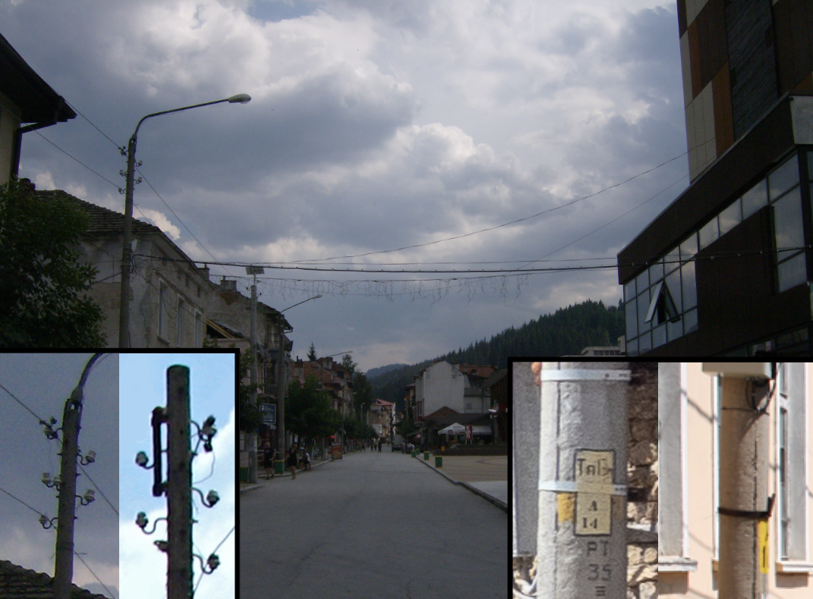
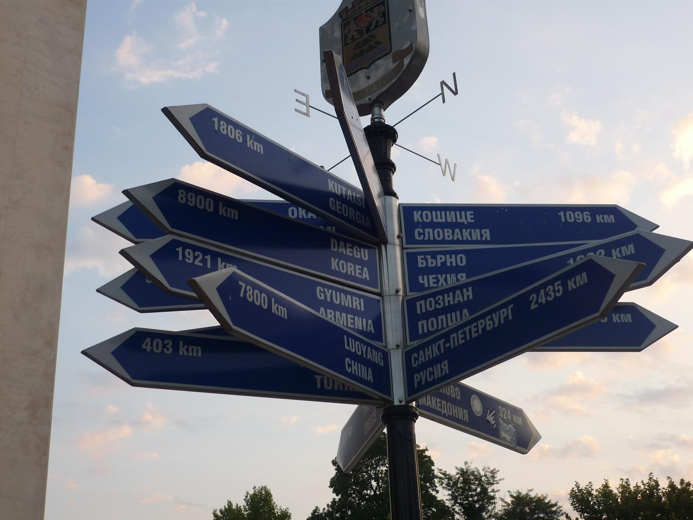
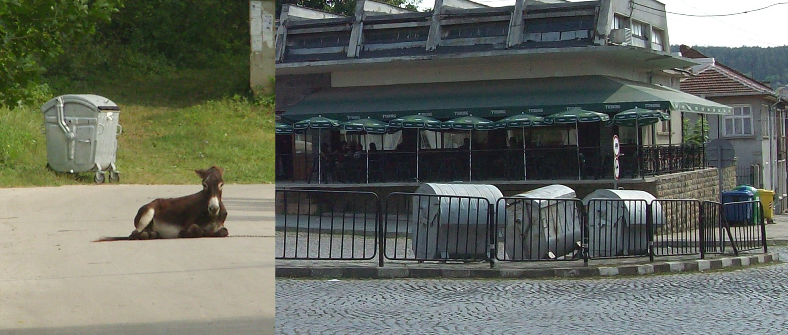
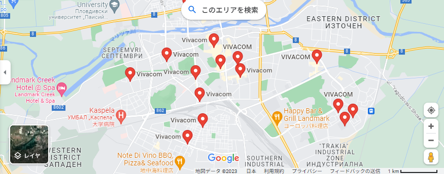
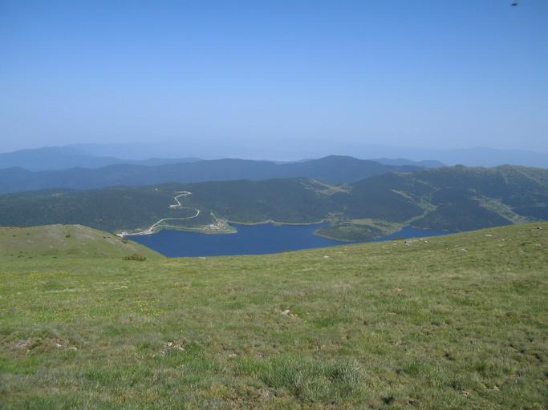
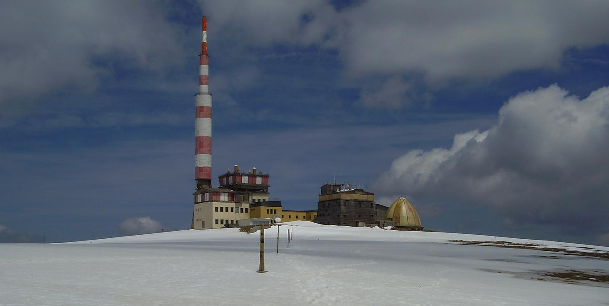

    <h2 class="section-title">{}</h2>
    <ul class="rule-list">
        <li>Domain negara adalah .bg</li>
        <li>Jumlah garis pada tanda penyeberangan adalah 4</li>
        <li>Bahasa resmi adalah Bulgaria (български) dan menggunakan huruf Kiril sebagai skrip utama</li>
        <li>Nama wilayah dan tanda lainnya biasanya ditulis dalam 2 bahasa</li>
        <li>Huruf "Ъ" hanya digunakan di Bulgaria dan Rusia{{% ref "https://ja.wikipedia.org/wiki/%D0%AA" "Ъ" %}}</li>
        <li class="no-evidence">Tempat sampah berbahan seperti seng sering ditemui di jalan atau depan rumah{}</li>
        <li class="no-evidence">Cuaca sering terlihat agak mendung secara keseluruhan</li>
    </ul>
    {}
    

        
Tanda pejalan kaki: By <a href="//commons.wikimedia.org/wiki/User:%E0%B8%A1%E0%B8%AD%E0%B8%87%E0%B9%82%E0%B8%81%E0%B9%80%E0%B8%A5%E0%B8%B5%E0%B8%A2%E0%B9%94%E0%B9%94" title="User:มองโกเลีย๔๔">มองโกเลีย๔๔</a> - Own work, <a href="https://creativecommons.org/licenses/by-sa/4.0" title="Creative Commons Attribution-Share Alike 4.0">CC BY-SA 4.0</a>, <a href="https://commons.wikimedia.org/w/index.php?curid=99078253">Link</a>

    

{}
{}

{}
Nama wilayah pada tanda biasanya ditulis dalam dua bahasa {}.
{}

{}
Jumlah garis pada tanda penyeberangan adalah 4 {}.
{}

{}
Rumah dengan atap genteng merah kecoklatan yang rata pada bagian atas dan biasanya dilengkapi cerobong asap sering ditemukan. Genteng seperti pada foto kedua juga cukup umum {}.
{}

{}
Tiang listrik dengan kait seperti yang ditemukan di {} juga dapat ditemukan di Bulgaria {}. Tiang listrik juga sering diberi cat kuning dengan tulisan dalam huruf Kiril {}.
{}

{}
Menara listrik dengan bentuk bercabang ke kiri dan kanan seperti pada foto sering ditemukan di Bulgaria {}.
{}

By <a href="//commons.wikimedia.org/wiki/User:Bin_im_Garten" title="User:Bin im Garten">Bin im Garten</a> - Own work, <a href="https://creativecommons.org/licenses/by-sa/3.0" title="Creative Commons Attribution-Share Alike 3.0">CC BY-SA 3.0</a>, <a href="https://commons.wikimedia.org/w/index.php?curid=17330681">Link</a>

{}
Huruf "Ъ" hanya digunakan di Bulgaria dan Rusia {{% ref "https://ja.wikipedia.org/wiki/%D0%AA" "Ъ" %}}.
{}

{}
Tempat sampah berbentuk drum bundar dengan penutup logam dan roda sering ditemukan di depan rumah atau di jalan {}. Namun, ini juga dapat ditemukan di negara lain sehingga tidak bisa dijadikan patokan utama.
{}

{}
Kondisi jalan seringkali buruk. Penduduk setempat bahkan membuat peta untuk menghindari jalan yang rusak {}. GDP per kapita pada tahun 2022 adalah yang terendah di Uni Eropa {}, sehingga banyak infrastruktur dan rumah terlihat rusak.
{}

By <a href="//commons.wikimedia.org/wiki/User:%D0%90%D0%BD%D0%B4%D1%80%D0%B5%D0%B9_%D0%A0%D0%BE%D0%BC%D0%B0%D0%BD%D0%B5%D0%BD%D0%BA%D0%BE" title="User:Андрей Романенко">Андрей Романенко</a> - Own work, <a href="https://creativecommons.org/licenses/by-sa/4.0" title="Creative Commons Attribution-Share Alike 4.0">CC BY-SA 4.0</a>, <a href="https://commons.wikimedia.org/w/index.php?curid=145099507">Link</a>

{}
{}

<iframe src="https://www.google.com/maps/embed?pb=!4v1682023318612!6m8!1m7!1s84EatgUD0lwZGQzlxBiPNA!2m2!1d42.59806937010458!2d27.35791417684463!3f323.02484627831154!4f-10.720130413835022!5f3.3140585619383063" width="295" height="295" style="border:0;" allowfullscreen="" loading="lazy" referrerpolicy="no-referrer-when-downgrade"></iframe>

{}
{}
{}
Beberapa tanda memiliki stiker berbentuk bulat merah pada bagian belakang.
{}

<iframe src="https://www.google.com/maps/embed?pb=!4v1687582202509!6m8!1m7!1sw2fzRy-1TDg3BpA_Q0MObw!2m2!1d43.33941930080717!2d27.20739235146471!3f261.0638197630687!4f-2.9601936671261484!5f3.325193203789971" width="295" height="295" style="border:0;" allowfullscreen="" loading="lazy" referrerpolicy="no-referrer-when-downgrade"></iframe>
<iframe src="https://www.google.com/maps/embed?pb=!4v1687582463889!6m8!1m7!1sMFUtF3wNV7c3hvmawsRZew!2m2!1d43.63553990209944!2d27.15682607109606!3f150.38357125903192!4f-4.646535777799954!5f3.325193203789971" width="295" height="295" style="border:0;" allowfullscreen="" loading="lazy" referrerpolicy="no-referrer-when-downgrade"></iframe>

{}
{}

{}
Antena Vivacom, perusahaan telekomunikasi terbesar di Bulgaria, sering ditemukan di rumah-rumah {}. Antena ini memiliki logo "V" atau tulisan "Vivacom". Antena Bulsatcom juga sering terlihat.
{}

{}
{}

    <h2 class="section-title">{}</h2>
    <ul class="rule-list">
        <li>Ada jalan di sekitar Bendungan Belmeken (Belmeken Dam) {}</li>
        <li>Puncak Botev di Taman Nasional Balkan Tengah memiliki menara televisi di puncaknya {}{}</li>
    </ul>

{}
{}
{}
Sulit untuk menebak negara pada pandangan pertama {}.
{}

{}
{}
{}
Sangat sulit dikenali pada pandangan pertama {}. Lokasi ini muncul dalam {}.
{}

{}
{}

{}
<li>By <a href="//commons.wikimedia.org/wiki/User:Edal" title="User:Edal">Edal Anton Lefterov</a> - Karya sendiri, <a href="https://creativecommons.org/licenses/by-sa/3.0" title="Creative Commons Attribution-Share Alike 3.0">CC BY-SA 3.0</a>, <a href="https://commons.wikimedia.org/w/index.php?curid=15140198">Link</a></li>
<li>By Vislupus - Karya sendiri, CC BY-SA 4.0, https://commons.wikimedia.org/w/index.php?curid=77437940</li>
{}
