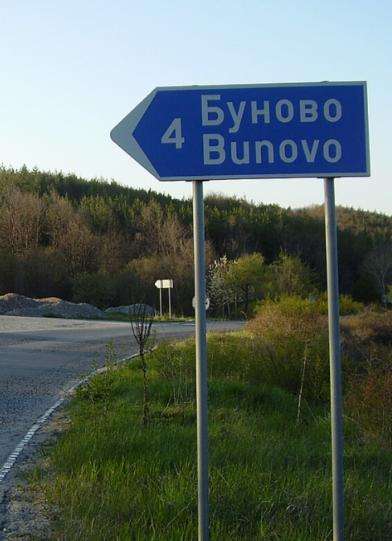
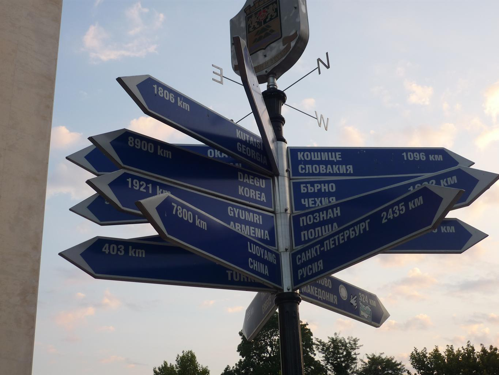
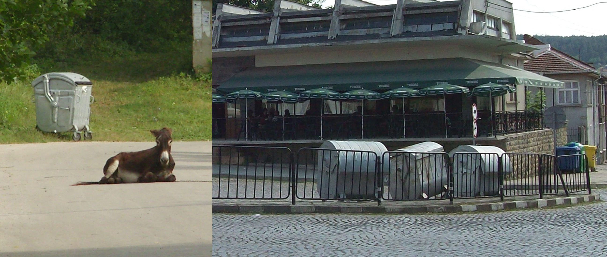
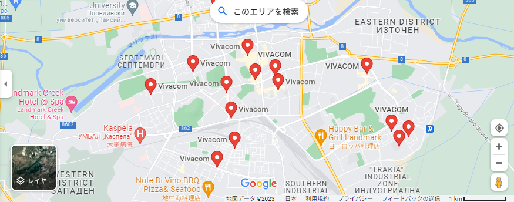

    <h2 class="section-title">{}</h2>
    <ul class="rule-list">
        <li>ドメインは.bg</li>
        <li>横断歩道の標識の線の数は4本</li>
        <li>公用語はブルガリア語（български）でキリル文字を使用する</li>
        <li>ブルガリア最大の電気通信会社であるVivacomのアンテナが家に設置されているかも</li>
        <li>「Ъ」の文字はブルガリアとロシアでしか使われない{{% ref "https://ja.wikipedia.org/wiki/%D0%AA" "Ъ" %}}</li>
        <li class="no-evidence">ブリキ製のようなゴミ箱が通りや家の前に置いてある{}</li>
        <li class="no-evidence">なんか全体的に天気が曇りっぽい</li>
        <li class="no-evidence">地域名の看板が基本的に２言語で書かれている</li>
        <li class="no-evidence">電柱に黄色いペイントがありそこにキリル文字が書いてある。</li>
    </ul>
    {}
    

        
歩行者の標識：By <a href="//commons.wikimedia.org/wiki/User:%E0%B8%A1%E0%B8%AD%E0%B8%87%E0%B9%82%E0%B8%81%E0%B9%80%E0%B8%A5%E0%B8%B5%E0%B8%A2%E0%B9%94%E0%B9%94" title="User:มองโกเลีย๔๔">มองโกเลีย๔๔</a> - Own work, <a href="https://creativecommons.org/licenses/by-sa/4.0" title="Creative Commons Attribution-Share Alike 4.0">CC BY-SA 4.0</a>, <a href="https://commons.wikimedia.org/w/index.php?curid=99078253">Link</a>

    

{}
{}
{}横断歩道の標識の線の数は4本
{}

{}赤茶色の上の部分平らな瓦屋根の家が多く、みんな煙突がついている。
{}

{}地域名などの看板が基本的に２言語で書かれている{}。
{}

{}電柱に黄色いペイントがありそこにキリル文字が書いてある{}{}。{}の電柱にある感じのフックのついた電柱がある{}。あとこの画像のような曇りっぽい天気が多いように思う。
{}

{}「Ъ」の文字はブルガリアとロシアでしか使われない{{% ref "https://ja.wikipedia.org/wiki/%D0%AA" "Ъ" %}}
{}

{}タイヤのついたブリキ製の丸いふたのゴミ箱が通りや家の前に置いてある{}{}。他の国にもあるときはあるのでこれだけで判断しないほうがいいかも。
{}

{}
{}
{}
{}

<iframe src="https://www.google.com/maps/embed?pb=!4v1682023318612!6m8!1m7!1s84EatgUD0lwZGQzlxBiPNA!2m2!1d42.59806937010458!2d27.35791417684463!3f323.02484627831154!4f-10.720130413835022!5f3.3140585619383063" width="295" height="295" style="border:0;" allowfullscreen="" loading="lazy" referrerpolicy="no-referrer-when-downgrade"></iframe>

{}
{}
{}なんか後ろに赤●のシールがある地域がある
{}

<iframe src="https://www.google.com/maps/embed?pb=!4v1687582202509!6m8!1m7!1sw2fzRy-1TDg3BpA_Q0MObw!2m2!1d43.33941930080717!2d27.20739235146471!3f261.0638197630687!4f-2.9601936671261484!5f3.325193203789971" width="295" height="295" style="border:0;" allowfullscreen="" loading="lazy" referrerpolicy="no-referrer-when-downgrade"></iframe>
<iframe src="https://www.google.com/maps/embed?pb=!4v1687582463889!6m8!1m7!1sMFUtF3wNV7c3hvmawsRZew!2m2!1d43.63553990209944!2d27.15682607109606!3f150.38357125903192!4f-4.646535777799954!5f3.325193203789971" width="295" height="295" style="border:0;" allowfullscreen="" loading="lazy" referrerpolicy="no-referrer-when-downgrade"></iframe>

{}
{}

{}ブルガリア最大の電気通信会社であるVivacomのアンテナが家に設置されているかも（例<a href="https://www.google.com/maps/@42.6995059,27.2516408,0a,17y,17.68h,105.49t/data=!3m4!1e1!3m2!1sLD0DHiT-1i4jqbCVXxk63w!2e0?source=apiv3">①</a>・<a href="https://goo.gl/maps/7xKpoFArC89Vmygu5">②</a>）。VというロゴかVivacomという文字が描かれている。都市部には店も多く存在する。Bulsatcomのアンテナもある。
{}

{}
{}

    <h2 class="section-title">{}</h2>
    <ul class="rule-list">
        <li>Belmeken Dam周辺に道がある{}</li>
        <li>中央バルカン国立公園のBotev山の山頂にはテレビ塔がある{}{}</li>
    </ul>

{}
{}
{}
初見では国がわからなかった{}。
{}

{}
{}
{}
初見では無理{}。{}より出題。
{}

{}
{}

{}
<li>By <a href="//commons.wikimedia.org/wiki/User:Edal" title="User:Edal">Edal Anton Lefterov</a> - Own work, <a href="https://creativecommons.org/licenses/by-sa/3.0" title="Creative Commons Attribution-Share Alike 3.0">CC BY-SA 3.0</a>, <a href="https://commons.wikimedia.org/w/index.php?curid=15140198">Link</a></li>
<li>By Vislupus - Own work, CC BY-SA 4.0, https://commons.wikimedia.org/w/index.php?curid=77437940</li>
{}