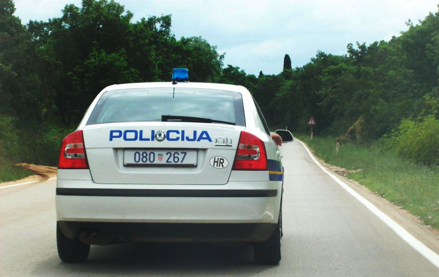
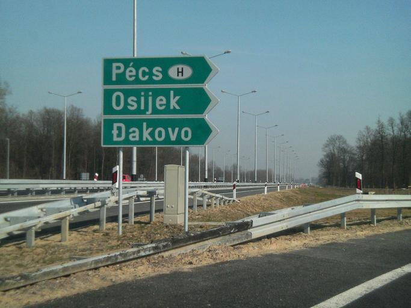
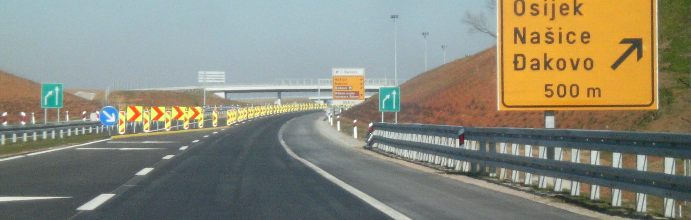
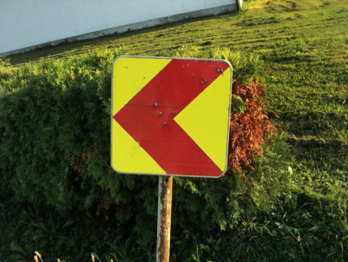

    <h2 class="section-title">{}</h2>
    <ul class="rule-list">
        <li>Domain internet adalah .hr</li>
        <li>Bahasa resmi adalah bahasa Kroasia, yang menggunakan huruf Latin
            <ul>
                <li>Karakter Đ・đ adalah ciri khas bahasa Kroasia {}. Selain Kroasia, karakter ini digunakan dalam bahasa Sami dan Vietnam.</li>
                <li>Karakter Ž・ž, Č・č, dan Š・š juga digunakan di Kroasia, Ceko, Slowakia, Slovenia, dan negara-negara Baltik. Karakter ini memiliki tanda diakritik seperti huruf "v" kecil di atasnya, yang disebut háček atau caron.</li>
            </ul>
        </li>
        <li>Sering terlihat hidran berwarna biru {}</li>
        <li>KONZUM adalah jaringan supermarket terbesar di Kroasia {}</li>
        <li>Guardrail dengan alur tipis yang bersudut dan reflektor merah digunakan di Kroasia, Serbia, Montenegro, Turki, dan Polandia</li>
        <li>Rambu penyeberangan pejalan kaki di Kroasia memiliki 5 garis dan dilengkapi sabuk</li>
        <li>Terkadang terlihat logo atau papan nama dengan motif papan catur khas bendera nasional Kroasia</li>
        <li class="no-evidence">Ada tanda panah berwarna merah pada pintu meteran listrik</li>
    </ul>
    {}

{}
{}

{}
Tisak plus doo adalah distributor terbesar produk tembakau di Kroasia, dengan lebih dari 850 toko {}.  
KONZUM adalah jaringan supermarket terbesar di Kroasia dengan sekitar 700 toko di dalam negeri {}. Bank terbesar di Kroasia, Zagrebačka banka {}, dan pengecer Plodine dengan sekitar 100 toko juga sering terlihat {}.
{}

{}
Ada dua jenis hidran berwarna biru dengan bentuk yang khas yang dapat ditemukan di pinggir jalan {}{}.
{}

{}
Sebelum 2016, pelat nomor kendaraan berwarna putih tanpa garis biru {}. Terkadang pelat ini tampak memiliki bingkai merah samar, tetapi sering kali hanya terlihat putih polos.
{}

{}

CC0
{}

{}
Karakter Đ・đ adalah ciri khas bahasa Kroasia. Selain itu, guardrail dengan <b>reflektor merah berbentuk persegi dan alur tipis</b> digunakan di Kroasia, Serbia, Montenegro, Turki, dan Polandia {}.
{}

{}
Rambu penyeberangan di Kroasia menunjukkan gambar orang dengan sabuk {}. Contoh: Kroasia, Latvia, dan Hongaria. Kaki berbentuk "く" menandakan Kroasia, sedangkan bentuk "ハ" menunjukkan Hongaria. Negara seperti {} dan {} juga memiliki sabuk pada gambarnya.
{}

{}
Shevron kuning dan merah sering terlihat.
{}

{}
Shevron serupa juga ditemukan di {} dan {}.
{}

{}
{}

{}
Shevron kuning dan merah sering terlihat.
{}

<iframe src="https://www.google.com/maps/embed?pb=!4v1694314678924!6m8!1m7!1s8XipuyeQ6lop-HBkQEsGLw!2m2!1d45.47253516983014!2d18.91674277445001!3f193.25744698733536!4f-2.5463749573817154!5f1.5389236508821318" width="590" height="290" style="border:0;" allowfullscreen="" loading="lazy" referrerpolicy="no-referrer-when-downgrade"></iframe>

{}
{}

<iframe src="https://www.google.com/maps/embed?pb=!4v1681257980003!6m8!1m7!1sMsOMB1naVEv1czOvhAtJ3g!2m2!1d45.34458769417302!2d15.37503663079558!3f43.1214049711359!4f-20.64904948311542!5f3.325193203789971" width="295" height="295" style="border:0;" allowfullscreen="" loading="lazy" referrerpolicy="no-referrer-when-downgrade"></iframe>
<iframe src="https://www.google.com/maps/embed?pb=!4v1681258012669!6m8!1m7!1sqHxbw4HeMmgHJobzL91FrA!2m2!1d45.34482174447255!2d15.37483800339599!3f298.77476173043993!4f-23.468580312565678!5f3.325193203789971" width="295" height="295" style="border:0;" allowfullscreen="" loading="lazy" referrerpolicy="no-referrer-when-downgrade"></iframe>

{}
{}

<iframe src

    <h2 class="section-title">{}</h2>
    <ul class="rule-list">
        <li>Di area perkotaan, kode area dapat membantu mengidentifikasi wilayah. Formatnya adalah "0XX".
            <ul>
                <li>01x: {}, cukup sulit ditemukan</li>
                <li>020: Dubrovnik, belum ditemukan</li>
                <li>021: {}</li>
                <li>023: {}</li>
                <li>051: {}</li>
            </ul>
        </li>
    </ul>

{}
{}
{}
Berdasarkan pengalaman berjalan di area perkotaan, melihat nama kota lebih sering terjadi daripada kode area.
{}

Sumber: <a href="https://web.archive.org/web/20110714164315/http://www.t-com.hr/privatni/telefon/pozivi/pozivni/medunarodni.asp">© T-Hrvatski Telekom - Međunarodni promet</a>

{}
{}

    <h2 class="section-title">{}</h2>
    <ul class="rule-list">
        <li>Di daerah pedalaman yang datar, banyak kebun anggur, tetapi Pulau Vis yang terpencil juga memiliki banyak kebun anggur.</li>
    </ul>

{}
{}
{}
Industri utama di pulau ini adalah budidaya anggur {}. Seperlima dari lahan pertanian di pulau ini adalah kebun anggur.
{}

{}
{}
