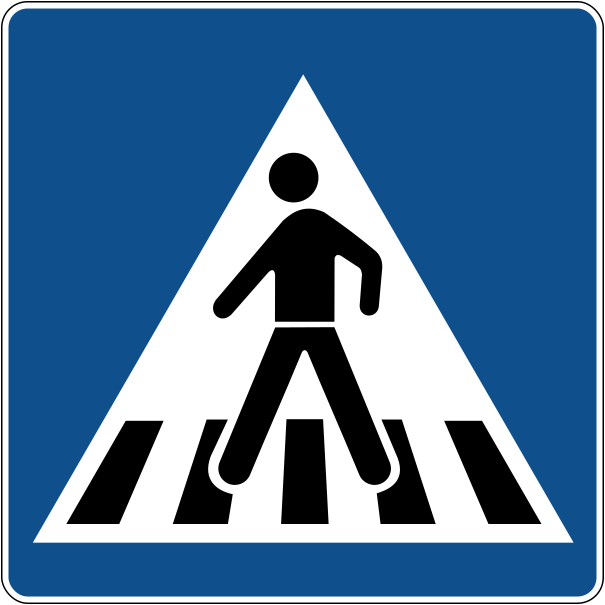

    <h2 class="section-title">{}</h2>
    <ul class="rule-list">
        <li>ドメインは.hr</li>
        <li>公用語はクロアチア語が用いられておりラテン文字を使用する
            <ul>
                <li>「Đ・đ」はクロアチア語の特徴的な文字{}。他に使用されるのはサーミ語・ベトナム語。</li>
                <li>「Ž・ž」「Č・č」「Š・š」の文字はクロアチア・チェコ・スロバキア・スロベニア・バルト三国に見られて上にハーチェクやキャロンと呼ばれるｖのような形が付いているのが特徴的</li>
            </ul>
        </li>
        <li>青色の消火栓を見かける{}</li>
        <li>KONZUMはクロアチア最大のスーパーマーケットチェーン{}</li>
        <li>赤い反射板で角張った細い溝のガードレールを使うのはクロアチア・セルビア・モンテネグロ・トルコ・ポーランド</li>
        <li>クロアチアの横断歩道の標識は５本線でベルトがついている</li>
        <li>国旗のチェックボード柄の模様のロゴや看板を見かけることがある</li>
        <li class="no-evidence">赤い色の矢印が電力計の扉にある</li>
    </ul>
    {}

{}
{}

{}
Tisak plus dooはタバコ製品のクロアチア最大の販売代理店であり約850店舗以上存在する。
KONZUMはクロアチア最大のスーパーマーケットチェーンでクロアチア国内におよそ700店舗ある。他に見かけるのはクロアチア最大手銀行のZagrebačka bankaや小売で100店舗前後あるとおもわれるPlodineなど{}。
{}

<a data-flickr-embed="true" href="https://www.flickr.com/photos/hile/27023806014/in/photolist-7jCuyg-WZkQKu-59yxc7-9b24Mr-Hb152U-4Qvnvc-5RDxaF-8qzBDb-6N2enw-2jJQd5B-2nAfamo-2nAkaEt-2jJR1d9-2jJLC74-2jJLC8g-2jJR1zw-2jJLCcE-2jJQd9z-2jJQdeE-2jJQdmZ-2jJLCiS-2jJLCjD-2jJLBTU-2jJLCgx-2jJQdTW-2jJR2mS-2jJLDBZ-2jJQenr-2jJR2NJ-2jJQduz-2jJR2ET-2jJQevs-2jJQcYz-2jJR2ov-2jJQdW1-2jJQe4f-2jJR33b-2jJQe6j-2jJR29c-2jJQeyy-2jJQdFw-2jJR2S1-2jJQdxF-2jJQefY-2jJLDbP-2jJR2fj-2jJLCBC-2jJQdAg-2jJQeBj-2jJR2bX" title="WP_20160612_21_07_39_Rich"></a>

{}
道端に以下の2つの特徴的な形をした青色の消火栓がある{}{}。
{}

{}
2016年までは白いナンバープレートだったので青い線が無いナンバープレートも多い{}。枠がかすかに赤く見える時がある気がするけれど、白一色に見えることも多い。
{}

{}

CC0</a>
{}

{}
「Đ・đ」はクロアチア語の特徴的な文字。また<b>赤い反射板で角張った細い溝</b>のガードレールを使うのはクロアチア・セルビア・モンテネグロ・トルコ・ポーランド{}。こんな感じのガードレールを見てポーランドやトルコではないと思ったならボスニア・ヘルツェゴビナに隣接しているクロアチア・セルビア・モンテネグロを考えてみる。
{}

{}
クロアチアの横断歩道の中の人はベルトを付けている。左からクロアチア・ラトビア・ハンガリー。足の形が「く」ならクロアチアで「ハ」ならハンガリー。{}や{}もベルトを付けている点に注意。
{}

{}
黄色と赤のシェブロンがある
{}

{}
クロアチアに確定するかはわからないけれどこんな感じの赤い矢印が電力計の扉に書かれていることが多い気がする{}。電球のポールにも貼ってあることがある{}。
{}

{}
{}

{}
黄色と赤のシェブロンがある。
{}

<iframe src="https://www.google.com/maps/embed?pb=!4v1694314678924!6m8!1m7!1s8XipuyeQ6lop-HBkQEsGLw!2m2!1d45.47253516983014!2d18.91674277445001!3f193.25744698733536!4f-2.5463749573817154!5f1.5389236508821318" width="590" height="290" style="border:0;" allowfullscreen="" loading="lazy" referrerpolicy="no-referrer-when-downgrade"></iframe>

{}
{}

<iframe src="https://www.google.com/maps/embed?pb=!4v1681257980003!6m8!1m7!1sMsOMB1naVEv1czOvhAtJ3g!2m2!1d45.34458769417302!2d15.37503663079558!3f43.1214049711359!4f-20.64904948311542!5f3.325193203789971" width="295" height="295" style="border:0;" allowfullscreen="" loading="lazy" referrerpolicy="no-referrer-when-downgrade"></iframe>
<iframe src="https://www.google.com/maps/embed?pb=!4v1681258012669!6m8!1m7!1sqHxbw4HeMmgHJobzL91FrA!2m2!1d45.34482174447255!2d15.37483800339599!3f298.77476173043993!4f-23.468580312565678!5f3.325193203789971" width="295" height="295" style="border:0;" allowfullscreen="" loading="lazy" referrerpolicy="no-referrer-when-downgrade"></iframe>

{}
{}

<iframe src="https://www.google.com/maps/embed?pb=!4v1681258464332!6m8!1m7!1sAw8lcQqLTGYHVMAEKqb2Gw!2m2!1d45.30784246950383!2d18.42113629874204!3f34.46953077869004!4f-14.946028716990526!5f3.325193203789971" width="295" height="295" style="border:0;" allowfullscreen="" loading="lazy" referrerpolicy="no-referrer-when-downgrade"></iframe>

{}
{}

    <h2 class="section-title">{}</h2>
    <ul class="rule-list">
        <li>街中ならば市外局番から地域が分かることがある。「0XX」のフォーマット。
            <ul>
                <li>01x：{}, 見つけるのは難しい</li>
                <li>020：Dubrovnik, 見つけられなかった</li>
                <li>021：{}</li>
                <li>023：{}</li>
                <li>051：{}</li>
            </ul>
        </li>
    </ul>

{}
{}
{}
街中を歩いてみた体感として地名を見る回数の方がずっと多いかも。
{}

出典：<a href="https://web.archive.org/web/20110714164315/http://www.t-com.hr/privatni/telefon/pozivi/pozivni/medunarodni.asp">© T-Hrvatski Telekom - Međunarodni promet</a>

{}
{}