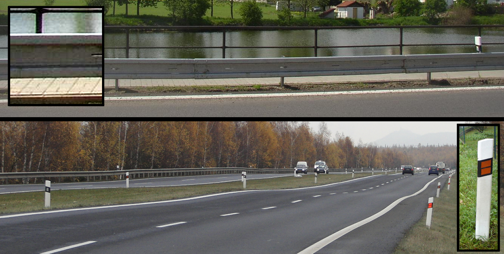
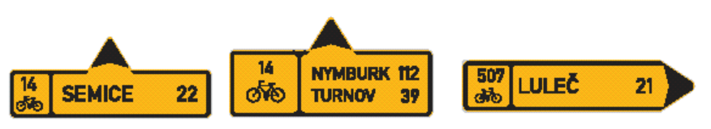
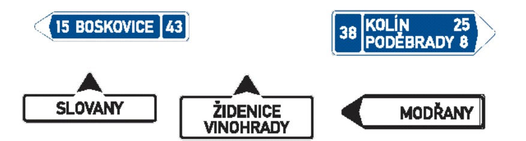
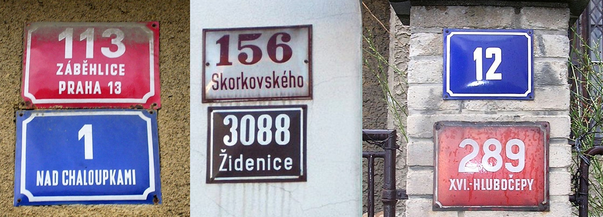
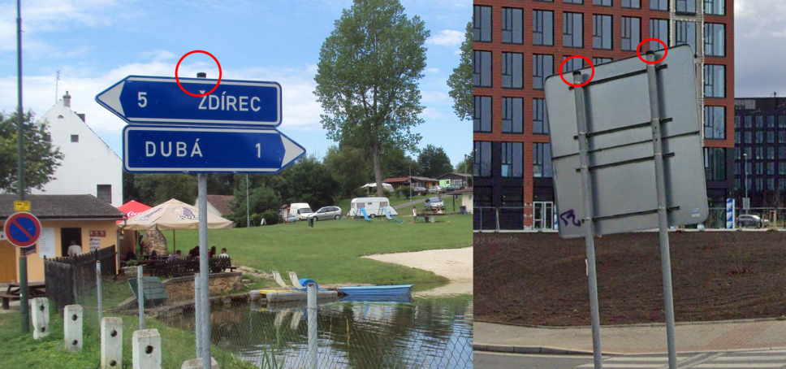
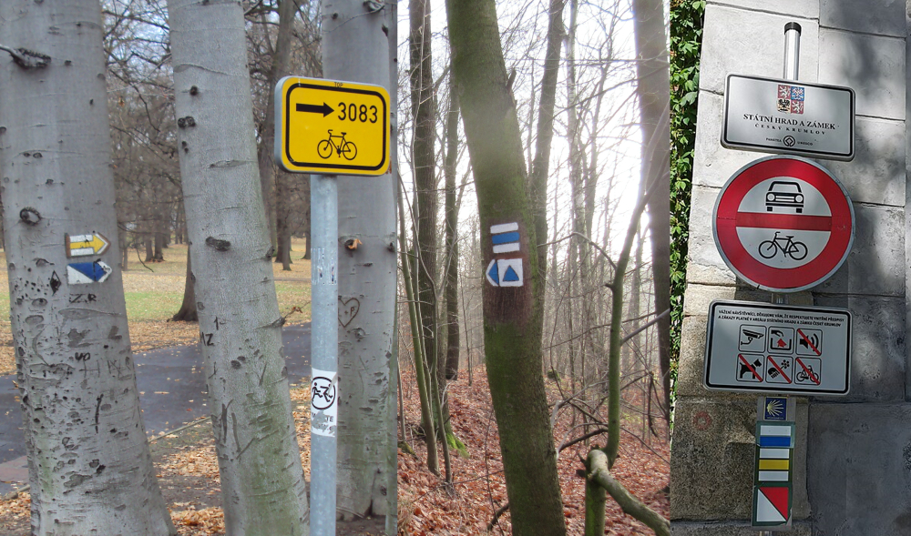
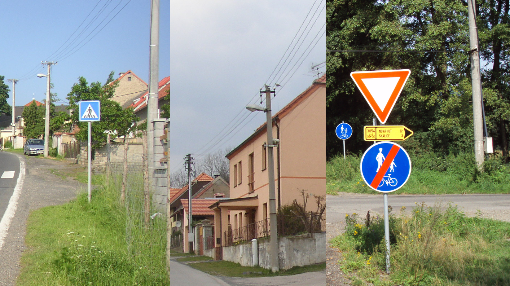
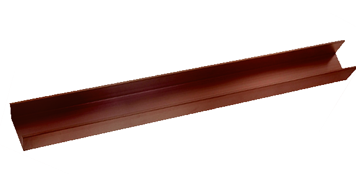
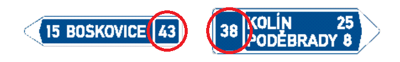

    <h2 class="section-title">{}</h2>
    <ul class="rule-list">
        <li>ドメインは.cz</li>
        <li>ボラードは黒い領域に反射板が2枚</li>
        <li>チェコ語とスロバキア語に違いがある
            <ul>
                <li>チェコ語の母音クロウジェク「Ů・ů」があるならチェコ</li>
                <li>「<b>Ř</b>」ならチェコ・「<b>Ŕ</b>」ならスロバキア</li>
                <li>「<b>Ě</b>」はチェコ語でのみ登場する</li>
            </ul>
        </li>
        <li>チェコとスロバキアのみthin-B profileと呼ばれるガードレールを使用する{}</li>
        <li>チェコかスロバキアのどちらか分からないとき標識のポールに黒いキャップがあるならばチェコ{}の可能性が高いが100%ではない</li>
        <li>家に赤や青の背景に白で文字が書かれていればチェコかも。白の背景に黒で文字が書かれていればスロバキアの可能性が高い。{}</li>
    </ul>
    {}

{}
{}

{}
{}と同じボラードとガードレール。ボラードは黒い領域に反射板が2枚ある{}。ガードレールはthin-B profileと呼ばれるガードレールを使用しており角ばっていて真ん中の凹みの幅が広いのが特徴的{}。
{}

{}
チェコの道路案内の看板はこんな感じの看板を使用する{}。{}の看板は矢印が書いてありフォーマットが異なる{}。また右下の看板のように「Ř」や「Ě」の文字があるならチェコ。「Ů・ů」がある場合もチェコになる。
{}

{}
家に赤や青の背景に白で文字が書かれていればチェコかも{}。白の背景に黒で文字が書かれていればスロバキアの可能性が高い{}が100%いつもそうとは限らない。
{}

{}
チェコかスロバキアのどちらか分からないとき標識のポールに黒いキャップがあったならばチェコ{}を考えてみる。ただしこれも<b>100%チェコというわけではない</b>ので注意。
{}

{}
チェコと{}の平坦な場所はこんな感じの並木道が見られる。木の種類や太さはいろいろ（例<a href="https://goo.gl/maps/CXuYgmh8nRACLPbQ6">①</a>・<a href="https://goo.gl/maps/nYTwesnaUY9dPRhKA">②</a>・<a href="https://goo.gl/maps/9thttoGvmmfoAgbs7">③</a>）。片側だけの場合もある。
{}

{}
チェコと{}では観光用のハイキングコースには白と赤・黄・青・緑で描かれたハイキングマーカーが見つかる{}{}。これは国際的に普及している規格なので、数は少ないものの周りのほぼすべての国で見つかる点に注意{}。
{}

{}
{}の例{}
{}

{}
{}
{}
チェコとスロバキアで共通の電柱が見つかる。コの字型っぽい棒に上下にコイルが刺さっている。また円形の電柱が多い。
{}

<iframe src="https://www.google.com/maps/embed?pb=!4v1686594386635!6m8!1m7!1sxH6l7uYoKzjXj28AC1K9pQ!2m2!1d49.38437426271587!2d15.36905043271308!3f44.10100217882954!4f29.88161714379865!5f3.325193203789971" width="295" height="295" style="border:0;" allowfullscreen="" loading="lazy" referrerpolicy="no-referrer-when-downgrade"></iframe>
<iframe src="https://www.google.com/maps/embed?pb=!4v1686594548149!6m8!1m7!1sXNYT_36W9Z5DDiGTZ3S2Mw!2m2!1d49.70806573351916!2d13.41885583096088!3f191.27219417026123!4f37.06150617937257!5f3.325193203789971" width="295" height="295" style="border:0;" allowfullscreen="" loading="lazy" referrerpolicy="no-referrer-when-downgrade"></iframe>

{}
形が異なっていたり複雑になったりしても、コの字型っぽい棒が使用されている時が多いように思う。二本の電柱がくっついている形の電柱も多い。
{}

<iframe src="https://www.google.com/maps/embed?pb=!4v1686595475450!6m8!1m7!1s6TWCtY6MYfHQD4_CG75V3A!2m2!1d49.18196165848737!2d16.48964443755139!3f44.432808772408805!4f29.841552503123765!5f3.325193203789971" width="295" height="295" style="border:0;" allowfullscreen="" loading="lazy" referrerpolicy="no-referrer-when-downgrade"></iframe>
<iframe src="https://www.google.com/maps/embed?pb=!4v1686595823142!6m8!1m7!1suzL342DLxTlHpBt6_vc6PA!2m2!1d49.12844432927459!2d16.6558420676652!3f149.51272206811763!4f39.53331163003605!5f3.325193203789971" width="295" height="295" style="border:0;" allowfullscreen="" loading="lazy" referrerpolicy="no-referrer-when-downgrade"></iframe>

{}
{}

    <h2 class="section-title">{}</h2>
    <ul class="rule-list">
        <li>標識に道路番号が書いてある{}</li>
    </ul>

{}
{}
{}
道路番号が看板に書いてある{}。他にも書いてあるケースあり、リンク先参照。
{}

{}
{}