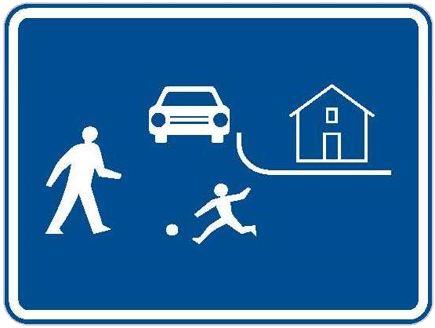
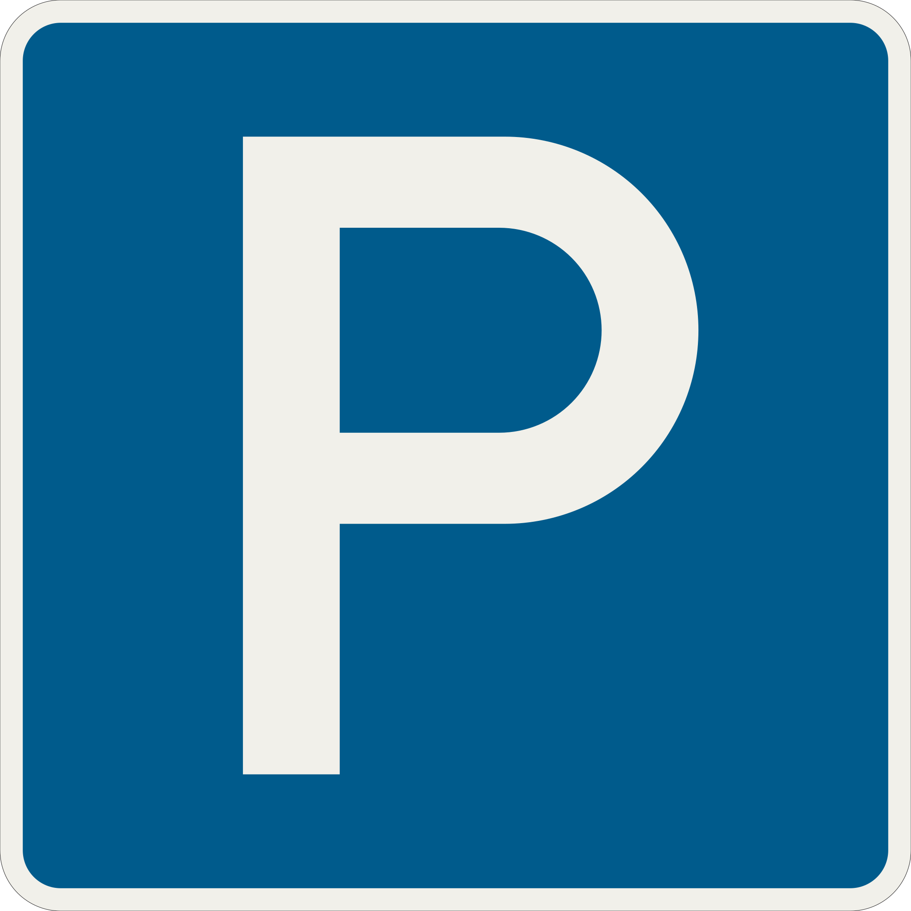

    <h2 class="section-title">{}</h2>
    <ul class="rule-list">
        <li>ドメインは.cz</li>
        <li>ボラードは黒い領域に反射板が2枚</li>
        <li>チェコ語とスロバキア語に違いがある
            <ul>
                <li>チェコ語の母音クロウジェク「Ů・ů」があるならチェコ</li>
                <li>「<b>Ř</b>」ならチェコ・「<b>Ŕ</b>」ならスロバキア</li>
                <li>「<b>Ě</b>」はチェコ語でのみ登場する</li>
            </ul>
        </li>
        <li>チェコとスロバキアのみthin-B profileと呼ばれるガードレールを使用する{}</li>
        <li>チェコかスロバキアのどちらか分からないとき標識のポールに黒いキャップがあるならばチェコ{}の可能性が高いが100%ではない</li>
        <li>家に赤や青の背景に白で文字が書かれていればチェコかも。白の背景に黒で文字が書かれていればスロバキアの可能性が高い。{}</li>
        <li>チェコと{}は２本の電柱をひとつにまとめた電柱がある</li>
    </ul>
    {}

{}
{}

{}
こんな感じの看板を使用する。スロバキアの看板は矢印が書いてありフォーマットが異なる{}。また右下の看板のように「Ř」や「Ě」の文字があるならチェコ。「Ů・ů」がある場合もチェコになる。
{}

{}
ボラードとガードレール。ボラードは黒い領域に反射板が2枚ある。ガードレールはthin-B profileと呼ばれるガードレールを使用しており角ばっていて真ん中の凹みの幅が広いのが特徴的。ボラードとガードレールはスロバキアにも同じものがある。
{}

<iframe src="https://www.google.com/maps/embed?pb=!4v1682936914809!6m8!1m7!1smVbj2pA5JV1ghMU170T-MA!2m2!1d49.18506314402373!2d16.75742697472375!3f13.65489772609046!4f-16.051398238411295!5f2.6800695378815926" width="295" height="295" style="border:0;" allowfullscreen="" loading="lazy" referrerpolicy="no-referrer-when-downgrade"></iframe>
<iframe src="https://www.google.com/maps/embed?pb=!4v1686404835713!6m8!1m7!1s9k-yEUpcSKPpDjlDt5sBYg!2m2!1d50.21223825702709!2d12.91789875724614!3f326.1518798228631!4f-25.31182555592214!5f2.9332278547999198" width="295" height="295" style="border:0;" allowfullscreen="" loading="lazy" referrerpolicy="no-referrer-when-downgrade"></iframe>

{}
家に赤や青の背景に白で文字が書かれていればチェコかも。白の背景に黒で文字が書かれていればスロバキアの可能性が高い{}が100%いつもそうとは限らない。
{}

<iframe src="https://www.google.com/maps/embed?pb=!4v1681946473677!6m8!1m7!1slXLE8i4WNVdBo9Zjwf9RTw!2m2!1d50.07301695432118!2d14.43958934522536!3f342.61217010079974!4f-1.1447244747842404!5f3.325193203789971" width="295" height="295" style="border:0;" allowfullscreen="" loading="lazy" referrerpolicy="no-referrer-when-downgrade"></iframe>
<iframe src="https://www.google.com/maps/embed?pb=!4v1683087636537!6m8!1m7!1sWTxf4o5bBQPCzyVBCFuyLg!2m2!1d49.74095887592078!2d13.39276455890356!3f53.125790524204945!4f5.342234466501495!5f3.325193203789971" width="295" height="295" style="border:0;" allowfullscreen="" loading="lazy" referrerpolicy="no-referrer-when-downgrade"></iframe>

{}
チェコかスロバキアのどちらか分からないとき標識のポールに黒いキャップがあったならばチェコ{}を考えてみる。ただし<b>100%チェコというわけではない</b>ので注意。
{}

<iframe src="https://www.google.com/maps/embed?pb=!4v1686496418723!6m8!1m7!1sO5qJ5InUvoKgiHD8Z4asyQ!2m2!1d50.100065094337!2d14.46705044268807!3f48.60841767080781!4f7.219742086950248!5f3.325193203789971" width="295" height="295" style="border:0;" allowfullscreen="" loading="lazy" referrerpolicy="no-referrer-when-downgrade"></iframe>
<iframe src="https://www.google.com/maps/embed?pb=!4v1683137810610!6m8!1m7!1sf_HTmx1eNXak41Ns48K5EA!2m2!1d49.83283880873212!2d18.28161402132868!3f179.98836807707247!4f-0.09167264981728351!5f3.325193203789971" width="295" height="295" style="border:0;" allowfullscreen="" loading="lazy" referrerpolicy="no-referrer-when-downgrade"></iframe>

{}
チェコと{}の平坦な場所はこんな感じの並木道が見られる。木の種類や太さはいろいろ（例<a href="https://goo.gl/maps/CXuYgmh8nRACLPbQ6">①</a>・<a href="https://goo.gl/maps/nYTwesnaUY9dPRhKA">②</a>・<a href="https://goo.gl/maps/9thttoGvmmfoAgbs7">③</a>）。片側だけの場合もある。
{}

{}
主に色が付いている看板について、チェコの標識は背景色と同じ縁がある時が多いがスロバキアはない時が多い{}。
上がチェコ、下がスロバキア。
{}

{}
{}
{}
チェコとスロバキアで共通の電柱が見つかる。コの字型っぽい棒に上下にコイルが刺さっている。
{}

<iframe src="https://www.google.com/maps/embed?pb=!4v1686594386635!6m8!1m7!1sxH6l7uYoKzjXj28AC1K9pQ!2m2!1d49.38437426271587!2d15.36905043271308!3f44.10100217882954!4f29.88161714379865!5f3.325193203789971" width="295" height="295" style="border:0;" allowfullscreen="" loading="lazy" referrerpolicy="no-referrer-when-downgrade"></iframe>
<iframe src="https://www.google.com/maps/embed?pb=!4v1686594548149!6m8!1m7!1sXNYT_36W9Z5DDiGTZ3S2Mw!2m2!1d49.70806573351916!2d13.41885583096088!3f191.27219417026123!4f37.06150617937257!5f3.325193203789971" width="295" height="295" style="border:0;" allowfullscreen="" loading="lazy" referrerpolicy="no-referrer-when-downgrade"></iframe>

{}
形が異なっていたり複雑になったりしても、コの字型っぽい棒が使用されている時が多いように思う。
{}

<iframe src="https://www.google.com/maps/embed?pb=!4v1686595475450!6m8!1m7!1s6TWCtY6MYfHQD4_CG75V3A!2m2!1d49.18196165848737!2d16.48964443755139!3f44.432808772408805!4f29.841552503123765!5f3.325193203789971" width="295" height="295" style="border:0;" allowfullscreen="" loading="lazy" referrerpolicy="no-referrer-when-downgrade"></iframe>
<iframe src="https://www.google.com/maps/embed?pb=!4v1686595823142!6m8!1m7!1suzL342DLxTlHpBt6_vc6PA!2m2!1d49.12844432927459!2d16.6558420676652!3f149.51272206811763!4f39.53331163003605!5f3.325193203789971" width="295" height="295" style="border:0;" allowfullscreen="" loading="lazy" referrerpolicy="no-referrer-when-downgrade"></iframe>

{}
{}

    <h2 class="section-title">{}</h2>
    <ul class="rule-list">
        <li>標識に道路番号が書いてある{}</li>
    </ul>

{}
{}
{}
道路番号が看板に書いてある{}。他にも書いてあるケースあり、リンク先参照。
{}

{}
{}