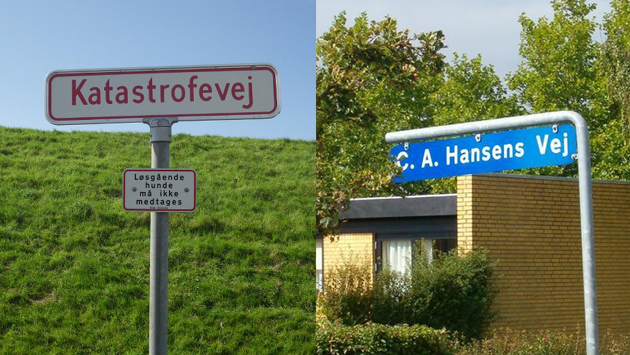

    <h2 class="section-title">{}</h2>
    <ul class="rule-list">
        <li>ドメインは.dk</li>
        <li>ナンバープレートは白か黄色{}</li>
        <li>ボラードには黄色の反射板と赤色の線がある</li>
        <li>丸いカーブのパイプで作られた道路看板がある</li>
        <li>「Ø・ø」の文字はデンマークとノルウェーでのみ使用される</li>
        <li class="no-evidence">通り名にvej・høje・havenが多い（英語ではroad・mound・garden/道・山・庭）？</li>
        <li class="no-evidence">デンマークのポスト業界でシェアの高いAlluxの丸いカーブのふたがあるポストが家の近くに設置されている</li>
    </ul>
    {}

{}
{}
{}
デンマークのOdenseにある会社のAlluxというブランドのポストが一般的。おしゃれで丸いふた{}。
{}

{}
丸いカーブのパイプが多い。通り名の看板も丸いパイプ。オランダなどはパイプが四角いことが多い。～vejはデンマーク語で～通りの意味{}。
{}

{}
ボラードには黄色の反射板と赤色の線がある{}。上部のオレンジ色のテープは色がはがれていることもあるので注意{}。
{}

{}
通り名にvej・høje・havenが多い{}。
{}

{}
家の前に旗を揚げるポールがあり、祝日や誕生日に旗を揚げることがある{}{}。掲げられる旗も極端に細い{}。
{}

{}
{}

{}
ナンバープレートは黄色も存在するので{}と間違えないように注意{}。
{}

{}

public domain, <a href="https://commons.wikimedia.org/w/index.php?curid=8391465">Wikimedia Commons</a>による

public domain
{}
{}
{}

{}
丸いカーブのパイプが多い。また横断歩道の標識の雰囲気が他と違う。
{}

<iframe src="https://www.google.com/maps/embed?pb=!4v1680252562741!6m8!1m7!1sZWJhmh_4nqfjNA9AtQnDOQ!2m2!1d55.79352258936748!2d12.49210912176099!3f271.2037104269405!4f-10.76706602482001!5f3.325193203789971" width="295" height="295" style="border:0;" allowfullscreen="" loading="lazy" referrerpolicy="no-referrer-when-downgrade"></iframe>
<iframe src="https://www.google.com/maps/embed?pb=!4v1680252582279!6m8!1m7!1snWlXLFx1EGjSLhIwboHCOg!2m2!1d55.79340002013565!2d12.49141446024509!3f211.88190720125897!4f5.226000330268334!5f3.325193203789971" width="295" height="295" style="border:0;" allowfullscreen="" loading="lazy" referrerpolicy="no-referrer-when-downgrade"></iframe>

{}
{}

    <h2 class="section-title">{}</h2>
    <ul class="rule-list">
        <li>ボーンホルム島の看板では『Nexø』か『Rønne』までの距離が書かれているケースがほとんど{}{{% by "https://ja.wikipedia.org/wiki/%E3%83%AC%E3%82%B9%E5%B3%B6" "wiki" "ボーンホルム島" %}}</li>
        <li>レス島という離島に伝統的な木造建築がある{{% by "https://ja.wikipedia.org/wiki/%E3%83%9C%E3%83%BC%E3%83%B3%E3%83%9B%E3%83%AB%E3%83%A0%E5%B3%B6" "wiki" "Læsø" %}}</li>
        <li>アンホルト島という離島がある
            <ul>
                <li>島の東側は灯台の燃料として木を伐採してしまったため砂地が広がっている</li>
                <li>道端にも砂がたまっていることがわかる{}</li>
            </ul>
        </li>
        <li>デンマークの自治領である{}・{}が出ることがある</li>
    </ul>

{}
{}

{}
『Nexø』と『Rønne』のどちらかが書いてある看板がほとんど。小さめの自転車ルートの看板にも書いてある{{% ref "https://ja.wikipedia.org/wiki/%E3%83%AC%E3%83%8D" "『Rønne - Wikipedia』" %}}。
{}

<iframe src="https://www.google.com/maps/embed?pb=!4v1691005725372!6m8!1m7!1strmPFlCuFC45oLK3wHu6Yw!2m2!1d55.07397758171165!2d14.92096067249546!3f41.08030279379204!4f-10.843329437286414!5f3.0113340896155862" width="600" height="250" style="border:0;" allowfullscreen="" loading="lazy" referrerpolicy="no-referrer-when-downgrade"></iframe>

{}
{}

{}
レス島という離島に伝統的な木造建築がある{{% by "https://ja.wikipedia.org/wiki/%E3%83%9C%E3%83%BC%E3%83%B3%E3%83%9B%E3%83%AB%E3%83%A0%E5%B3%B6" "wiki" "Læsø" %}}。『Byrum』・『Vesterø Havn』・『Østerby Havn』などの地名が看板に見つかる{}ならレス島に行ってみる。
{}

<iframe src="https://www.google.com/maps/embed?pb=!4v1685715672800!6m8!1m7!1sk7YWZkBYx1AzkLEjDoGVMg!2m2!1d57.26311626119966!2d11.03311029395011!3f281.53783425047243!4f0.3680693973414719!5f1.4939587085738273" width="550" height="250" style="border:0;" allowfullscreen="" loading="lazy" referrerpolicy="no-referrer-when-downgrade"></iframe>

{}
{}

{}
アンホルト島の東側は砂地が広がっていて道はほとんど無い{}。道のある場所でも道端に砂がたまっていたり砂みたいな道路だったりする{}。
{}

<iframe src="https://www.google.com/maps/embed?pb=!4v1697261565914!6m8!1m7!1sja229-1LQr8vmd1-vK0EtQ!2m2!1d56.71580830041433!2d11.54309706651893!3f339.80967863425553!4f-2.5571449070028933!5f0.4000000000000002" width="95%" height="300" style="border:0;" allowfullscreen="" loading="lazy" referrerpolicy="no-referrer-when-downgrade"></iframe>

{}
{}

{}

<li>ボラードの画像は以下の画像を加工しています
    <ul>
        <li>By <a rel="nofollow" class="external text" href="https://www.flickr.com/people/84554176@N00">Guillaume Baviere</a> from Copenhagen, Denmark - <a rel="nofollow" class="external text" href="https://www.flickr.com/photos/84554176@N00/16997362030/">2015-04-11</a>, <a href="https://creativecommons.org/licenses/by-sa/2.0" title="Creative Commons Attribution-Share Alike 2.0">CC BY-SA 2.0</a>, <a href="https://commons.wikimedia.org/w/index.php?curid=74159251">Link</a>
        </li>
        <li>
        By © 2009 by <a href="//commons.wikimedia.org/wiki/User:Tsca" title="User:Tsca">Tomasz Sienicki</a> [user: <a href="//commons.wikimedia.org/wiki/User:Tsca" title="User:Tsca">tsca</a>, mail: tomasz.sienicki at gmail.com] - Photograph by <a href="//commons.wikimedia.org/wiki/User:Tsca" title="User:Tsca">Tomasz Sienicki</a> (Own work), <a href="https://creativecommons.org/licenses/by/3.0" title="Creative Commons Attribution 3.0">CC BY 3.0</a>, <a href="https://commons.wikimedia.org/w/index.php?curid=7691913">Link</a>
        </li>
    </ul>
</li>
{}