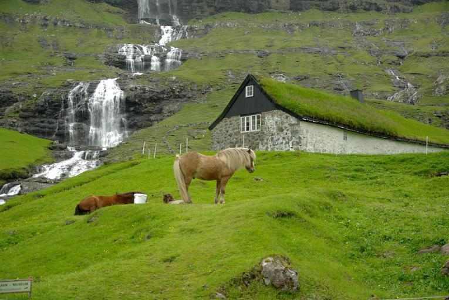
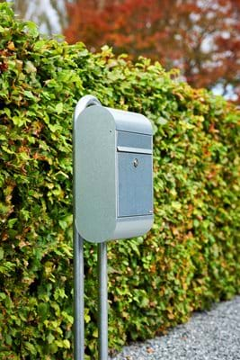

    <h2 class="section-title">{}</h2>
    <ul class="rule-list">
        <li>Domain: .fo</li>
        <li>Mobil Google Car yang khas</li>
        <li>Bolard berwarna kuning dan merah</li>
        <li>Banyak bebatuan dan hampir tidak ada pohon</li>
        <li>Terdapat lapangan sepak bola di tengah kota</li>
        <li>Terdapat penggembalaan domba</li>
        <li>Huruf "ð" hanya digunakan di Kepulauan Faroe dan Islandia</li>
    </ul>

{}
{}

{}
Di luar pusat kota, suasana seperti ini umum ditemukan, tanpa banyak pohon {}. Beberapa rumah memiliki atap rumput untuk insulasi.
{}

{}
Bolard berwarna kuning dan merah sering ditemukan {}. Mobil Google Car juga sering terlihat.
{}

By <a href="//commons.wikimedia.org/wiki/User:Zairon" title="User:Zairon">Zairon</a> - Own work, <a href="https://creativecommons.org/licenses/by-sa/4.0" title="Creative Commons Attribution-Share Alike 4.0">CC BY-SA 4.0</a>, <a href="https://commons.wikimedia.org/w/index.php?curid=34337495">Link</a>

{}
Domba atau kuda sering terlihat dekat dengan kota {}. Lapangan sepak bola dan futsal banyak ditemukan di perkotaan dan pinggiran {}.
{}

{}
Merupakan wilayah Denmark {} dan memiliki beberapa kesamaan, seperti merek kotak surat Allux {}. Papan nama jalan dan halte bus menyerupai desain Denmark {}.
{}

{}
Terdapat papan nama kuning yang serupa dengan di {}, serta tiang putih dan biru dekat penyeberangan jalan {}.
{}

By <a href="//commons.wikimedia.org/w/index.php?title=User:Lillestr%C3%B8m_SK&amp;action=edit&amp;redlink=1" class="new" title="User:Lillestrøm SK (page does not exist)">Lillestrøm SK</a> - Own work, <a href="https://creativecommons.org/licenses/by-sa/3.0" title="Creative Commons Attribution-Share Alike 3.0">CC BY-SA 3.0</a>, <a href="https://commons.wikimedia.org/w/index.php?curid=15029674">Link</a>

{}
{}

<iframe src="https://www.google.com/maps/embed?pb=!4v1683456940846!6m8!1m7!1s8vt0f0xP1LFMO1NdmGHuWg!2m2!1d62.34167483857214!2d-6.555360000110078!3f30.6085019064917!4f-30.866470462954638!5f3.2887346902936843" width="295" height="295" style="border:0;" allowfullscreen="" loading="lazy" referrerpolicy="no-referrer-when-downgrade"></iframe>
<iframe src="https://www.google.com/maps/embed?pb=!4v1683549317088!6m8!1m7!1sMmn1x_rkCxPM9YqTtrjY8Q!2m2!1d62.05808983564778!2d-6.923287083314774!3f300.6214728933497!4f-37.99380046550717!5f3.325193203789971" width="295" height="295" style="border:0;" allowfullscreen="" loading="lazy" referrerpolicy="no-referrer-when-downgrade"></iframe>

{}
{}

{}
<li>Gambar kotak surat dikutip dari '<a href="https://allux.com/allux-6000/p/66491">Allux 6000 - Scandinavian design</a>'</li>
{}
