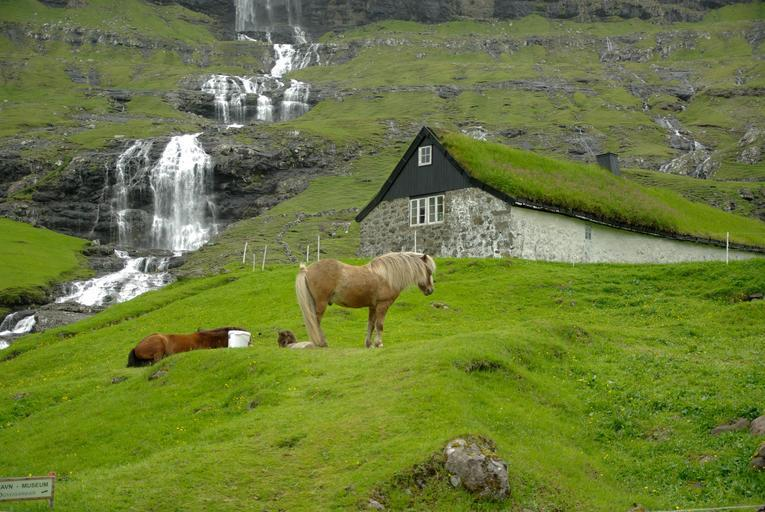
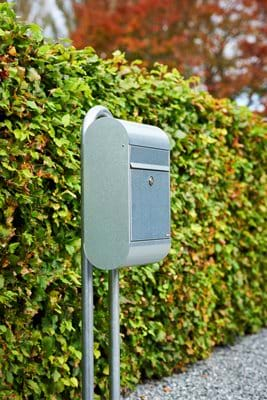
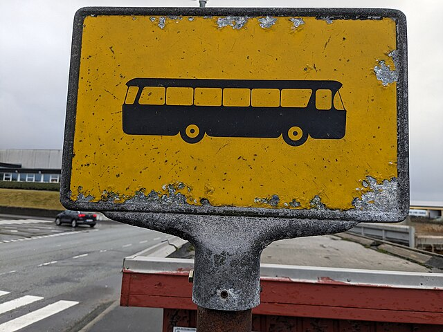

    <h2 class="section-title">{}</h2>
    <ul class="rule-list">
        <li>ドメインは.fo</li>
        <li>Google Carが特徴的</li>
        <li>黄色と赤色のボラードがある</li>
        <li>岩場が多く木がほとんど生えていない</li>
        <li>サッカー場が街中にある</li>
        <li>羊の放牧が行われている</li>
        <li>「ð」の文字はフェロー諸島とアイスランドでのみ使用される</li>
    </ul>

{}
{}

{}
都心以外はこんな感じの雰囲気で木が生えていない{}。また断熱のために草屋根（屋根の上に土をのせて草を生やしたもの）がある家が散見されるのも特徴的。
{}

{}
黄色と赤色のボラードが多い{}。Google Carが映っているのも特徴的。
{}

By <a href="//commons.wikimedia.org/wiki/User:Zairon" title="User:Zairon">Zairon</a> - Own work, <a href="https://creativecommons.org/licenses/by-sa/4.0" title="Creative Commons Attribution-Share Alike 4.0">CC BY-SA 4.0</a>, <a href="https://commons.wikimedia.org/w/index.php?curid=34337495">Link</a>

{}
放牧がよく行われているので町の近くでも羊や馬が見られるかも{}。またサッカーが人気でサッカーやフットサル場が街中と郊外に複数ある{}。
{}

{}
{}領でありデンマークとの共通点がある。デンマークにあるAlluxブランドのポストも見つかる{}{}。T字っぽい金具に付けられた通り名やバスの看板もデンマークみがある気がする{}。
{}

{}
{}などにもあるような黄色い看板が見つかる。また、横断歩道の近くに白と青で塗られた棒がある{}。
{}

By <a href="//commons.wikimedia.org/w/index.php?title=User:Lillestr%C3%B8m_SK&amp;action=edit&amp;redlink=1" class="new" title="User:Lillestrøm SK (page does not exist)">Lillestrøm SK</a> - Own work, <a href="https://creativecommons.org/licenses/by-sa/3.0" title="Creative Commons Attribution-Share Alike 3.0">CC BY-SA 3.0</a>, <a href="https://commons.wikimedia.org/w/index.php?curid=15029674">Link</a>

{}
{}

<iframe src="https://www.google.com/maps/embed?pb=!4v1683456940846!6m8!1m7!1s8vt0f0xP1LFMO1NdmGHuWg!2m2!1d62.34167483857214!2d-6.555360000110078!3f30.6085019064917!4f-30.866470462954638!5f3.2887346902936843" width="295" height="295" style="border:0;" allowfullscreen="" loading="lazy" referrerpolicy="no-referrer-when-downgrade"></iframe>
<iframe src="https://www.google.com/maps/embed?pb=!4v1683549317088!6m8!1m7!1sMmn1x_rkCxPM9YqTtrjY8Q!2m2!1d62.05808983564778!2d-6.923287083314774!3f300.6214728933497!4f-37.99380046550717!5f3.325193203789971" width="295" height="295" style="border:0;" allowfullscreen="" loading="lazy" referrerpolicy="no-referrer-when-downgrade"></iframe>

{}
{}

{}
<li>ポストの画像は『<a href="https://allux.com/allux-6000/p/66491">Allux 6000 - Scandinavian design</a>』より引用しています</li>
{}