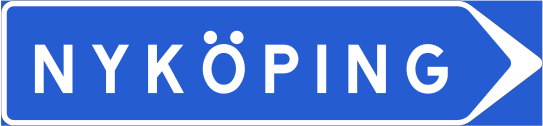
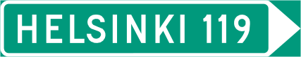
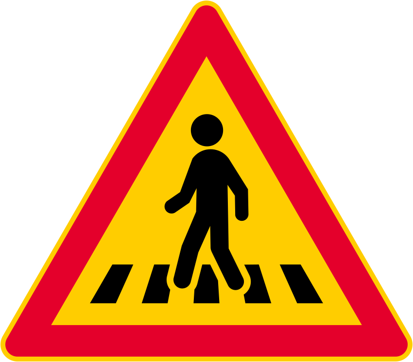
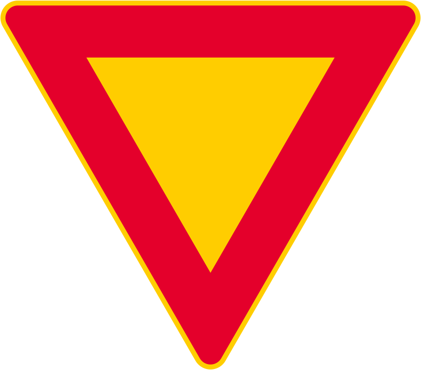
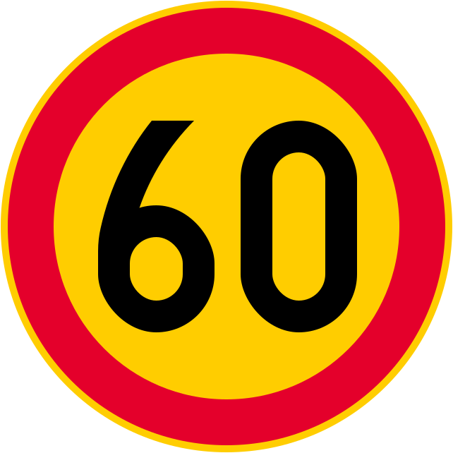
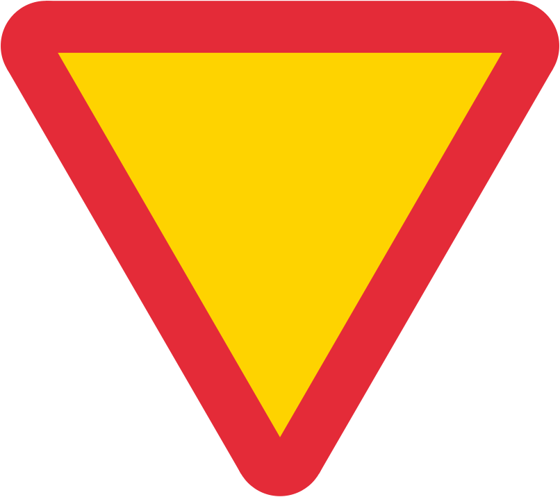

---

title: "Finland"
date: 2023-02-26
lastmod: 2023-07-01
weight: 2
draft: false
keywords: [""]
sections: [""]
bg: "bg/city.jpg"
flag: "FI.svg"
jetro_detail: true
plonkit: true
sc_title: "Areas that are easy to mistake"
sc: [
    ["../norway/", "Norway"],
    ["../sweden/", "Sweden"],
    ["../aland_islands/", "Aland Islands"],
    ["../../n_america/canada/", "Canada"],
    ]
additional_link:
    - ["Finland Doc for Geoguessr", "https://docs.google.com/presentation/d/1PeARCQFbP0Q7Uxuws3ELYcktA6j0Whbq9Mqz8xQARHM/edit#slide=id.g14913b7a907_1_0"]
---

    <h2 class="section-title">{}</h2>
    <ul class="rule-list">
        <li>The domain is .fi</li>
        <li>Crosswalks in Northern Europe 5 book is finland</li>
        <li>The background color of the sign orange many colors{}</li>
        <li>In Scandinavia, the background of speed signs is orange in Finland.Sweden</li>
        <li>street name ～tie There are many</li>
        <li>In Finland, signs have a narrow yellow border.be{}</li>
        <li>The arrow shape on the signboard is filled in like a ▶{}</li>
        <li>The company name has the meaning ``stock company.''Oh(abbreviation for osakeyhtiö)"</li>
        <li>Passing place signboards are only available in Finland arrow</li>
        <li class="no-evidence">If you point the pin just above Arnekoski, you might get a stable score (4385 points) in Finland.</li>
    </ul>
    {}

{}
{}
{}
The shape of the arrow on the signboard with the region name is filled in like a ▶ or becomes a beautiful ▷.Also ～tie I often see this street name.
{}

    

        

            
            
        

        
Sweden

    

    

        

            
            
        

        
Finland

    

    

        

            
        

        
Norway

    

{}
Crosswalks in Northern Europe 5 book is finland{}.From the left Finland・Norway・Sweden.
{}

{}
There are many street names such as ``~tie'' and ``~gatan.''
{}

{}
Finland has warning signs thin yellow border around There is{}.The top row is Finland, and the bottom row is Sweden (orange background) and Norway (white background).
{}

{}
The passing place sign on a narrow road in Scandinavia has an arrow only in Finland.A hint may be given in a place where there are no pavements and no houses in sight.From the left Finland{}・Sweden・Norway{}.
{}

{}
to the center line yellow Colored and white dashed lines are used.From the left Finland・Sweden・Norway{}.
{}

{}
flat overall{}.While Sweden and Norway have mountain ranges over 2000m above sea level, Finland's highest point is only about 1400m above sea level, and its highest point is near the border with Sweden and Norway.{}.
{}

{}
{}

{}
Northern Europe is characterized by log houses painted in deep red (Falun red).{{% by "https://ja.wikipedia.org/wiki/%E3%83%95%E3%82%A1%E3%83%BC%E3%83%AB%E3%83%B3%E8%B5%A4" "wiki" "farun red" %}}.
{}

<iframe src="https://www.google.com/maps/embed?pb=!4v1681603219451!6m8!1m7!1sCAoSLEFGMVFpcE5sV1lxZzJhVmxyV1dlbjdabF9INFM2SGs4QzdZdUJ5cGZqTnpG!2m2!1d66.47400349870854!2d25.77805517560248!3f200.62698346344465!4f5.666424746809113!5f1.6727209384642365" width="295" height="295" style="border:0;" allowfullscreen="" loading="lazy" referrerpolicy="no-referrer-when-downgrade"></iframe>

{}
{}

<iframe src="https://www.google.com/maps/embed?pb=!4v1680257983569!6m8!1m7!1sCAoSK0FGMVFpcE4xSnZfNUY0VUQtOXdHU1BaRmRVcUpndmVjY2RxWUx2MDVZZkU.!2m2!1d64.79049293577131!2d28.86883061036374!3f91.48555917413526!4f-7.18344359100135!5f3.302572108668874" width="295" height="295" style="border:0;" allowfullscreen="" loading="lazy" referrerpolicy="no-referrer-when-downgrade"></iframe>
<iframe src="https://www.google.com/maps/embed?pb=!4v1680258023177!6m8!1m7!1sCAoSK0FGMVFpcE4xSnZfNUY0VUQtOXdHU1BaRmRVcUpndmVjY2RxWUx2MDVZZkU.!2m2!1d64.79049293577131!2d28.86883061036374!3f37.19906091178483!4f-9.018507226864358!5f3.325193203789971" width="295" height="295" style="border:0;" allowfullscreen="" loading="lazy" referrerpolicy="no-referrer-when-downgrade"></iframe>
<iframe src="https://www.google.com/maps/embed?pb=!4v1680258157281!6m8!1m7!1s2yXz9ScGow_kAdVuldyAgA!2m2!1d62.5627184508939!2d22.89723479065259!3f296.6156076712753!4f-20.04210075493647!5f3.325193203789971" width="295" height="295" style="border:0;" allowfullscreen="" loading="lazy" referrerpolicy="no-referrer-when-downgrade"></iframe>

{}
{}

{}
Finnish is a Uralic language, while Sweden, Norway, Denmark, and Iceland are Norse languages.In Finnish, two vowels are sometimes placed next to each other.
{}

<table class="word-list">
<tr>
    <th>language name</th> <th>Notation</th>
</tr>
<tr><td>Japanese</td><td>This is a one-way zone</td></tr>
<tr><td>English</td><td>This is a one-way zone.</td></tr>
<tr><td>swedish</td><td>Det härär enkelriktad zon.</td></tr>
<tr><td>norwegian</td><td>Dette er enveiskj ø ringsson.</td></tr>
<tr><td>Danish</td><td>Dete er en ensrettet zone.</td></tr>
<tr><td>Finnish</td><td>Tämä on yksisuuntainen alue.</td></tr>
</table>

{}
{}

{}
If you know it's Finland but don't know which region, you might be able to get stable points by pointing the pin directly above Arnekoski.{}.There is a point just above Arnekoski.
{}

{}
{}

    <h2 class="section-title">{}</h2>
    <ul class="rule-list">
        <li>The region may be known by the language written on the signboard.{}
            <ul>
                <li>When Finnish and Swedish are side by side along the south or southwest coast</li>
                <li>When written alongside Northern Sami northernmost area</li>
            </ul>
        </li>
        <li>If the surrounding area is flat and the road surface is reddish{}Maybe</li>
        <li>Area codes vary by region</li>
    </ul>

{}
{}

{}
If Finnish and Swedish are side by side, or if Swedish is in the south or southwest coast.{}
{}

{}
{}

{}
If it is written alongside Northern Sami, etc., it is the northernmost area.{}
{}

<iframe src="https://www.google.com/maps/embed?pb=!4v1683367980711!6m8!1m7!1s1J0oYD1THBh_-O0oz_Em1A!2m2!1d68.44920612578743!2d22.48414377380987!3f24.98751516452928!4f-3.282087002843099!5f1.7435841893377364" width="500" height="300" style="border:0;" allowfullscreen="" loading="lazy" referrerpolicy="no-referrer-when-downgrade"></iframe>

{}
{}

</a>

public domain

{}
{}