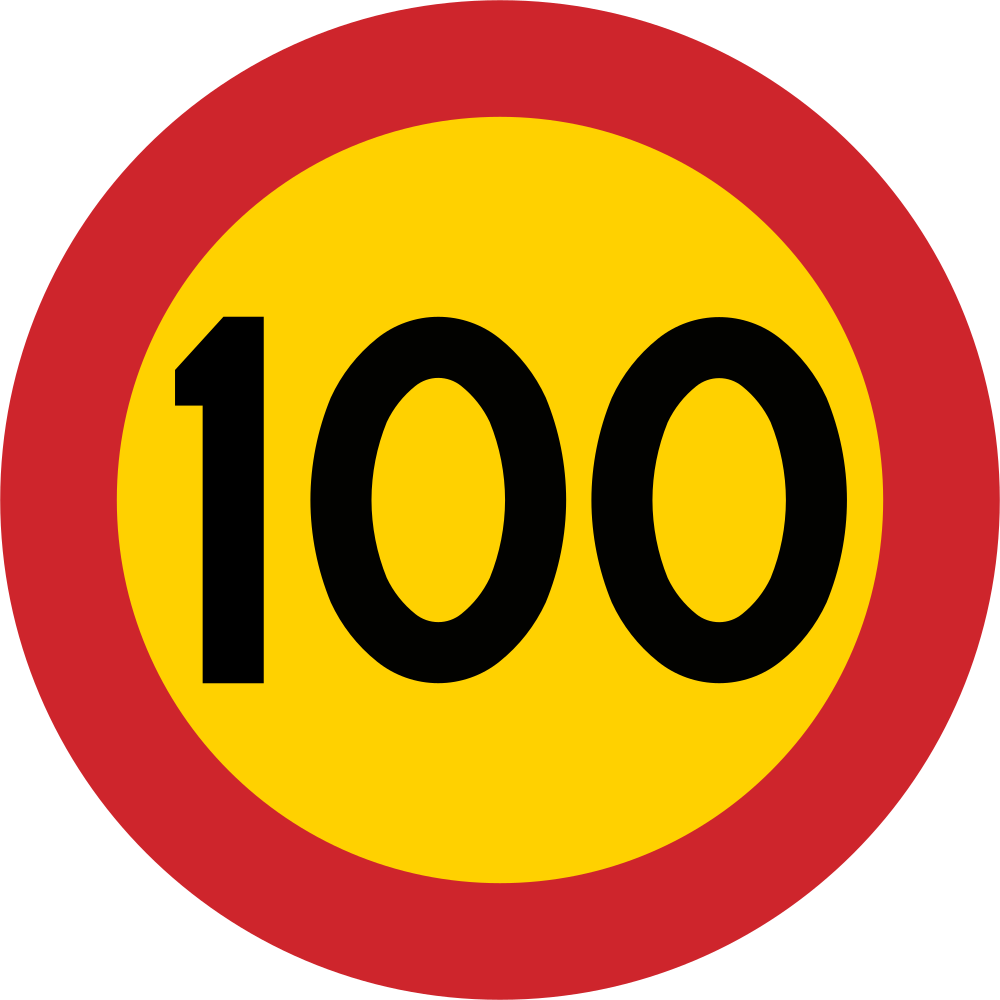

    <h2 class="section-title">{}</h2>
    <ul class="rule-list">
        <li>ドメインは.fi</li>
        <li>北欧で横断歩道が5本はフィンランド</li>
        <li>標識の背景色にオレンジ色が多い{}</li>
        <li>速度標識の背景がオレンジ色なのはフィンランドとスウェーデン</li>
        <li>通り名に～tieが多い</li>
        <li>フィンランドは速度標識のまわりに黄色の細い円がある{}</li>
        <li>看板の矢印の形が▶のような塗りつぶしになっている{}</li>
        <li>会社名に株式会社という意味である「Oy（osakeyhtiöの略）」と付いている</li>
        <li>Passing place（車の待避所）の看板がフィンランドだけ矢印</li>
        <li class="no-evidence">アーネコスキの直ぐ上にピンを指すとフィンランドで安定した点（4385点）が取れるかも</li>
    </ul>
    {}

{}
{}
{}
地域名が書かれた看板の矢印の形が▶のような塗りつぶし or 綺麗な▷になっている。また～tieという通り名をよく見かける。
{}

    

        

            
            
        

        
スウェーデン

    

    

        

            
            
        

        
フィンランド

    

    

        

            
        

        
ノルウェー

    

{}
北欧で横断歩道が5本はフィンランド。左からフィンランド・ノルウェー・スウェーデン。
{}

{}
フィンランドは速度標識のまわりに黄色の細い円がある{}。上の段がフィンランド・下の段がスウェーデン（オレンジ背景）とノルウェー（白背景）。
{}

{}
北欧の狭い道にあるPassing place（車の待避所）の看板がフィンランドだけ矢印（例<a href="https://goo.gl/maps/22aeWZvbBynbwaXh6">①</a>・<a href="https://goo.gl/maps/HmKuBQafiJcTDvku9">②</a>）。舗装されておらず家も見当たらない場所でヒントになることがある。左からフィンランド・スウェーデン・ノルウェー。
{}

{}
中央の線に黄色と白の破線が使われる。左からフィンランド・スウェーデン・ノルウェー{}。
{}

{}
フィンランドなのは分かったもののどの地域が分からないとき、アーネコスキの直ぐ上にピンを指すと安定して点が取れるかも{}。アーネコスキのすぐ上にポイントがある。
{}

{}
{}

{}
北欧は濃い赤色（ファールン赤）で塗られたログハウスが特徴的{{% by "https://ja.wikipedia.org/wiki/%E3%83%95%E3%82%A1%E3%83%BC%E3%83%AB%E3%83%B3%E8%B5%A4" "wiki" "ファールン赤" %}}。
{}

<iframe src="https://www.google.com/maps/embed?pb=!4v1681603219451!6m8!1m7!1sCAoSLEFGMVFpcE5sV1lxZzJhVmxyV1dlbjdabF9INFM2SGs4QzdZdUJ5cGZqTnpG!2m2!1d66.47400349870854!2d25.77805517560248!3f200.62698346344465!4f5.666424746809113!5f1.6727209384642365" width="295" height="295" style="border:0;" allowfullscreen="" loading="lazy" referrerpolicy="no-referrer-when-downgrade"></iframe>

{}
{}

<iframe src="https://www.google.com/maps/embed?pb=!4v1680257983569!6m8!1m7!1sCAoSK0FGMVFpcE4xSnZfNUY0VUQtOXdHU1BaRmRVcUpndmVjY2RxWUx2MDVZZkU.!2m2!1d64.79049293577131!2d28.86883061036374!3f91.48555917413526!4f-7.18344359100135!5f3.302572108668874" width="295" height="295" style="border:0;" allowfullscreen="" loading="lazy" referrerpolicy="no-referrer-when-downgrade"></iframe>
<iframe src="https://www.google.com/maps/embed?pb=!4v1680258023177!6m8!1m7!1sCAoSK0FGMVFpcE4xSnZfNUY0VUQtOXdHU1BaRmRVcUpndmVjY2RxWUx2MDVZZkU.!2m2!1d64.79049293577131!2d28.86883061036374!3f37.19906091178483!4f-9.018507226864358!5f3.325193203789971" width="295" height="295" style="border:0;" allowfullscreen="" loading="lazy" referrerpolicy="no-referrer-when-downgrade"></iframe>
<iframe src="https://www.google.com/maps/embed?pb=!4v1680258157281!6m8!1m7!1s2yXz9ScGow_kAdVuldyAgA!2m2!1d62.5627184508939!2d22.89723479065259!3f296.6156076712753!4f-20.04210075493647!5f3.325193203789971" width="295" height="295" style="border:0;" allowfullscreen="" loading="lazy" referrerpolicy="no-referrer-when-downgrade"></iframe>

{}
{}

{}
フィンランド語はウラル語系、スウェーデン・ノルウェー・デンマーク・アイスランドなどはノルド語系の言語。フィンランド語では母音を2つ並べることがある。
{}

<table class="word-list">
<tr>
    <th>言語名</th> <th>表記</th>
</tr>
<tr><td>日本語</td><td>ここは一方通行のゾーンです</td></tr>
<tr><td>英語</td><td>This is a one-way zone.</td></tr>
<tr><td>スウェーデン語</td><td>Det här är en enkelriktad zon.</td></tr>
<tr><td>ノルウェー語</td><td>Dette er en enveiskjøringssone.</td></tr>
<tr><td>デンマーク語</td><td>Dette er en ensrettet zone.</td></tr>
<tr><td>フィンランド語</td><td>Tämä on yksisuuntainen alue.</td></tr>
</table>

{}
{}

    <h2 class="section-title">{}</h2>
    <ul class="rule-list">
        <li>看板に書かれた言語によって地域が分かることがある{}
            <ul>
                <li>フィンランド語とスウェーデン語が並んでる場合もしくはスウェーデン語の場合は南か南西の海沿い</li>
                <li>北部サーミ語などと並んで書かれている場合は最も北のエリア</li>
            </ul>
        </li>
        <li>周りが平坦で路面が赤っぽいならば{}かも</li>
    </ul>

{}
{}

{}
フィンランド語とスウェーデン語が並んでる場合もしくはスウェーデン語の場合は南か南西の海沿い{}
{}

{}
{}

{}
北部サーミ語などと並んで書かれている場合は最も北のエリア{}
{}

<iframe src="https://www.google.com/maps/embed?pb=!4v1683367980711!6m8!1m7!1s1J0oYD1THBh_-O0oz_Em1A!2m2!1d68.44920612578743!2d22.48414377380987!3f24.98751516452928!4f-3.282087002843099!5f1.7435841893377364" width="500" height="300" style="border:0;" allowfullscreen="" loading="lazy" referrerpolicy="no-referrer-when-downgrade"></iframe>

{}
{}