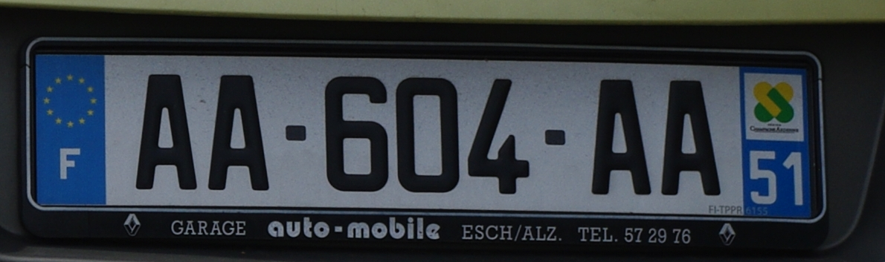
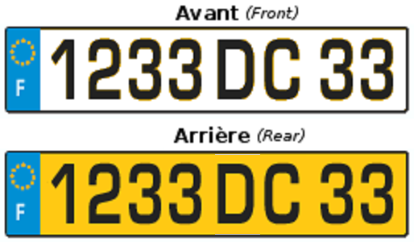

    <h2 class="section-title">見分け方</h2>
    <ul class="rule-list">
        <li>ドメインは.fr</li>
        <li>フランス語の「â，î，û，ê，ô」とアクサンテギュ（「e」に点をつけた文字）が特徴的</li>
        <li>電話番号が2つの数が5個並んでいる</li>
        <li>電柱に青いプレートが貼ってあることがある{}</li>
    </ul>

{}
{}
{}
電話番号が2桁が5つ並んでいる。はじめの番号で地域もわかる。
{}

<iframe src="https://www.google.com/maps/embed?pb=!4v1679812478530!6m8!1m7!1sZ4yDy1eOwJD9eD_9-4jNXA!2m2!1d48.38573952136643!2d-4.489652245502031!3f326.77275279375493!4f-13.373393826588455!5f3.325193203789971" width="295" height="295" style="border:0;" allowfullscreen="" loading="lazy" referrerpolicy="no-referrer-when-downgrade"></iframe>
<iframe src="https://www.google.com/maps/embed?pb=!4v1681048066604!6m8!1m7!1sYWHe9Zlc-WPOSc_comFbDA!2m2!1d42.70116600989535!2d2.896681430311358!3f49.92435327323158!4f-6.833316766170071!5f3.325193203789971" width="295" height="295" style="border:0;" allowfullscreen="" loading="lazy" referrerpolicy="no-referrer-when-downgrade"></iframe>

{}
ボラードは丸く太い。赤と白のものがあり、先がとがっている。
{}

<iframe src="https://www.google.com/maps/embed?pb=!4v1679380793765!6m8!1m7!1s8ryarpB8PYnYChP5lv4jsQ!2m2!1d43.80164608843641!2d0.05137941076106586!3f175.39096274941411!4f-34.975801139495374!5f1.7103596603011662" width="295" height="295" style="border:0;" allowfullscreen="" loading="lazy" referrerpolicy="no-referrer-when-downgrade"></iframe>
<iframe src="https://www.google.com/maps/embed?pb=!4v1681048276254!6m8!1m7!1sOOrM2Me1inplaB-KoJfFOg!2m2!1d44.23389681443417!2d-1.223356535712167!3f342.16!4f-7.489999999999995!5f3.325193203789971" width="295" height="295" style="border:0;" allowfullscreen="" loading="lazy" referrerpolicy="no-referrer-when-downgrade"></iframe>

{}
ナンバープレートは両サイドに青、古いもの（2009年以前のフォーマット）は片方だけ青の場合もある。
{}
{}

Svbzc - 投稿者自身による著作物, CC 表示-継承 3.0, https://commons.wikimedia.org/w/index.php?curid=6831533による
{}
{}

CC BY-SA 3.0, https://commons.wikimedia.org/w/index.php?curid=329958
{}
{}
{}

<iframe src="https://www.google.com/maps/embed?pb=!4v1679499555256!6m8!1m7!1s1s6iwfSSHnzzn-W_5ApFOQ!2m2!1d49.58687382021852!2d2.292816456709319!3f15.68954378050926!4f-7.759508438445337!5f3.325193203789971" width="295" height="295" style="border:0;" allowfullscreen="" loading="lazy" referrerpolicy="no-referrer-when-downgrade"></iframe>
<iframe src="https://www.google.com/maps/embed?pb=!4v1679499745297!6m8!1m7!1sjhcpN_yf7nbEPTp8ZZzM0A!2m2!1d48.38306966108105!2d-4.527637790167269!3f219.9072758992309!4f4.26856072184178!5f2.885928539097609" width="295" height="295" style="border:0;" allowfullscreen="" loading="lazy" referrerpolicy="no-referrer-when-downgrade"></iframe>
<iframe src="https://www.google.com/maps/embed?pb=!4v1681048137991!6m8!1m7!1skN9PPHcI2yjaRk2U6QIhRg!2m2!1d45.0339435257467!2d-0.7395826973967495!3f151.99725813313395!4f-21.08328800397571!5f2.807974713449285" width="295" height="295" style="border:0;" allowfullscreen="" loading="lazy" referrerpolicy="no-referrer-when-downgrade"></iframe>

{}
{}

{}
{}

<iframe src="https://www.google.com/maps/embed?pb=!4v1679812478530!6m8!1m7!1sZ4yDy1eOwJD9eD_9-4jNXA!2m2!1d48.38573952136643!2d-4.489652245502031!3f326.77275279375493!4f-13.373393826588455!5f3.325193203789971" width="295" height="295" style="border:0;" allowfullscreen="" loading="lazy" referrerpolicy="no-referrer-when-downgrade"></iframe>
<iframe src="https://www.google.com/maps/embed?pb=!4v1679499615536!6m8!1m7!1s1s6iwfSSHnzzn-W_5ApFOQ!2m2!1d49.58687382021852!2d2.292816456709319!3f199.85492266075627!4f-2.8166128908505357!5f3.276746547678126" width="295" height="295" style="border:0;" allowfullscreen="" loading="lazy" referrerpolicy="no-referrer-when-downgrade"></iframe>

{}
{}

{}
Système Uはフランスのスーパーマーケット組合（{{% by "https://en.wikipedia.org/wiki/Syst%C3%A8me_U" "wiki" "Système U" %}}）。強くなるとHyper Uになる。
{}

<iframe src="https://www.google.com/maps/embed?pb=!4v1679380851133!6m8!1m7!1seb5strGIv6GMDtG6tcPu8A!2m2!1d43.29484919391635!2d-0.3242797265581168!3f50.863799117673!4f13.586103203075723!5f3.325193203789971" width="295" height="295" style="border:0;" allowfullscreen="" loading="lazy" referrerpolicy="no-referrer-when-downgrade"></iframe>
<iframe src="https://www.google.com/maps/embed?pb=!4v1681342282435!6m8!1m7!1sTFLCBVj_D16Egvy7fCg-iw!2m2!1d46.45146941722496!2d-0.8055775440280517!3f64.28518427305654!4f4.02540626784014!5f3.3141337805568174" width="295" height="295" style="border:0;" allowfullscreen="" loading="lazy" referrerpolicy="no-referrer-when-downgrade"></iframe>

{}
{}

<iframe src="https://www.google.com/maps/embed?pb=!4v1679380793765!6m8!1m7!1s8ryarpB8PYnYChP5lv4jsQ!2m2!1d43.80164608843641!2d0.05137941076106586!3f175.39096274941411!4f-34.975801139495374!5f1.7103596603011662" width="295" height="295" style="border:0;" allowfullscreen="" loading="lazy" referrerpolicy="no-referrer-when-downgrade"></iframe>

{}
{}

    <h2 class="section-title">州・地域の見分け方</h2>
    <ul class="rule-list">
        <li>電話番号の先頭の2桁で地域がわかる</li>
        <li>ナンバープレートで両サイドに青色のものがある</li>
        <li>01はパリ周辺、あとは時計回り。離島（コルス島）は04を覚えておけば気合で思い出せる？</li>
        <li>パリの場合は区画の番号が時計回り、店の住所を見れば直ぐに場所が分かる{}</li>
    </ul>

    <h2 class="section-title">都市・町の見分け方</h2>
    <ul class="rule-list">
        <li>ヴェルサイユ宮殿の中も出題される</li>
    </ul>

{}
{}
{}
{}

<iframe src="https://www.google.com/maps/embed?pb=!4v1679759814340!6m8!1m7!1s0rQNq_fO8gB7bszVAGJsyA!2m2!1d48.8047658!2d2.1202258!3f169.26389412089094!4f5.753910367891805!5f0.7820865974627469" width="295" height="295" style="border:0;" allowfullscreen="" loading="lazy" referrerpolicy="no-referrer-when-downgrade"></iframe>

{}
{}