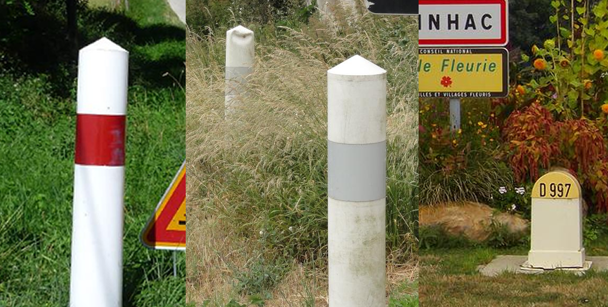

    <h2 class="section-title">{}</h2>
    <ul class="rule-list">
        <li>ドメインは.fr</li>
        <li>電話番号は2つの数が5個並んでいる</li>
        <li>「D653」と言った感じのDで始まる道路番号の黄色いプレートがある</li>
        <li>フランス語の「â，î，û，ê，ô」と「é」の文字が多く見つかる</li>
        <li>電柱に青いプレートが貼ってあることがある{}</li>
        <li>通り名の看板に「Rue」と書いてあればフランス語圏の可能性が高い</li>
    </ul>
    {}

{}
{}

{}
ボラードは丸く太い白いポールに赤い反射板がある{}。先端の色や反射板の色がちがうもの{}や消しゴムみたいな形のものもある{}。ただしごく稀に同じボラードを{}でも見かける{}。
{}

{}
電話番号は2桁の数字が5つ並んでいるフォーマット{}。半角スペースか「.」で区切られて書かれていることが多い。はじめの2桁で地域もわかりパリが `01`。そのあとの2桁も絞り込みに使える。
{}

{}
電柱やポールに青いプレートが貼ってあるならば99%フランス領のどこか{}{}。ごく稀に例外もある{}。
{}

{}
プレートが白い場合は{}{}や{}{}を考えてみる。
{}

{}
Dで始まる道路番号の黄色いプレートがある{}。ただしマップから探すのは結構むずかしい。
{}

{}
ナンバープレートは他のEU諸国と同じく左側だけ青色のものが多い。ただし両サイドが青色{}のものや全体が黄色い{}ときもある。
{}

{}

By <a rel="nofollow" class="external text" href="https://www.flickr.com/people/24736216@N07">Roger</a> from Sarasota, Florida, U.S.A. - <a rel="nofollow" class="external text" href="https://www.flickr.com/photos/24736216@N07/8912170510/">Marigot - St. Martin License Plates</a>, <a href="https://creativecommons.org/licenses/by-sa/2.0" title="Creative Commons Attribution-Share Alike 2.0">CC BY-SA 2.0</a>, <a href="https://commons.wikimedia.org/w/index.php?curid=40704190">Link</a>
{}

{}
青・白のシェブロンがある{}。青・白のシェブロンを使うのはヨーロッパではフランスと{}のみ。
{}

{}
コンクリートの四角い電柱や区切りのある電柱がある。同じ形の電柱はフランス領である{}にも存在する。仕切りのある電柱は隣国の{}でも見つかるので周りの景色も確認する。
{}

{}
通り名の看板が建物の壁に貼ってあることがあり、「Rue」と書かれている。オック語のような他言語のプレートが並んでいることもある。以下は<a href="https://goo.gl/maps/kjcz9N3tpU6ETf4d8">Toulouse市</a>の看板。
{}

{}
フランス以外では四角い立方体型のポストはあまり見かけないように思う{}。
{}

{}
{}

{}
青いプレートのついたポール。区切りのある電柱もある。
{}

<iframe src="https://www.google.com/maps/embed?pb=!4v1679499555256!6m8!1m7!1s1s6iwfSSHnzzn-W_5ApFOQ!2m2!1d49.58687382021852!2d2.292816456709319!3f15.68954378050926!4f-7.759508438445337!5f3.325193203789971" width="295" height="295" style="border:0;" allowfullscreen="" loading="lazy" referrerpolicy="no-referrer-when-downgrade"></iframe>
<iframe src="https://www.google.com/maps/embed?pb=!4v1682905393199!6m8!1m7!1spuvViFzy7cby3c7YJUVtHw!2m2!1d50.70903062516371!2d3.241730280958023!3f255.50125409265092!4f-4.9258843590848045!5f3.1652909710178734" width="295" height="295" style="border:0;" allowfullscreen="" loading="lazy" referrerpolicy="no-referrer-when-downgrade"></iframe>

{}
{}

{}
Système Uはフランスのスーパーマーケット組合 {{% by "https://en.wikipedia.org/wiki/Syst%C3%A8me_U" "wiki" "Système U" %}}。強くなるとHyper Uになる。
{}

<iframe src="https://www.google.com/maps/embed?pb=!4v1679380851133!6m8!1m7!1seb5strGIv6GMDtG6tcPu8A!2m2!1d43.29484919391635!2d-0.3242797265581168!3f50.863799117673!4f13.586103203075723!5f3.325193203789971" width="295" height="295" style="border:0;" allowfullscreen="" loading="lazy" referrerpolicy="no-referrer-when-downgrade"></iframe>
<iframe src="https://www.google.com/maps/embed?pb=!4v1681342282435!6m8!1m7!1sTFLCBVj_D16Egvy7fCg-iw!2m2!1d46.45146941722496!2d-0.8055775440280517!3f64.28518427305654!4f4.02540626784014!5f3.3141337805568174" width="295" height="295" style="border:0;" allowfullscreen="" loading="lazy" referrerpolicy="no-referrer-when-downgrade"></iframe>

{}
{}

    <ul class="rule-list-none">
        <li>{}</li>
    </ul>

{}
{}

    <h2 class="section-title">{}</h2>
    <ul class="rule-list">
        <li>市外局番の先頭の2桁で地域がわかるかも。01はパリ周辺であとは時計回り
            <ul>
                <li>『02 9x』は半島部 (by 市民ジョンさん@コメ欄)</li>
                <li>『04 95』は離島だが都会ではないので電話番号を見つけるのは難しいかも</li>
            </ul>
        </li>
        <li>フランスの海外県がありそこでもEUと同じ左側が青いナンバープレートを見ることがある
            <ul>
                <li>{}</li>
                <li>{}</li>
                <li>{}</li>
                <li>参考『<a href="https://ja.wikipedia.org/wiki/%E3%83%95%E3%83%A9%E3%83%B3%E3%82%B9%E3%81%AE%E6%B5%B7%E5%A4%96%E7%9C%8C%E3%83%BB%E6%B5%B7%E5%A4%96%E9%A0%98%E5%9C%9F">フランスの海外県・海外領土</a>』</li>
            </ul>
        </li>
    </ul>

{}
{}

CC BY 3.0. <a href="https://en.wikipedia.org/wiki/Telephone_numbers_in_France">Telephone numbers in France. (2023, March 30). In Wikipedia.</a>

{}
電話番号は2桁の数字が5つ並んでいる。はじめの番号（いわゆる市外局番に相当するもの）で地域もわかる。パリが `01` 。`02` からは時計回りなので他の国と比較すると覚えやすい。
{}
{}
{}

CC BY 3.0. <a href="https://en.wikipedia.org/wiki/Telephone_numbers_in_France">Telephone numbers in France. (2023, March 30). In Wikipedia.</a>を加工しています

{}
コメントで教えてもらったついでに作ってみた図。なんとなく `02 9x` で半島に、`05 4x` で結構北に、`04 7x` かどうかで海沿いに行くか行かないか決めるのが役立つ気がする。もちろんすべての地域の４桁目まで覚えられるのが理想かもしれないが個人的にはこの３つ以外覚えるのは無理。
{}
{}
{}

    <h4 class="section-title">建築</h4>
    <ul class="rule-list">
        <li class="no-evidence">Slate{{% ref "https://ja.wikipedia.org/wiki/%E7%B2%98%E6%9D%BF%E5%B2%A9" "粘板岩" %}}という黒色の板状の素材がある地域ほど家の屋根が黒っぽい
            <ul>
                <li>主なSlate生産地は北西の半島周り{}・中央のCorrèze付近{}・ピレネー山脈付近{}であり一般的には半島を中心とした北部に多め</li>
                <li>{}</li>
                <li>{}</li>
            </ul>
        </li>
        <li>レンガが多かったら{}近くを検討してみる{}{}</li>
        <li>スイス近くの山脈は家の作りもスイスに近い</li>
        <li>南東のLuberon周りでは薄い板状の白い岩を積み重ねた石垣などがある</li>
    </ul>

{}
{}
{}
調べた限りだとSlateという素材が手に入りやすい地域は黒い屋根が多い{{% ref "https://ja.wikipedia.org/wiki/%E3%83%96%E3%83%AB%E3%82%BF%E3%83%BC%E3%83%8B%E3%83%A5" "ブルターニュ" %}}。たとえば北西のブルターニュは黒い屋根と石壁や石造りの家が多く感じる{}。Wikipedia{}に基づくならばSlateが多く生産されていた北西の半島部分・中央のCorrèze付近{}・ピレネー山脈付近は黒い屋根が多い。細かい地域は『<a href="https://drive.google.com/file/d/1xgyIFSG1jM2V92cXNUs1K5ZkIAFEKIqt/view">France Tips for Geoguessr</a>』の図を見る。
{}

{}
{}
{}
木の板で作られた家が見つかる{}。
{}

{}
{}
{}
レンガの家が見つかる{}。写真はAubyの町。
{}

{}
{}
{}
薄い板状の白い岩を積み重ねた石垣などがある{}。
{}

{}
{}

    <h4 class="section-title">農業</h4>
    <ul class="rule-list">
        <li>■ブドウ畑が広がる
            <ul>
                <li>西のBordeaux周辺{}</li>
                <li>地中海沿いのHérault県{}</li>
                <li>Lyon北のボジョレー地区{}</li>
            </ul>
        </li>
        <li>■牧畜・畜産業が多い
            <ul>
                <li>中央のLimoges周辺{}</li>
            </ul>
        </li>
        <li>■山岳地帯付近では羊やヤギが多い
            <ul>
                <li>ピレネー山脈周辺{}</li>
            </ul>
        </li>
        <li>農作物に若干の地域性がある {}
            <ul>
                <li class="no-evidence">菜種の畑は北部に多い</li>
                <li class="no-evidence">ひまわりの畑は北部沿岸部には少ない</li>
            </ul>
        </li>
    </ul>

{}
{}

{}
図の出典：Swinnen, Johan, Pavel Ciaian, and d’Artis Kancs. Study on the Functioning of Land Markets in the EU Member States under the Influence of Measures applied under the Common Agricultural Policy. No. 04/2008. EERI Research Paper Series, 2008.
{}

{}
{}

    <h4 class="section-title">言語</h4>
    <ul class="rule-list">
        <li>町の名前の語尾で地域が分かることがある
            <ul>
                <li>ドイツ付近では町名に「ett」「heim」といった文字が付いている</li>
                <li>南西部では町名が「ac」で終わることが多い{}</li>
            </ul>
        </li>
        <li>オック語の表記があるならばフランス南部に行ってみる</li>
        <li>コルシカ島はコルシカ語との二言語表記の看板があったり、フランス語表記が塗りつぶされていたりする</li>
    </ul>

{}
{}

{}
周りの言語の影響を受けて地名も変化する。「~heim」ならドイツ国境付近へ、「~court」「~ville」ならば北へ、「~ac」かつ黒い屋根が少ない場合は南へ行ってみる。
{}

<blockquote class="reddit-embed-bq" style="height:500px" data-embed-height="740"><a href="https://www.reddit.com/r/MapPorn/comments/fzfpz0/suffixes_in_french_city_names_hq_in_comments/">Suffixes in French city names (HQ in comments)</a>  by<a href="https://www.reddit.com/user/syl20_0/">u/syl20_0</a> in<a href="https://www.reddit.com/r/MapPorn/">MapPorn</a></blockquote>

{}
{}

{}
以下は<a href="https://goo.gl/maps/kjcz9N3tpU6ETf4d8">Toulouse市</a>の看板で下がオック語の表記。
{}

{}
{}

{}
歴史的な理由から看板のフランス語表記に落書きがされていたり穴が開いていることも{}。詳細は外部サイトなど参照{{% ref "https://ja.wikivoyage.org/wiki/%E3%82%B3%E3%83%AB%E3%82%B7%E3%82%AB%E5%B3%B6" "コルシカ島" %}}。
{}

By skender - <a href="//commons.wikimedia.org/wiki/File:Col_de_Teghime_et_D81.jpg" title="File:Col de Teghime et D81.jpg">File:Col_de_Teghime_et_D81.jpg</a>, <a href="https://creativecommons.org/licenses/by/2.0" title="Creative Commons Attribution 2.0">CC BY 2.0</a>, <a href="https://commons.wikimedia.org/w/index.php?curid=37685557">Link</a>

{}
{}

    <h2 class="section-title">{}</h2>
    <ul class="rule-list">
        <li>『Highest road in Europe』とも呼ばれるCol de la Bonette峠がありD64の道がある</li>
        <li>Corsica（コルシカ）島
            <ul>
                <li>Corsica島は急峻な山と手つかずの自然が広がっている{}</li>
                <li>市外局番が『04 95』{}</li>
                <li>コルシカ語との二言語表記の看板がある{}</li>
            </ul>
        </li>
        <li>Noirmoutier島という平坦な湿地地帯がある{}</li>
        <li class="no-evidence">Porquerolles島という離島が地中海側のイエール諸島にある{}</li>
        <li>Aiguille de la Grande Sassièreへの道がある{}</li>
    </ul>

{}
{}
{}D64道路が走っている{}。
{}

{}
{}
{}小さい島だが2500m超の山が連なり内陸の道路は険しい山が見える。写真はD27道路{}？島の東海岸付近以外は平野がほぼ無く、4割の地域が自然公園であり手つかずの自然が残されている。山がち・植林でない森・農業の様子もないならこの島を考えてみる{}。
{}

{}
{}
{}ノワールムティエ（Noirmoutier）島はラムサール条約に登録されている湿地であり辺り一面が平坦でフランスではかなり珍しい景色をしている{}{{% ref "https://ja.wikipedia.org/wiki/%E3%83%8E%E3%83%AF%E3%83%BC%E3%83%AB%E3%83%A0%E3%83%86%E3%82%A3%E3%82%A8%E5%B3%B6" "ノワールムティエ島" %}}。水路が多く浮草がたくさん浮かんでいる。オレロン島{}やレ島{}のような他の西側の島にも似た景色がある。
{}

{}
{}
{}舗装されていない道や黄色い看板が多い{}。地中海性気候で周りの木も暖かい感じ{}。
{}

{}
{}
{}
フランスのサヴォワ県にあるアルプスの山、Aiguille de la Grande Sassièreへの道がある。初見ではフランスとわからなかったのでメモ{}。
{}

By <a href="//commons.wikimedia.org/wiki/User:Kulmalukko" title="User:Kulmalukko">Tiia Monto</a> - Own work, <a href="https://creativecommons.org/licenses/by-sa/4.0" title="Creative Commons Attribution-Share Alike 4.0">CC BY-SA 4.0</a>, <a href="https://commons.wikimedia.org/w/index.php?curid=135596065">Link</a>

{}
{}

    <ul class="rule-list">
        <li>Parisは区画の番号が時計回り{}</li>
    </ul>

{}
{}
{}
パリの行政区はル・ルーヴルの１からスタートしてらせん状に数が増える。
{}

<a href="https://en.wikipedia.org/wiki/User:ThePromenader" class="extiw" title="en:User:ThePromenader">ThePromenader</a>, <a href="//commons.wikimedia.org/wiki/User:Yonidebest" title="User:Yonidebest">user:yonidebest</a> added the numbers - <a href="//commons.wikimedia.org/wiki/File:Paris_arr_jms.gif" title="File:Paris arr jms.gif">Image:Paris arr jms.gif</a>, <a href="http://creativecommons.org/licenses/by-sa/3.0/" title="Creative Commons Attribution-Share Alike 3.0">CC BY-SA 3.0</a> - <a href="https://commons.wikimedia.org/w/index.php?curid=3121274">Link</a>

{}
通りの交差点近くの建物の壁に『●●ARR, RUE ◆◆』と書かれたプレートが張られている。下のプレートの場合はパリの8番目の区画に行く。
{}

{}
{}

{}
<li>By <a href="//commons.wikimedia.org/wiki/User:Chabe01" title="User:Chabe01">Chabe01</a> - Own work, <a href="https://creativecommons.org/licenses/by-sa/4.0" title="Creative Commons Attribution-Share Alike 4.0">CC BY-SA 4.0</a>, <a href="https://commons.wikimedia.org/w/index.php?curid=59212980">Link</a></li>
{}
