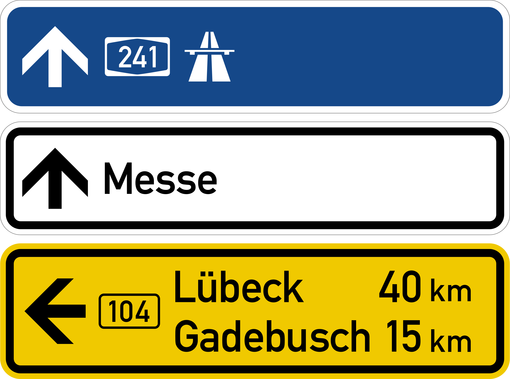
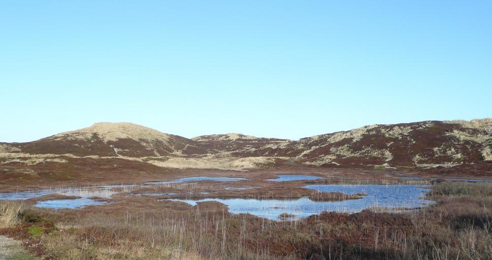
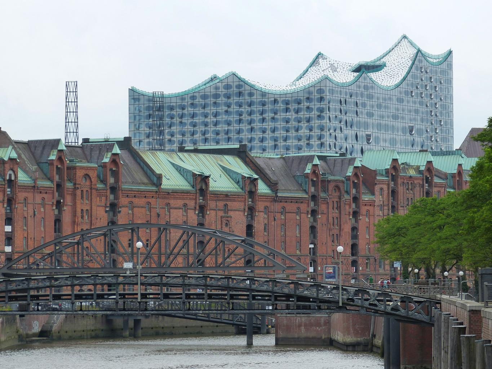
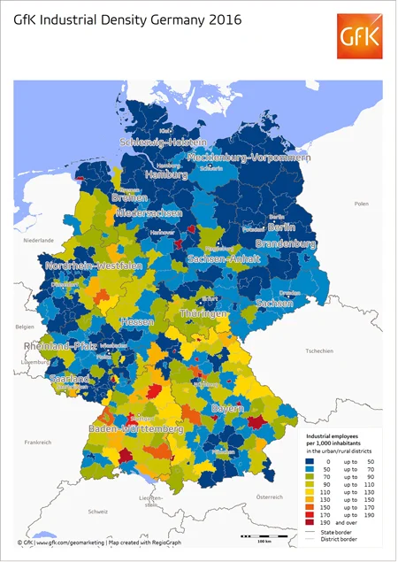

    <h2 class="section-title">{}</h2>
    <ul class="rule-list">
        <li>The country-code domain is .de</li>
        <li>Einbahnstraße marks a one-way street</li>
        <li>German uses the Eszett character ß</li>
        <li>Bollards carry white or orange reflectors</li>
        <li>Bus and tram stops display a green “H” (Haltestelle) symbol</li>
        <li>Legacy coverage featured square blur and mostly Gen2 imagery{}; new Street View refreshes began rolling out after July 2023{}</li>
        <li class="no-evidence">Urban areas rarely show exposed utility poles{}</li>
    </ul>
    {}
    {}

{}
{}

{}
An Einbahnstraße sign means you are in Germany{}, while the shorter <b>EINBAHN</b> indicates {}. No-parking zones allow short stops and use arrowed signs{}. Watch for the Eszett ß in German text.
{}

{}
Orange background signs with arrows and road numbers are widespread{}. White signs retain black outlines. Comparing signage styles helps identify bridge border crossings{}.
{}

{}
Bollards typically have white bodies with orange or white reflectors{}. Look for forested roads with tidy shoulders.
{}

{}
Bus and tram stops bear green “H” circles marked Haltestelle{}.
{}

{}
Older Gen2 imagery produces boxy blur and muted colors. Newer updates offer sharper imagery in major cities.
{}

{}
{}

{}
Autobahn junction plates use yellow shielding with “A###” numbering{}. Local roads carry “L” or “B” prefixes.
{}

{}
{}

    <h2 class="section-title">Forests & terrain</h2>
    <ul class="rule-list">
        <li>The Harz and Thuringian Forest have dense spruce corridors</li>
        <li>North Sea islands such as Sylt contain treeless dunes</li>
        <li>Rape fields bloom bright yellow each spring</li>
    </ul>

{}
{}
{}
Expect evergreen forests, logging clearings, and mossy shoulders{}.
{}

{}
{}
{}
Sylt contains dune landscapes devoid of trees{}{}.
{}

{}
{}
{}
In spring, bright-yellow rapeseed fields dominate the countryside.
{}

{}
{}

    <h2 class="section-title">Cities</h2>
    <ul class="rule-list">
        <li>Hamburg features historic brick warehouses along canals</li>
        <li>Each major city uses different street-name plate styles{}</li>
    </ul>

{}
{}
{}
Brick warehouses line the canals{}{}.
{}

{}
{}
<ul class="rule-list">
    <li>Berlin: white plates with gray borders attached by metal straps</li>
    <li>Munich: blue plates with indented corners and raised dots</li>
    <li>Cologne: simple white plates</li>
    <li>More examples: <a href="https://docs.google.com/document/d/1uIKgS-bxcTJ2kPNcuwVdw_1608QuHohbgbDLrti6Vjo/edit#heading=h.kj2u3acdnyg1">A GeoGuessr guide to Germany (by Steve)</a></li>
</ul>

{}
{}
{}
Many intersections include historical street plates and district info.
{}

{}
{}

{}
{}

{}
{}

{}
Industrial density varies: GfK maps highlight clusters of manufacturing employees per 1,000 inhabitants{}.
{}

<a href="https://www.gfk.com/insights/mom-0116">Illustration: GfK</a>, <a href="https://www.gfk.com/insights/mom-0116">Link</a>

{}
<li>Right pole photo credit: By <a href="//commons.wikimedia.org/w/index.php?title=User:Ralf_Krebs&amp;amp;action=edit&amp;amp;redlink=1" class="new" title="User:Ralf Krebs (page does not exist)">Ralf Krebs</a> - Own work, <a href="https://creativecommons.org/licenses/by/3.0" title="Creative Commons Attribution 3.0">CC BY 3.0</a>, <a href="https://commons.wikimedia.org/w/index.php?curid=124966897">Link</a></li>
{}



    <h4 class="mb-4">Representative companies</h4>
    <table class="table table-striped table-bordered">
        <thead class="table-light">
            <tr>
                <th scope="col" class="col-width-2">Company</th>
                <th scope="col" class="col-width-1">Ticker</th>
                <th scope="col" class="col-width-7">Overview</th>
                <th scope="col" class="col-width-05">IR</th>
                <th scope="col" class="col-width-05">Dividends</th>
            </tr>
        </thead>
        <tbody class="corp-desc">
            <tr>
                <td>BASF</td>
                <td>-</td>
                <td>{}</td>
                <td>-</td>
                <td>-</td>
            </tr>
            <tr>
                <td>Hapag-Lloyd</td>
                <td>-</td>
                <td>{}</td>
                <td>-</td>
                <td>-</td>
            </tr>
        </tbody>
    </table>

