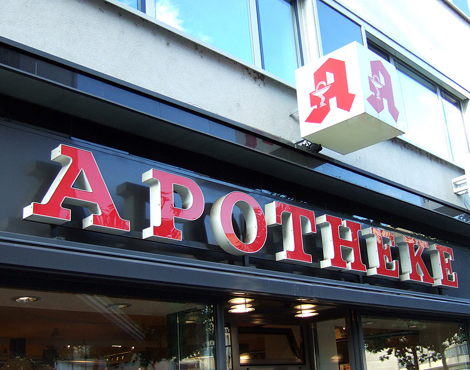
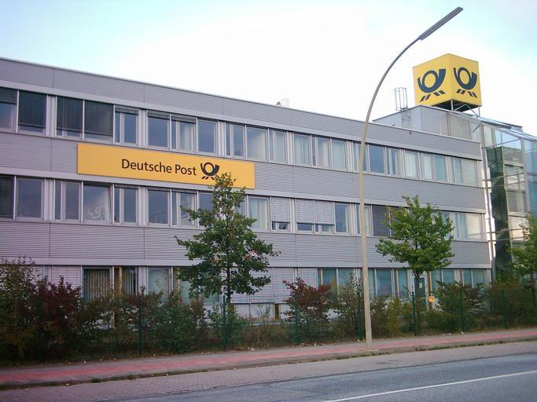
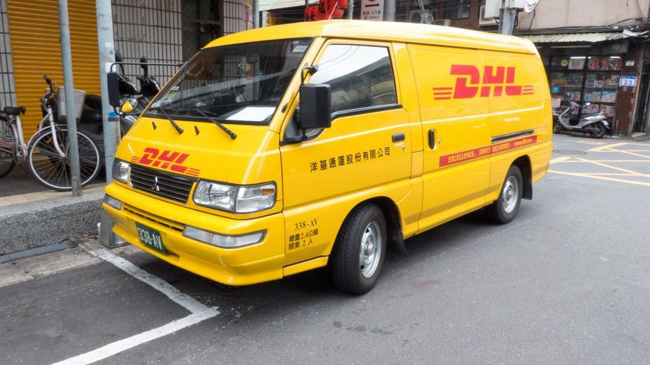
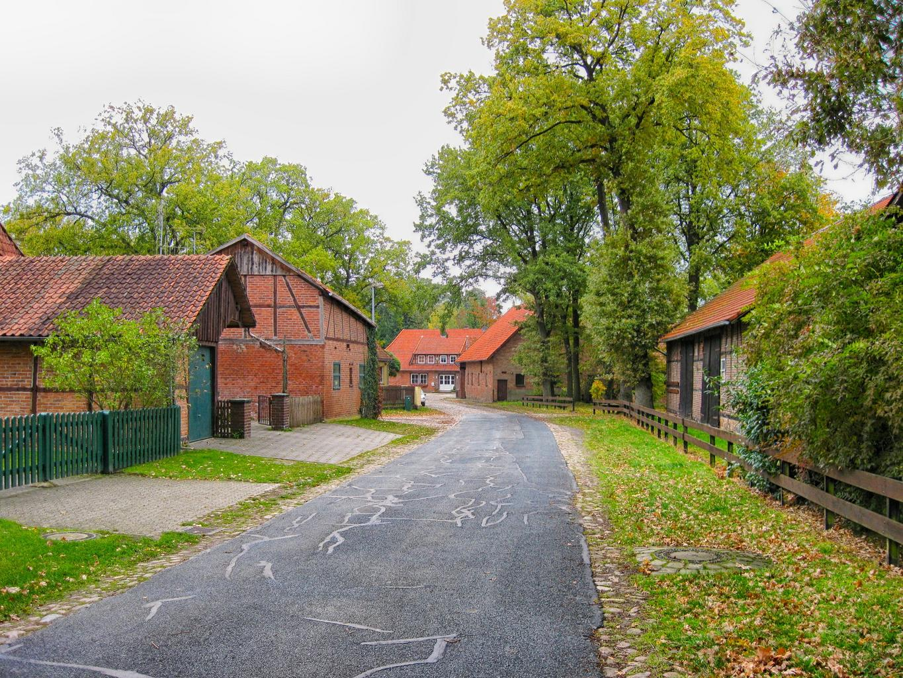
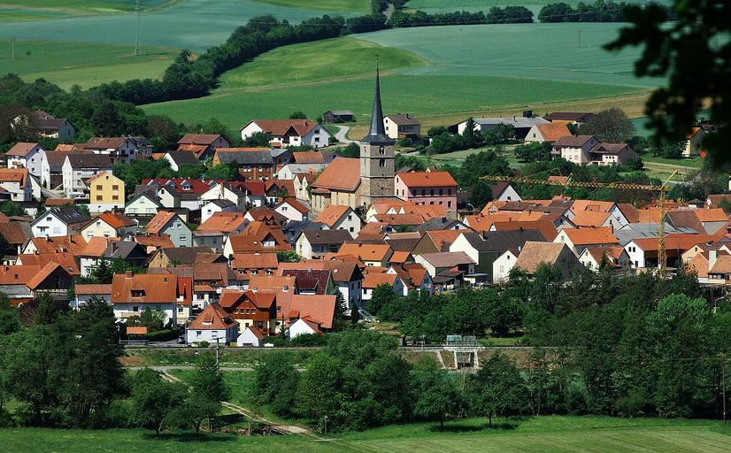
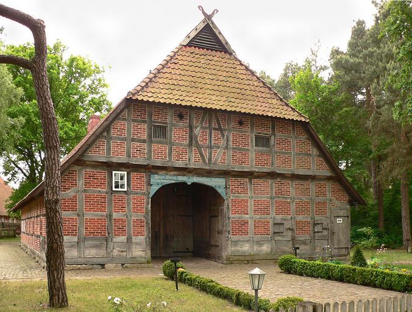

    <h2 class="section-title">{}</h2>
        <ul class="rule-list">
        <li>The country-code domain is .de</li>
        <li>Einbahnstrasse marks a one-way street</li>
        <li>German uses the Eszett character &szlig;</li>
        <li>Bollards carry white or orange reflectors</li>
        <li>Bus and tram stops display a green H (Haltestelle) symbol</li>
        <li>Company names often include GmbH on signs</li>
        <li>Legacy coverage featured square blur and mostly Gen2 imagery{}; new Street View refreshes began rolling out after July 2023{}</li>
        <li class="no-evidence">Some town signs include QR codes that link to local information</li>
        <li class="no-evidence">Urban areas rarely show exposed utility poles{}</li>
    </ul>
    {}
    {}

{}
{}

{}
An Einbahnstrasse sign means you are in Germany{}, while the shorter <b>EINBAHN</b> indicates {}. No-parking zones allow short stops and use arrowed signs{}. Watch for the Eszett &szlig; in German text.
{}

{}
Orange background signs with arrows and road numbers are widespread{}. White signs retain black outlines. Comparing signage styles helps identify bridge border crossings{}.
{}

{}
Bollards typically have white bodies with orange or white reflectors{}. Look for forested roads with tidy shoulders.
{}

{}
Bus and tram stops bear green “H” circles marked Haltestelle{}.
{}

{}
Older Gen2 imagery produces boxy blur and muted colors. Newer updates offer sharper imagery in major cities.
{}

{}
{}
{}
Look for the green pharmacy sign marked Apotheke{}.
{}

{}
Deutsche Post and DHL branding is widespread; DHL is a major global logistics group{}.
{}

{}
Aral gas stations are common across Germany{}.
{}

{}
{}

<iframe src="https://www.google.com/maps/embed?pb=!4v1679315413839!6m8!1m7!1sCAoSLEFGMVFpcE5iN3A2QTBpaW5vcGZHWjVFUXM0eHIteURHbUJhbHA0NzdvX2l4!2m2!1d50.7327359391176!2d6.82996892026819!3f340.44893574166593!4f-7.7953259871863025!5f3.325193203789971" width="295" height="295" style="border:0;" allowfullscreen="" loading="lazy" referrerpolicy="no-referrer-when-downgrade"></iframe>

{}
{}

{}
Germany saw a Street View refresh in 2023. When you see a 2023 Google copyright watermark, the coverage is newer and often clearer than the older Gen2 imagery.
{}

{}
{}

{}
Autobahn junction plates use yellow shielding with A### numbering{}. Local roads carry B, L, or K prefixes.
{}

{}
{}

 

    <h2 class="section-title">{}</h2>
    <ul class="rule-list">
        <li class="no-evidence">Brick villages with orange tiles are more common in the north</li>
        <li class="no-evidence">Large prefabricated housing blocks hint at former East Germany</li>
        <li class="no-evidence">Central Germany can show small-town landscapes and gentle hills</li>
        <li class="no-evidence">Slate roofs cluster around the Trier/Burgen area{}</li>
        <li>Fachhallenhaus-style farmhouses appear in northern Germany near the {}{}</li>
        <li class="no-evidence">The German Timber-Frame Road links traditional half-timbered towns{}
            <ul>
                <li>North{}</li>
                <li>South{}</li>
            </ul>
        </li>
    </ul>

{}
{}

{}
Example village: Stellichte{}.
{}

{}
{}

{}
Example town: Hoyerswerda{}{{% ref "https://ja.wikipedia.org/wiki/%E3%83%9B%E3%82%A4%E3%82%A8%E3%83%AB%E3%82%B9%E3%83%B4%E3%82%A7%E3%83%AB%E3%83%80" "Hoyerswerda" %}}.
{}

{}
{}

{}
Example town: Burglauer{}.
{}

{}
{}

{}
Slate roofs are common around Trier and Burgen, close to the Fell Exhibition Slate Mine{}.
{}

By <a href="//commons.wikimedia.org/wiki/User:P170" title="User:P170">P170</a> - Own work, <a href="https://creativecommons.org/licenses/by-sa/4.0" title="Creative Commons Attribution-Share Alike 4.0">CC BY-SA 4.0</a>, <a href="https://commons.wikimedia.org/w/index.php?curid=128484741">Link</a>

{}
{}

{}
Northern Germany has Fachhallenhaus farmhouses, sometimes resembling {} or Dutch styles{}.
{}

{}
{}

{}
This route highlights historic half-timbered towns and preservation districts.
{}

By <a href="//commons.wikimedia.org/w/index.php?title=User:Deutsche_Fachwerkstra%C3%9Fe&amp;action=edit&amp;redlink=1" class="new" title="User:Deutsche Fachwerkstrasse (page does not exist)">Deutsche Fachwerkstrasse</a> - Own work, <a href="https://creativecommons.org/licenses/by-sa/4.0" title="Creative Commons Attribution-Share Alike 4.0">CC BY-SA 4.0</a>, <a href="https://commons.wikimedia.org/w/index.php?curid=49334857">Link</a>

{}
{}

    <ul class="rule-list">
        <li>German place-name suffixes can hint at region{}</li>
        <li>North-south differences show in climate and landscape</li>
        <li>Telephone area codes provide rough regional hints</li>
        <li class="no-evidence">Industrial density clusters in specific regions</li>
    </ul>

{}
{}

{}
Use suffix maps to estimate region quickly.
{}

<blockquote class="reddit-embed-bq" style="height:500px" data-embed-height="740"><a href="https://www.reddit.com/r/MapPorn/comments/9xpzd8/german_name_place_endings_eg_burg_vs_dorf_vs/">German name place endings (e.g., \"-burg\" vs \"-dorf\" vs \"-inghausen\", etc.) [1536x1572] [x-post /r/DataArt]</a>  by<a href="https://www.reddit.com/user/jmerlinb/">u/jmerlinb</a> in<a href="https://www.reddit.com/r/MapPorn/">MapPorn</a></blockquote>

{}
{}

By <a href="//commons.wikimedia.org/wiki/User:Botaurus-stellaris" title="User:Botaurus-stellaris">Botaurus-stellaris</a> - Own work, <a href="http://creativecommons.org/licenses/by-sa/3.0/" title="Creative Commons Attribution-Share Alike 3.0">CC BY-SA 3.0</a>, <a href="https://commons.wikimedia.org/w/index.php?curid=1376564">Link</a>

{}
{}

By <a href="https://de.wikipedia.org/wiki/User:Chumwa" class="extiw" title="de:User:Chumwa">Maximilian Dorrbecker</a> (<a href="https://de.wikipedia.org/wiki/User:Chumwa" class="extiw" title="de:User:Chumwa">Chumwa</a>) - Own work, <a href="https://creativecommons.org/licenses/by-sa/2.5" title="Creative Commons Attribution-Share Alike 2.5">CC BY-SA 2.5</a>, <a href="https://commons.wikimedia.org/w/index.php?curid=76218560">Link</a>

{}
{}

    <h2 class="section-title">Forests & terrain</h2>
    <ul class="rule-list">
        <li>The Harz and Thuringian Forest have dense spruce corridors</li>
        <li>North Sea islands such as Sylt contain treeless dunes</li>
        <li>Rape fields bloom bright yellow each spring</li>
    </ul>

{}
{}
{}
Expect evergreen forests, logging clearings, and mossy shoulders{}.
{}

{}
{}
{}
Sylt contains dune landscapes devoid of trees{}{}.
{}

{}
{}
{}
In spring, bright-yellow rapeseed fields dominate the countryside.
{}

{}
{}

    <h2 class="section-title">Cities</h2>
    <ul class="rule-list">
        <li>Hamburg features historic brick warehouses along canals</li>
        <li>Each major city uses different street-name plate styles{}</li>
    </ul>

{}
{}
{}
Brick warehouses line the canals{}{}.
{}

{}
{}
<ul class="rule-list">
    <li>Berlin: white plates with gray borders attached by metal straps</li>
    <li>Munich: blue plates with indented corners and raised dots</li>
    <li>Cologne: simple white plates</li>
    <li>More examples: <a href="https://docs.google.com/document/d/1uIKgS-bxcTJ2kPNcuwVdw_1608QuHohbgbDLrti6Vjo/edit#heading=h.kj2u3acdnyg1">A GeoGuessr guide to Germany (by Steve)</a></li>
</ul>

{}
{}
{}
Many intersections include historical street plates and district info.
{}

{}
{}

{}
{}

{}
{}

{}
Industrial density varies: GfK maps highlight clusters of manufacturing employees per 1,000 inhabitants{}.
{}

<a href="https://www.gfk.com/insights/mom-0116">Illustration: GfK</a>, <a href="https://www.gfk.com/insights/mom-0116">Link</a>

{}
<li>Right pole photo credit: By <a href="//commons.wikimedia.org/w/index.php?title=User:Ralf_Krebs&amp;amp;action=edit&amp;amp;redlink=1" class="new" title="User:Ralf Krebs (page does not exist)">Ralf Krebs</a> - Own work, <a href="https://creativecommons.org/licenses/by/3.0" title="Creative Commons Attribution 3.0">CC BY 3.0</a>, <a href="https://commons.wikimedia.org/w/index.php?curid=124966897">Link</a></li>
{}



    <h4 class="mb-4">Representative companies</h4>
    <table class="table table-striped table-bordered">
        <thead class="table-light">
            <tr>
                <th scope="col" class="col-width-2">Company</th>
                <th scope="col" class="col-width-1">Ticker</th>
                <th scope="col" class="col-width-7">Overview</th>
                <th scope="col" class="col-width-05">IR</th>
                <th scope="col" class="col-width-05">Dividends</th>
            </tr>
        </thead>
        <tbody class="corp-desc">
            <tr>
                <td>BASF</td>
                <td>-</td>
                <td>Germany's largest chemical company; its name comes from Badische Anilin- und Sodafabrik.</td>
                <td>{}</td>
                <td>-</td>
            </tr>
            <tr>
                <td>Hapag-Lloyd</td>
                <td>-</td>
                <td>One of the world's major container shipping lines, headquartered in Germany.</td>
                <td>{}</td>
                <td>-</td>
            </tr>
        </tbody>
    </table>

