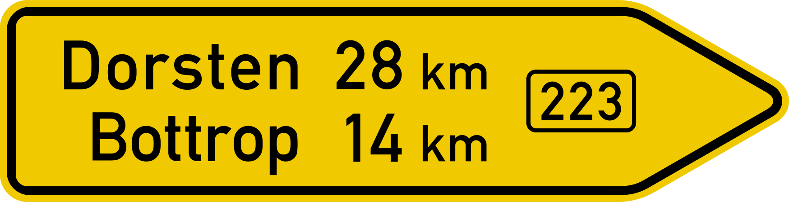
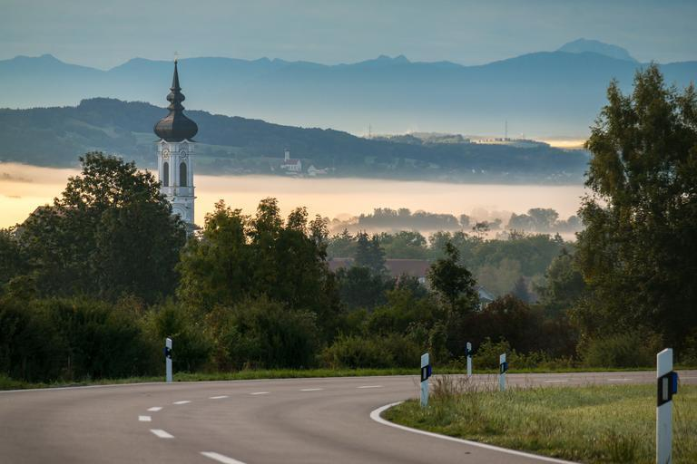
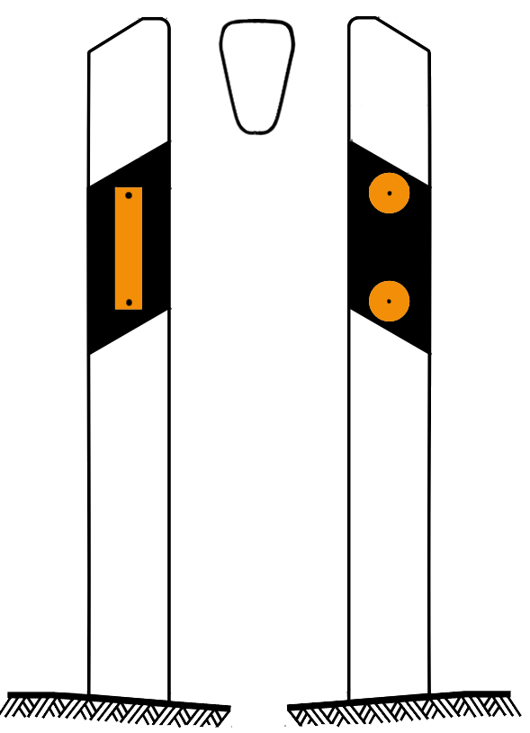
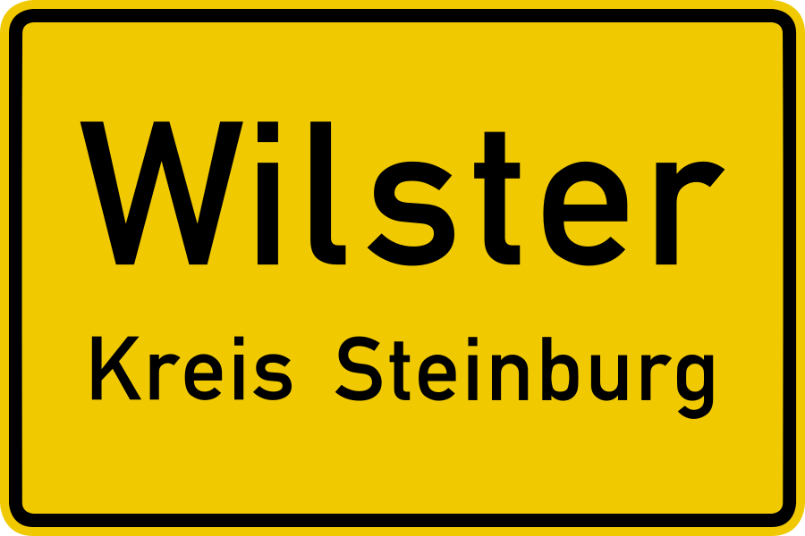
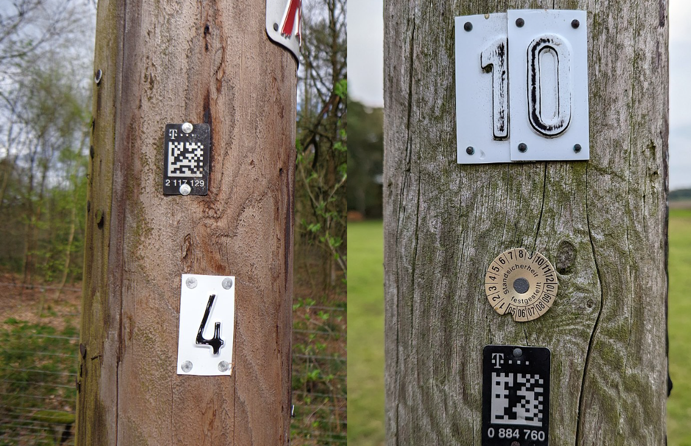
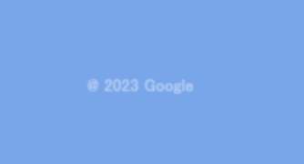
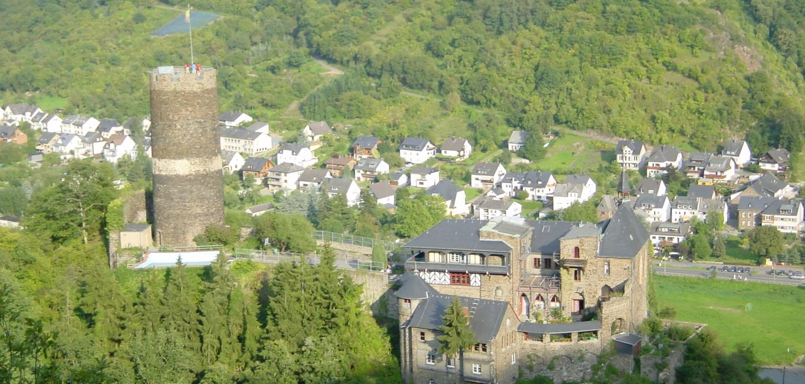
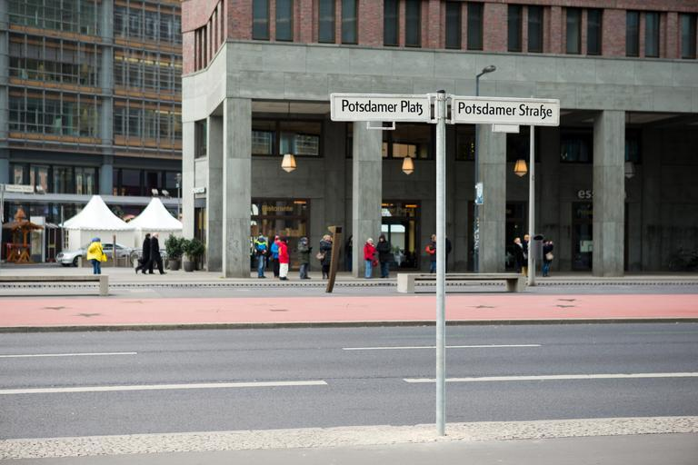
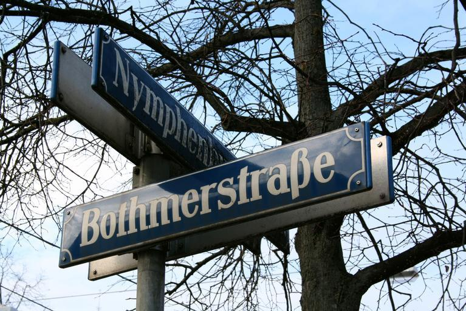
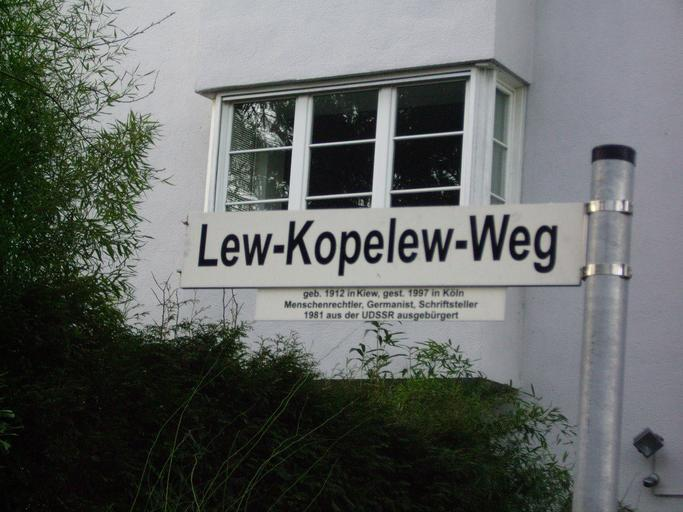

    <h2 class="section-title">{}</h2>
    <ul class="rule-list">
        <li>Domain-nya adalah .de</li>
        <li>Einbahnstraße adalah rambu lalu lintas jalan satu arah</li>
        <li>Bahasa Jerman menggunakan huruf Eszett "ß" sebagai bagian dari alfabet</li>
        <li>Terdapat bollard reflektor berwarna putih atau oranye</li>
        <li>Terdapat tanda "H (singkatan dari Haltestelle)" di halte bus atau kereta</li>
        <li>Kadang-kadang terlihat tulisan "GmbH" di papan nama, yang berarti perusahaan terbatas</li>
        <li>Street View sebelumnya hanya memiliki mosaik kotak-kotak generasi kedua, tetapi sejak Juli 2023, Street View yang baru dijadwalkan untuk ditambahkan {} {}</li>
        <li class="no-evidence">Banyak pelat putih dengan nomor atau pelat dengan kode QR hitam terpasang pada tiang listrik kayu</li>
        <li class="no-evidence">Di daerah perkotaan atau perumahan, tiang listrik relatif sedikit {}</li>
        <li>Street View banyak diperbarui pada tahun 2023 dan sering menampilkan tulisan "@ 2023 Google"</li>
    </ul>
    {}

{}
{}

{}
Jika terdapat rambu Einbahnstraße, maka Anda berada di Jerman {}. Namun, jika rambu menunjukkan <b>EINBAHN</b>, kemungkinan besar itu adalah {}. Selain itu, zona larangan parkir yang memperbolehkan menunggu sering ditandai dengan rambu "No Parking" dengan panah {}. Bahasa Jerman menggunakan huruf Eszett "ß" sebagai bagian dari alfabet.
{}

{}
Terdapat rambu jalan berlatar belakang oranye dengan nomor di ujung panah {}. Jika berlatar belakang putih, biasanya terdapat garis hitam di sekelilingnya. Perbedaan tanda ini dapat menunjukkan perbatasan pada jembatan {}.
{}

{}
Wilayah berbahasa Jerman seperti Jerman dan {} memiliki tanda "H (singkatan dari Haltestelle)" di halte bus atau kereta {}. Kadang-kadang, nama halte tertulis di papan tanda panjang.
{}

{}
Terdapat bollard reflektor berwarna putih atau oranye {}. Di pintu masuk kota, terdapat papan bertuliskan nama kota di kedua sisinya {}. Tiang tanda sering memiliki tutup hitam atau abu-abu.
{}

{}
Banyak pelat putih dengan nomor atau kode QR hitam terpasang pada tiang listrik kayu {}. Terkadang angka pada pelat sudah pudar.
{}

{}
{}

{}
Apotek di Jerman memiliki logo merah khas {}.
{}

{}
Truk dan kotak pos milik DHL Group, perusahaan pengiriman dengan kantor pusat di Bonn, Jerman, sering terlihat {}. DHL adalah salah satu perusahaan logistik terbesar di Eropa.
{}

{}
Terdapat stasiun pengisian bahan bakar Aral dan perusahaan kimia seperti BASF yang banyak ditemukan di kawasan industri Ruhr {}, {}. Kadang terlihat bangunan seperti pabrik di pinggiran kota {}, meski mungkin tidak relevan untuk Geoguessr.
{}

{}
{}

<iframe src="https://www.google.com/maps/embed?pb=!4v1679315413839!6m8!1m7!1sCAoSLEFGMVFpcE5iN3A2QTBpaW5vcGZHWjVFUXM0eHIteURHbUJhbHA0NzdvX2l4!2m2!1d50.7327359391176!2d6.82996892026819!3f340.44893574166593!4f-7.7953259871863025!5f3.325193203789971" width="295" height="295" style="border:0;" allowfullscreen="" loading="lazy" referrerpolicy="no-referrer-when-downgrade"></iframe>

{}
{}

{}
Street View yang dirilis pada tahun 2023 sering menampilkan "@ 2023 Google" (contoh gambar di bawah). Namun, wilayah negara tetangga seperti {} juga memiliki area yang diperbarui pada tahun 2023, sehingga indikator ini tidak cukup untuk menentukan lokasi di Jerman.
{}

{}
{}

    <h2 class="section-title">{}</h2>
    <ul class="rule-list">
        <li class="no-evidence">Rumah bata merah lebih sering ditemukan di wilayah barat laut dekat Belanda</li>
        <li class="no-evidence">Jalan dengan banyak kompleks perumahan besar cenderung berada di sisi timur?</li>
        <li class="no-evidence">Dinding putih dengan atap oranye lebih umum di bagian tengah hingga selatan?</li>
        <li class="no-evidence">Di sekitar tambang batu tulis di wilayah tengah, atap rumah berwarna hitam mungkin lebih sering terlihat (citra satelit {}) {}</li>
        <li>Rumah tipe Fachhallenhaus dapat ditemukan di bagian utara Jerman dan bagian timur {} {}</li>
        <li class="no-evidence">Sepanjang jalan 'German Timber-Frame Road', terdapat rumah dengan rangka kayu sesuai namanya {}
            <ul>
                <li>Bagian utara {}</li>
                <li>Bagian timur jauh {}</li>
            </ul>
        </li>
    </ul>

{}
{}

{}
Foto ini diambil di kota Stellichte {}.
{}

{}
{}

{}
Foto ini diambil di kota Hoyerswerda {}. Kota ini memiliki sejarah sebagai "kota baru sosialis" yang dibangun sebagai kawasan tempat tinggal pekerja {{% ref "https://ja.wikipedia.org/wiki/%E3%83%9B%E3%82%A4%E3%82%A8%E3%83%AB%E3%82%B9%E3%83%B4%E3%82%A7%E3%83%AB%E3%83%80" "Hoyerswerda" %}}.
{}

{}
{}

{}
Foto ini diambil di kota Burglauer {}.
{}

{}
{}

{}
Atap hitam mungkin lebih umum di wilayah dengan batu hitam yang tersedia, seperti di sekitar tambang batu tulis. Di {}, wilayah dengan batu tulis juga memiliki atap hitam. Rumah-rumah di wilayah ini mungkin menggunakan bahan yang murah dan mudah diakses. Foto ini menunjukkan pemandangan di sekitar tambang di wilayah tengah, termasuk kota Burgen dan Trier {}.
{}

By <a href="//commons.wikimedia.org/wiki/User:P170" title="User:P170">P170</a> - Own work, <a href="https://creativecommons.org/licenses/by-sa/4.0" title="Creative Commons Attribution-Share Alike 4.0">CC BY-SA 4.0</a>, <a href="https://commons.wikimedia.org/w/index.php?curid=128484741">Link</a>

{}
{}

{}
Rumah-rumah tipe ini dapat ditemukan di bagian utara Jerman. Meskipun sering dibuat dari batu bata, rumah ini juga dapat ditemukan di daerah yang agak jauh dari {} {}.
{}

{}
{}

{}
Sepanjang jalan ini, Anda dapat menemukan rumah tradisional dengan kerangka kayu. Jalan ini mencakup wilayah luas di bagian barat dan timur jauh Jerman.
{}

By <a href="//commons.wikimedia.org/w/index.php?title=User:Deutsche_Fachwerkstra%C3%9Fe&amp;action=edit&amp;redlink=1" class="new" title="User:Deutsche Fachwerkstraße (page does not exist)">Deutsche Fachwerkstraße</a> - Own work, <a href="https://creativecommons.org/licenses/by-sa/4.0" title="Creative Commons Attribution-Share Alike 4.0">CC BY-SA 4.0</a>, <a href="https://commons.wikimedia.org/w/index.php?curid=49334857">Link</a>

{}
{}

    <ul class="rule-list">
        <li>Polanya penamaan kota dapat dikenali {}</li>
        <li>Bagian utara Jerman cenderung berupa dataran yang relatif rata</li>
        <li>Kode area telepon dapat mengindikasikan lokasi</li>
        <li class="no-evidence">Wilayah dengan zona industri atau pabrik biasanya bukan bagian timur laut</li>
        <li class="no-evidence">Ladang bunga kuning (seperti kanola) lebih umum ditemukan di timur laut {}</li>
    </ul>

{}
{}

{}
<a href="https://tobiaskauer.org/projects/end/?ach">Anda dapat memeriksa pola penamaan kota pada halaman ini(link)</a>.
{}

<blockquote class="reddit-embed-bq" style="height:500px" data-embed-height="740"><a href="https://www.reddit.com/r/MapPorn/comments/9xpzd8/german_name_place_endings_eg_burg_vs_dorf_vs/">German name place endings (e.g., "-burg" vs "-dorf" vs "-inghausen", etc.) [1536x1572] [x-post /r/DataArt]</a>  by<a href="https://www.reddit.com/user/jmerlinb/">u/jmerlinb</a> in<a href="https://www.reddit.com/r/MapPorn/">MapPorn</a></blockquote>

{}
{}

By <a href="//commons.wikimedia.org/wiki/User:Botaurus-stellaris" title="User:Botaurus-stellaris">Botaurus-stellaris</a> - Own work, <a href="http://creativecommons.org/licenses/by-sa/3.0/" title="Creative Commons Attribution-Share Alike 3.0">CC BY-SA 3.0</a>, <a href="https://commons.wikimedia.org/w/index.php?curid=1376564">Link</a>

{}
{}

By <a href="https://de.wikipedia.org/wiki/User:Chumwa" class="extiw" title="de:User:Chumwa">Maximilian Dörrbecker</a> (<a href="https://de.wikipedia.org/wiki/User:Chumwa" class="extiw" title="de:User:Chumwa">Chumwa</a>) - Own work, <a href="https://creativecommons.org/licenses/by-sa/2.5" title="Creative Commons Attribution-Share Alike 2.5">CC BY-SA 2.5</a>, <a href="https://commons.wikimedia.org/w/index.php?curid=76218560">Link</a>

{}
{}

{}
Jumlah pekerja per 1.000 penduduk yang bekerja di perusahaan industri sangat bervariasi tergantung wilayah {}.
{}

<a href="https://www.gfk.com/insights/mom-0116">Illustration: GfK</a>, <a href="https://www.gfk.com/insights/mom-0116">Link</a>

{}
{}

{}
Ladang bunga kuning seperti kanola lebih sering terlihat di sekitar semenanjung utara atau timur laut, meskipun dapat ditemukan di seluruh wilayah. Foto ini diambil di utara, dekat Fischland. Ladang bunga kuning umumnya lebih banyak di sekitar Laut Utara.
{}

{}
{}

    <h2 class="section-title">{}</h2>
    <ul class="rule-list">
        <li>Pulau Sylt memiliki area datar tanpa pepohonan</li>
        <li class="no-evidence">Hamburg memiliki banyak gudang dan rumah dari bata merah</li>
        <li>Bentuk papan nama jalan berbeda di setiap kota {}
            <ul>
                <li>Berlin: Latar belakang putih dengan bingkai abu-abu, sering kali dipasang menggunakan pengikat logam berwarna perak</li>
                <li>Munich: Memiliki lekukan di keempat sudutnya dengan titik-titik, latar belakang biru, dan papan yang tidak rata</li>
                <li>Cologne: Papan putih sederhana</li>
                <li>Informasi lainnya dapat ditemukan di <a href="https://docs.google.com/document/d/1uIKgS-bxcTJ2kPNcuwVdw_1608QuHohbgbDLrti6Vjo/edit#heading=h.kj2u3acdnyg1">A GeoGuessr guide to Germany (written by Steve)</a></li>
            </ul>
        </li>
    </ul>

{}
{}

{}
Pulau Sylt memiliki area tanpa pepohonan {} {{% ref "https://ja.wikipedia.org/wiki/%E3%82%B8%E3%83%AB%E3%83%88%E5%B3%B6" "Pulau Sylt" %}}.
{}

{}
{}
{}
Di tepi sungai Hamburg, Anda dapat melihat bangunan bata merah yang berjejer {} {{% ref "https://ja.wikipedia.org/wiki/%E3%83%8F%E3%83%B3%E3%83%96%E3%83%AB%E3%82%AF" "Hamburg" %}}. Lokasi seperti ini tidak terlalu banyak ditemukan.
{}

{}
{}
{}
Berlin sering kali memiliki papan nama jalan dengan latar belakang putih, bingkai abu-abu, dan dipasang menggunakan pengikat logam berwarna perak.
{}

{}
{}

{}
Papan nama di Munich memiliki lekukan di keempat sudutnya dengan titik-titik, latar belakang biru, dan permukaan yang tidak rata.
{}

{}
{}

{}
Cologne memiliki papan nama jalan yang sederhana dengan warna putih.
{}

{}
{}

{}
<li>Gambar tiang listrik di kanan: By <a href="//commons.wikimedia.org/w/index.php?title=User:Ralf_Krebs&amp;amp;action=edit&amp;amp;redlink=1" class="new" title="User:Ralf Krebs (page does not exist)">Ralf Krebs</a> - Own work, <a href="https://creativecommons.org/licenses/by/3.0" title="Creative Commons Attribution 3.0">CC BY 3.0</a>, <a href="https://commons.wikimedia.org/w/index.php?curid=124966897">Link</a></li>
{}
