

    <h2 class="section-title">{}</h2>
    <ul class="rule-list">
        <li>ドメインは.de</li>
        <li>Einbahnstraßeは一方通行の標識</li>
        <li>ドイツ語はエスツェット「ß」を文字として使う</li>
        <li>白やオレンジの反射板のボラードがある</li>
        <li>バスや電車の停留所に『H（Haltestelleの頭文字）』のマークがある</li>
        <li>有限会社という意味の『GmbH』が看板に書かれているときがある</li>
        <li>四角いモザイクが多く第2世代しかなかった{}が2023年7月以降は新しいストリートビューが追加される予定なので注意{}</li>
        <li class="no-evidence">番号が書かれた白いプレートや黒いQRコードが書かれたプレートが木製の電柱に多く付いている</li>
        <li class="no-evidence">都市部や住宅地は電柱が少ない{}</li>
        <li>2023年にストリートビューが多く追加されており『@ 2023 Google』と表示されていることが多い</li>
    </ul>
    {}

{}
{}

{}
Einbahnstraßeの標識があればドイツ{}で<b>EINBAHN</b>だと{}。また駐車禁止だが待機ができるゾーンに矢印つきのNo Parkingの看板を良く見かける{}。ドイツ語圏ではエスツェット「ß」を文字として使う。

{}

{}
オレンジ背景で矢印の先に番号が書かれた道路看板がある{}。白背景の場合も黒い線の輪郭がある。看板の違いを見れば国境にある橋だとわかることも{}。
{}

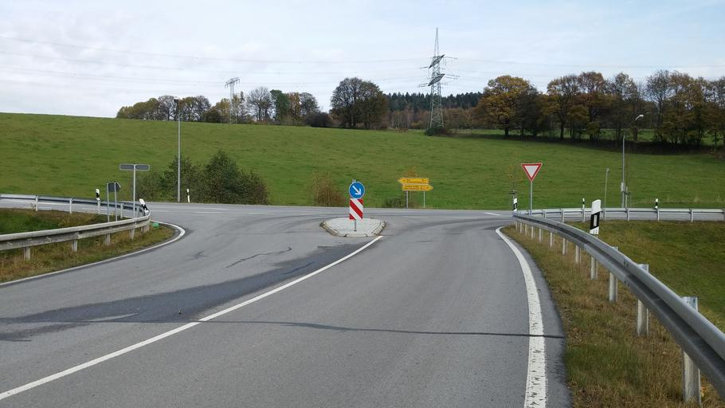

{}
ドイツや{}のようなドイツ語圏にはバスや電車の停留所に『H（Haltestelleの頭文字）』のマークがある{}。
横長の看板にバス停の名前が書かれていることもある。
{}

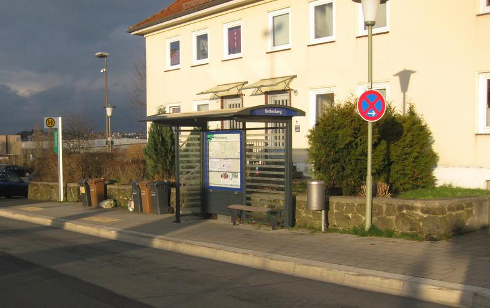

{}
白やオレンジの反射板のボラードがある{}。町の出入口に表裏に地名が書かれた看板がある{}。標識の棒に黒やグレーのキャップが付いていることも多いように思う。
{}

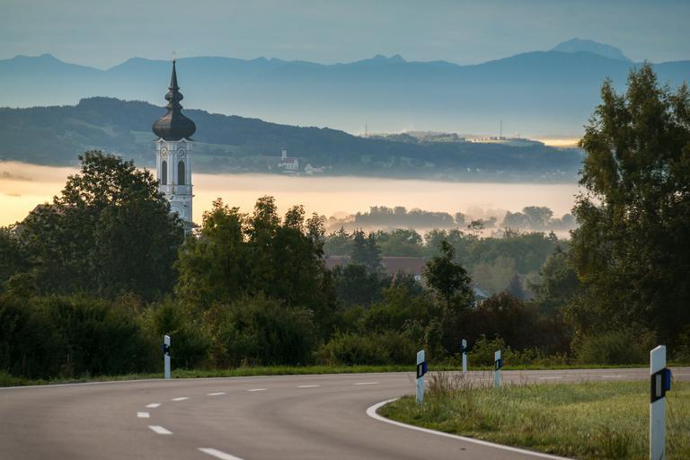

{}
番号が書かれた白いプレートや黒いQRコードが書かれたプレートが木製の電柱に多く付いている{}のを良く見かける{}。数字の色がはがれていることがある。
{}

{}
{}
{}
薬局に赤いロゴがある{}。
{}

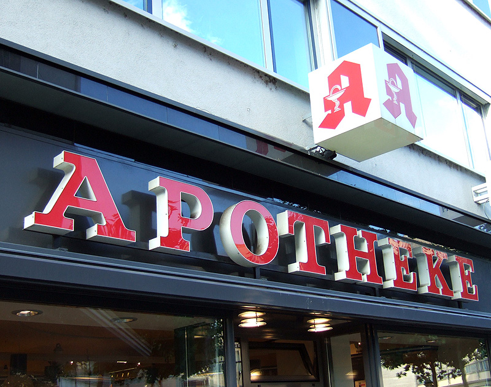

{}
ドイツのボンに本社を置く運送会社であるDHLグループのトラックやポストがある{}。DHLはロジスティクス業界ではヨーロッパ最大規模の会社であり、どの国にもトラックが走っている。
{}

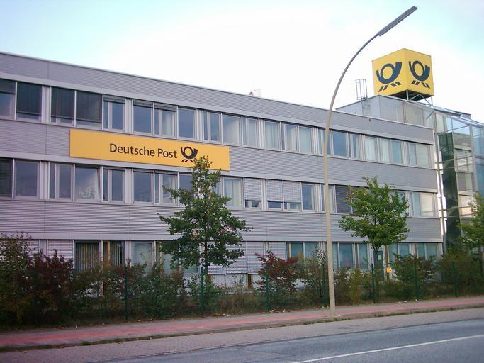
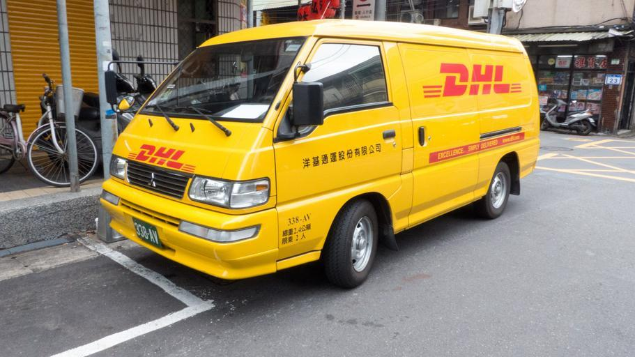

{}
石油製品を販売するAralがある{}。またBASFを代表とした化学系の企業がルール工業地域に多く{}郊外に工場らしきものが見える{}ことがあるけれどGeoguessrでは使えないかも。
{}

{}
{}

<iframe src="https://www.google.com/maps/embed?pb=!4v1679315413839!6m8!1m7!1sCAoSLEFGMVFpcE5iN3A2QTBpaW5vcGZHWjVFUXM0eHIteURHbUJhbHA0NzdvX2l4!2m2!1d50.7327359391176!2d6.82996892026819!3f340.44893574166593!4f-7.7953259871863025!5f3.325193203789971" width="295" height="295" style="border:0;" allowfullscreen="" loading="lazy" referrerpolicy="no-referrer-when-downgrade"></iframe>

{}
{}

{}
2023年にストリートビューが多く追加されており『@ 2023 Google』と表示されていることが多い（以下はイメージ図）。しかし{}を含む周辺国でも2023年に撮影されたエリアは存在するのでこれだけでドイツには行かないようにしたい。
{}

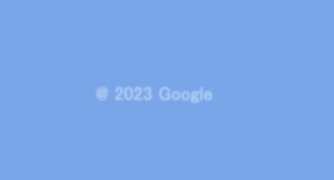

{}
{}

    <h2 class="section-title">{}</h2>
    <ul class="rule-list">
        <li class="no-evidence">レンガの家は北西側のオランダ周辺に多い</li>
        <li class="no-evidence">大規模な集合住宅が集まった通りは東側に多い？</li>
        <li class="no-evidence">白い壁とオレンジ色の屋根は中部～南部に多め？</li>
        <li class="no-evidence">中部のスレート鉱山周辺は黒い家の屋根が多いかも（衛星写真{}）{}</li>
        <li>地名のパターンがある{}</li>
    </ul>

{}
{}

{}
写真はStellichteの町{}。
{}

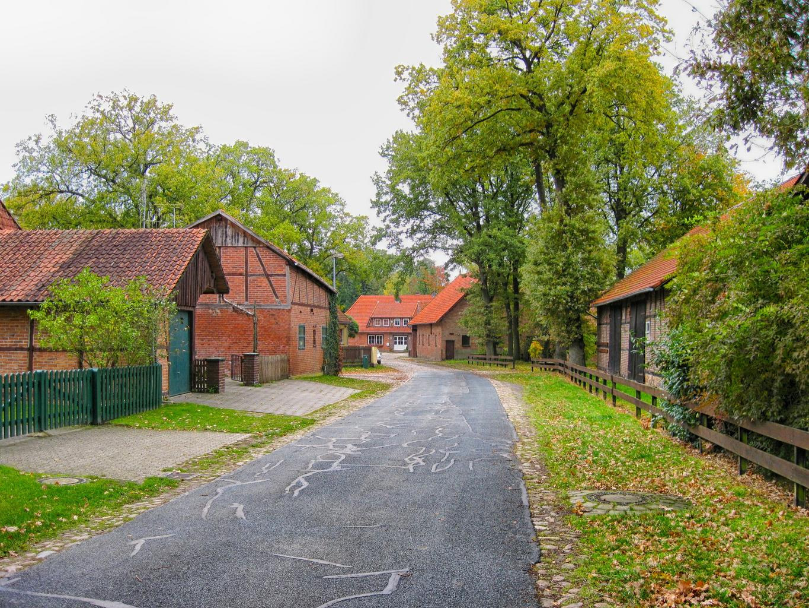

{}
{}

{}
写真はホイエルスヴェルダ（Hoyerswerda）の町{}。労働者居住区として「社会主義者ニュータウン」が作られた歴史がある{{% ref "https://ja.wikipedia.org/wiki/%E3%83%9B%E3%82%A4%E3%82%A8%E3%83%AB%E3%82%B9%E3%83%B4%E3%82%A7%E3%83%AB%E3%83%80" "Hoyerswerda" %}}。
{}

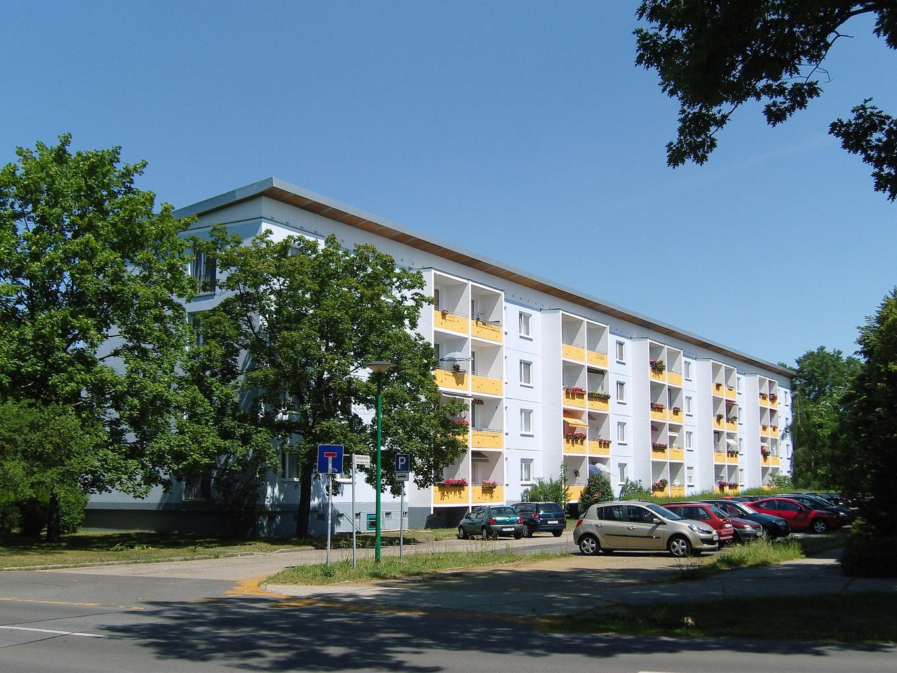

{}
{}

{}
写真はBurglauerの町{}。
{}

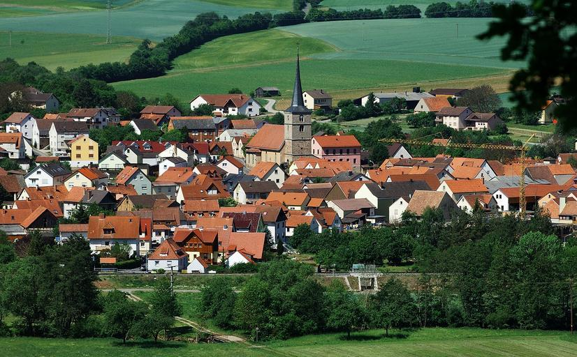

{}
{}

{}
黒い石が手に入る地域では屋根が黒いのかも。{}もSlateがある地域は屋根が黒い。その地域で安く手に入る材料を元に家が作られていたのかもしれない。写真は中部の鉱山{}の周りにあるBurgenとTrierの街並み。
{}

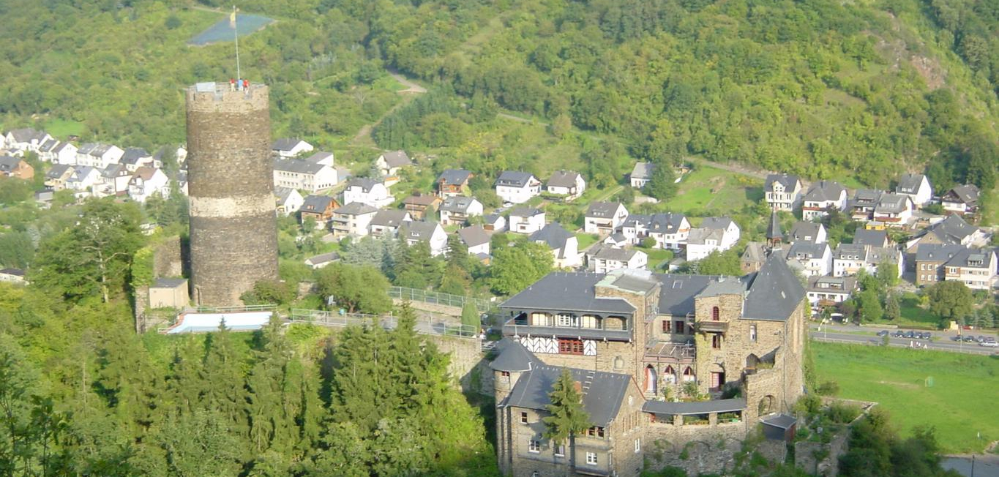

By <a href="//commons.wikimedia.org/wiki/User:P170" title="User:P170">P170</a> - Own work, <a href="https://creativecommons.org/licenses/by-sa/4.0" title="Creative Commons Attribution-Share Alike 4.0">CC BY-SA 4.0</a>, <a href="https://commons.wikimedia.org/w/index.php?curid=128484741">Link</a>

{}
{}

{}
<a href="https://tobiaskauer.org/projects/end/?ach">このページ(リンク)</a>で確認できる。
{}

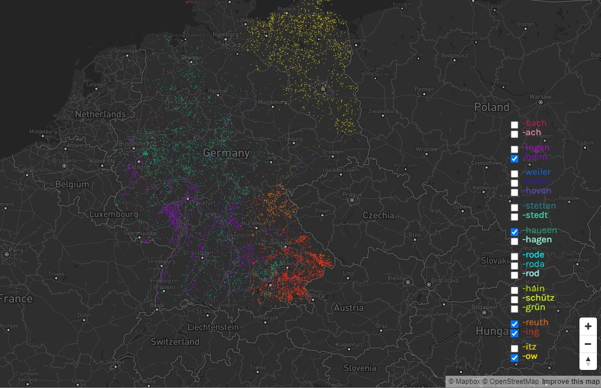

{}

{}

    <ul class="rule-list">
        <li>北半分は平坦な地域が多い</li>
        <li>市外局番で地域がわかる</li>
        <li class="no-evidence">工業地帯や工場が見える場合は北東部ではないかも</li>
        <li class="no-evidence">黄色い花（菜種）の畑は北東に多いかも{}</li>
    </ul>

{}
{}

By <a href="//commons.wikimedia.org/wiki/User:Botaurus-stellaris" title="User:Botaurus-stellaris">Botaurus-stellaris</a> - Own work, <a href="http://creativecommons.org/licenses/by-sa/3.0/" title="Creative Commons Attribution-Share Alike 3.0">CC BY-SA 3.0</a>, <a href="https://commons.wikimedia.org/w/index.php?curid=1376564">Link</a>

{}
{}

By <a href="https://de.wikipedia.org/wiki/User:Chumwa" class="extiw" title="de:User:Chumwa">Maximilian Dörrbecker</a> (<a href="https://de.wikipedia.org/wiki/User:Chumwa" class="extiw" title="de:User:Chumwa">Chumwa</a>) - Own work, <a href="https://creativecommons.org/licenses/by-sa/2.5" title="Creative Commons Attribution-Share Alike 2.5">CC BY-SA 2.5</a>, <a href="https://commons.wikimedia.org/w/index.php?curid=76218560">Link</a>

{}
{}

{}
1,000人あたりの産業企業で働く従業員の数は地域によってかなり偏りがある{}。
{}

<a href="https://www.gfk.com/insights/mom-0116">Illustration: GfK</a>, <a href="https://www.gfk.com/insights/mom-0116">Link</a>

{}
{}

{}
北の半島近くや北東だと思われるけれど全域でありえる。写真は北のFischlandで撮られたもの。
{}

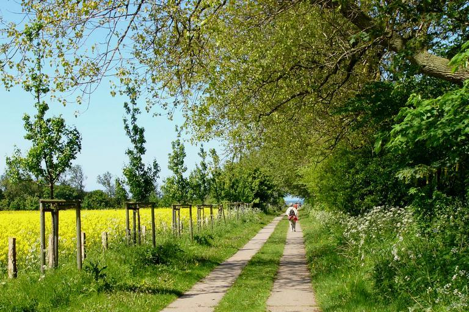

{}
{}

    <h2 class="section-title">{}</h2>
    <ul class="rule-list">
        <li>ジルト島は平坦で木がほとんどない場所がある</li>
        <li class="no-evidence">ハンブルグはレンガ造りの倉庫や家が多く見られる</li>
        <li>都市ごとに通りを示す看板の形が異なる {}
            <ul>
                <li>ベルリン：白い背景に灰色の枠があり銀色の結束バンドのようなもので固定されていることが多い</li>
                <li>ミュンヘン：四隅に凹みがあり点がある・青い背景でプレートが平らではない</li>
                <li>ケルン：シンプルな白いプレートだ</li>
                <li>他は『<a href="https://docs.google.com/document/d/1uIKgS-bxcTJ2kPNcuwVdw_1608QuHohbgbDLrti6Vjo/edit#heading=h.kj2u3acdnyg1">A GeoGuessr guide to Germany (written by Steve)</a>』を参照</li>
            </ul>
        </li>
    </ul>

{}
{}

{}
ジルト島は木が全く生えていない場所がある{}{{% ref "https://ja.wikipedia.org/wiki/%E3%82%B8%E3%83%AB%E3%83%88%E5%B3%B6" "ジルト島" %}}。
{}

{}
{}
{}
川沿いにレンガの建物が並んで見える{}{{% ref "https://ja.wikipedia.org/wiki/%E3%83%8F%E3%83%B3%E3%83%96%E3%83%AB%E3%82%AF" "ハンブルグ" %}}。見れる場所はそこまで多くない。
{}

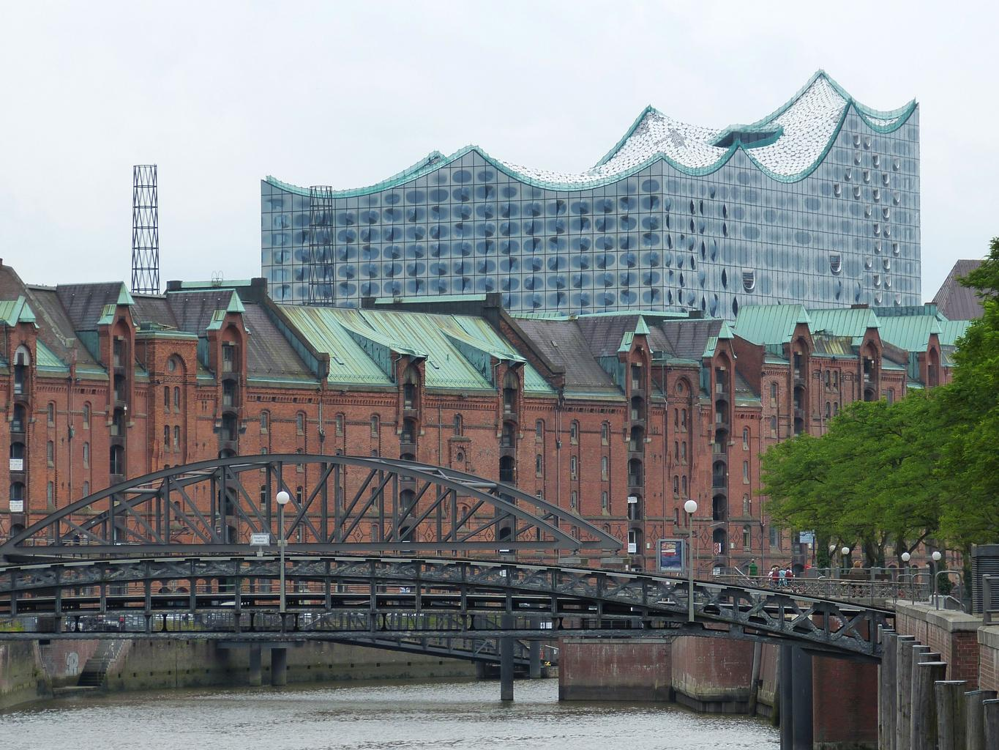

{}
{}
{}
ベルリンは白い背景に灰色の枠があり銀色の結束バンドのようなもので固定されていることが多い
{}

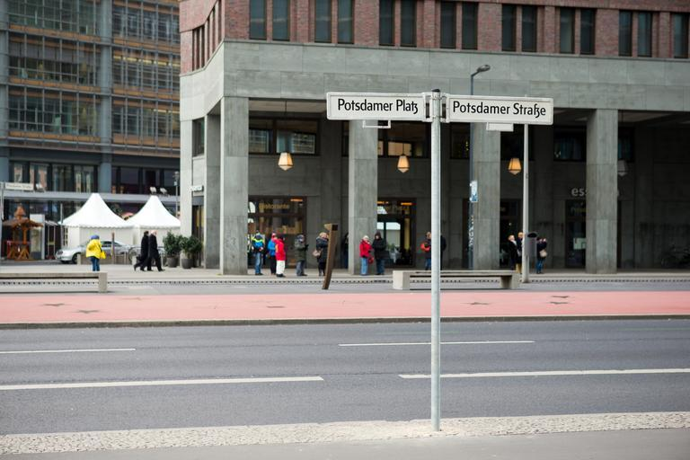

{}
{}

{}
四隅に凹みがあり点がある・青い背景でプレートが平らではない。
{}

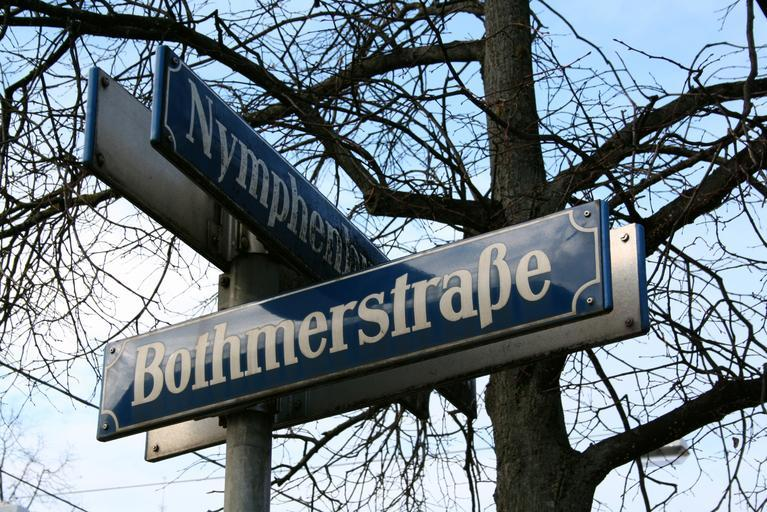

{}
{}

{}
ケルンはシンプルな白いプレートだ
{}

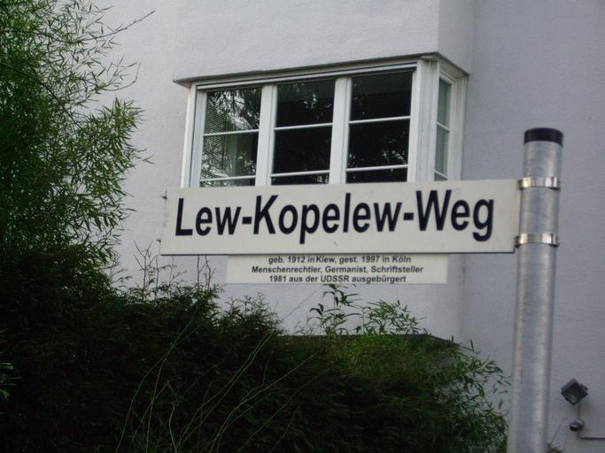

{}
{}

{}
<li>右側の電柱画像の出典：By <a href="//commons.wikimedia.org/w/index.php?title=User:Ralf_Krebs&amp;amp;action=edit&amp;amp;redlink=1" class="new" title="User:Ralf Krebs (page does not exist)">Ralf Krebs</a> - Own work, <a href="https://creativecommons.org/licenses/by/3.0" title="Creative Commons Attribution 3.0">CC BY 3.0</a>, <a href="https://commons.wikimedia.org/w/index.php?curid=124966897">Link</a></li>
{}