

    <h2 class="section-title">{}</h2>
    <ul class="rule-list">
        <li>ドメインは.de</li>
        <li>Einbahnstraßeは一方通行の標識</li>
        <li>ドイツ語はエスツェット「ß」を文字として使う</li>
        <li>白やオレンジの反射板のボラードがある</li>
        <li>バスや電車の停留所に『H（Haltestelleの頭文字）』のマークがある</li>
        <li>有限会社という意味の『GmbH』が看板に書かれているときがある</li>
        <li>四角いモザイクが多く第2世代しかなかった{}が2023年7月以降は新しいストリートビューが追加される予定なので注意{}</li>
        <li class="no-evidence">番号が書かれた白いプレートや黒いQRコードが書かれたプレートが木製の電柱に多く付いている</li>
        <li class="no-evidence">都市部や住宅地は電柱が少ない{}</li>
    </ul>
    {}

{}
{}

{}
エスツェット「ß」を文字として使い、Einbahnstraßeの標識があればドイツ{}。また駐車禁止だが待機ができるゾーンに矢印つきのNo Parkingの看板を良く見かける{}。

{}

{}
オレンジ背景で矢印の先に番号が書かれた道路看板がある{}。白背景の場合も黒い線の輪郭がある。看板の違いを見れば国境にある橋だとわかることも{}。
{}

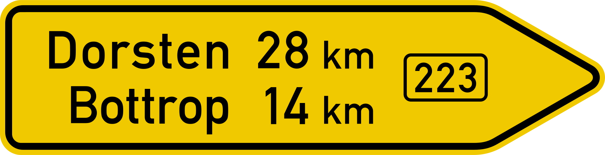

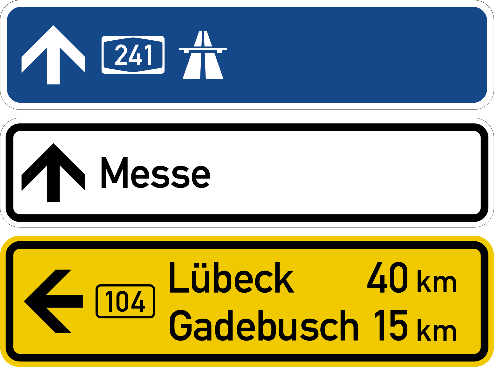

{}
ドイツや{}のようなドイツ語圏にはバスや電車の停留所に『H（Haltestelleの頭文字）』のマークがある{}。
横長の看板にバス停の名前が書かれていることもある。
{}

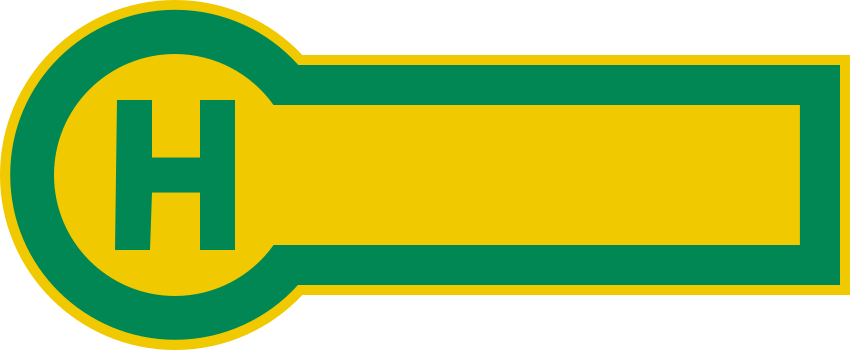

{}
白やオレンジの反射板のボラードがある{}。町の出入口に表裏に地名が書かれた看板がある{}。標識の棒に黒やグレーのキャップが付いていることも多いように思う。
{}

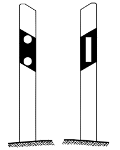
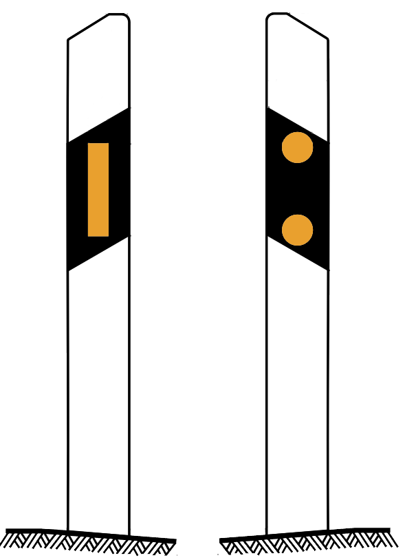
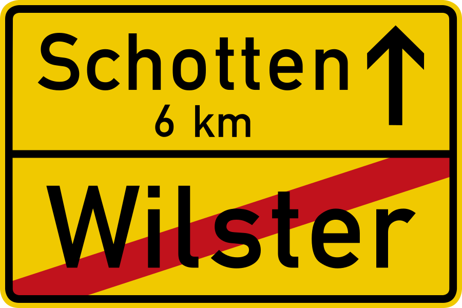
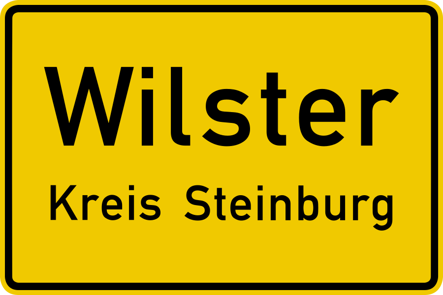

{}
石油製品を販売するAralがある{}。またBASFを代表とした化学系の企業がルール工業地域に多く{}郊外に工場らしきものが見える{}ことがあるけれどGeoguessrでは使えないかも。
{}

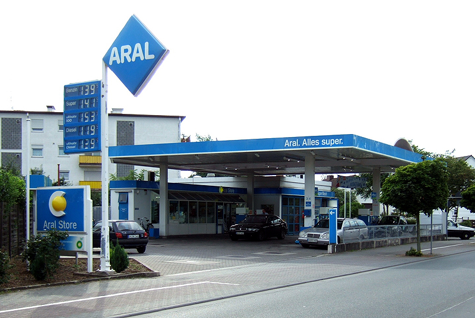

{}
番号が書かれた白いプレートや黒いQRコードが書かれたプレートが木製の電柱に多く付いている{}のを良く見かける{}。数字の色がはがれていることがある。
{}

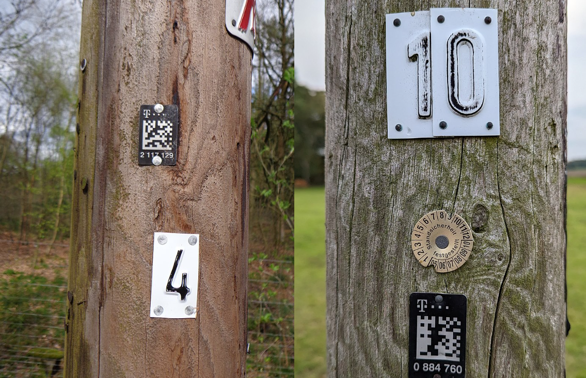

{}
{}
{}
MAN Truck & Busはバイエルン州のミュンヘンに本社がある
{}

<iframe src="https://www.google.com/maps/embed?pb=!4v1683185523960!6m8!1m7!1snvYQfP_pgME098dkO1Qt_g!2m2!1d50.92495539690297!2d6.95852656384067!3f322.8118669778739!4f-5.199782705638626!5f2.8953866314678622" width="295" height="295" style="border:0;" allowfullscreen="" loading="lazy" referrerpolicy="no-referrer-when-downgrade"></iframe>

{}
{}

<iframe src="https://www.google.com/maps/embed?pb=!4v1679315413839!6m8!1m7!1sCAoSLEFGMVFpcE5iN3A2QTBpaW5vcGZHWjVFUXM0eHIteURHbUJhbHA0NzdvX2l4!2m2!1d50.7327359391176!2d6.82996892026819!3f340.44893574166593!4f-7.7953259871863025!5f3.325193203789971" width="295" height="295" style="border:0;" allowfullscreen="" loading="lazy" referrerpolicy="no-referrer-when-downgrade"></iframe>

{}
{}

    <h2 class="section-title">{}</h2>
    <ul class="rule-list">
        <li>市外局番で地域がわかるかもしれない</li>
        <li class="no-evidence">工業地帯や工場が見える場合は北東部ではないかも</li>
        <li class="no-evidence">黄色い花の畑は北東に多いかも</li>
    </ul>

{}
{}

By <a href="https://de.wikipedia.org/wiki/User:Chumwa" class="extiw" title="de:User:Chumwa">Maximilian Dörrbecker</a> (<a href="https://de.wikipedia.org/wiki/User:Chumwa" class="extiw" title="de:User:Chumwa">Chumwa</a>) - Own work, <a href="https://creativecommons.org/licenses/by-sa/2.5" title="Creative Commons Attribution-Share Alike 2.5">CC BY-SA 2.5</a>, <a href="https://commons.wikimedia.org/w/index.php?curid=76218560">Link</a>

{}
{}

{}
1,000人あたりの産業企業で働く従業員の数は地域によってかなり偏りがある{}。
{}

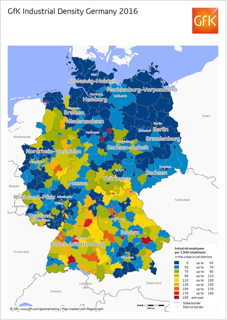

<a href="https://www.gfk.com/insights/mom-0116">Illustration: GfK</a>, <a href="https://www.gfk.com/insights/mom-0116">Link</a>

{}
{}

{}
北の半島近くや北東？
{}

<iframe src="https://www.google.com/maps/embed?pb=!4v1691739906314!6m8!1m7!1s9T2SdmE7nsWg0WG0OLwctg!2m2!1d54.66792947597245!2d9.169040278201713!3f58.212510993484585!4f-2.763962543996115!5f1.5127468040509835"width="295" height="295" style="border:0;" allowfullscreen="" loading="lazy" referrerpolicy="no-referrer-when-downgrade"></iframe>
<iframe src="https://www.google.com/maps/embed?pb=!4v1691739926333!6m8!1m7!1sHfl0KQi00d2IQNksAovkKw!2m2!1d54.04221896671441!2d11.8653657170168!3f141.7447266347252!4f-10.086491840332585!5f0.4000000000000002"width="295" height="295" style="border:0;" allowfullscreen="" loading="lazy" referrerpolicy="no-referrer-when-downgrade"></iframe>

{}
{}

    <h2 class="section-title">{}</h2>
    <ul class="rule-list">
        <li>ジルト島は平坦で木がほとんどない場所がある</li>
        <li>都市ごとに通りを示す看板の形が異なる {}
            <ul>
                <li>ベルリン：白い背景に灰色の枠があり銀色の結束バンドのようなもので固定されていることが多い</li>
                <li>ミュンヘン：四隅に凹みがあり点がある・青い背景でプレートが平らではない</li>
                <li>フランクフルト：太目のフォントを使用している。ミュンヘンと違いSやAにはねが無くフォントが異なる。</li>
                <li>ケルン：シンプルな白いプレートだ</li>
                <li>他は『<a href="https://docs.google.com/document/d/1uIKgS-bxcTJ2kPNcuwVdw_1608QuHohbgbDLrti6Vjo/edit#heading=h.kj2u3acdnyg1">A GeoGuessr guide to Germany (written by Steve)</a>』を参照</li>
            </ul>
        </li>
    </ul>

{}
{}

{}
ジルト島は木が全く生えていない場所がある{}{{% ref "https://ja.wikipedia.org/wiki/%E3%82%B8%E3%83%AB%E3%83%88%E5%B3%B6" "ジルト島" %}}。
{}

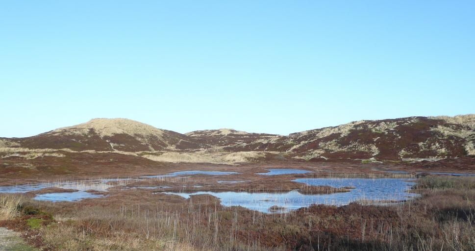

{}
{}
{}
ベルリンは白い背景に灰色の枠があり銀色の結束バンドのようなもので固定されていることが多い
{}

<iframe src="https://www.google.com/maps/embed?pb=!4v1692219579214!6m8!1m7!1sRSd--X2sO7iLwf9-8wpAQw!2m2!1d52.50789754695823!2d13.41422605682538!3f52.791105021141895!4f6.313852675606768!5f3.325193203789971" width="295" height="295" style="border:0;" allowfullscreen="" loading="lazy" referrerpolicy="no-referrer-when-downgrade"></iframe>

{}
{}

{}
フランクフルトは太目のフォントを使用している。ミュンヘンと違いSやAにはねが無くフォントが異なる。
{}

<iframe src="https://www.google.com/maps/embed?pb=!4v1683183283371!6m8!1m7!1s26xOKC0QgOrvYADBTrv8UQ!2m2!1d50.11839071648642!2d8.685527282540612!3f284.328087279669!4f8.477032225173815!5f3.3043171645708016" width="590" height="350" style="border:0;" allowfullscreen="" loading="lazy" referrerpolicy="no-referrer-when-downgrade"></iframe>
<iframe src="https://www.google.com/maps/embed?pb=!4v1683183157628!6m8!1m7!1sM34SkSbbBpDcaVQKffhrcw!2m2!1d50.14479086155589!2d8.726754428120737!3f344.04036845588325!4f5.289756406750016!5f3.325193203789971" width="590" height="350" style="border:0;" allowfullscreen="" loading="lazy" referrerpolicy="no-referrer-when-downgrade"></iframe>

{}
{}

{}
ケルンはシンプルな白いプレートだ
{}

<iframe src="https://www.google.com/maps/embed?pb=!4v1692249685942!6m8!1m7!1sM4HPmr8PIjG8GKRFbqwk3g!2m2!1d50.97358254838189!2d7.012341618275182!3f260.56219276860475!4f8.89480565272649!5f1.679402548558337" width="295" height="295" style="border:0;" allowfullscreen="" loading="lazy" referrerpolicy="no-referrer-when-downgrade"></iframe>

{}
{}

{}
<li>右側の電柱画像の出典：By <a href="//commons.wikimedia.org/w/index.php?title=User:Ralf_Krebs&amp;amp;action=edit&amp;amp;redlink=1" class="new" title="User:Ralf Krebs (page does not exist)">Ralf Krebs</a> - Own work, <a href="https://creativecommons.org/licenses/by/3.0" title="Creative Commons Attribution 3.0">CC BY 3.0</a>, <a href="https://commons.wikimedia.org/w/index.php?curid=124966897">Link</a></li>
{}