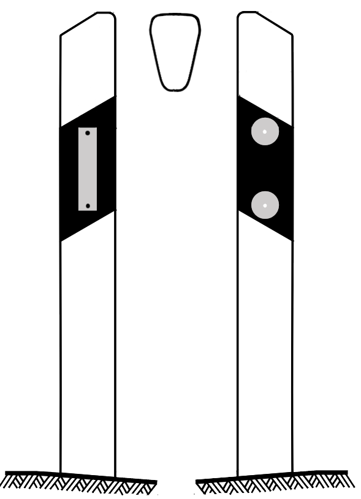

    <h2 class="section-title">{}</h2>
    <ul class="rule-list">
        <li>ドメインは.de</li>
        <li>Einbahnstraßeは一方通行の標識</li>
        <li>ドイツ語はエスツェット「ß」を文字として使う</li>
        <li>白やオレンジの反射板のボラードがある</li>
        <li>バスや電車の停留所に『H（Haltestelleの頭文字）』のマークがある</li>
        <li>有限会社という意味の『GmbH』が看板に書かれているときがある</li>
        <li>四角いモザイクが多く第2世代しかなかった{}が2023年7月以降は新しいストリートビューが追加される予定なので注意{}</li>
    </ul>
    {}

{}
{}

{}
エスツェット「ß」を文字として使い、Einbahnstraßeの標識があればドイツ。また駐車禁止だが待機ができるゾーンに矢印つきのNo Parkingの看板を良く見かける。

{}

{}
ドイツや{}のようなドイツ語圏にはバスや電車の停留所に『H（Haltestelleの頭文字）』のマークがある{}。
横長の看板にバス停の名前が書かれていることもある。
{}

{}
白やオレンジの反射板のボラードと２つの地名が書かれた看板がある{}。標識の棒に黒やグレーのキャップが付いていることも多いように思う。
{}

{}
石油製品を販売するAralがある{}。またBASFを代表とした化学系の企業がルール工業地域に多く{}郊外に工場らしきものが見える{}ことがあるけれどGeoguessrでは使えないかも。
{}

{}
{}
{}
MAN Truck & Busはバイエルン州のミュンヘンに本社がある
{}

<iframe src="https://www.google.com/maps/embed?pb=!4v1683185523960!6m8!1m7!1snvYQfP_pgME098dkO1Qt_g!2m2!1d50.92495539690297!2d6.95852656384067!3f322.8118669778739!4f-5.199782705638626!5f2.8953866314678622" width="295" height="295" style="border:0;" allowfullscreen="" loading="lazy" referrerpolicy="no-referrer-when-downgrade"></iframe>

{}
{}

<iframe src="https://www.google.com/maps/embed?pb=!4v1679315413839!6m8!1m7!1sCAoSLEFGMVFpcE5iN3A2QTBpaW5vcGZHWjVFUXM0eHIteURHbUJhbHA0NzdvX2l4!2m2!1d50.7327359391176!2d6.82996892026819!3f340.44893574166593!4f-7.7953259871863025!5f3.325193203789971" width="295" height="295" style="border:0;" allowfullscreen="" loading="lazy" referrerpolicy="no-referrer-when-downgrade"></iframe>

{}
{}

    <h2 class="section-title">{}</h2>
    <ul class="rule-list">
        <li>市外局番で地域がわかるかもしれない</li>
    </ul>

{}
{}

By <a href="https://de.wikipedia.org/wiki/User:Chumwa" class="extiw" title="de:User:Chumwa">Maximilian Dörrbecker</a> (<a href="https://de.wikipedia.org/wiki/User:Chumwa" class="extiw" title="de:User:Chumwa">Chumwa</a>) - Own work, <a href="https://creativecommons.org/licenses/by-sa/2.5" title="Creative Commons Attribution-Share Alike 2.5">CC BY-SA 2.5</a>, <a href="https://commons.wikimedia.org/w/index.php?curid=76218560">Link</a>

{}
{}

    <h2 class="section-title">{}</h2>
    <ul class="rule-list">
        <li>都市ごとに通りを示す看板の形が異なる {}
            <ul>
                <li>ベルリン：白い背景に灰色の枠があり銀色の結束バンドのようなもので固定されていることが多い</li>
                <li>ミュンヘン：四隅に凹みがあり点がある・青い背景でプレートが平らではない</li>
                <li>フランクフルト：太目のフォントを使用している。ミュンヘンと違いSやAにはねが無くフォントが異なる。</li>
                <li>ケルン：シンプルな白いプレートだ</li>
                <li>他は『<a href="https://docs.google.com/document/d/1uIKgS-bxcTJ2kPNcuwVdw_1608QuHohbgbDLrti6Vjo/edit#heading=h.kj2u3acdnyg1">A GeoGuessr guide to Germany (written by Steve)</a>』を参照</li>
            </ul>
        </li>
    </ul>

{}
{}
{}
ベルリンは白い背景に灰色の枠があり銀色の結束バンドのようなもので固定されていることが多い
{}

{}
ミュンヘンは四隅に凹みがあり濃いめの青の背景
{}

{}
{}

{}
フランクフルトは太目のフォントを使用している。ミュンヘンと違いSやAにはねが無くフォントが異なる。
{}

<iframe src="https://www.google.com/maps/embed?pb=!4v1683183283371!6m8!1m7!1s26xOKC0QgOrvYADBTrv8UQ!2m2!1d50.11839071648642!2d8.685527282540612!3f284.328087279669!4f8.477032225173815!5f3.3043171645708016" width="590" height="350" style="border:0;" allowfullscreen="" loading="lazy" referrerpolicy="no-referrer-when-downgrade"></iframe>
<iframe src="https://www.google.com/maps/embed?pb=!4v1683183157628!6m8!1m7!1sM34SkSbbBpDcaVQKffhrcw!2m2!1d50.14479086155589!2d8.726754428120737!3f344.04036845588325!4f5.289756406750016!5f3.325193203789971" width="590" height="350" style="border:0;" allowfullscreen="" loading="lazy" referrerpolicy="no-referrer-when-downgrade"></iframe>

{}
{}

{}
ケルンはシンプルな白いプレートだ
{}

<iframe src="https://www.google.com/maps/embed?pb=!4v1679420669101!6m8!1m7!1sQrzpoIdLhpyBj2X7WhSZ_Q!2m2!1d50.96195311460543!2d6.921252247984377!3f160.56204986744783!4f1.4959776138107799!5f3.325193203789971" width="590" height="350" style="border:0;" allowfullscreen="" loading="lazy" referrerpolicy="no-referrer-when-downgrade"></iframe>
<iframe src="https://www.google.com/maps/embed?pb=!4v1683183593027!6m8!1m7!1sXlTF7Y8ui1gh3efsbH-gCA!2m2!1d50.97362520064448!2d7.012388600509781!3f238.62683440263206!4f0.25072637737952164!5f3.325193203789971" width="590" height="350" style="border:0;" allowfullscreen="" loading="lazy" referrerpolicy="no-referrer-when-downgrade"></iframe>

{}
{}