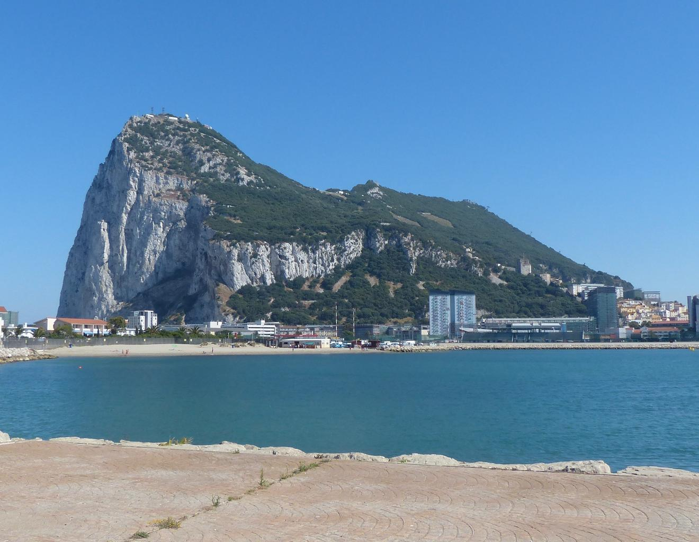
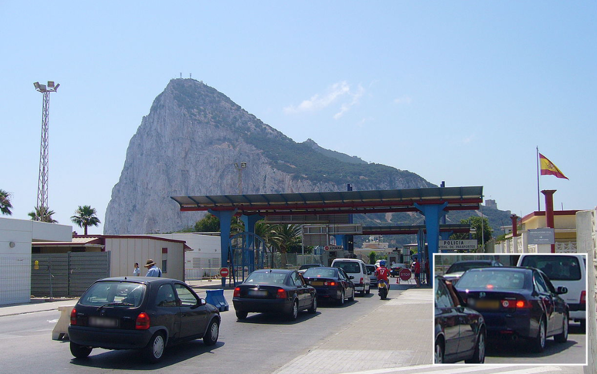

    <h2 class="section-title">{}</h2>
    <ul class="rule-list">
        <li>ドメインは.gi</li>
        <li>右側通行（一方でイギリスは左側通行）</li>
        <li>ナンバープレートは前が白で後ろが黄</li>
        <li>白い岩肌が家の近くまで迫っている</li>
        <li>Google Carのアンテナが白い</li>
    </ul>

{}
{}

{}
いわゆるThe Rock（一枚岩の巨大な石灰岩）があり、白い岩肌が家の近くまで迫っている{}。
{}

{}
右側通行かつナンバープレートは前が白で後ろが黄色{}。
{}

{}
西にジブラルタル港と造船所が見渡せる{}{}。イギリス軍が駐屯しており造船のような軍事関連産業が盛んで船がたくさん見える。観光や金融産業も盛んらしい。
{}

{}
Google Carのアンテナが白い
{}

<iframe src="https://www.google.com/maps/embed?pb=!4v1683628682271!6m8!1m7!1skgCblgg2Yh_9DWKdcEvFyg!2m2!1d36.13292009980223!2d-5.341079351606667!3f198.2123926477626!4f-28.824230954535288!5f2.912563245917548" width="495" height="395" style="border:0;" allowfullscreen="" loading="lazy" referrerpolicy="no-referrer-when-downgrade"></iframe>

{}
{}