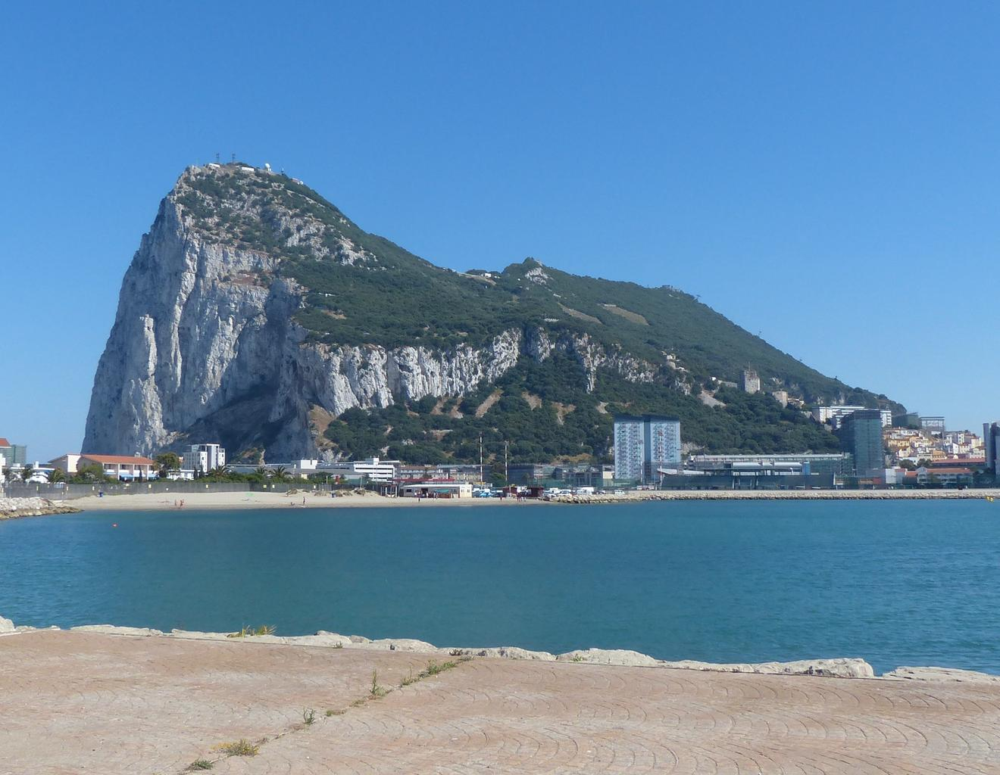

    <h2 class="section-title">{}</h2>
    <ul class="rule-list">
        <li>O domínio usa .gi</li>
        <li>A circulação é pelo lado direito (ao contrário do Reino Unido continental, que dirige pela esquerda)</li>
        <li>As placas são brancas na dianteira e amarelas na traseira</li>
        <li>Falésias calcárias branquinhas aparecem muito perto das casas</li>
        <li>A antena do Google Car é branca</li>
    </ul>

{}
{}

{}
A enorme rocha calcária conhecida como The Rock domina a paisagem; as paredes brancas chegam bem perto das áreas residenciais{}.
{}

{}
Mesmo dirigindo à direita, os veículos mantêm o padrão britânico: placa dianteira branca e traseira amarela{}.
{}

{}
Voltado para o oeste você vê o porto e o estaleiro de Gibraltar{}{}. A presença militar britânica e os serviços financeiros tornam a costa cheia de navios.
{}

{}
O Google Car local usa antena branca.
{}

<iframe src="https://www.google.com/maps/embed?pb=!4v1683628682271!6m8!1m7!1skgCblgg2Yh_9DWKdcEvFyg!2m2!1d36.13292009980223!2d-5.341079351606667!3f198.2123926477626!4f-28.824230954535288!5f2.912563245917548" width="495" height="395" style="border:0;" allowfullscreen="" loading="lazy" referrerpolicy="no-referrer-when-downgrade"></iframe>

{}
{}
