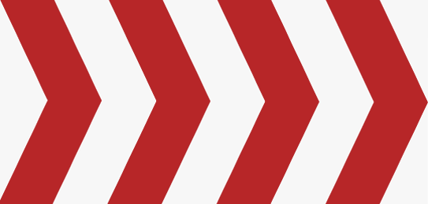
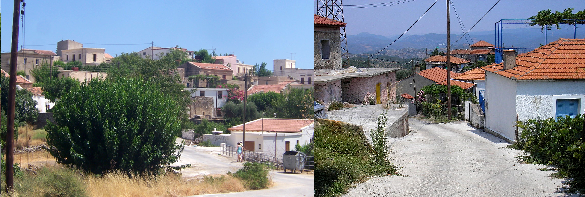
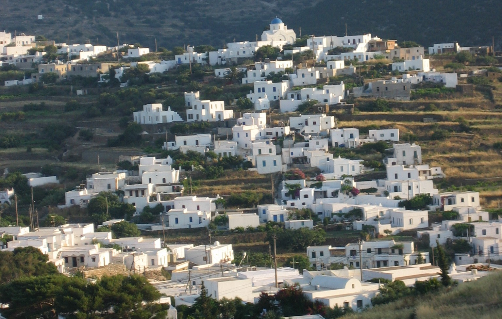
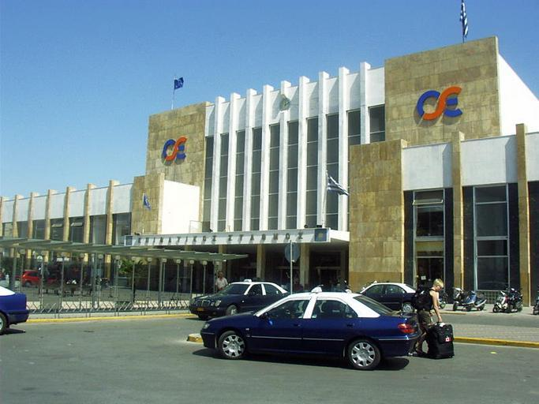

---

title: "Grecia"
date: 2023-02-26
lastmod: 2023-07-01
weight: 2
draft: false
keywords: [""]
sections: [""]
bg: "bg/city.jpg"
flag: "GR.svg"
jetro_detail: true
plonkit: true
sc_title: "Áreas que son fáciles de confundir"
sc: [
    ["../../middle_east/sba/", "Áreas de base soberana británica Akrotiri y Dekelia"],
    ["../albania/", "Albania"],
    ["../spain/", "España"],
    ["../croatia/", "Croacia lado mediterráneo"],
    ["../../middle_east/turkey/", "A lo largo de la costa oeste de Türkiye"],
    ]
---

    <h2 class="section-title">{}</h2>
    <ul class="rule-list">
        <li>hay letras griegas</li>
        <li>llamado Kandylaakia Un pequeño monumento parecido a una capilla Hay muchos al borde del camino.{}</li>
        <li>Una señal de advertencia naranja fondo{}</li>
        <li>El poste telefónico árbol a menudo está hecho de</li>
        <li>en blanco y negro Hay muchos galones de</li>
        <li>dos lineas blancas Hay muchas franjas medianas en{}</li>
        <li>Hay un bolardo reflector rojo sobre un fondo negro{}</li>
    </ul>
    {}
    {}

{}
{}
{}
Tiene letras griegas, siendo distintivas Σ y λ.{}.Los carteles con letras amarillas escritas sobre un fondo azul o marrón rara vez se ven fuera de Grecia.{}.
{}

{}dos lineas blancas En Europa, casi toda Grecia tiene franjas medianas.{}{}mosquito{}{}.
{}

{}
Las dos líneas blancas son{}o{}Es posible, pero deberías poder notar por el paisaje que es diferente.casi nunca{}Pero puedes encontrarlo{}Presta atención a los puntos.
{}

{}
Hay muchos pequeños monumentos parecidos a capillas llamados Kandylakia a los lados de las carreteras.{}.Ubicados en zonas donde se han producido accidentes de tráfico.Parece estar ubicado cerca de los sitios donde las personas sobrevivieron milagrosamente o lamentablemente perdieron la vida.{}{}.
{}

Por <a href="//commons.wikimedia.org/w/index.php?title=User:PjotrMahh1&amp;amp;action=edit&amp;amp;redlink=1" class="new" title="User:PjotrMahh1 (page does not exist)">Pjotr ​​Mahhonin</a> - propio trabajo, <a href="https://creativecommons.org/licenses/by-sa/4.0" title="Creative Commons Attribution-Share Alike 4.0">CC BY-SA 4.0</a>, <a href="https://commons.wikimedia.org/w/index.php?curid=100208787">Enlace</a>

{}
El fondo del letrero suele ser naranja.{}.オレンジの警告看板はギリシャの他には北欧・{}・{}Hay muchos.Sin embargo, tenga en cuenta que en muchos países se pueden encontrar señales temporales con fondos naranjas.
{}

{}
La flecha es{}En su mayoría hay flechas blancas sobre un fondo negro.{}.Hay raras excepciones{}.
{}

{}
Los postes telefónicos suelen estar hechos de madera.{}.
{}

{}
{}Además, los postes de teléfono son de madera, y también puedes encontrar palabras griegas, ¡así que ten cuidado!
{}

Por Roton Piotr, <a href="https://creativecommons.org/licenses/by-sa/3.0" title="Creative Commons Attribution-Share Alike 3.0">CC BY-SA 3.0</a>, <a href="https://commons.wikimedia.org/w/index.php?curid=57792716">Enlace</a>

{}
Grecia tiene mucha luz solar y mucha piedra caliza, por lo que muchos edificios tienen paredes blancas.El techo suele ser de color marrón rojizo.{}.Sin embargo, en islas remotas y algunas zonas, hay muchos casos en los que no se utilizan tejas de color marrón rojizo y los techos son planos ({}).
{}

{}
hay muchos olivos{}
{}

{}
Grecia·{}・{}・{}・{}・{}Hay muchos accidentes geográficos kársticos en la zona y hay muchos lugares donde se pueden ver rocas blancas.{}.
{}

{}
{}

{}
{}En la mayoría de los casos, las señales de velocidad tienen un fondo naranja, pero en Grecia suelen tener un fondo blanco.
{}

<iframe src="https://www.google.com/maps/embed?pb=!4v1681562784599!6m8!1m7!1sSNeXfdQWlEXj92nCSXjduA!2m2!1d39.83661953176593!2d22.51527738510446!3f32.14116344717707!4f-8.816995597275962!5f2.4387869201840315" width="295" height="295" style="border:0;" allowfullscreen="" loading="lazy" referrerpolicy="no-referrer-when-downgrade"></iframe>
<iframe src="https://www.google.com/maps/embed?pb=!4v1679482227397!6m8!1m7!1s-_YX9OU-_d_1nMNO_tmWWw!2m2!1d37.96493530525935!2d23.74940432877799!3f195.2890261192887!4f1.6281484979047463!5f3.325193203789971" width="295" height="295" style="border:0;" allowfullscreen="" loading="lazy" referrerpolicy="no-referrer-when-downgrade"></iframe>

{}
{}

<iframe src="https://www.google.com/maps/embed?pb=!4v1688107287211!6m8!1m7!1sHdi9HUClHPbNuAzlaXse3A!2m2!1d40.40659520651187!2d21.32464355017767!3f253.07489613825066!4f-34.212844418528455!5f2.8722551534471177" width="295" height="295" style="border:0;" allowfullscreen="" loading="lazy" referrerpolicy="no-referrer-when-downgrade"></iframe>
<iframe src="https://www.google.com/maps/embed?pb=!4v1688107152207!6m8!1m7!1sCcML3GNqdlwlkSt5YCaFBQ!2m2!1d41.28769137666923!2d22.93970614357949!3f57.35025114807158!4f-9.105558133964138!5f3.325193203789971" width="295" height="295" style="border:0;" allowfullscreen="" loading="lazy" referrerpolicy="no-referrer-when-downgrade"></iframe>
<iframe src="https://www.google.com/maps/embed?pb=!4v1691366944201!6m8!1m7!1s8eDq34C8WRBC7UTNpgItTA!2m2!1d41.68721343979372!2d26.2682746052514!3f336.6749127515674!4f-13.13221868370941!5f1.155086221189392"width="295" height="295" style="border:0;" allowfullscreen="" loading="lazy" referrerpolicy="no-referrer-when-downgrade"></iframe>

{}
{}

<iframe src="https://www.google.com/maps/embed?pb=!4v1681563271945!6m8!1m7!1sRBOj8Df-u8IoEDERm8jIRA!2m2!1d38.09957462407244!2d23.65938358353345!3f190.99156130230284!4f-0.4026614639561217!5f0.8570811876639206" width="295" height="295" style="border:0;" allowfullscreen="" loading="lazy" referrerpolicy="no-referrer-when-downgrade"></iframe>
<iframe src="https://www.google.com/maps/embed?pb=!4v1688107444382!6m8!1m7!1s6Prr51HExKppM8weWumh7g!2m2!1d37.08004996507277!2d25.54043620673971!3f255.69523454910913!4f-5.993340603505331!5f1.0003527211606977" width="295" height="295" style="border:0;" allowfullscreen="" loading="lazy" referrerpolicy="no-referrer-when-downgrade"></iframe>

{}
{}

    <h2 class="section-title">{}</h2>
    <ul class="rule-list">
        <li>Si se escribe el código de área que comienza con 2, puede limitar la ubicación.
            <ul>
                <li>21:{}</li>
                <li>231:{}</li>
                <li>266:{}</li>
                <li>28:{}</li>
            </ul>
        </li>
        <li>Algunas islas remotas cerca de Turquía Grecia territorio</li>
        <li>Los tipos de agricultura difieren entre zonas planas y zonas inclinadas.{}
            <ul>
                <li>Las llanuras del continente se utilizan principalmente para el algodón y la agricultura de regadío.</li>
                <li>En las laderas del continente y en islas remotas hay muchos campos de olivos y bayas.</li>
                <li>La isla Kuriti (Κρήτη) también tiene muchas plantaciones de olivos.{}</li>
                <li>Hay viñedos por toda la zona y se exporta vino.{}</li>
            </ul>
        </li>
        <li>Muchos lugares turísticos se encuentran a lo largo de la costa.</li>
        <li>A veces puedes limitar el área mirando el final del nombre de la ciudad.{{% ref "https://jgchaparro.medium.com/%CF%83%CE%B5%CF%81%CF%86%CE%AC%CF%81%CE%BF%CE%BD%CF%84%CE%B1%CF%82-%CE%B7-%CE%B3%CE%B5%CF%89%CE%B3%CF%81%CE%B1%CF%86%CE%AF%CE%B1-%CF%84%CF%89%CE%BD-%CE%B5%CE%BB%CE%BB%CE%B7%CE%BD%CE%B9%CE%BA%CF%8E%CE%BD-%CF%84%CE%BF%CF%80%CF%89%CE%BD%CF%85%CE%BC%CE%AF%CF%89%CE%BD-4da1d6ce5b7b" "Σερφάροντας στην γεωγραφία των ελληνικών τοπωνυμίων" %}}.Hay muchas excepciones.
            <ul>
                <li>-άτα: Cerca de la isla de Cefalonia{}</li>
                <li>-ανά: Isla de Creta o zona montañosa del continente{}</li>
                <li>-ές・-έ: Común en la isla de Creta.{}</li>
                <li>-αίικα: lado oeste del continente{}・Isla de Samos{}</li>
            </ul>
        </li>
    </ul>

{}
{}

{}
Casi en sentido antihorario.28 Entonces intenta ir a una isla remota.
{}

Por <a href="https://el.wikipedia.org/wiki/%CE%A7%CF%81%CE%AE%CF%83%CF%84%CE%B7%CF%82:244wiki" class="extiw" title="el:Χρήστης:244wiki">244wiki</a> - propio trabajo, atribución, <a href="https://commons.wikimedia.org/w/index.php?curid=93910931">Enlace</a>(<a href="https://de.m.wikipedia.org/wiki/Datei:Greek_landline_area_codes_map.png">Detalles de la licencia</a>)

{}
{}
{}
Islas remotas cerca de Turquía territorio apenas griego
{}

<blockquote class="twitter-tweet">
<a href="https://t.co/hoVOxtPQlH">pic.twitter.com/hoVOxtPQlH</a>
- Μείνε (@meine_geo) <a href="https://twitter.com/meine_geo/status/1664031998334353408?ref_src=twsrc%5Etfw">31 de mayo de 2023</a></blockquote> 

{}
{}

{}
Por ejemplo, el algodón sólo se puede producir en terrenos llanos.Las zonas con baja producción de algodón suelen ser desiguales.A veces se puede encontrar algodón blanco al borde de la carretera.{}.
{}

{}
{}

{}
La zona azul es popular para el turismo.{}.
{}

{}
{}

{}
Una imagen que creé mientras miraba referencias y mapas.{{% ref "https://jgchaparro.medium.com/%CF%83%CE%B5%CF%81%CF%86%CE%AC%CF%81%CE%BF%CE%BD%CF%84%CE%B1%CF%82-%CE%B7-%CE%B3%CE%B5%CF%89%CE%B3%CF%81%CE%B1%CF%86%CE%AF%CE%B1-%CF%84%CF%89%CE%BD-%CE%B5%CE%BB%CE%BB%CE%B7%CE%BD%CE%B9%CE%BA%CF%8E%CE%BD-%CF%84%CE%BF%CF%80%CF%89%CE%BD%CF%85%CE%BC%CE%AF%CF%89%CE%BD-4da1d6ce5b7b" "Σερφάροντας στην γεωγραφία των ελληνικών τοπωνυμίων" %}}.
{}

{}
{}

    <h2 class="section-title">{}</h2>
    <ul class="rule-list">
        <li>Los automóviles están prohibidos en la isla de Hydra por ordenanza, por lo que solo existen excursionistas.{{% ref "https://ja.wikipedia.org/wiki/%E3%82%A4%E3%83%89%E3%83%A9%E5%B3%B6" "Isla Hidra" %}}</li>
        <li>La isla de Kea tiene un clima con poca lluvia y muchas casas tienen colinas y muros de piedra.{}</li>
        <li>La isla de Sifnos no se ha convertido en un destino turístico aparte del puerto y hay muchas ruinas e iglesias.{}.</li>
        <li class="no-evidence">Los grandes botes de basura verdes a veces tienen escritos los nombres de las ciudades.</li>
        <li class="no-evidence">Los colores de los taxis varían según la ciudad.</li>
    </ul>

{}
{}
{}
No se permiten coches en la isla, por lo que el transporte se realiza a pie o en burro.Por lo tanto, Street View sólo existe para excursionistas y hay burros por toda la ciudad.{}.
{}

Por theusmanmali, <a href="https://creativecommons.org/licenses/by-sa/3.0" title="Creative Commons Attribution-Share Alike 3.0">CC BY-SA 3.0</a>, <a href="https://commons.wikimedia.org/w/index.php?curid=53642795">Enlace</a>

{}
{}
{}
Según los datos, hay muchos cerros sin árboles y parece ser un clima desértico.{}.{}Hay muchas casas hechas con paredes de piedra que no son blancas como{}{}.Solo están disponibles las ubicaciones fotografiadas después de abril de 2023.
{}

{}
{}
{}
ruinas e iglesias{}se puede encontrar mucho.Hay más de 300 iglesias en la isla.{}.No se ha convertido en un destino turístico y a menudo hay que caminar por caminos sin pavimentar.{}.Parece que la cerámica es popular.La falta de casas con tejados rojos también da la sensación de estar en una isla remota.{}.
{}

{}
{}
{}
Los botes de basura a veces tienen nombres de ciudades escritos, así que verifique si hay letras griegas en el bote de basura y, si parece el nombre de una ciudad, intente buscarlo en el mapa.El de la izquierda es Κομοτηνή, el de la derecha es Αθήνα.
{}

<iframe src="https://www.google.com/maps/embed?pb=!4v1683521796853!6m8!1m7!1sjZZ8EXhSjYq8VsHDf7AoVQ!2m2!1d41.12331863689597!2d25.3986589847111!3f269.3300573943943!4f-22.17485408778903!5f3.325193203789971" width="295" height="295" style="border:0;" allowfullscreen="" loading="lazy" referrerpolicy="no-referrer-when-downgrade"></iframe>
<iframe src="https://www.google.com/maps/embed?pb=!4v1683521693014!6m8!1m7!1sb0GixXXzrBYEJg5R5TpVmA!2m2!1d38.0235869860223!2d23.74597211421801!3f94.27744211760701!4f-30.305485569166386!5f3.325193203789971" width="295" height="295" style="border:0;" allowfullscreen="" loading="lazy" referrerpolicy="no-referrer-when-downgrade"></iframe>

{}
{}
{}
Atenas es amarilla.
{}

{}
Heraklion (una ciudad en la parte norte de Creta) tiene mucha plata.
{}

Por Mietek Ł, <a href="https://creativecommons.org/licenses/by-sa/3.0" title="Creative Commons Attribution-Share Alike 3.0">CC BY-SA 3.0</a>, <a href="https://commons.wikimedia.org/w/index.php?curid=52894268">Enlace</a>

{}
Salónica es de color azul oscuro.
{}

{}
{}

    <h4 class="mb-4">Descripción de empresas representativas</h4>
    <table class="table table-striped table-bordered">
        <thead class="table-light">
            <tr>
                <th scope="col" class="col-width-2">Nombre de empresa</th>
                <th scope="col" class="col-width-1">código</th>
                <th scope="col" class="col-width-7">explicación</th>
                <th scope="col" class="col-width-05">liquidación de cuentas</th>
                <th scope="col" class="col-width-05">Historial de dividendos</th>
            </tr>
        </thead>
        <tbody class="corp-desc">
            <tr>
                <td>Graneleros estrella</td>
                <td>{}</td>
                <td>Opera buques graneleros secos.Consulte las referencias para obtener una lista de barcos de propiedad.{}.Posee más de 15 embarcaciones Capesize.</td>
                <td>{}</td>
                <td>{}</td>
            </tr>
            <tr>
                <td>Dánao</td>
                <td>{}</td>
                <td>Posee una gran flota de portacontenedores y los alquila a empresas operativas en Estados Unidos y otros países.</td>
                <td>{}</td>
                <td>{}</td>
            </tr>
            <tr>
                <td>Arrendamiento global de barcos</td>
                <td>{}</td>
                <td>Alquile su propio barco a una empresa de transporte de contenedores{}.</td>
                <td>{}</td>
                <td>{}</td>
            </tr>
        </tbody>
    </table>

