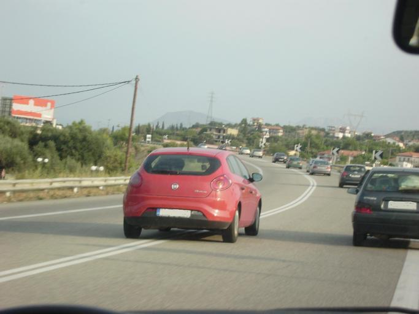
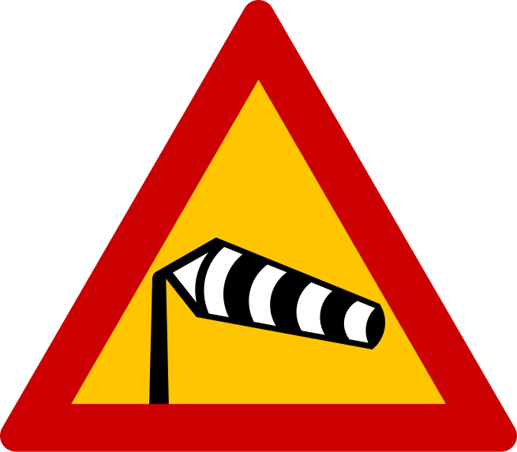
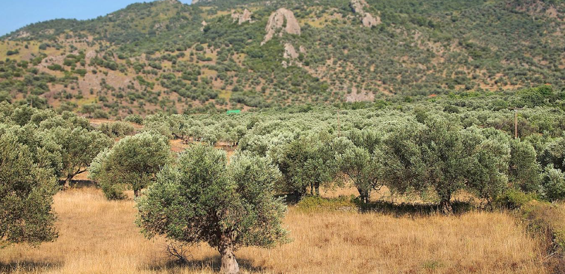
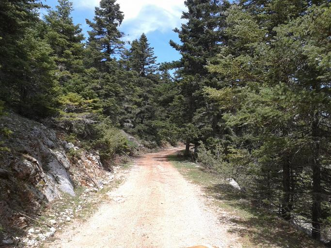
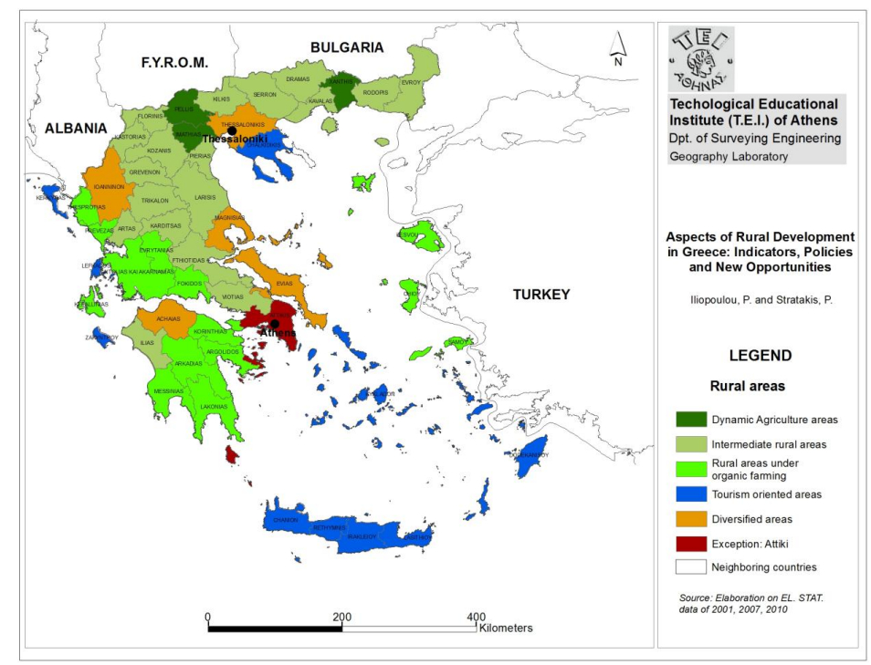
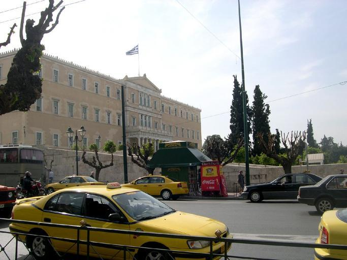

---

title: "Yunani"
date: 2023-02-26
lastmod: 2023-07-01
weight: 2
draft: false
keywords: [""]
sections: [""]
bg: "bg/city.jpg"
flag: "GR.svg"
jetro_detail: true
plonkit: true
sc_title: "Area yang mudah salah"
sc: [
    ["../../middle_east/sba/", "Wilayah Pangkalan Kedaulatan Inggris Akrotiri dan Dekelia"],
    ["../albania/", "Albania"],
    ["../spain/", "Spanyol"],
    ["../croatia/", "sisi Mediterania Kroasia"],
    ["../../middle_east/turkey/", "Di sepanjang pantai barat Türkiye"],
    ]
---

    <h2 class="section-title">{}</h2>
    <ul class="rule-list">
        <li>ada huruf yunani</li>
        <li>disebut Kandylaakia Monumen kecil mirip kapel Banyak sekali di pinggir jalan{}</li>
        <li>Sebuah tanda peringatan oranye latar belakang{}</li>
        <li>Tiang telepon pohon sering terbuat dari</li>
        <li>hitam dan putih Ada banyak chevron</li>
        <li>dua garis putih Ada banyak garis median di dalamnya{}</li>
        <li>Ada tonggak reflektor merah dengan latar belakang hitam{}</li>
    </ul>
    {}
    {}

{}
{}
{}
Ia mempunyai huruf Yunani, dengan Σ dan λ yang khas.{}.Tanda dengan huruf kuning yang ditulis dengan latar belakang biru atau coklat juga jarang terlihat di luar Yunani.{}.
{}

{}dua garis putih Di Eropa, hampir seluruh Yunani memiliki garis tengah.{}{}nyamuk{}{}.
{}

{}
Kedua garis putih tersebut adalah{}atau{}Itu mungkin saja terjadi, tetapi Anda harus dapat mengetahui dari pemandangan bahwa itu berbeda.jarang{}Tapi Anda bisa menemukannya{}Perhatikan poin-poinnya.
{}

{}
Ada banyak monumen kecil mirip kapel bernama Kandylakia di pinggir jalan.{}.Terletak di daerah yang pernah terjadi kecelakaan lalu lintas.Tampaknya lokasinya dekat dengan lokasi di mana orang-orang secara ajaib selamat atau kehilangan nyawa mereka.{}{}.
{}

Oleh <a href="//commons.wikimedia.org/w/index.php?title=User:PjotrMahh1&amp;amp;action=edit&amp;amp;redlink=1" class="new" title="User:PjotrMahh1 (page does not exist)">Pjotr ​​​​Mahhonin</a> - pekerjaan sendiri, <a href="https://creativecommons.org/licenses/by-sa/4.0" title="Creative Commons Attribution-Share Alike 4.0">CC BY-SA 4.0</a>, <a href="https://commons.wikimedia.org/w/index.php?curid=100208787">Link</a>

{}
Latar belakang papan nama sering kali berwarna oranye.{}.Selain Yunani, ada tanda peringatan berwarna oranye di Eropa Utara.{}・{}Ada banyak.Namun perlu diketahui bahwa tanda-tanda sementara dengan latar belakang oranye dapat ditemukan di banyak negara.
{}

{}
Panahnya adalah{}Misalnya, sebagian besar ada panah putih dengan latar belakang hitam.{}.Ada pengecualian yang jarang terjadi{}.
{}

{}
Tiang telepon seringkali terbuat dari kayu.{}.
{}

{}
{}Selain itu, tiang teleponnya terbuat dari kayu, dan Anda juga dapat menemukan kata-kata Yunani, jadi berhati-hatilah!
{}

Oleh Roton Piotr, <a href="https://creativecommons.org/licenses/by-sa/3.0" title="Creative Commons Attribution-Share Alike 3.0">CC BY-SA 3.0</a>, <a href="https://commons.wikimedia.org/w/index.php?curid=57792716">Link</a>

{}
Yunani memiliki sinar matahari yang kuat dan banyak batu kapur, sehingga banyak bangunan berdinding putih.Atapnya seringkali berwarna coklat kemerahan.{}.Namun di pulau-pulau terpencil dan beberapa daerah, banyak terjadi kasus dimana ubin berwarna coklat kemerahan tidak digunakan sama sekali dan atapnya datar ({}).
{}

{}
ada banyak pohon zaitun{}
{}

{}
Yunani·{}・{}・{}・{}・{}Terdapat banyak bentang alam karst di kawasan tersebut, dan banyak tempat di mana bebatuan putih terlihat.{}.
{}

{}
{}

{}
{}Dalam kebanyakan kasus, rambu penunjuk kecepatan mempunyai latar belakang oranye, namun di Yunani sering kali rambu tersebut berlatar belakang putih.
{}

<iframe src="https://www.google.com/maps/embed?pb=!4v1681562784599!6m8!1m7!1sSNeXfdQWlEXj92nCSXjduA!2m2!1d39.83661953176593!2d22.51527738510446!3f32.14116344717707!4f-8.816995597275962!5f2.4387869201840315" width="295" height="295" style="border:0;" allowfullscreen="" loading="lazy" referrerpolicy="no-referrer-when-downgrade"></iframe>
<iframe src="https://www.google.com/maps/embed?pb=!4v1679482227397!6m8!1m7!1s-_YX9OU-_d_1nMNO_tmWWw!2m2!1d37.96493530525935!2d23.74940432877799!3f195.2890261192887!4f1.6281484979047463!5f3.325193203789971" width="295" height="295" style="border:0;" allowfullscreen="" loading="lazy" referrerpolicy="no-referrer-when-downgrade"></iframe>

{}
{}

<iframe src="https://www.google.com/maps/embed?pb=!4v1688107287211!6m8!1m7!1sHdi9HUClHPbNuAzlaXse3A!2m2!1d40.40659520651187!2d21.32464355017767!3f253.07489613825066!4f-34.212844418528455!5f2.8722551534471177" width="295" height="295" style="border:0;" allowfullscreen="" loading="lazy" referrerpolicy="no-referrer-when-downgrade"></iframe>
<iframe src="https://www.google.com/maps/embed?pb=!4v1688107152207!6m8!1m7!1sCcML3GNqdlwlkSt5YCaFBQ!2m2!1d41.28769137666923!2d22.93970614357949!3f57.35025114807158!4f-9.105558133964138!5f3.325193203789971" width="295" height="295" style="border:0;" allowfullscreen="" loading="lazy" referrerpolicy="no-referrer-when-downgrade"></iframe>
<iframe src="https://www.google.com/maps/embed?pb=!4v1691366944201!6m8!1m7!1s8eDq34C8WRBC7UTNpgItTA!2m2!1d41.68721343979372!2d26.2682746052514!3f336.6749127515674!4f-13.13221868370941!5f1.155086221189392"width="295" height="295" style="border:0;" allowfullscreen="" loading="lazy" referrerpolicy="no-referrer-when-downgrade"></iframe>

{}
{}

<iframe src="https://www.google.com/maps/embed?pb=!4v1681563271945!6m8!1m7!1sRBOj8Df-u8IoEDERm8jIRA!2m2!1d38.09957462407244!2d23.65938358353345!3f190.99156130230284!4f-0.4026614639561217!5f0.8570811876639206" width="295" height="295" style="border:0;" allowfullscreen="" loading="lazy" referrerpolicy="no-referrer-when-downgrade"></iframe>
<iframe src="https://www.google.com/maps/embed?pb=!4v1688107444382!6m8!1m7!1s6Prr51HExKppM8weWumh7g!2m2!1d37.08004996507277!2d25.54043620673971!3f255.69523454910913!4f-5.993340603505331!5f1.0003527211606977" width="295" height="295" style="border:0;" allowfullscreen="" loading="lazy" referrerpolicy="no-referrer-when-downgrade"></iframe>

{}
{}

    <h2 class="section-title">{}</h2>
    <ul class="rule-list">
        <li>Jika tertulis kode area yang dimulai dengan 2, Anda dapat mempersempit lokasinya.
            <ul>
                <li>21:{}</li>
                <li>231:{}</li>
                <li>266:{}</li>
                <li>28:{}</li>
            </ul>
        </li>
        <li>Beberapa pulau terpencil dekat Turki Yunani wilayah</li>
        <li>Jenis pertanian berbeda antara lahan datar dan lahan miring.{}
            <ul>
                <li>Dataran datar di daratan sebagian besar digunakan untuk pertanian kapas dan irigasi.</li>
                <li>Ada banyak ladang zaitun dan buah beri di lereng daratan dan di pulau-pulau terpencil.</li>
                <li>Pulau Kuriti (Κρήτη) juga memiliki banyak perkebunan zaitun.{}</li>
                <li>Ada kebun anggur di seluruh wilayah dan anggur diekspor.{}</li>
            </ul>
        </li>
        <li>Banyak tempat wisata yang terletak di sepanjang pantai.</li>
        <li>Terkadang Anda dapat mempersempit area dengan melihat akhir nama kota.{{% ref "https://jgchaparro.medium.com/%CF%83%CE%B5%CF%81%CF%86%CE%AC%CF%81%CE%BF%CE%BD%CF%84%CE%B1%CF%82-%CE%B7-%CE%B3%CE%B5%CF%89%CE%B3%CF%81%CE%B1%CF%86%CE%AF%CE%B1-%CF%84%CF%89%CE%BD-%CE%B5%CE%BB%CE%BB%CE%B7%CE%BD%CE%B9%CE%BA%CF%8E%CE%BD-%CF%84%CE%BF%CF%80%CF%89%CE%BD%CF%85%CE%BC%CE%AF%CF%89%CE%BD-4da1d6ce5b7b" "Perlindungan Pelanggan" %}}.Ada banyak pengecualian.
            <ul>
                <li>-άτα: Dekat Pulau Kefalonia{}</li>
                <li>-ανά: Pulau Kreta atau daerah pegunungan di daratan{}</li>
                <li>-ές・-έ: Umum di Pulau Kreta.{}</li>
                <li>-αίικα: Sisi barat daratan{}・Pulau Samos{}</li>
            </ul>
        </li>
    </ul>

{}
{}

{}
Hampir berlawanan arah jarum jam.28 Lalu cobalah pergi ke pulau terpencil.
{}

Oleh <a href="https://el.wikipedia.org/wiki/%CE%A7%CF%81%CE%AE%CF%83%CF%84%CE%B7%CF%82:244wiki" class="extiw" title="el:Χρήστης:244wiki">244wiki</a> - pekerjaan sendiri, Atribusi, <a href="https://commons.wikimedia.org/w/index.php?curid=93910931">Link</a>(<a href="https://de.m.wikipedia.org/wiki/Datei:Greek_landline_area_codes_map.png">Detail lisensi</a>)

{}
{}
{}
Pulau-pulau terpencil dekat Turki hampir tidak merupakan wilayah Yunani
{}

<blockquote class="twitter-tweet">
<a href="https://t.co/hoVOxtPQlH">pic.twitter.com/hoVOxtPQlH</a>
&mdash; Μείνε (@meine_geo) <a href="https://twitter.com/meine_geo/status/1664031998334353408?ref_src=twsrc%5Etfw">31 Mei 2023</a></blockquote> 

{}
{}

{}
Misalnya kapas hanya bisa diproduksi di lahan datar.Daerah dengan produksi kapas rendah seringkali tidak merata.Kapas putih terkadang bisa kita temukan di pinggir jalan.{}.
{}

{}
{}

{}
Kawasan biru populer untuk pariwisata.{}.
{}

{}
{}

{}
Gambar yang saya buat sambil melihat referensi dan peta{{% ref "https://jgchaparro.medium.com/%CF%83%CE%B5%CF%81%CF%86%CE%AC%CF%81%CE%BF%CE%BD%CF%84%CE%B1%CF%82-%CE%B7-%CE%B3%CE%B5%CF%89%CE%B3%CF%81%CE%B1%CF%86%CE%AF%CE%B1-%CF%84%CF%89%CE%BD-%CE%B5%CE%BB%CE%BB%CE%B7%CE%BD%CE%B9%CE%BA%CF%8E%CE%BD-%CF%84%CE%BF%CF%80%CF%89%CE%BD%CF%85%CE%BC%CE%AF%CF%89%CE%BD-4da1d6ce5b7b" "Perlindungan Pelanggan" %}}.
{}

{}
{}

    <h2 class="section-title">{}</h2>
    <ul class="rule-list">
        <li>Mobil dilarang di Pulau Hydra berdasarkan peraturan, jadi hanya trekker yang ada.{{% ref "https://ja.wikipedia.org/wiki/%E3%82%A4%E3%83%89%E3%83%A9%E5%B3%B6" "Pulau Hidra" %}}</li>
        <li>Pulau Kea memiliki iklim dengan sedikit hujan dan banyak rumah berbukit dan berdinding batu.{}</li>
        <li>Pulau Sifnos belum berkembang menjadi tujuan wisata selain pelabuhan, dan masih banyak terdapat reruntuhan dan gereja.{}.</li>
        <li class="no-evidence">Tempat sampah besar berwarna hijau terkadang bertuliskan nama kota.</li>
        <li class="no-evidence">Warna taksi berbeda-beda di setiap kota</li>
    </ul>

{}
{}
{}
Mobil tidak diperbolehkan di pulau ini, jadi transportasi dilakukan dengan berjalan kaki atau keledai.Oleh karena itu, Street View hanya tersedia untuk trekker, dan terdapat keledai di seluruh kota.{}.
{}

Oleh theusmanmali, <a href="https://creativecommons.org/licenses/by-sa/3.0" title="Creative Commons Attribution-Share Alike 3.0">CC BY-SA 3.0</a>, <a href="https://commons.wikimedia.org/w/index.php?curid=53642795">Link</a>

{}
{}
{}
Berdasarkan data, banyak terdapat perbukitan yang tidak memiliki pepohonan, dan iklimnya cenderung gurun.{}.{}Ada banyak rumah yang dibuat dengan dinding batu non-putih seperti itu{}{}.Hanya lokasi yang difoto setelah April 2023 yang tersedia.
{}

{}
{}
{}
reruntuhan dan gereja{}dapat ditemukan banyak.Ada lebih dari 300 gereja di pulau itu.{}.Tempat ini belum berkembang menjadi tujuan wisata, dan seringkali Anda harus berjalan di jalan yang tidak beraspal.{}.Tampaknya tembikar itu populer.Minimnya rumah beratap merah juga memberikan kesan berada di pulau terpencil.{}.
{}

{}
{}
{}
Tempat sampah terkadang memiliki tulisan nama kota, jadi periksa apakah ada huruf Yunani di tempat sampah tersebut, dan jika terlihat seperti nama kota, coba cari di peta.Yang kiri adalah Κομοτηνή, yang kanan adalah Αθήνα.
{}

<iframe src="https://www.google.com/maps/embed?pb=!4v1683521796853!6m8!1m7!1sjZZ8EXhSjYq8VsHDf7AoVQ!2m2!1d41.12331863689597!2d25.3986589847111!3f269.3300573943943!4f-22.17485408778903!5f3.325193203789971" width="295" height="295" style="border:0;" allowfullscreen="" loading="lazy" referrerpolicy="no-referrer-when-downgrade"></iframe>
<iframe src="https://www.google.com/maps/embed?pb=!4v1683521693014!6m8!1m7!1sb0GixXXzrBYEJg5R5TpVmA!2m2!1d38.0235869860223!2d23.74597211421801!3f94.27744211760701!4f-30.305485569166386!5f3.325193203789971" width="295" height="295" style="border:0;" allowfullscreen="" loading="lazy" referrerpolicy="no-referrer-when-downgrade"></iframe>

{}
{}
{}
Athena berwarna kuning.
{}

{}
Heraklion (sebuah kota di bagian utara Kreta) memiliki banyak perak.
{}

Oleh Mietek Ł, <a href="https://creativecommons.org/licenses/by-sa/3.0" title="Creative Commons Attribution-Share Alike 3.0">CC BY-SA 3.0</a>, <a href="https://commons.wikimedia.org/w/index.php?curid=52894268">Link</a>

{}
Tesalonika berwarna biru tua.
{}

{}
{}

    <h4 class="mb-4">Deskripsi perusahaan perwakilan</h4>
    <table class="table table-striped table-bordered">
        <thead class="table-light">
            <tr>
                <th scope="col" class="col-width-2">Nama perusahaan</th>
                <th scope="col" class="col-width-1">kode</th>
                <th scope="col" class="col-width-7">penjelasan</th>
                <th scope="col" class="col-width-05">penyelesaian rekening</th>
                <th scope="col" class="col-width-05">Sejarah dividen</th>
            </tr>
        </thead>
        <tbody class="corp-desc">
            <tr>
                <td>Pengangkut Massal Bintang</td>
                <td>{}</td>
                <td>Mengoperasikan kapal curah kering.Lihat referensi untuk daftar kapal yang dimiliki.{}.Memiliki lebih dari 15 kapal Capesize.</td>
                <td>{}</td>
                <td>{}</td>
            </tr>
            <tr>
                <td>Danao</td>
                <td>{}</td>
                <td>Perusahaan ini memiliki armada kapal kontainer dalam jumlah besar dan menyewakannya kepada perusahaan yang beroperasi di Amerika Serikat dan negara lain.</td>
                <td>{}</td>
                <td>{}</td>
            </tr>
            <tr>
                <td>Sewa Kapal Global</td>
                <td>{}</td>
                <td>Sewa kapal Anda sendiri ke perusahaan pelayaran kontainer{}.</td>
                <td>{}</td>
                <td>{}</td>
            </tr>
        </tbody>
    </table>

