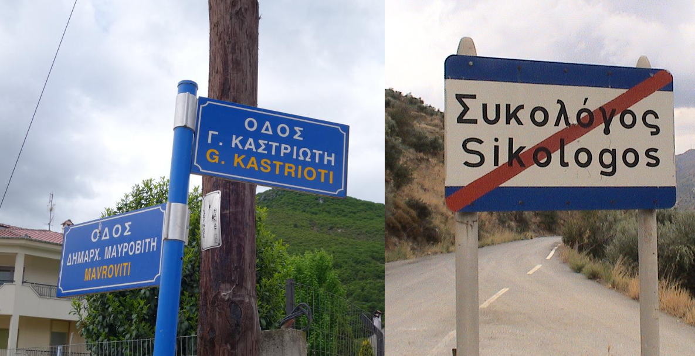
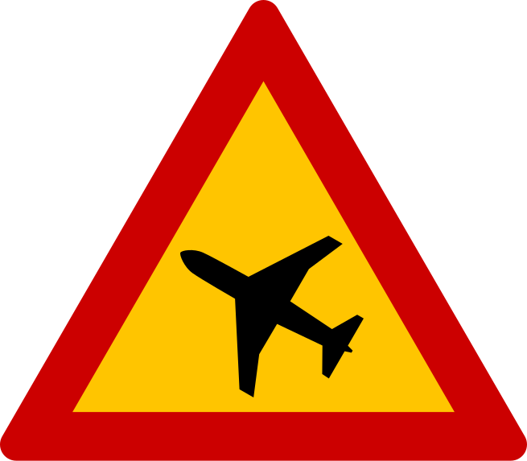
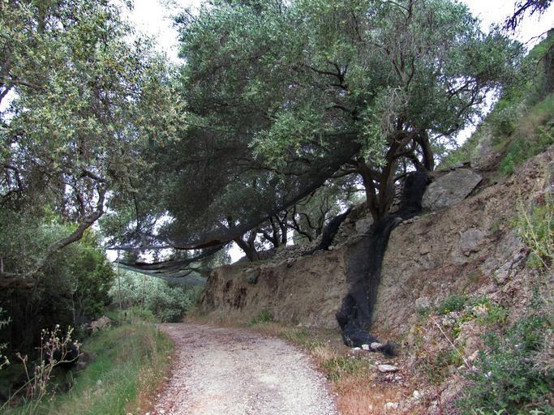
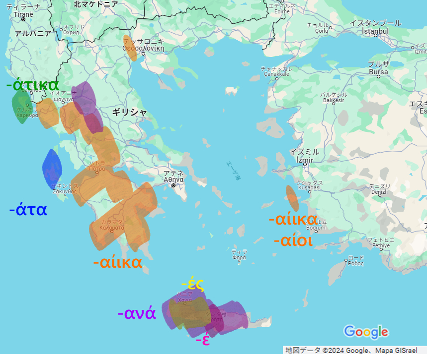

    <h2 class="section-title">{}</h2>
    <ul class="rule-list">
        <li>ギリシャ文字がある</li>
        <li>Kandylakiaと呼ばれる小さなチャペルのようなモニュメントが道端に多くある{}</li>
        <li>警告看板がオレンジ背景{}</li>
        <li>電柱が木でできていることが多い</li>
        <li>白黒のシェブロンが多い</li>
        <li>白の2本線の中央分離帯が多い{}</li>
        <li>黒背景に赤色の反射板のボラードがある{}</li>
    </ul>
    {}
    {}

{}
{}
{}
ギリシャ文字がありΣやλが特徴的{}。青背景や茶色背景に黄色い文字が書かれている看板もギリシャ以外ではあまり見かけない{}。
{}

{}白の2本線の中央分離帯があるのはヨーロッパではほぼギリシャ{}{}か{}{}。
{}

{}
白二本線は{}や{}があり得るが景色から違うと判断できるはず。まれに{}でも見つかる{}点に注意。
{}

{}
Kandylakiaと呼ばれる小さなチャペルのようなモニュメントが道端に多くある{}。交通事故などが発生した場所にある。奇跡的に助かったり、逆に不運にも命を落としてしまった現場付近にあるらしい{}{}。
{}

By <a href="//commons.wikimedia.org/w/index.php?title=User:PjotrMahh1&amp;amp;action=edit&amp;amp;redlink=1" class="new" title="User:PjotrMahh1 (page does not exist)">Pjotr Mahhonin</a> - Own work, <a href="https://creativecommons.org/licenses/by-sa/4.0" title="Creative Commons Attribution-Share Alike 4.0">CC BY-SA 4.0</a>, <a href="https://commons.wikimedia.org/w/index.php?curid=100208787">Link</a>

{}
看板の背景がオレンジのことが多い{}。オレンジの警告看板はギリシャの他には北欧・{}・{}が多い。ただし一時的に設置されたオレンジ背景の看板は多くの国で見つかるのて注意。
{}

{}
矢印は{}と同じく黒背景に白矢印がほとんど{}。稀に例外もある{}。
{}

{}
電柱が木でできていることが多い{}。
{}

{}
{}も電柱が木でできており、ギリシャ語も見つかるので注意！
{}

By Roton Piotr, <a href="https://creativecommons.org/licenses/by-sa/3.0" title="Creative Commons Attribution-Share Alike 3.0">CC BY-SA 3.0</a>, <a href="https://commons.wikimedia.org/w/index.php?curid=57792716">Link</a>

{}
ギリシャは日差しが強く石灰も多いため白い壁の建物が多い。屋根は赤褐色の色が多い{}。ただし離島や一部地域では赤褐色の瓦が一切使用されず平らな屋根の時も多い（{}）。
{}

{}
オリーブの木が多くある{}
{}

{}
ギリシャ・{}・{}・{}・{}・{}にはカルスト地形が多く分布しており白い岩が見える場所が多い{}。
{}

{}
{}

{}
{}は速度表示の看板の背景がオレンジのことが多いけれど、ギリシャは白が多い。
{}

<iframe src="https://www.google.com/maps/embed?pb=!4v1681562784599!6m8!1m7!1sSNeXfdQWlEXj92nCSXjduA!2m2!1d39.83661953176593!2d22.51527738510446!3f32.14116344717707!4f-8.816995597275962!5f2.4387869201840315" width="295" height="295" style="border:0;" allowfullscreen="" loading="lazy" referrerpolicy="no-referrer-when-downgrade"></iframe>
<iframe src="https://www.google.com/maps/embed?pb=!4v1679482227397!6m8!1m7!1s-_YX9OU-_d_1nMNO_tmWWw!2m2!1d37.96493530525935!2d23.74940432877799!3f195.2890261192887!4f1.6281484979047463!5f3.325193203789971" width="295" height="295" style="border:0;" allowfullscreen="" loading="lazy" referrerpolicy="no-referrer-when-downgrade"></iframe>

{}
{}

<iframe src="https://www.google.com/maps/embed?pb=!4v1688107287211!6m8!1m7!1sHdi9HUClHPbNuAzlaXse3A!2m2!1d40.40659520651187!2d21.32464355017767!3f253.07489613825066!4f-34.212844418528455!5f2.8722551534471177" width="295" height="295" style="border:0;" allowfullscreen="" loading="lazy" referrerpolicy="no-referrer-when-downgrade"></iframe>
<iframe src="https://www.google.com/maps/embed?pb=!4v1688107152207!6m8!1m7!1sCcML3GNqdlwlkSt5YCaFBQ!2m2!1d41.28769137666923!2d22.93970614357949!3f57.35025114807158!4f-9.105558133964138!5f3.325193203789971" width="295" height="295" style="border:0;" allowfullscreen="" loading="lazy" referrerpolicy="no-referrer-when-downgrade"></iframe>
<iframe src="https://www.google.com/maps/embed?pb=!4v1691366944201!6m8!1m7!1s8eDq34C8WRBC7UTNpgItTA!2m2!1d41.68721343979372!2d26.2682746052514!3f336.6749127515674!4f-13.13221868370941!5f1.155086221189392"width="295" height="295" style="border:0;" allowfullscreen="" loading="lazy" referrerpolicy="no-referrer-when-downgrade"></iframe>

{}
{}

<iframe src="https://www.google.com/maps/embed?pb=!4v1681563271945!6m8!1m7!1sRBOj8Df-u8IoEDERm8jIRA!2m2!1d38.09957462407244!2d23.65938358353345!3f190.99156130230284!4f-0.4026614639561217!5f0.8570811876639206" width="295" height="295" style="border:0;" allowfullscreen="" loading="lazy" referrerpolicy="no-referrer-when-downgrade"></iframe>
<iframe src="https://www.google.com/maps/embed?pb=!4v1688107444382!6m8!1m7!1s6Prr51HExKppM8weWumh7g!2m2!1d37.08004996507277!2d25.54043620673971!3f255.69523454910913!4f-5.993340603505331!5f1.0003527211606977" width="295" height="295" style="border:0;" allowfullscreen="" loading="lazy" referrerpolicy="no-referrer-when-downgrade"></iframe>

{}
{}

    <h2 class="section-title">{}</h2>
    <ul class="rule-list">
        <li>2から始まる市外局番が書いてあるならば場所を絞り込める
            <ul>
                <li>21：{}</li>
                <li>231：{}</li>
                <li>266：{}</li>
                <li>28：{}</li>
            </ul>
        </li>
        <li>トルコの近くの離島もぎりぎりギリシャ領</li>
        <li>平地と傾斜のある場所では農業のタイプが異なる{}
            <ul>
                <li>本土側の平地はコットンや灌漑農業が多い</li>
                <li>本土側の傾斜がある場所や離島ではオリーブやベリーの畑が多い</li>
                <li>クリティ(Κρήτη)島もオリーブのプランテーションが多い{}</li>
                <li>ブドウ畑が全域にありワインが輸出されている{}</li>
            </ul>
        </li>
        <li>観光地は海沿いに多い</li>
        <li>町名の語尾から地域を絞り込める時がある{{% ref "https://jgchaparro.medium.com/%CF%83%CE%B5%CF%81%CF%86%CE%AC%CF%81%CE%BF%CE%BD%CF%84%CE%B1%CF%82-%CE%B7-%CE%B3%CE%B5%CF%89%CE%B3%CF%81%CE%B1%CF%86%CE%AF%CE%B1-%CF%84%CF%89%CE%BD-%CE%B5%CE%BB%CE%BB%CE%B7%CE%BD%CE%B9%CE%BA%CF%8E%CE%BD-%CF%84%CE%BF%CF%80%CF%89%CE%BD%CF%85%CE%BC%CE%AF%CF%89%CE%BD-4da1d6ce5b7b" "Σερφάροντας στην γεωγραφία των ελληνικών τοπωνυμίων" %}}。例外も多め。
            <ul>
                <li>-άτα：ケファロニア島付近{}</li>
                <li>-ανά：クリティ島 or 本土の山岳地帯{}</li>
                <li>-ές・-έ：クリティ島に多い{}</li>
                <li>-αίικα：本土西側{}・サモス島{}</li>
            </ul>
        </li>
    </ul>

{}
{}

{}
ほぼ反時計周り。28なら離島へ行ってみる。
{}

By <a href="https://el.wikipedia.org/wiki/%CE%A7%CF%81%CE%AE%CF%83%CF%84%CE%B7%CF%82:244wiki" class="extiw" title="el:Χρήστης:244wiki">244wiki</a> - Own work, Attribution, <a href="https://commons.wikimedia.org/w/index.php?curid=93910931">Link</a>（<a href="https://de.m.wikipedia.org/wiki/Datei:Greek_landline_area_codes_map.png">ライセンスの詳細</a>）

{}
{}
{}
トルコの近くの離島もぎりぎりギリシャ領
{}

<blockquote class="twitter-tweet">
<a href="https://t.co/hoVOxtPQlH">pic.twitter.com/hoVOxtPQlH</a>
&mdash; Μείνε (@meine_geo) <a href="https://twitter.com/meine_geo/status/1664031998334353408?ref_src=twsrc%5Etfw">May 31, 2023</a></blockquote> 

{}
{}

{}
たとえば綿花は平地でしか生産できない。綿花の生産が少ない地域は平坦ではないことが多い。道端に白い綿が落ちていることがある{}。
{}

{}
{}

{}
青いエリアは観光が盛ん{}。
{}

{}
{}

{}
参考文献やマップを眺めながらなんとなく作成してみたイメージ図{{% ref "https://jgchaparro.medium.com/%CF%83%CE%B5%CF%81%CF%86%CE%AC%CF%81%CE%BF%CE%BD%CF%84%CE%B1%CF%82-%CE%B7-%CE%B3%CE%B5%CF%89%CE%B3%CF%81%CE%B1%CF%86%CE%AF%CE%B1-%CF%84%CF%89%CE%BD-%CE%B5%CE%BB%CE%BB%CE%B7%CE%BD%CE%B9%CE%BA%CF%8E%CE%BD-%CF%84%CE%BF%CF%80%CF%89%CE%BD%CF%85%CE%BC%CE%AF%CF%89%CE%BD-4da1d6ce5b7b" "Σερφάροντας στην γεωγραφία των ελληνικών τοπωνυμίων" %}}。
{}

{}
{}

    <h2 class="section-title">{}</h2>
    <ul class="rule-list">
        <li>イドラ島は条例で自動車が禁止されておりトレッカーのみが存在する{{% ref "https://ja.wikipedia.org/wiki/%E3%82%A4%E3%83%89%E3%83%A9%E5%B3%B6" "イドラ島" %}}</li>
        <li>ケア島は雨が少ない気候で丘と石壁のある家が多い{}</li>
        <li>シフノス島は港以外は観光地化が進んでおらず遺跡や教会が多くある{}。</li>
        <li class="no-evidence">緑の大き目のゴミ箱に都市名が書いてあることがある</li>
        <li class="no-evidence">タクシーの色が都市ごとに異なる</li>
    </ul>

{}
{}
{}
島は自動車乗り入れ禁止となっており交通手段は徒歩かロバのどちらか。そのためストリートビューもトレッカー以外存在せず、街中にロバがいる{}。
{}

By theusmanmali, <a href="https://creativecommons.org/licenses/by-sa/3.0" title="Creative Commons Attribution-Share Alike 3.0">CC BY-SA 3.0</a>, <a href="https://commons.wikimedia.org/w/index.php?curid=53642795">Link</a>

{}
{}
{}
木の生えていない丘が多くデータ上は砂漠気候らしい{}。{}のような白くない石壁で作られた家も多い{}{}。2023年4月以降に撮影された場所しかない。
{}

{}
{}
{}
遺跡や教会{}が多く見つかる。教会は島の中に300箇所以上ある{}。観光地化は進んでおらず、舗装されていない道を歩くことも多い{}。陶芸が盛んらしい。赤い屋根の家が無いのも離島感がある{}。
{}

{}
{}
{}
ゴミ箱に都市名が書いてあることがあるのでゴミ箱にギリシャ文字があるか確認して、都市名に見えたらマップで探してみる。左がΚομοτηνή、右がΑθήνα。
{}

<iframe src="https://www.google.com/maps/embed?pb=!4v1683521796853!6m8!1m7!1sjZZ8EXhSjYq8VsHDf7AoVQ!2m2!1d41.12331863689597!2d25.3986589847111!3f269.3300573943943!4f-22.17485408778903!5f3.325193203789971" width="295" height="295" style="border:0;" allowfullscreen="" loading="lazy" referrerpolicy="no-referrer-when-downgrade"></iframe>
<iframe src="https://www.google.com/maps/embed?pb=!4v1683521693014!6m8!1m7!1sb0GixXXzrBYEJg5R5TpVmA!2m2!1d38.0235869860223!2d23.74597211421801!3f94.27744211760701!4f-30.305485569166386!5f3.325193203789971" width="295" height="295" style="border:0;" allowfullscreen="" loading="lazy" referrerpolicy="no-referrer-when-downgrade"></iframe>

{}
{}
{}
アテネは黄色。
{}

{}
Heraklion（クリティ島北部の都市）は銀色多め。
{}

By Mietek Ł, <a href="https://creativecommons.org/licenses/by-sa/3.0" title="Creative Commons Attribution-Share Alike 3.0">CC BY-SA 3.0</a>, <a href="https://commons.wikimedia.org/w/index.php?curid=52894268">Link</a>

{}
テッサロニキは紺色。
{}

{}
{}

    <h4 class="mb-4">代表的な企業の説明</h4>
    <table class="table table-striped table-bordered">
        <thead class="table-light">
            <tr>
                <th scope="col" class="col-width-2">企業名</th>
                <th scope="col" class="col-width-1">コード</th>
                <th scope="col" class="col-width-7">説明</th>
                <th scope="col" class="col-width-05">決算</th>
                <th scope="col" class="col-width-05">配当履歴</th>
            </tr>
        </thead>
        <tbody class="corp-desc">
            <tr>
                <td>Star Bulk Carriers</td>
                <td>{}</td>
                <td>ドライバルク船の運行をする。保有している船のリストは参考文献参照{}。Capesizeを15船以上保有。</td>
                <td>{}</td>
                <td>{}</td>
            </tr>
            <tr>
                <td>Danaos</td>
                <td>{}</td>
                <td>コンテナ船を大量に保有し米国などの運行会社にコンテナ船を貸し出す。</td>
                <td>{}</td>
                <td>{}</td>
            </tr>
            <tr>
                <td>Global Ship Lease</td>
                <td>{}</td>
                <td>コンテナ船会社に保有している船を貸し出す{}。</td>
                <td>{}</td>
                <td>{}</td>
            </tr>
        </tbody>
    </table>

