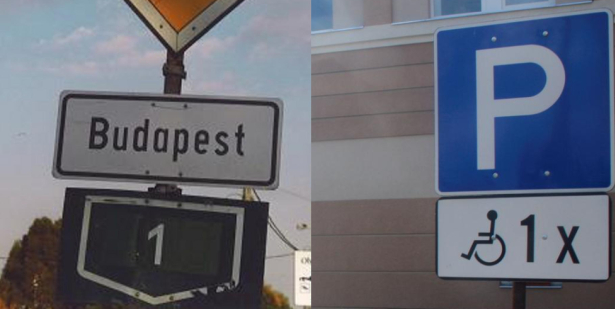
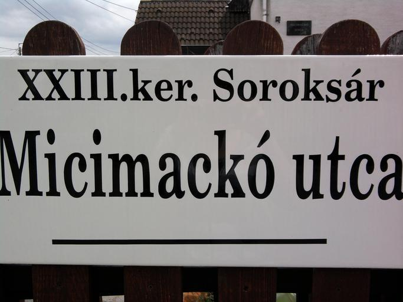
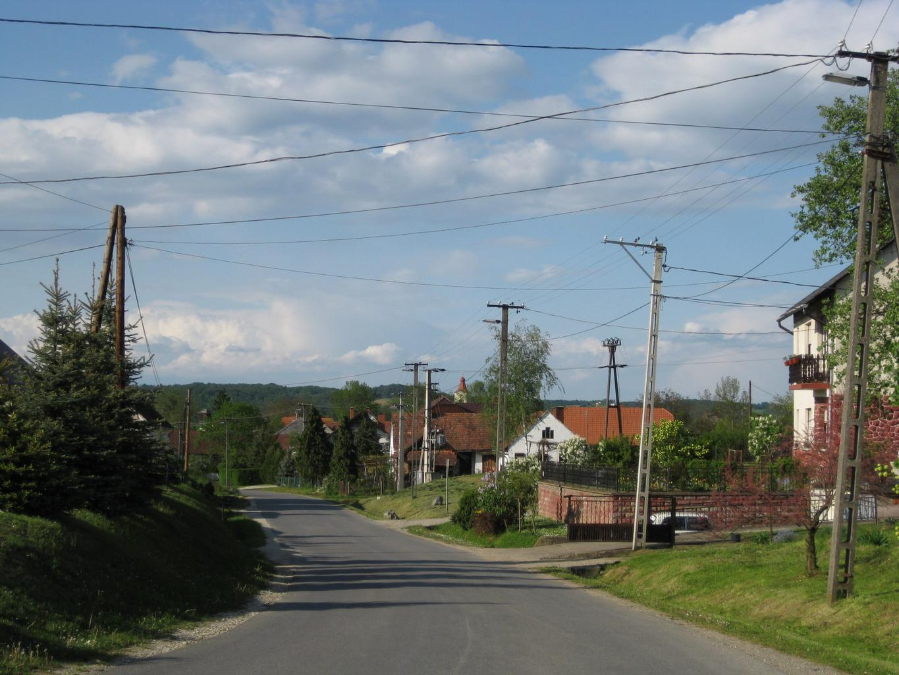
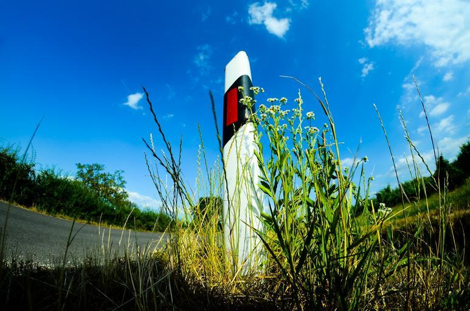
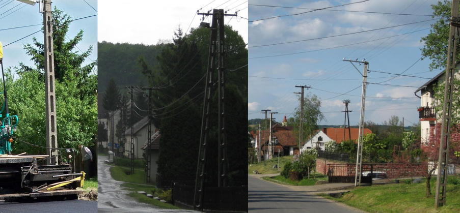
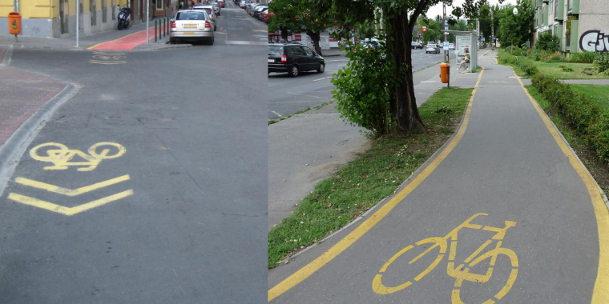

    <h2 class="section-title">{}</h2>
    <ul class="rule-list">
        <li>ドメインは.hu</li>
        <li>ハンガリー語を使いキリル文字は使用しない{{% ref "https://ja.wikipedia.org/wiki/%E3%83%8F%E3%83%B3%E3%82%AC%E3%83%AA%E3%83%BC%E8%AA%9E" "ハンガリー語" %}}</li>
        <li>標識は４つのネジで留められていることが多い{}</li>
        <li>ダブルアキュートを使う文字が含まれるのはハンガリー語（ű・ő）とロシアのチュヴァシュ語（ӳ）{{% by "https://ja.wikipedia.org/wiki/%E3%83%80%E3%83%96%E3%83%AB%E3%82%A2%E3%82%AD%E3%83%A5%E3%83%BC%E3%83%88" "wiki" "ダブルアキュート" %}}</li>
        <li>Utcaはハンガリー語でstreetの意味{}</li>
        <li>ハンガリーの横断歩道の中の人はベルトを付けている</li>
        <li>平坦な国で山がほとんど無い</li>
    </ul>
    {}

{}
{}

{}
標識は４つのネジで留められていることが多い{}{}。標識の前からネジがハッキリ見えることがわかる。他の国でもネジが見えることはあるので、周りの雰囲気も合わせてハンガリーかどうか判断する。
{}

{}
ű・őのような点を斜めにふたつ付けたもの（ダブルアキュート）はハンガリーの特徴{}。斜めの点がふたつついていたらハンガリーと覚えておく。また緑色の独特な形の道路番号がある。
{}

By Anomália - Self-photographed, <a href="https://creativecommons.org/licenses/by-sa/4.0" title="Creative Commons Attribution-Share Alike 4.0">CC BY-SA 4.0</a>, <a href="https://commons.wikimedia.org/w/index.php?curid=17464575">Link</a>

{}
Utcaはハンガリー語でstreetの意味。また『´』が付いた文字は隣接する{}語では使用せず{}・{}・{}でも正書法上は使用されない{{% ref "https://ja.wikipedia.org/wiki/%E3%82%A2%E3%82%AD%E3%83%A5%E3%83%BC%E3%83%88%E3%83%BB%E3%82%A2%E3%82%AF%E3%82%BB%E3%83%B3%E3%83%88" "アクサンテギュ" %}}。
{}

{}
ハンガリーの横断歩道の中の人はベルトを付けている。左からクロアチア・ハンガリー・ラトビア{}。足の形が「ハ」ならハンガリーで、「く」ならクロアチア（強引）。
{}

{}
郊外は明るい色のコンクリート壁・赤茶色の瓦屋根・平屋の家が多い。また、古い家の中にはHungarian Cubesと呼ばれている特徴的な塗装の家があるらしい{}{}。
{}

{}
ハンガリーや{}にありそうなボラード。
{}

{}
{}
{}
ハンガリーっぽい電柱。
{}

{}
{}

<iframe src="https://www.google.com/maps/embed?pb=!4v1682250665332!6m8!1m7!1shUF-N7g2fWOkI2VWUYroKg!2m2!1d46.00918856548847!2d18.21112981205877!3f213.46592080762417!4f-15.275643775147572!5f3.325193203789971" width="295" height="295" style="border:0;" allowfullscreen="" loading="lazy" referrerpolicy="no-referrer-when-downgrade"></iframe>
<iframe src="https://www.google.com/maps/embed?pb=!4v1682250691940!6m8!1m7!1sFjqPVzeRTe7QU8CJNULeuA!2m2!1d46.00959533689232!2d18.2114822354293!3f341.89808076402284!4f-21.776482310074897!5f3.304918830400852" width="295" height="295" style="border:0;" allowfullscreen="" loading="lazy" referrerpolicy="no-referrer-when-downgrade"></iframe>

{}
{}

{}
{}

    <h2 class="section-title">{}</h2>
    <ul class="rule-list">
        <li>南東は平坦な平野が広がっているが、北には最大で標高1000m近い山がある</li>
    </ul>

{}
{}

By <a href="//commons.wikimedia.org/wiki/User:Ikonact" title="User:Ikonact">Ikonact</a> - Own workSources of data:Topography: NASA SRTM3 v2;Urbanised areas: Natural Earth;Other data: © OpenStreetMap contributorsTool:The map is created with Octave scripts developed by <a href="//commons.wikimedia.org/wiki/User:Ikonact" title="User:Ikonact">Ikonact</a>, <a href="https://creativecommons.org/licenses/by-sa/4.0" title="Creative Commons Attribution-Share Alike 4.0">CC BY-SA 4.0</a>, <a href="https://commons.wikimedia.org/w/index.php?curid=64483500">Link</a>

{}
{}