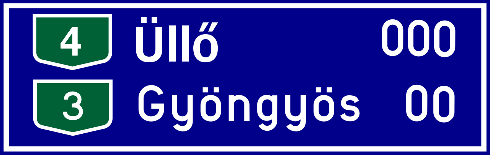

    <h2 class="section-title">{}</h2>
    <ul class="rule-list">
        <li>ドメインは.hu</li>
        <li>標識は４つのネジで留められていることが多い{}</li>
        <li>ダブルアキュートを使う文字が含まれるのはハンガリー語（ű・ő）とロシアのチュヴァシュ語（ӳ）{{% by "https://ja.wikipedia.org/wiki/%E3%83%80%E3%83%96%E3%83%AB%E3%82%A2%E3%82%AD%E3%83%A5%E3%83%BC%E3%83%88" "wiki" "ダブルアキュート" %}}</li>
        <li>Utcaはハンガリー語でstreetの意味、看板によくある{}</li>
        <li>平坦な国で山がほとんど無い</li>
    </ul>
    {}

{}
{}

{}
標識は４つのネジで留められていることが多い{}。他の国と違い標識の前からネジがハッキリ見えることがわかる。また、Utcaはハンガリー語でstreetの意味。
{}

{}
ű・őのような点を斜めにふたつ付けたもの（ダブルアキュート）はハンガリーの特徴。
{}

{}
{}
{}
ハンガリーっぽい電柱。
{}

<iframe src="https://www.google.com/maps/embed?pb=!4v1687035524432!6m8!1m7!1sSXAh9cKg2YVhk7Ej1CZqbg!2m2!1d46.62878782208853!2d20.49102787512574!3f191.53646895915023!4f18.202057858923425!5f3.325193203789971" width="295" height="295" style="border:0;" allowfullscreen="" loading="lazy" referrerpolicy="no-referrer-when-downgrade"></iframe>

{}
{}

<iframe src="https://www.google.com/maps/embed?pb=!4v1682250665332!6m8!1m7!1shUF-N7g2fWOkI2VWUYroKg!2m2!1d46.00918856548847!2d18.21112981205877!3f213.46592080762417!4f-15.275643775147572!5f3.325193203789971" width="295" height="295" style="border:0;" allowfullscreen="" loading="lazy" referrerpolicy="no-referrer-when-downgrade"></iframe>
<iframe src="https://www.google.com/maps/embed?pb=!4v1682250691940!6m8!1m7!1sFjqPVzeRTe7QU8CJNULeuA!2m2!1d46.00959533689232!2d18.2114822354293!3f341.89808076402284!4f-21.776482310074897!5f3.304918830400852" width="295" height="295" style="border:0;" allowfullscreen="" loading="lazy" referrerpolicy="no-referrer-when-downgrade"></iframe>

{}
{}