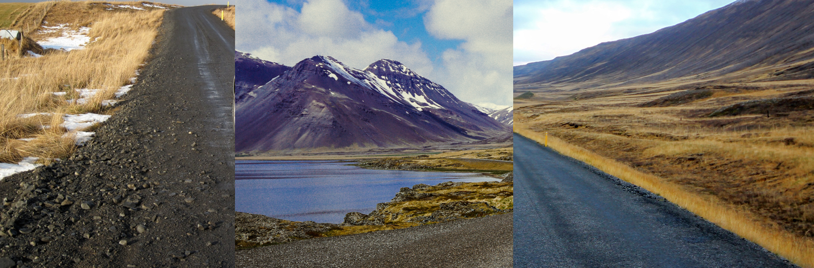
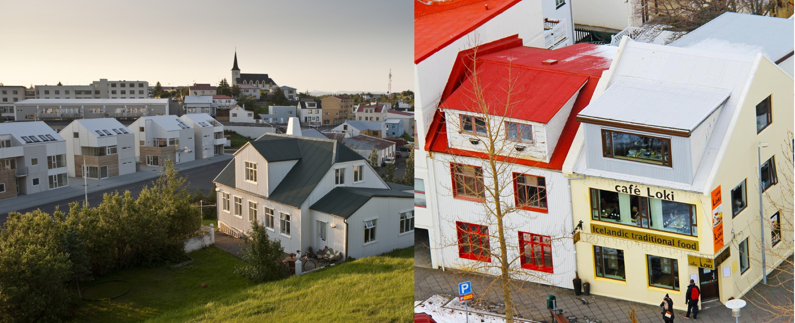

    <h2 class="section-title">{}</h2>
    <ul class="rule-list">
        <li>ドメインは.is</li>
        <li>黄色のボラードがある{}</li>
        <li>耕作可能な土地は1％しかなく全体的に土が黒い</li>
        <li>自然状態の植物はコケと針状の草のみ{}</li>
        <li>溶岩によって作成された地形であり不規則に川や湿地がある</li>
        <li>「ð」の文字はフェロー諸島とアイスランドでのみ使用される</li>
        <li>ナンバープレートの左側に青のラインが<b>無い</b>ので注意</li>
        <li class="no-no-evidence">北欧にある木製のロッジのような家は存在せず窓が大きい</li>
    </ul>
    {}

{}
{}
{}
溶岩によって作成された地形であり土が黒く針状の草が自生する{}。その性質上、不規則に川や湿地があり、川岸がまっすぐな川はほぼ存在しない。同じく火山由来の地形である{}・{}・{}なども土が黒っぽいことが多い。
{}

{}
黄色のボラードがある{}
{}

{}
寒いアイスランドでは部屋の温度を下げないように日光を取り入れる窓がたくさんがあるように見える{}。また、北欧と異なり木が生えない環境なので木製の壁や屋根はほとんどないように見える{}。
{}

{}
ナンバープレートは白色なので注意{}。
{}

{}

CC0
{}

{}
横断歩道の標識が黄色い。ただ都心部以外はあまり見つからないかも。
{}

{}
{}

<iframe src="https://www.google.com/maps/embed?pb=!4v1681046931645!6m8!1m7!1sh2wQaymPMFFX85UI1Ob6TQ!2m2!1d64.47604090738368!2d-14.49618073734571!3f158.88383826148194!4f-3.0972084823761037!5f3.325193203789971" width="295" height="295" style="border:0;" allowfullscreen="" loading="lazy" referrerpolicy="no-referrer-when-downgrade"></iframe>

{}
{}
