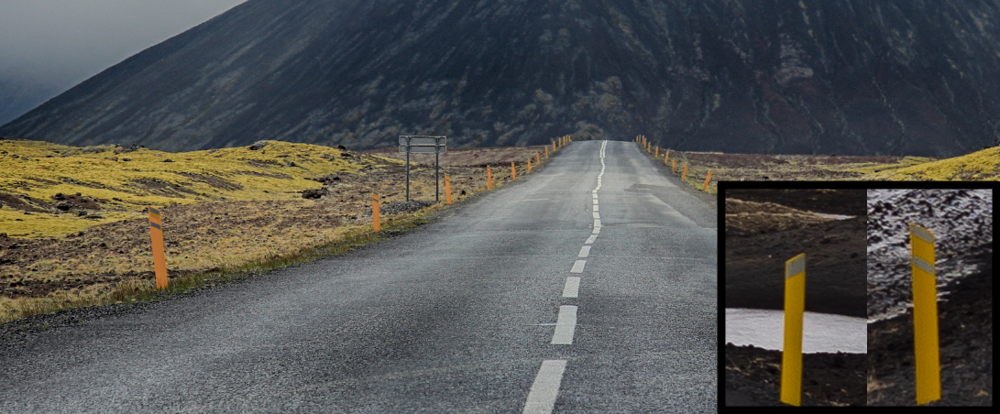

    <h2 class="section-title">{}</h2>
    <ul class="rule-list">
        <li>ドメインは.is</li>
        <li>黄色のボラードがある{}</li>
        <li>耕作可能な土地は1％しかなく全体的に土が黒い</li>
        <li>自然状態の植物はコケと針状の草のみ{}</li>
        <li>溶岩によって作成された地形であり不規則に川や湿地がある</li>
        <li>「ð」の文字はフェロー諸島とアイスランドでのみ使用される</li>
        <li>ナンバープレートの左側に青のラインが無いので注意</li>
    </ul>
    {}

{}
{}
{}
溶岩によって作成された地形であり土が黒く針状の草のみが自生する。不規則に川や湿地がある。川岸がまっすぐな川はほぼ無い。
{}

{}
黄色のボラードがある
{}

{}
横断歩道の標識が黄色い。ただ都心部以外はあまり見つからないかも。
{}

{}
{}

<iframe src="https://www.google.com/maps/embed?pb=!4v1681046931645!6m8!1m7!1sh2wQaymPMFFX85UI1Ob6TQ!2m2!1d64.47604090738368!2d-14.49618073734571!3f158.88383826148194!4f-3.0972084823761037!5f3.325193203789971" width="295" height="295" style="border:0;" allowfullscreen="" loading="lazy" referrerpolicy="no-referrer-when-downgrade"></iframe>

{}
{}
