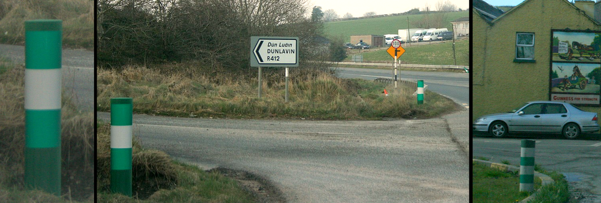
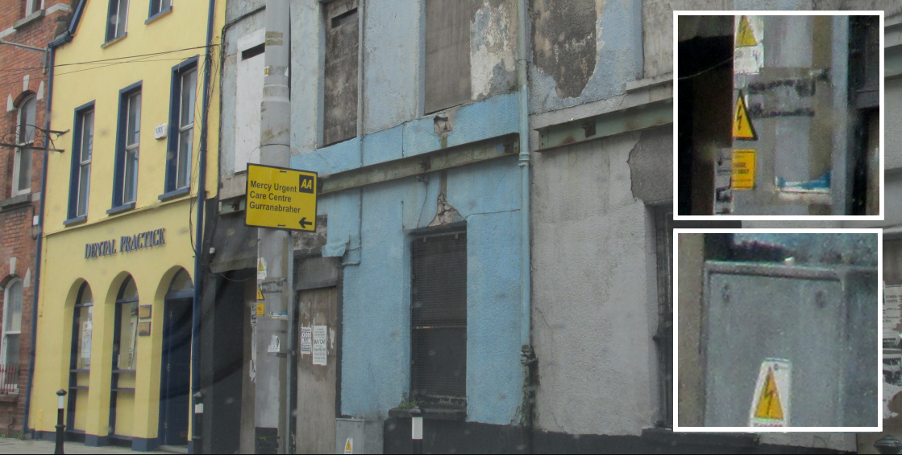
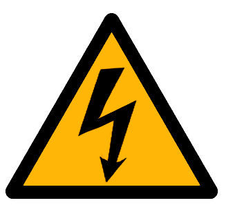
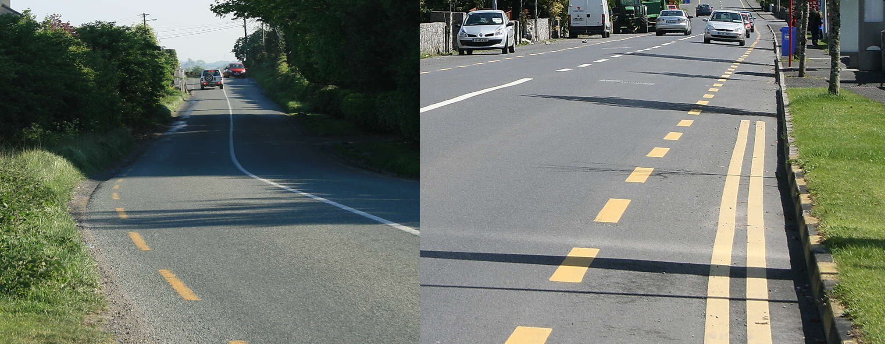
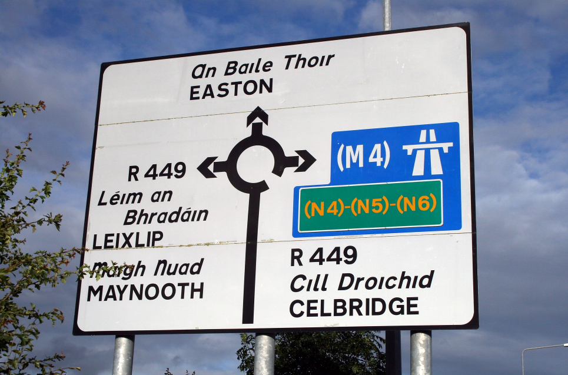
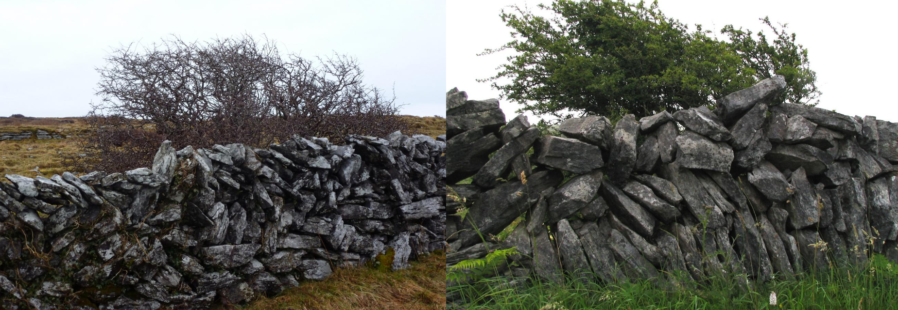

    <h2 class="section-title">{}</h2>
    <ul class="rule-list">
        <li>緑色のボラードがある{}</li>
        <li>ドメインは.ie</li>
        <li>左側通行</li>
        <li>緑色のポスト</li>
        <li>イギリスと比較して全体的に建物が白い</li>
        <li class="no-evidence">⚠️の中に人がいない上、イギリスと比べて街中にたくさん⚠️がある</li>
    </ul>
    {}

{}
{}
{}
緑色のボラードがある{}{}
{}

{}
緑色のポストがある。中国やエジプトも同じ色。形はいろいろバリエーションがある。
{}

{}
アイルランドはイギリスと比較してこの⚠️が道端などでも良く見られる気がする{}。⚠️の中に人が描かれていたらイギリスかも、人がいないならアイルランド。図は自作なので厳密ではないです。
{}

{}
イギリスかどうか分からないとき黄色の点線があるならアイルランド{}{}。停止線が黄色ならば{}の可能性が高い。
{}

{}
道路番号の頭文字がR・N・M。イギリスはB・A・M。
{}

{}
{}

    <h2 class="section-title">{}</h2>
    <ul class="rule-list">
        <li class="no-evidence">石がたくさんある地域ではDry stone{}を使って作られた石壁が多い。たとえば西の方のBurren周辺など{}。</li>
    </ul>

{}
{}

{}
{}

    <h2 class="section-title">{}</h2>
    <ul class="rule-list">
        <li class="no-evidence">石油の備蓄タンクやコンテナターミナルが見えたならDublinに行ってみる{}</li>
    </ul>

{}
{}

{}
一般にこういうものが見えたらその国で一番重要な港がありそうな場所に行っていいと思う。
ウルグアイ→モンテビデオ{}、アイスランド→レイキャビク{}、マルタ→一番南の港{}など。
{}

<iframe src="https://www.google.com/maps/embed?pb=!4v1691131476876!6m8!1m7!1sZxa0KRI4JRiRb8Ey9EAOGw!2m2!1d53.35200880179976!2d-6.214987220605945!3f191.397382832162!4f3.0574230638863895!5f0.7820865974627469" width="95%" height="300" style="border:0;" allowfullscreen="" loading="lazy" referrerpolicy="no-referrer-when-downgrade"></iframe>

{}
{}