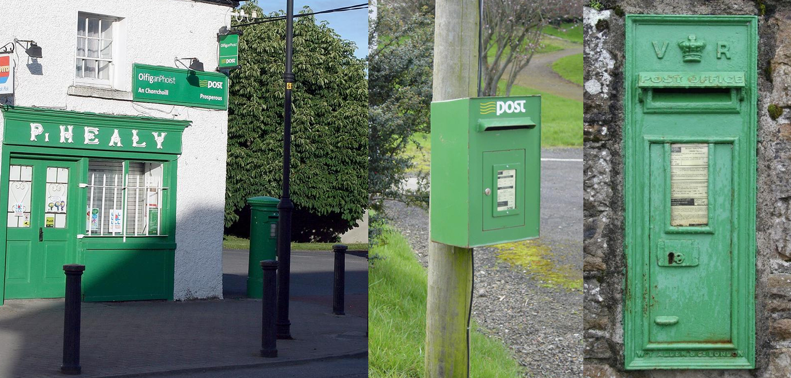
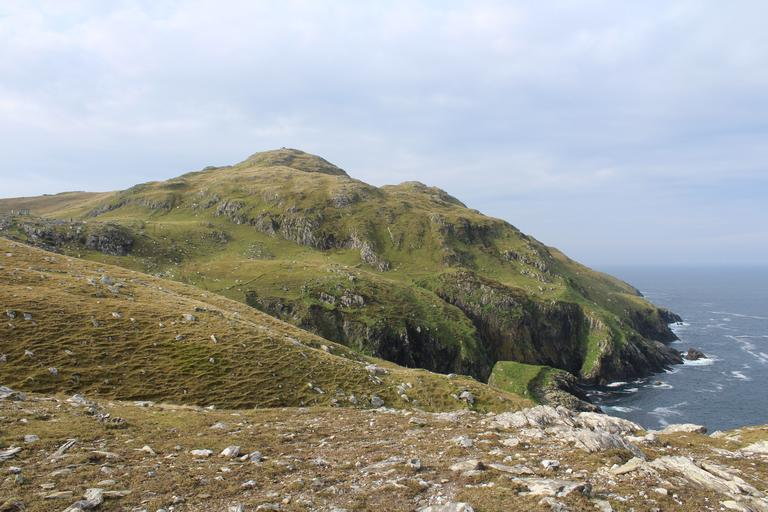
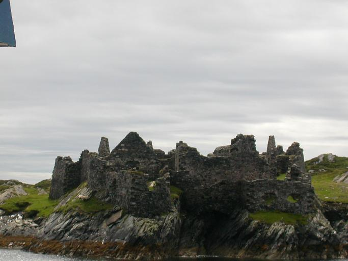

    <h2 class="section-title">{}</h2>
    <ul class="rule-list">
        <li>緑色のボラードがある{}</li>
        <li>ドメインは.ie</li>
        <li>左側通行</li>
        <li>緑色のポスト</li>
        <li>イギリスと比較して全体的に建物が白い</li>
        <li class="no-evidence">⚠️の中に人がいない上、イギリスと比べて街中にたくさん⚠️がある</li>
    </ul>
    {}
    {}

{}
{}
{}
緑色のボラードがある{}{}
{}

{}
緑色のポストがある。{}や{}も同じ色だがこれらの国は施設内以外にストリートビューが無い上に景観も大きく異なるはず。形はいろいろバリエーションがある。
{}

{}
アイルランドはイギリスと比較してこの⚠️が道端などでも良く見られる気がする{}。⚠️の中に人が描かれていたらイギリスかも、人がいないならアイルランド。図は自作なので厳密ではないです。
{}

{}
イギリスかどうか分からないとき黄色の点線があるならアイルランド{}{}。停止線が黄色ならば{}の可能性が高い。
{}

{}
道路番号の頭文字がR・N・M。イギリスはB・A・M。
{}

{}
{}

    <h2 class="section-title">{}</h2>
    <ul class="rule-list">
        <li class="no-evidence">石がたくさんある地域ではDry stone{}を使って作られた石壁が多い。たとえば西の方のBurren周辺{}や西の海側{}。</li>
    </ul>

{}
{}

{}
{}

    <h2 class="section-title">{}</h2>
    <ul class="rule-list">
        <li>Inishturkという離島では赤い何かが見える{}</li>
        <li>Inishbofinはリュックのようなものが見える{}{}</li>
        <li class="no-evidence">石油の備蓄タンクやコンテナターミナルが見えたならDublinに行ってみる{}</li>
    </ul>

{}
{}

{}
赤い何かが見える{}。人口50人前後の島。
{}

{}
{}

{}
<a href="https://www.inishbofin.com/">島の公式ホームページ</a>から分かるように観光がメインの産業。リュックのようなものが見える{}。
{}

{}
{}

{}
一般にこういうものが見えたらその国で一番重要な港がありそうな場所に行っていいと思う。
ウルグアイ→モンテビデオ{}、アイスランド→レイキャビク{}、マルタ→一番南の港{}など。
{}

<iframe src="https://www.google.com/maps/embed?pb=!4v1691131476876!6m8!1m7!1sZxa0KRI4JRiRb8Ey9EAOGw!2m2!1d53.35200880179976!2d-6.214987220605945!3f191.397382832162!4f3.0574230638863895!5f0.7820865974627469" width="95%" height="300" style="border:0;" allowfullscreen="" loading="lazy" referrerpolicy="no-referrer-when-downgrade"></iframe>

{}
{}

    <h4 class="mb-4">代表的な企業の説明</h4>
    <table class="table table-striped table-bordered">
        <thead class="table-light">
            <tr>
                <th scope="col" class="col-width-2">企業名</th>
                <th scope="col" class="col-width-1">コード</th>
                <th scope="col" class="col-width-7">説明</th>
                <th scope="col" class="col-width-05">決算</th>
                <th scope="col" class="col-width-05">配当履歴</th>
            </tr>
        </thead>
        <tbody class="corp-desc">
            <tr>
                <td>Johnson Controls</td>
                <td>{}</td>
                <td>空調機・エアコン大手。北米ではTrane Technologies、{}のダイキンに続く3~
                4位のシェアを持つ。</td>
                <td>{}</td>
                <td>{}</td>
            </tr>
            <tr>
                <td>アクセンチュア</td>
                <td>{}</td>
                <td>コンサルティングでは世界最大級。日本ではIT戦略立案・システム開発の提案・提供に強みがあるイメージがありシステム開発の一部を同社内開発チームがすることもできる。</td>
                <td>{}</td>
                <td>{}</td>
            </tr>
        </tbody>
    </table>

