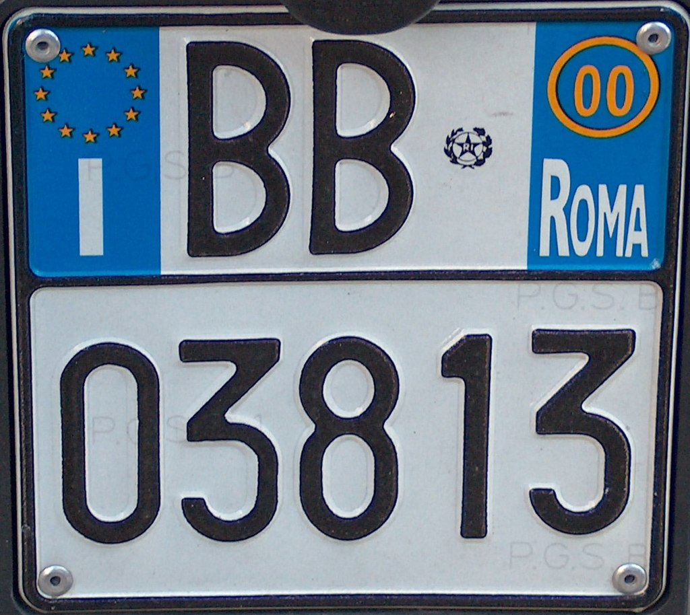

    <h2 class="section-title">見分け方</h2>
    <ul class="rule-list">
        <li>ドメインは.it</li>
        <li>ナンバープレートは両サイドに青色、これはイタリア・フランス・アルバニアなど</li>
        <li>赤い瓦のような屋根の家が多い{}</li>
    </ul>

{}
{}
{}
ナンバープレートは両サイドに青色、これはイタリアとアルバニアの。アルバニアは画像を見れば直ぐにわかるので、車があればイタリアがすぐにわかるはず。
{}
{}

Willtron, CC 表示-継承 3.0, https://commons.wikimedia.org/w/index.php?curid=4619704による
{}
{}

TheFlyingDutchman, CC 表示-継承 3.0, https://commons.wikimedia.org/w/index.php?curid=7116148による
{}
{}
{}

<iframe src="https://www.google.com/maps/embed?pb=!4v1679812903211!6m8!1m7!1sSMFir_M8O0qVU05WO53LqQ!2m2!1d40.79241710237211!2d16.75499111660603!3f172.19635803893811!4f-18.88659177147491!5f3.325193203789971" width="295" height="295" style="border:0;" allowfullscreen="" loading="lazy" referrerpolicy="no-referrer-when-downgrade"></iframe>

{}
{}

<iframe src="https://www.google.com/maps/embed?pb=!4v1679951036760!6m8!1m7!1sIEUWD5fYba2gczGTnEEFDw!2m2!1d43.16686727372661!2d12.77751759439546!3f352.6375152704196!4f-18.646676625627762!5f3.1902177612185434" width="295" height="295" style="border:0;" allowfullscreen="" loading="lazy" referrerpolicy="no-referrer-when-downgrade"></iframe>
<iframe src="https://www.google.com/maps/embed?pb=!4v1679951074620!6m8!1m7!1sraBOZFgfxQ5JLemLVU0ESg!2m2!1d43.16705853048431!2d12.77781161988071!3f248.2504232080267!4f-0.7558497052979902!5f3.325193203789971" width="295" height="295" style="border:0;" allowfullscreen="" loading="lazy" referrerpolicy="no-referrer-when-downgrade"></iframe>

{}
{}

<iframe src="https://www.google.com/maps/embed?pb=!4v1679950794453!6m8!1m7!1shiXAjht1julMhueQUwH3ww!2m2!1d44.32128083606679!2d3.596610744676261!3f85.21357402837904!4f21.072327369524842!5f3.325193203789971" width="295" height="295" style="border:0;" allowfullscreen="" loading="lazy" referrerpolicy="no-referrer-when-downgrade"></iframe>
<iframe src="https://www.google.com/maps/embed?pb=!4v1681485811397!6m8!1m7!1s0VzIixNAaRRXxFPg16EV6g!2m2!1d44.66233315758485!2d7.423223860663709!3f168.62142812554478!4f13.838600860090068!5f3.325193203789971" width="295" height="295" style="border:0;" allowfullscreen="" loading="lazy" referrerpolicy="no-referrer-when-downgrade"></iframe>

{}
{}

<iframe src="https://www.google.com/maps/embed?pb=!4v1679675424757!6m8!1m7!1sYPJLTYBc1h1hufIIVdyozQ!2m2!1d44.69938287322245!2d8.948909405395149!3f8.997668547664777!4f-14.101818837900879!5f3.325193203789971" width="295" height="295" style="border:0;" allowfullscreen="" loading="lazy" referrerpolicy="no-referrer-when-downgrade"></iframe>
<iframe src="https://www.google.com/maps/embed?pb=!4v1679677396103!6m8!1m7!1s49jdsi_z0BbIXHlL2ELTzQ!2m2!1d42.38323591985135!2d11.95323039171786!3f146.20036850013696!4f-12.743769259753023!5f3.324813682596279" width="295" height="295" style="border:0;" allowfullscreen="" loading="lazy" referrerpolicy="no-referrer-when-downgrade"></iframe>
<iframe src="https://www.google.com/maps/embed?pb=!4v1679951214123!6m8!1m7!1sh4bnyY0C7b0-y-Xnh7D97Q!2m2!1d42.25694648451257!2d12.55546351069515!3f37.63170108939756!4f-14.252198971526994!5f3.325193203789971" width="295" height="295" style="border:0;" allowfullscreen="" loading="lazy" referrerpolicy="no-referrer-when-downgrade"></iframe>
<iframe src="https://www.google.com/maps/embed?pb=!4v1681485893908!6m8!1m7!1sLMhMnYCsE9WSj6Hdg20lww!2m2!1d44.66366533545654!2d7.427181040851108!3f17.420578906513175!4f-20.476249435785093!5f3.325193203789971" width="295" height="295" style="border:0;" allowfullscreen="" loading="lazy" referrerpolicy="no-referrer-when-downgrade"></iframe>
<iframe src="https://www.google.com/maps/embed?pb=!4v1681485924542!6m8!1m7!1ss27mXpqJ7MZh1I0e7GrQ-w!2m2!1d44.66380632122473!2d7.427647402490296!3f27.59290653487331!4f-28.999936472781506!5f3.325193203789971" width="295" height="295" style="border:0;" allowfullscreen="" loading="lazy" referrerpolicy="no-referrer-when-downgrade"></iframe>
<iframe src="https://www.google.com/maps/embed?pb=!4v1681485958478!6m8!1m7!1s_IocCYjic6_W6hsDQpH58A!2m2!1d44.66403017946543!2d7.428443492109739!3f282.61256992869187!4f-22.98695062406398!5f3.325193203789971" width="295" height="295" style="border:0;" allowfullscreen="" loading="lazy" referrerpolicy="no-referrer-when-downgrade"></iframe>

{}
{}
{}
ぶどう畑がおおい
{}

<iframe src="https://www.google.com/maps/embed?pb=!4v1681485704007!6m8!1m7!1sE73J2h_OQM_5UUK4FQWJAQ!2m2!1d44.66060825830753!2d7.418788806567348!3f307.9065571439209!4f-6.184000050369335!5f1.5811581702377921" width="295" height="295" style="border:0;" allowfullscreen="" loading="lazy" referrerpolicy="no-referrer-when-downgrade"></iframe>
<iframe src="https://www.google.com/maps/embed?pb=!4v1681485855636!6m8!1m7!1sIavJSDZugUq7eDePvsOIHQ!2m2!1d44.66308090582659!2d7.425792618854587!3f125.57436424812295!4f-4.254959015940301!5f0.7820865974627469" width="295" height="295" style="border:0;" allowfullscreen="" loading="lazy" referrerpolicy="no-referrer-when-downgrade"></iframe>

{}
{}

    <h2 class="section-title">都市・町の見分け方</h2>
    <ul class="rule-list">
    </ul>

{}
{}
{}
船にのって移動するエリアがある
{}

<iframe src="https://www.google.com/maps/embed?pb=!4v1680007607808!6m8!1m7!1sTgiMp5dyfyTyjqWYiFsUKw!2m2!1d45.4353144254022!2d12.33380958037088!3f138.24278233222202!4f13.252121456570137!5f0.4000000000000002" width="295" height="295" style="border:0;" allowfullscreen="" loading="lazy" referrerpolicy="no-referrer-when-downgrade"></iframe>

{}
{}
