

    <h2 class="section-title">{}</h2>
    <ul class="rule-list">
        <li>車は右側通行</li>
        <li>ドメインは.it</li>
        <li>上から見たら黒い▼の形のボラードがある</li>
        <li>ナンバープレートは両サイドに青色</li>
        <li>角張った板に丸い縁取りの線が描かれた標識が多い</li>
        <li>赤い瓦のような屋根の家が多い{}</li>
        <li>ぶどう畑が多く生産量は中国に次いで世界２位</li>
        <li>通り名の看板に「Via」「Vico」と書いてあればイタリア語圏の可能性が高い</li>
        <li>シェブロンは{}と同じく黒背景に白矢印が多い</li>
        <li>標識の裏側が黒色や灰色の時が多い</li>
        <li>イタリアのタバコの販売店には多くの場合「T」と書かれた看板が付いている{}</li>
        <li>Eni S.p.A.の黄色いガソリンスタンドがある</li>
    </ul>
    {}

{}
{}

{}
上が黒い▼の形のボラード{}。{}にも似た形のボラードがある。
{}

<a href="http://creativecommons.org/licenses/by-sa/3.0/" title="Creative Commons Attribution-Share Alike 3.0">CC BY-SA 3.0</a>, <a href="https://commons.wikimedia.org/w/index.php?curid=2046554">Link</a>, 加工あり

{}
ナンバープレートは両サイドに青色がほとんど{}。しかし{}や{}にも両サイド青のナンバーが見つかる点に注意。
{}

{}

Willtron, CC 表示-継承 3.0, <a href="https://commons.wikimedia.org/w/index.php?curid=4619704">Wikimedia Commons</a>による
{}

{}
角張った板に丸い縁取りの線が描かれた標識が多い{}。道路番号の看板も同様{}。
{}


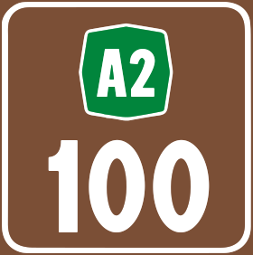


{}
SP・SSなどの道路番号と八角形のAの道路番号{}はイタリア特有。
{}

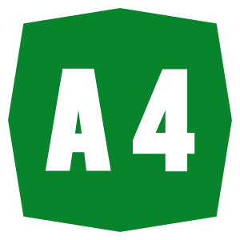
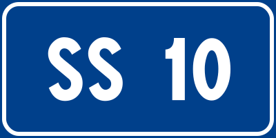

{}
道路番号や標識の看板の裏側は黒色や灰色であることが多い{}。{}も裏側が黒く、イタリアと経済・歴史的に関係がある{}や{}もなぜか看板裏が黒い。{}も黒っぽく見えることが多い。
{}

{}
通り名の看板に「Via」と書いてある{}。白い板に青い線の縁取りがある看板が多く{}、同じ看板は{}でも見られる。
{}

{}
イタリア最大の工業会社のひとつであるEni S.p.A.{}の黄色いガソリンスタンドがある。ロゴが良すぎる。
{}

{}
{}

{}
イタリアのタバコや切手の販売店には多くの場合「T」と書かれた看板が付いている{}。
{}

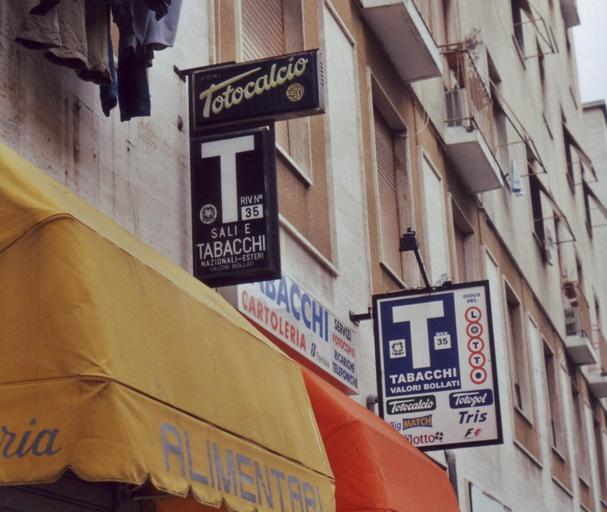

{}
{}
{}
ぶどう畑が多い
{}

<iframe src="https://www.google.com/maps/embed?pb=!4v1681485704007!6m8!1m7!1sE73J2h_OQM_5UUK4FQWJAQ!2m2!1d44.66060825830753!2d7.418788806567348!3f307.9065571439209!4f-6.184000050369335!5f1.5811581702377921" width="295" height="295" style="border:0;" allowfullscreen="" loading="lazy" referrerpolicy="no-referrer-when-downgrade"></iframe>
<iframe src="https://www.google.com/maps/embed?pb=!4v1681485855636!6m8!1m7!1sIavJSDZugUq7eDePvsOIHQ!2m2!1d44.66308090582659!2d7.425792618854587!3f125.57436424812295!4f-4.254959015940301!5f0.7820865974627469" width="295" height="295" style="border:0;" allowfullscreen="" loading="lazy" referrerpolicy="no-referrer-when-downgrade"></iframe>

{}
{}

<iframe src="https://www.google.com/maps/embed?pb=!4v1679675424757!6m8!1m7!1sYPJLTYBc1h1hufIIVdyozQ!2m2!1d44.69938287322245!2d8.948909405395149!3f8.997668547664777!4f-14.101818837900879!5f3.325193203789971" width="295" height="295" style="border:0;" allowfullscreen="" loading="lazy" referrerpolicy="no-referrer-when-downgrade"></iframe>
<iframe src="https://www.google.com/maps/embed?pb=!4v1681485924542!6m8!1m7!1ss27mXpqJ7MZh1I0e7GrQ-w!2m2!1d44.66380632122473!2d7.427647402490296!3f27.59290653487331!4f-28.999936472781506!5f3.325193203789971" width="295" height="295" style="border:0;" allowfullscreen="" loading="lazy" referrerpolicy="no-referrer-when-downgrade"></iframe>
<iframe src="https://www.google.com/maps/embed?pb=!4v1681485958478!6m8!1m7!1s_IocCYjic6_W6hsDQpH58A!2m2!1d44.66403017946543!2d7.428443492109739!3f282.61256992869187!4f-22.98695062406398!5f3.325193203789971" width="295" height="295" style="border:0;" allowfullscreen="" loading="lazy" referrerpolicy="no-referrer-when-downgrade"></iframe>
<iframe src="https://www.google.com/maps/embed?pb=!4v1691345734742!6m8!1m7!1sK51uzMklydBMIYeJoNaQXg!2m2!1d37.98065591249411!2d15.82571521640423!3f292.61542132446385!4f-15.65845492723345!5f1.3807764640608764"width="295" height="295" style="border:0;" allowfullscreen="" loading="lazy" referrerpolicy="no-referrer-when-downgrade"></iframe>

{}
{}

<iframe width="422" height="751" src="https://www.youtube.com/embed/-BFJIAxLhrw" title="ボラード引っこ抜いてみた" frameborder="0" allow="accelerometer; autoplay; clipboard-write; encrypted-media; gyroscope; picture-in-picture; web-share" allowfullscreen></iframe>

{}
{}

    <h2 class="section-title">{}</h2>
    <ul class="rule-list">
        <li>海沿いは日照時間が長くサボテンが生えている
            <ul>
                <li>プーリア地方の海沿い{}</li>
                <li>トスカーナ群島{}</li>
                <li>シチリア島{}</li>
                <li>サルデーニャ島{}</li>
            </ul>
        </li>
        <li>市外局番の先頭の数字でおよその地域が特定できる、北西から南にかけて１～９。</li>
        <li class="no-evidence">{}のような石壁模様の家やスノーポールが多いなら西部の山岳地帯に行ってみる{}</li>
        <li class="no-evidence">田んぼやコーン畑があるなら北部かも{}</li>
    </ul>

{}
{}

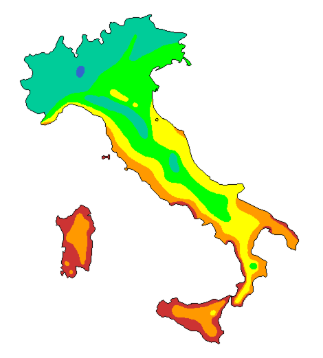

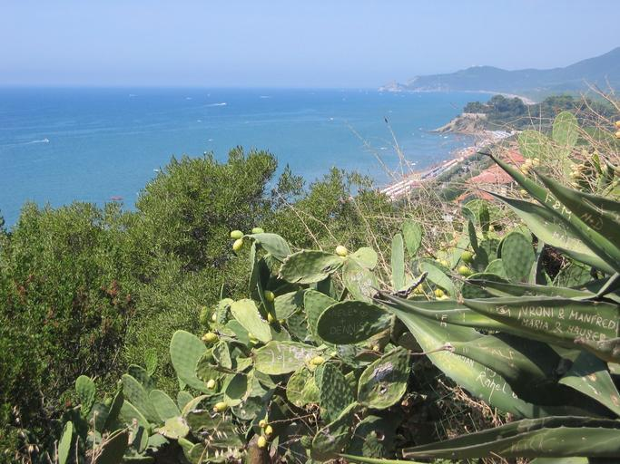

{}
赤に近いほど日照時間が長く暖かそうな地域{}。サボテンが生えていることが多い。
{}

{}
{}

By <a href="https://de.wikipedia.org/wiki/User:Chumwa" class="extiw" title="de:User:Chumwa">Maximilian Dörrbecker</a> (<a href="https://de.wikipedia.org/wiki/User:Chumwa" class="extiw" title="de:User:Chumwa">Chumw</a>) - Own work, <a href="https://creativecommons.org/licenses/by-sa/2.5" title="Creative Commons Attribution-Share Alike 2.5"><a href="https://creativecommons.org/licenses/by-sa/2.5/deed.ja">CC BY-SA 2.5</a></a>, <a href="https://commons.wikimedia.org/w/index.php?curid=77509237">Link</a>

{}
{}
{}
{}のような石壁模様の家が見つかるので国を間違えないように注意{}。
{}

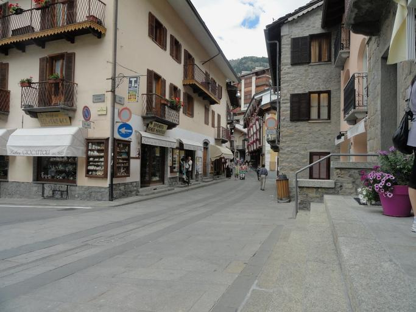

{}
{}

    <ul class="rule-list">
        <li>カラブリア州{}
            <ul>
                <li>稀に雪が積もっていることもある{}</li>
            </ul>
        </li>
        <li>サルデーニャ州{}
            <ul>
                <li>たまにサルデーニャ語とイタリア語の２言語表記の看板がある</li>
                <li>イタリアで唯一アウトストラーダが存在しない州なので緑の八角形のマークは無い</li>
                <li class="no-evidence">サルデーニャ島だけにあるオレンジ色がハッキリと見えるボラードがある{}らしいがよくわからない</li>
            </ul>
        </li>
        <li>シチリア州ではシチリア自治州の州旗を見かけることがある{}</li>
    </ul>

{}
{}
{}
カラブリア州は観光以外の産業が発達しておらず自然も多い{}。若者の失業率が50%近くあり、他の州とは経済的な格差が残っている。古い感じの建物も多い{}{{% ref "https://ja.wikipedia.org/wiki/%E3%82%AB%E3%83%A9%E3%83%96%E3%83%AA%E3%82%A2%E5%B7%9E" "カラブリア州" %}}。</li>
{}

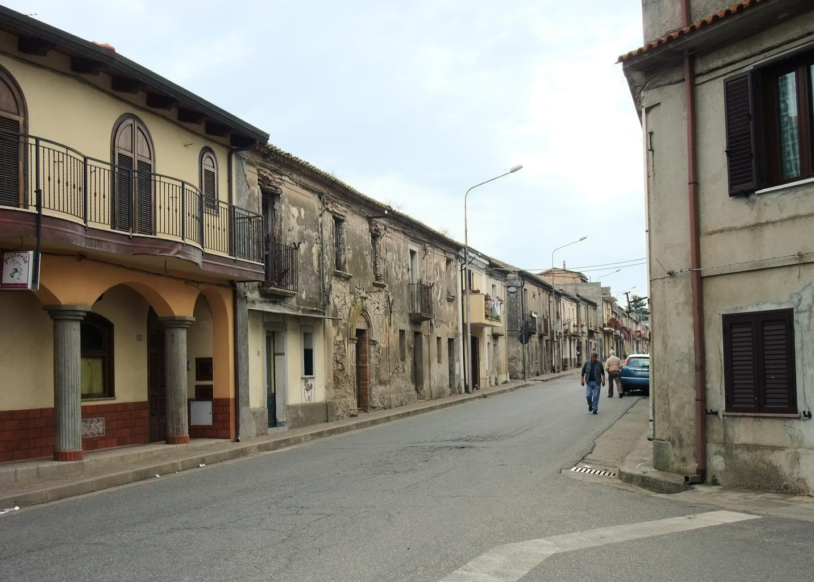</img>

By <a href="//commons.wikimedia.org/w/index.php?title=User:GeorgeOrwell1984&amp;amp;action=edit&amp;amp;redlink=1" class="new" title="User:GeorgeOrwell1984 (page does not exist)">GeorgeOrwell1984</a> - Own work, <a href="https://creativecommons.org/licenses/by-sa/4.0" title="Creative Commons Attribution-Share Alike 4.0">CC BY-SA 4.0</a>, <a href="https://commons.wikimedia.org/w/index.php?curid=90559600">Link</a>

{}
{}

{}
サルデーニャ語との２言語表記の看板が見つかるが頻度は高くない。
{}

{}
アウトストラーダのマークがある場合はサルデーニャ島でない可能性が高い。
{}

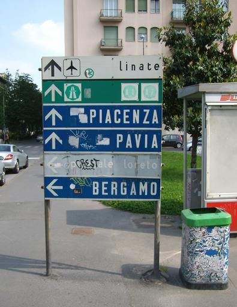

{}
岩肌が見える山やてっぺんのみ木が生えていない山が見られる{}。
{}

By <a href="//commons.wikimedia.org/wiki/User:Discanto" title="User:Discanto">Gianni Careddu</a> - Own work, <a href="https://creativecommons.org/licenses/by-sa/3.0" title="Creative Commons Attribution-Share Alike 3.0">CC BY-SA 3.0</a>, <a href="https://commons.wikimedia.org/w/index.php?curid=35013305">Link</a>

{}
街中ならATMを見ると「Banco di Sardegna」と書いてあることが多い。
{}

{}
サルデーニャ島だけにあるオレンジ色がハッキリと見えるボラードがある{}らしいがまだ自分がどういうものか理解していない。
{}

<iframe src="https://www.google.com/maps/embed?pb=!4v1684782046965!6m8!1m7!1sP4IFKQU5BK6CS_BFMSzkhQ!2m2!1d39.43199430857938!2d9.018000990198715!3f351.49282198311755!4f-27.57935045494488!5f3.325193203789971" width="295" height="295" style="border:0;" allowfullscreen="" loading="lazy" referrerpolicy="no-referrer-when-downgrade"></iframe>

{}
{}

{}
シチリア自治州の州旗を見かけることがある{}
{}

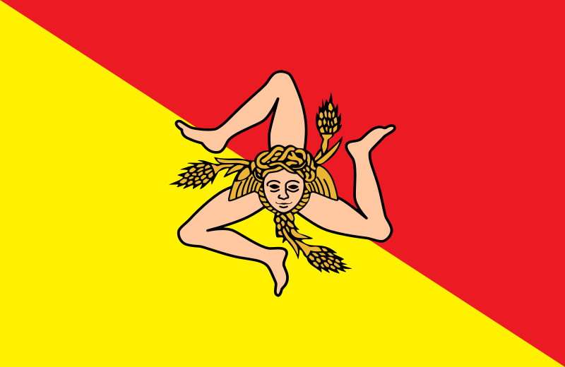

{}
{}

    <h2 class="section-title">{}</h2>
    <ul class="rule-list">
        <li class="no-evidence">Pantelleria島は黒っぽい石の石垣が多い{{% ref "https://ja.wikipedia.org/wiki/%E3%83%91%E3%83%B3%E3%83%86%E3%83%83%E3%83%AC%E3%83%AA%E3%83%BC%E3%82%A2%E5%B3%B6" "パンテッレリーア島" %}}</li>
        <li>Egadi諸島にいる時はサンタカテリーナ城が目印になる{}{}</li>
        <li>Veneziaには船にのって移動するエリアがある</li>
        <li>Lampedusa島は看板やバス停に島名が書いてある{}</li>
        <li>San domino島は石畳の場所が多くフェリーが泊っている{}</li>
        <li>{}に囲まれたイタリアの飛び地であるCampione d'Italia町はカメラが低い</li>
    </ul>

{}
{}
{}
Pantelleria島（Isola di Pantelleria）はサボテンと石垣が多い。トレッカーの場所も多い{}。
{}

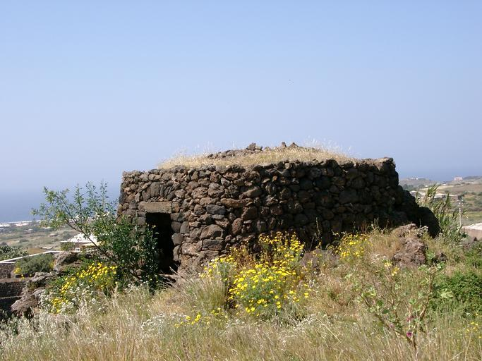

{}
{}
{}
岩でできた山のてっぺんに城が見える。街中で家に視界を遮られないかぎり大体この城が見えるっぽい{}。
{}

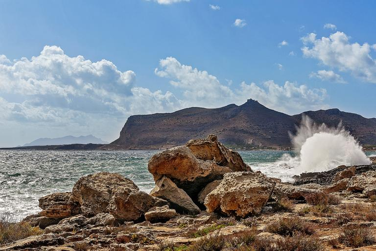

{}
{}
{}
Veneziaには船にのって移動するエリアがある{}
{}

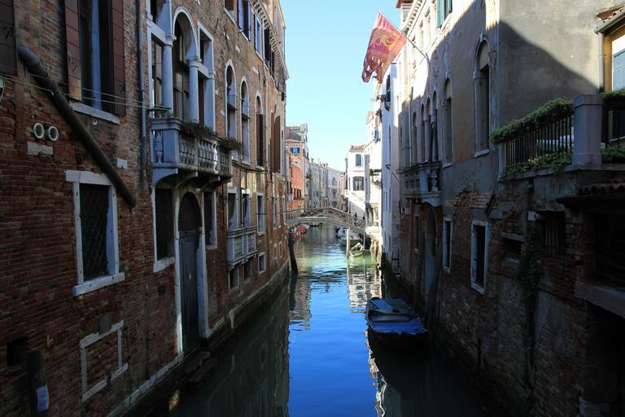

{}
{}
{}
本土からかなり離れた離島{}。バギーが多い{}のは{}や{}のような離島の共通点。初見で当てるのは難しい。
{}

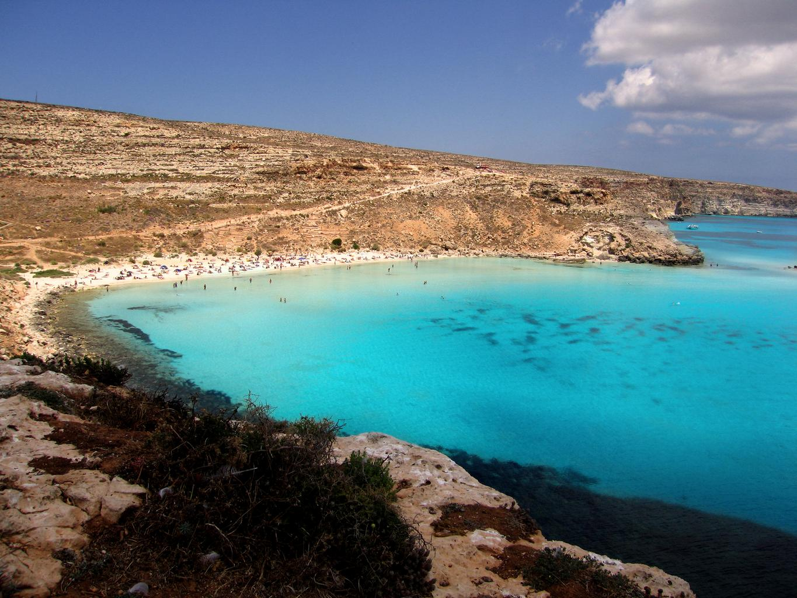

{}
{}
{}
画質が悪く石畳の場所が多い{}。港にはこの写真のフェリーが泊っている{}。
{}

By <a href="//commons.wikimedia.org/wiki/User:GiorgioGaleotti" title="User:GiorgioGaleotti">Giorgio Galeotti</a> - Own work, <a href="https://creativecommons.org/licenses/by/4.0" title="Creative Commons Attribution 4.0">CC BY 4.0</a>, <a href="https://commons.wikimedia.org/w/index.php?curid=51315857">Link</a>

{}
{}
{}
町の通貨はスイス・フランでカメラも低いがナンバーや標識はイタリア。
{}

<iframe src="https://www.google.com/maps/embed?pb=!4v1697113513213!6m8!1m7!1s-GsScTEQUXEt-skbp8aQHA!2m2!1d45.96405788174396!2d8.969423409115834!3f26.386871860734875!4f-13.646092540524307!5f1.4102657176074715" width="600" height="300" style="border:0;" allowfullscreen="" loading="lazy" referrerpolicy="no-referrer-when-downgrade"></iframe>
<iframe src="https://www.google.com/maps/embed?pb=!4v1697113589943!6m8!1m7!1sSRNscs_-sXyeCFmObS79cg!2m2!1d45.97326055783069!2d8.974055455777467!3f315.12637288040565!4f-33.36230251643603!5f0.4000000000000002" width="600" height="300" style="border:0;" allowfullscreen="" loading="lazy" referrerpolicy="no-referrer-when-downgrade"></iframe>

{}
{}
