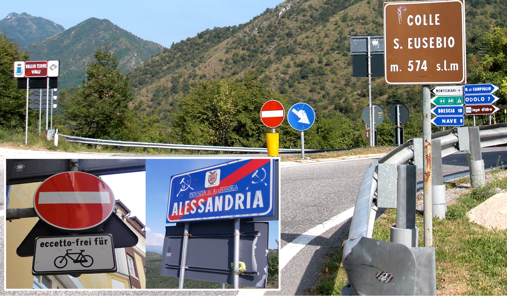

    <h2 class="section-title">{}</h2>
    <ul class="rule-list">
        <li>車は右側通行</li>
        <li>ドメインは.it</li>
        <li>上から見たら黒い▼の形のボラードがある</li>
        <li>ナンバープレートは両サイドに青色でこれはイタリア・フランス・アルバニアなどにある。</li>
        <li>赤い瓦のような屋根の家が多い{}</li>
        <li>ぶどう畑が多く生産量は中国に次いで世界２位。フランスとスペインも生産量が多い。</li>
        <li>通り名の看板に「Via」「Vico」と書いてあればイタリア語圏の可能性が高い</li>
        <li>Eni S.p.A.の黄色いガソリンスタンドがある</li>
        <li>シェブロンは{}と同じく黒背景に白矢印が多い</li>
        <li>標識の裏側が黒色や灰色の時が多い</li>
    </ul>
    {}

{}
{}

{}
上が黒い▼の形のボラード{}。{}にも似た形のボラードが見つかる。
{}

<a href="http://creativecommons.org/licenses/by-sa/3.0/" title="Creative Commons Attribution-Share Alike 3.0">CC BY-SA 3.0</a>, <a href="https://commons.wikimedia.org/w/index.php?curid=2046554">Link</a>, 加工あり

{}
SP・SSなどの道路番号と八角形のAの道路番号{}はイタリア特有。
{}

{}
そして、道路番号や標識の看板の裏側は黒色や灰色であることが多い{}。
{}

{}
ナンバープレートは両サイドに青色がほとんど{}。しかし{}や{}にも両サイド青のナンバーが見つかる点に注意。
{}

{}

Willtron, CC 表示-継承 3.0, <a href="https://commons.wikimedia.org/w/index.php?curid=4619704">Wikimedia Commons</a>による
{}

{}
通り名の看板に「Via」と書いてある{}。白い板に青い線の縁取りがある看板が多く{}、同じ看板は{}でも見られる。
{}

{}
イタリア最大の工業会社のひとつであるEni S.p.A.{}の黄色いガソリンスタンドがある。ロゴが良すぎる。
{}

{}
{}

<iframe src="https://www.google.com/maps/embed?pb=!4v1679950794453!6m8!1m7!1shiXAjht1julMhueQUwH3ww!2m2!1d44.32128083606679!2d3.596610744676261!3f85.21357402837904!4f21.072327369524842!5f3.325193203789971" width="295" height="295" style="border:0;" allowfullscreen="" loading="lazy" referrerpolicy="no-referrer-when-downgrade"></iframe>
<iframe src="https://www.google.com/maps/embed?pb=!4v1681485811397!6m8!1m7!1s0VzIixNAaRRXxFPg16EV6g!2m2!1d44.66233315758485!2d7.423223860663709!3f168.62142812554478!4f13.838600860090068!5f3.325193203789971" width="295" height="295" style="border:0;" allowfullscreen="" loading="lazy" referrerpolicy="no-referrer-when-downgrade"></iframe>

{}
{}

<iframe src="https://www.google.com/maps/embed?pb=!4v1679675424757!6m8!1m7!1sYPJLTYBc1h1hufIIVdyozQ!2m2!1d44.69938287322245!2d8.948909405395149!3f8.997668547664777!4f-14.101818837900879!5f3.325193203789971" width="295" height="295" style="border:0;" allowfullscreen="" loading="lazy" referrerpolicy="no-referrer-when-downgrade"></iframe>
<iframe src="https://www.google.com/maps/embed?pb=!4v1681485924542!6m8!1m7!1ss27mXpqJ7MZh1I0e7GrQ-w!2m2!1d44.66380632122473!2d7.427647402490296!3f27.59290653487331!4f-28.999936472781506!5f3.325193203789971" width="295" height="295" style="border:0;" allowfullscreen="" loading="lazy" referrerpolicy="no-referrer-when-downgrade"></iframe>
<iframe src="https://www.google.com/maps/embed?pb=!4v1681485958478!6m8!1m7!1s_IocCYjic6_W6hsDQpH58A!2m2!1d44.66403017946543!2d7.428443492109739!3f282.61256992869187!4f-22.98695062406398!5f3.325193203789971" width="295" height="295" style="border:0;" allowfullscreen="" loading="lazy" referrerpolicy="no-referrer-when-downgrade"></iframe>
<iframe src="https://www.google.com/maps/embed?pb=!4v1691345734742!6m8!1m7!1sK51uzMklydBMIYeJoNaQXg!2m2!1d37.98065591249411!2d15.82571521640423!3f292.61542132446385!4f-15.65845492723345!5f1.3807764640608764"width="295" height="295" style="border:0;" allowfullscreen="" loading="lazy" referrerpolicy="no-referrer-when-downgrade"></iframe>

{}
{}
{}
ぶどう畑が多い
{}

<iframe src="https://www.google.com/maps/embed?pb=!4v1681485704007!6m8!1m7!1sE73J2h_OQM_5UUK4FQWJAQ!2m2!1d44.66060825830753!2d7.418788806567348!3f307.9065571439209!4f-6.184000050369335!5f1.5811581702377921" width="295" height="295" style="border:0;" allowfullscreen="" loading="lazy" referrerpolicy="no-referrer-when-downgrade"></iframe>
<iframe src="https://www.google.com/maps/embed?pb=!4v1681485855636!6m8!1m7!1sIavJSDZugUq7eDePvsOIHQ!2m2!1d44.66308090582659!2d7.425792618854587!3f125.57436424812295!4f-4.254959015940301!5f0.7820865974627469" width="295" height="295" style="border:0;" allowfullscreen="" loading="lazy" referrerpolicy="no-referrer-when-downgrade"></iframe>

{}
{}

    <h2 class="section-title">{}</h2>
    <ul class="rule-list">
        <li>市外局番の先頭の数字でおよその地域が特定できる、北西から南にかけて１～９。</li>
        <li class="no-evidence">{}のような石壁模様の家やスノーポールが多いなら西部の山岳地帯に行ってみる</li>
        <li class="no-evidence">地中海側はサボテンや石垣が多い{}</li>
        <li class="no-evidence">田んぼやコーン畑があるなら北部かも{}</li>
    </ul>

{}
{}

By <a href="https://de.wikipedia.org/wiki/User:Chumwa" class="extiw" title="de:User:Chumwa">Maximilian Dörrbecker</a> (<a href="https://de.wikipedia.org/wiki/User:Chumwa" class="extiw" title="de:User:Chumwa">Chumw</a>) - Own work, <a href="https://creativecommons.org/licenses/by-sa/2.5" title="Creative Commons Attribution-Share Alike 2.5"><a href="https://creativecommons.org/licenses/by-sa/2.5/deed.ja">CC BY-SA 2.5</a></a>, <a href="https://commons.wikimedia.org/w/index.php?curid=77509237">Link</a>

{}
{}
{}
町によっては石壁模様じゃないところもあり。
{}

<iframe src="https://www.google.com/maps/embed?pb=!4v1691810889121!6m8!1m7!1saHGb6IwLM5Px4lGzXkHcZw!2m2!1d45.78989392770293!2d6.972546145677878!3f231.56342264796746!4f-6.765814239929341!5f0.4000000000000002"width="295" height="295" style="border:0;" allowfullscreen="" loading="lazy" referrerpolicy="no-referrer-when-downgrade"></iframe>
<iframe src="https://www.google.com/maps/embed?pb=!4v1691811174264!6m8!1m7!1s0C_36eJOGZt46UuC6GSD0w!2m2!1d44.04376379129428!2d7.720899640947964!3f271.70588990021815!4f5.818231171632846!5f0.7820865974627469"width="295" height="295" style="border:0;" allowfullscreen="" loading="lazy" referrerpolicy="no-referrer-when-downgrade"></iframe>

{}
{}
{}
オリーブやサボテンなどがあり{}・{}・{}などに似た雰囲気のところもある。
{}

<iframe src="https://www.google.com/maps/embed?pb=!4v1691811399647!6m8!1m7!1sJxcrTpTPlrUU-i8QbgzqJA!2m2!1d43.79185684091036!2d7.561474432794951!3f196.95859422055136!4f0.8004641186715702!5f0.49098104251056895"width="295" height="295" style="border:0;" allowfullscreen="" loading="lazy" referrerpolicy="no-referrer-when-downgrade"></iframe>
<iframe src="https://www.google.com/maps/embed?pb=!4v1691811509870!6m8!1m7!1sdE8k6vUimKSFs5NV3_wTZg!2m2!1d37.92976853603578!2d12.29821741847973!3f1.707977352151886!4f2.864350915826492!5f0.4000000000000002"width="295" height="295" style="border:0;" allowfullscreen="" loading="lazy" referrerpolicy="no-referrer-when-downgrade"></iframe>

{}
{}

    <h2 class="section-title">{}</h2>
    <ul class="rule-list">
        <li class="no-evidence">パンテッレリーア島は黒っぽい石の石垣が多い</li>
        <li class="no-evidence">サルデーニャ島だけにあるオレンジ色がハッキリと見えるボラードがある{}</li>
        <li class="no-evidence">トスカーナ群島は松の木が生えている{{% ref "https://ja.wikipedia.org/wiki/%E3%83%88%E3%82%B9%E3%82%AB%E3%83%BC%E3%83%8A%E7%BE%A4%E5%B3%B6" "トスカーナ群島" %}}。
        <li>Veneziaには船にのって移動するエリアがある</li>
    </ul>

{}
{}
{}
パンテッレリーア島（Isola di Pantelleria）はサボテンと石垣が多い。トレッカーの場所も多い。ストリートビューの例<a href="https://goo.gl/maps/DBMbksyBRYUx1tLKA">①</a>・<a href="https://goo.gl/maps/95SL83VW7JgrG1Pz7">②</a>。
{}

{}
{}
{}
サルデーニャ島だけにあるオレンジ色がハッキリと見えるボラードがある{}らしいがまだ自分がどういうものか理解していない。
{}

<iframe src="https://www.google.com/maps/embed?pb=!4v1684782046965!6m8!1m7!1sP4IFKQU5BK6CS_BFMSzkhQ!2m2!1d39.43199430857938!2d9.018000990198715!3f351.49282198311755!4f-27.57935045494488!5f3.325193203789971" width="295" height="295" style="border:0;" allowfullscreen="" loading="lazy" referrerpolicy="no-referrer-when-downgrade"></iframe>

{}
{}
{}
松の木が生えている{{% ref "https://ja.wikipedia.org/wiki/%E3%83%88%E3%82%B9%E3%82%AB%E3%83%BC%E3%83%8A%E7%BE%A4%E5%B3%B6" "トスカーナ群島" %}}。
{}

<iframe src="https://www.google.com/maps/embed?pb=!4v1692586996308!6m8!1m7!1sZic3oM_JMRIrLc9dwKxzvw!2m2!1d42.79193095479819!2d10.20662480828561!3f10.989831177043527!4f-4.035775962542573!5f0.4000000000000002" width="600" height="350" style="border:0;" allowfullscreen="" loading="lazy" referrerpolicy="no-referrer-when-downgrade"></iframe>

{}
{}
{}
Veneziaには船にのって移動するエリアがある
{}

<iframe src="https://www.google.com/maps/embed?pb=!4v1680007607808!6m8!1m7!1sTgiMp5dyfyTyjqWYiFsUKw!2m2!1d45.4353144254022!2d12.33380958037088!3f138.24278233222202!4f13.252121456570137!5f0.4000000000000002" width="600" height="350" style="border:0;" allowfullscreen="" loading="lazy" referrerpolicy="no-referrer-when-downgrade"></iframe>

{}
{}
