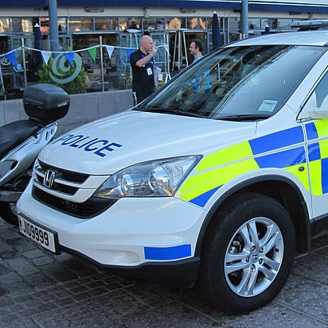
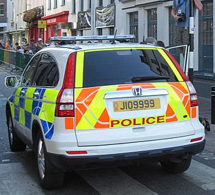
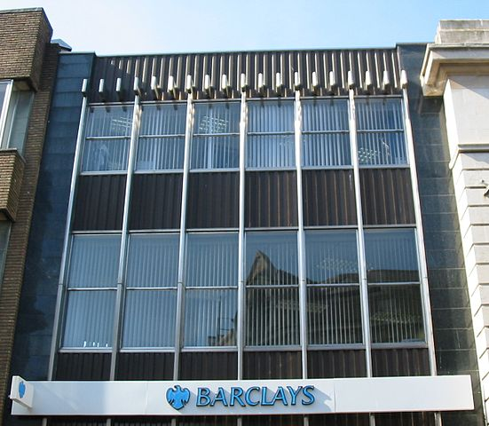

    <h2 class="section-title">{}</h2>
    <ul class="rule-list">
        <li>El dominio del país termina en .je.</li>
        <li>Las matrículas no llevan la franja azul al estilo europeo.{}</li>
        <li>Las líneas del borde de la carretera y las líneas de detención suelen ser amarillas.</li>
        <li>Pese a que no es demasiado urbana, verás muchos edificios de grandes bancos.</li>
        <li>La calidad de Street View suele ser baja (Gen 2).</li>
    </ul>

{}
{}
{}
Las matrículas carecen de la franja azul{}{} y el lateral izquierdo puede verse ligeramente rojizo.
{}

{}

Por Willtron, <a href="https://creativecommons.org/licenses/by-sa/3.0/deed.ja">CC BY-SA 3.0</a>, <a href="hhttps://commons.wikimedia.org/w/index.php?curid=8474147">Wikimedia Commons (enlace)</a>
{}

{}
Las líneas del borde y las líneas de detención suelen ser amarillas.
{}

<iframe src="https://www.google.com/maps/embed?pb=!4v1686245940178!6m8!1m7!1s3qjWE3cE5gBlAQfHGehyig!2m2!1d49.1944431910344!2d-2.113460101491273!3f194.94413311331212!4f-10.838173015884891!5f2.6349741861968248" width="295" height="295" style="border:0;" allowfullscreen="" loading="lazy" referrerpolicy="no-referrer-when-downgrade"></iframe>
<iframe src="https://www.google.com/maps/embed?pb=!4v1686246036272!6m8!1m7!1sbpQs9f1jPi4_Z3fxqyvNjw!2m2!1d49.2269650574782!2d-2.145468534781537!3f238.08837338275168!4f-18.718414304017344!5f1.5357967635633352" width="295" height="295" style="border:0;" allowfullscreen="" loading="lazy" referrerpolicy="no-referrer-when-downgrade"></iframe>

{}
A pesar de su tamaño, la isla alberga numerosos edificios bancarios, como Barclays o el Royal Bank of Canada{}.
{}

{}
Fíjate en los carteles ciclistas con la forma de la isla dibujada en el mapa.
{}

Por <a href="//commons.wikimedia.org/wiki/User:Danrok" title="User:Danrok">Danrok</a> - Obra propia, <a href="https://creativecommons.org/licenses/by-sa/4.0" title="Creative Commons Attribution-Share Alike 4.0">CC BY-SA 4.0</a>, <a href="https://commons.wikimedia.org/w/index.php?curid=90584925">Link</a>

{}
{}
