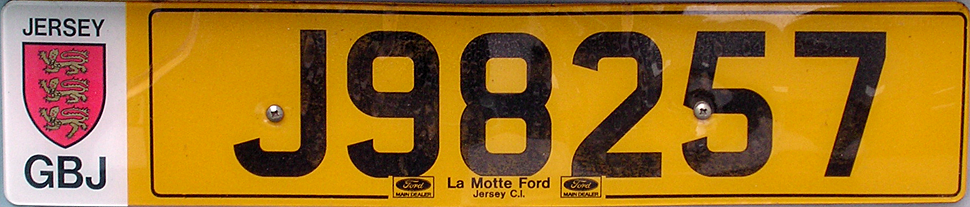

    <h2 class="section-title">{}</h2>
    <ul class="rule-list">
        <li>ドメインは.je</li>
        <li>ナンバープレートについて青色のストライプが無い{}</li>
        <li>路側帯の線が黄色の場所が多く停止線・指導停止線と思われる線も黄色で描かれている</li>
        <li>そこまで都会ではないのに大手銀行の建物がある</li>
        <li>画質が悪い（Gen2）</li>
    </ul>

{}
{}
{}
ナンバープレートについて青色のストライプが無い{}。左側が少し赤みがかって見える。
{}

<iframe src="https://www.google.com/maps/embed?pb=!4v1683431760115!6m8!1m7!1sCAoSLEFGMVFpcE1sU2xxOEJ2ZHlzTXhZLW1CM24zMUlCOGFLX3ViQXNsVTRtT1Jp!2m2!1d49.19024100381638!2d-2.111558188325187!3f10.477115159725365!4f-14.006521160790072!5f1.5382304242767262" width="520" height="300" style="border:0;" allowfullscreen="" loading="lazy" referrerpolicy="no-referrer-when-downgrade"></iframe>

{}

By Willtron, <a href="https://creativecommons.org/licenses/by-sa/3.0/deed.ja">CC BY-SA 3.0</a>, <a href="hhttps://commons.wikimedia.org/w/index.php?curid=8474147">Wikimedia Commons(Link)</a>による
{}

{}
路側帯の線が黄色の場所が多く停止線・指導停止線と思われる線も黄色で描かれている
{}

<iframe src="https://www.google.com/maps/embed?pb=!4v1686245940178!6m8!1m7!1s3qjWE3cE5gBlAQfHGehyig!2m2!1d49.1944431910344!2d-2.113460101491273!3f194.94413311331212!4f-10.838173015884891!5f2.6349741861968248" width="295" height="295" style="border:0;" allowfullscreen="" loading="lazy" referrerpolicy="no-referrer-when-downgrade"></iframe>
<iframe src="https://www.google.com/maps/embed?pb=!4v1686246036272!6m8!1m7!1sbpQs9f1jPi4_Z3fxqyvNjw!2m2!1d49.2269650574782!2d-2.145468534781537!3f238.08837338275168!4f-18.718414304017344!5f1.5357967635633352" width="295" height="295" style="border:0;" allowfullscreen="" loading="lazy" referrerpolicy="no-referrer-when-downgrade"></iframe>

{}
そこまで都会ではないのに銀行の建物がたくさんある。以下はCiti BankとRoyal Bank of Canada{}。
{}

<iframe src="https://www.google.com/maps/embed?pb=!4v1683432426752!6m8!1m7!1sEf09tRvJJ3ERHyPKH8MrwA!2m2!1d49.18500186671962!2d-2.112332031066294!3f17.462404572326715!4f0.12119351323100602!5f3.325193203789971" width="295" height="295" style="border:0;" allowfullscreen="" loading="lazy" referrerpolicy="no-referrer-when-downgrade"></iframe>
<iframe src="https://www.google.com/maps/embed?pb=!4v1683432984340!6m8!1m7!1siDU8G1f4gNa9M4j15wjmaA!2m2!1d49.18436002675839!2d-2.107901829769607!3f268.9482352125647!4f2.8719295601191703!5f3.325193203789971" width="295" height="295" style="border:0;" allowfullscreen="" loading="lazy" referrerpolicy="no-referrer-when-downgrade"></iframe>

{}
島の形に自転車マークが描かれた看板が道端にある。
{}

By <a href="//commons.wikimedia.org/wiki/User:Danrok" title="User:Danrok">Danrok</a> - Own work, <a href="https://creativecommons.org/licenses/by-sa/4.0" title="Creative Commons Attribution-Share Alike 4.0">CC BY-SA 4.0</a>, <a href="https://commons.wikimedia.org/w/index.php?curid=90584925">Link</a>

{}
{}