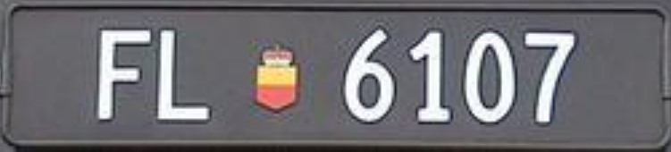
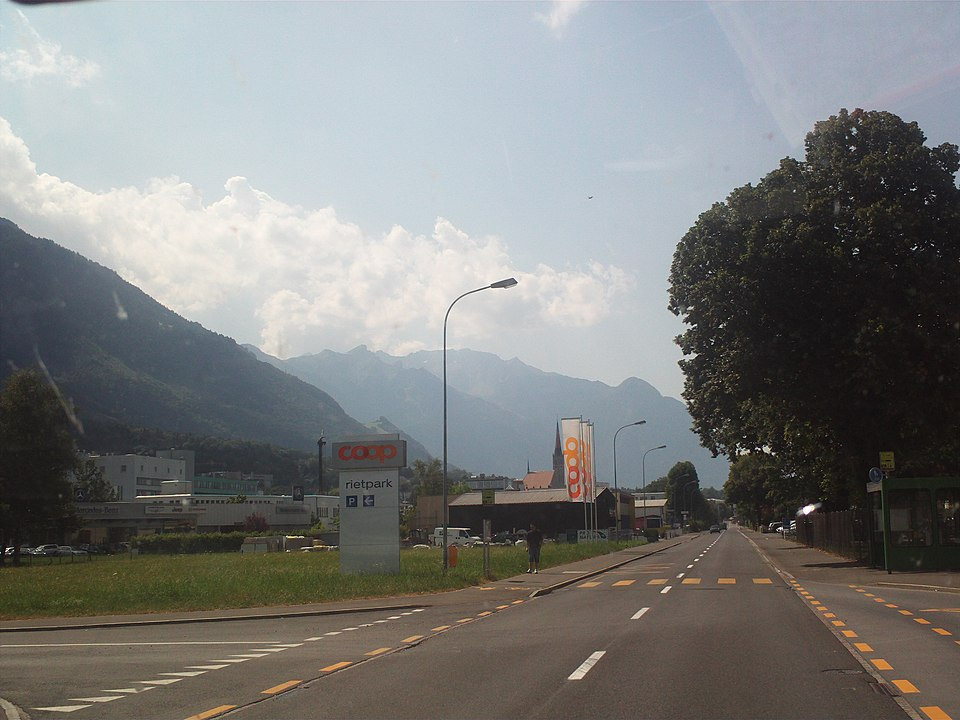

    <h2 class="section-title">{}</h2>
    <ul class="rule-list">
        <li>Domain internetnya .li</li>
        <li>Plat nomor berwarna dasar hitam</li>
        <li>Halte dan bus LIEmobil didominasi warna hijau tua</li>
        <li>Pelat alamat rumah biasanya juga menuliskan nama jalan</li>
    </ul>

{}
{}
{}
Plat Liechtenstein berwarna hitam dengan logo merah di tengahnya{}. Namun banyak pekerja komuter dari negara tetangga, jadi plat asing juga sering muncul{}{{% ref "https://ja.wikipedia.org/wiki/%E3%83%AA%E3%83%92%E3%83%86%E3%83%B3%E3%82%B7%E3%83%A5%E3%82%BF%E3%82%A4%E3%83%B3#%E7%B5%8C%E6%B8%88" "リヒテンシュタイン#経済" %}}.
{}

{}

Domain publik
{}

{}
Jaringan bus LIEmobil berwarna hijau tua mencolok{}, dan halte-halte bus juga menggunakan warna serupa{}{}. Hampir setiap desa punya halte, sering kali ditemani tempat sampah logam berwarna perak{}.
{}

By <a href="//commons.wikimedia.org/wiki/User:Wikiolo" title="User:Wikiolo">Wikiolo</a> - Own work, <a href="https://creativecommons.org/licenses/by-sa/3.0" title="Creative Commons Attribution-Share Alike 3.0">CC BY-SA 3.0</a>, <a href="https://commons.wikimedia.org/w/index.php?curid=79697497">Link</a>

{}
Ciri-cirinya mirip {}: zebra cross berwarna hitam-putih dengan tujuh garis pada rambu penyeberangan{}. Banyak jalan utama juga memiliki jalur sepeda hitam di sisi luar{}.
{}

{}
Bahasa yang digunakan adalah bahasa Jerman; Anda dapat menemukan kata “GENERELL” pada rambu batas kecepatan{}. Meski wilayahnya kecil, puncak tertingginya hampir 2.600 meter, sehingga pegunungan Alpen terlihat dari banyak jalan{}. Di pintu masuk kota, warna bendera keluarga pangeran sering menghiasi papan nama{}.
{}

By <a href="//commons.wikimedia.org/wiki/User:Walser123" class="mw-redirect" title="User:Walser123">Walser123</a> - Own work, <a href="https://creativecommons.org/licenses/by-sa/4.0" title="Creative Commons Attribution-Share Alike 4.0">CC BY-SA 4.0</a>, <a href="https://commons.wikimedia.org/w/index.php?curid=90017181">Link</a>

{}
Pelat alamat biasanya menuliskan nomor rumah di atas nama jalan{}. Di Swiss, sering kali hanya nomor rumah saja. Logo layanan pos Liechtensteinische Post juga bisa ditemukan pada kantor pos setempat{}.
{}

By Rafael P. D. Suppmann, <a href="https://creativecommons.org/licenses/by-sa/3.0" title="Creative Commons Attribution-Share Alike 3.0">CC BY-SA 3.0</a>, <a href="https://commons.wikimedia.org/w/index.php?curid=73511504">Link</a>

{}
Ditemukan juga kotak hijau untuk membuang kotoran anjing{}{}. Kotak ROBIDOG ini juga terkadang terlihat di Swiss dan di wilayah berbahasa Jerman lainnya.
{}

<a href="http://creativecommons.org/publicdomain/zero/1.0/deed.en" title="Creative Commons Zero, Public Domain Dedication">CC0</a>, <a href="https://commons.wikimedia.org/w/index.php?curid=12536500">Link</a>

{}
{}
