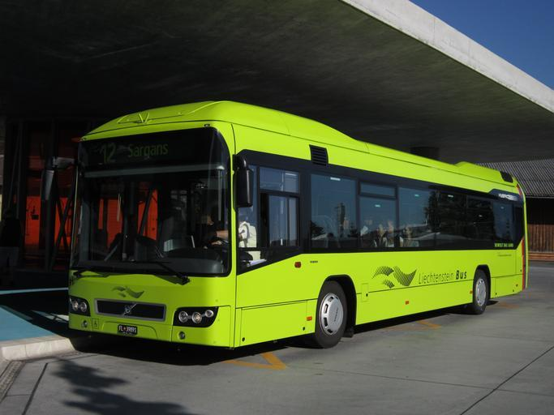
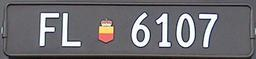
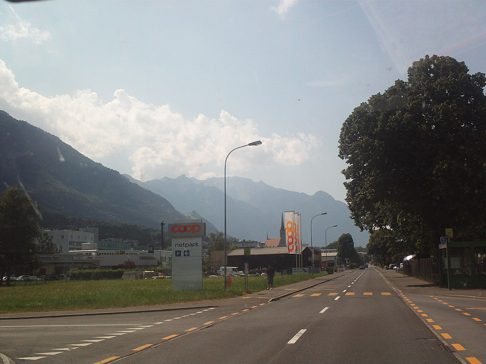
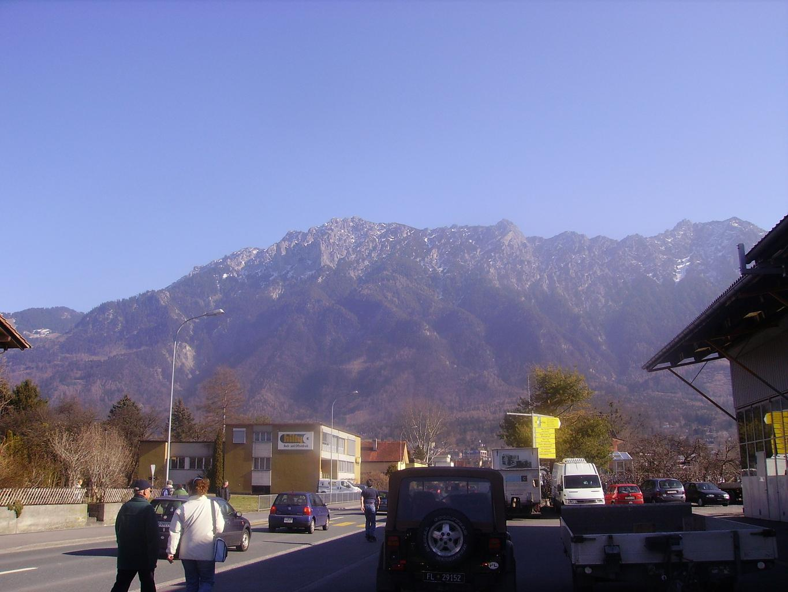

    <h2 class="section-title">{}</h2>
    <ul class="rule-list">
        <li>ドメインは.li</li>
        <li>ナンバープレートが黒い</li>
    </ul>

{}
{}
{}
ナンバープレートが黒い{}。
{}

{}

Public domain
{}

{}
{}と共通点が多く、横断歩道が黄色かつ横断歩道の標識に7本の線がある{}。また、幹線道路の多くに黄色い自転車道が走っている。
{}

{}
ドイツ語圏であり『GENERELL』と書かれている。
{}

By <a href="//commons.wikimedia.org/wiki/User:Walser123" class="mw-redirect" title="User:Walser123">Walser123</a> - Own work, <a href="https://creativecommons.org/licenses/by-sa/4.0" title="Creative Commons Attribution-Share Alike 4.0">CC BY-SA 4.0</a>, <a href="https://commons.wikimedia.org/w/index.php?curid=90017181">Link</a>

{}
非常に狭い国家だが最高峰は2600m近くあり、ほとんどの道路や街中からアルプスの山並みが望める{}。
{}

{}
{}
