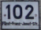

    <h2 class="section-title">{}</h2>
    <ul class="rule-list">
        <li>ドメインは.li</li>
        <li>ナンバープレートが黒い</li>
        <li>バス停やバスが黄緑色</li>
    </ul>

{}
{}
{}
ナンバープレートが黒く中央に赤色のロゴがうっすら見える{}。しかし労働者の半分は国外から来ており、隣国のナンバープレートも少なくないので注意{}{{% ref "https://ja.wikipedia.org/wiki/%E3%83%AA%E3%83%92%E3%83%86%E3%83%B3%E3%82%B7%E3%83%A5%E3%82%BF%E3%82%A4%E3%83%B3#%E7%B5%8C%E6%B8%88" "リヒテンシュタイン#経済" %}}。
{}

{}

Public domain
{}

{}
リヒテンシュタインバス（LIEmobil）の黄緑色のバス{}やバス停が見つかる{}{}。国内のメインの交通手段でありほとんどの町にバス停がある。バス停には銀色のゴミ箱が設置されていることも多く分かりやすい{}。
{}

By <a href="//commons.wikimedia.org/wiki/User:Wikiolo" title="User:Wikiolo">Wikiolo</a> - Own work, <a href="https://creativecommons.org/licenses/by-sa/3.0" title="Creative Commons Attribution-Share Alike 3.0">CC BY-SA 3.0</a>, <a href="https://commons.wikimedia.org/w/index.php?curid=79697497">Link</a>

{}
{}と共通点が多く、横断歩道が黄色かつ横断歩道の標識に7本の線がある{}。また、幹線道路の多くに黄色い自転車道が走っている{}。
{}

{}
ドイツ語圏であり『GENERELL』と書かれている{}。また非常に狭い国家だが最高峰は2600m近くあり、ほとんどの道路や街中からアルプスの山並みが望める{}。
{}

By <a href="//commons.wikimedia.org/wiki/User:Walser123" class="mw-redirect" title="User:Walser123">Walser123</a> - Own work, <a href="https://creativecommons.org/licenses/by-sa/4.0" title="Creative Commons Attribution-Share Alike 4.0">CC BY-SA 4.0</a>, <a href="https://commons.wikimedia.org/w/index.php?curid=90017181">Link</a>

{}
家の表札の番号の下に通り名が書いてある{}。{}は通り名は書かれておらず番号のみのケースが多いように思う。また、同国内の郵便サービスであるLiechtensteinische Postのロゴも見つかる{}。
{}

By Rafael P. D. Suppmann, <a href="https://creativecommons.org/licenses/by-sa/3.0" title="Creative Commons Attribution-Share Alike 3.0">CC BY-SA 3.0</a>, <a href="https://commons.wikimedia.org/w/index.php?curid=73511504">Link</a>

{}
{}
