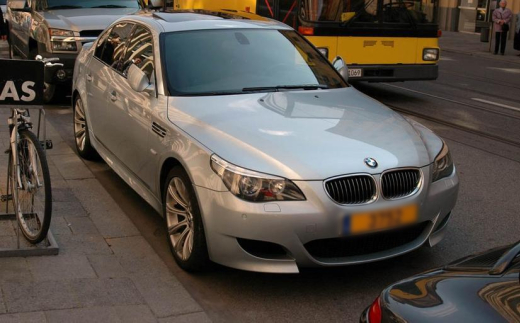
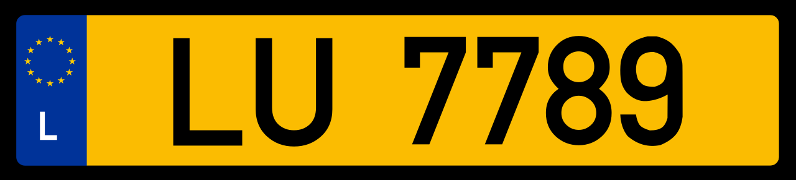
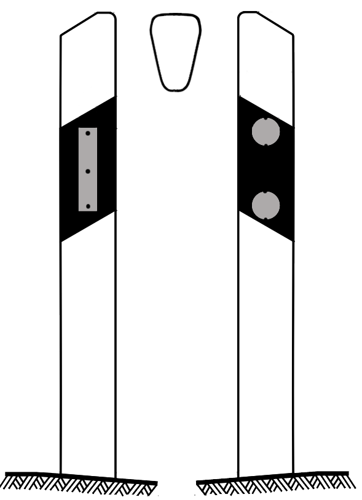
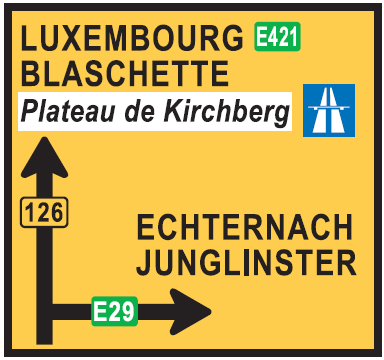
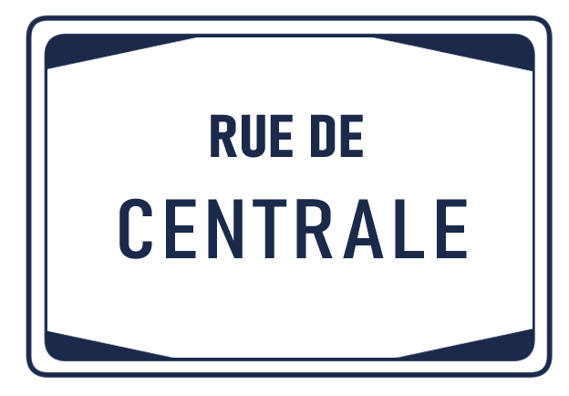
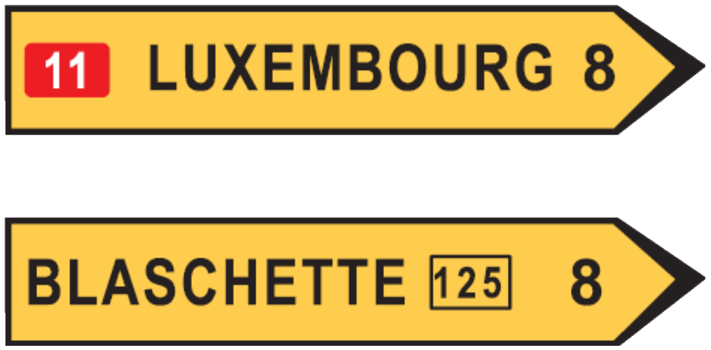

    <h2 class="section-title">{}</h2>
    <ul class="rule-list">
        <li>ドメインは.lu</li>
        <li>ナンバープレートは前後が黄色</li>
        <li>ボラードの反射板が灰色で赤やオレンジの反射板がない</li>
        <li>看板にフランス語が併記されていることがある</li>
        <li class="no-evidence">黒色の背景に黄色のシェブロンが多い</li>
        <li class="no-evidence">オランダと比べ山がちで、水路が少なく、家が全体的に白っぽく、自転車用の道路数が少ないように思える{}</li>
    </ul>
    {}
    {}

{}
{}
{}
ナンバープレートは前後が黄色。平均所得は平均的なヨーロッパ人の2.5倍であり、Volkswagen・Mercedes・Audiの売上が多い{{% ref "https://www.focus2move.com/luxembourg-car-market-2022/" "Luxembourg 2022. Car Market Closes Year With A 10.7% Loss" %}}。オランダは韓国車KIAやTOYOTAも多い。
{}

{}

Willtron, CC 表示-継承 3.0, <a href="https://commons.wikimedia.org/w/index.php?curid=4614844">Wikimedia Commons</a>による
{}

{}
ボラードの反射板が灰色で赤やオレンジの反射板がない{}。{}のボラードと見た目が似ているけれど反射板のネジの位置が違うように見えるので近くに寄れば見分けられるかも（100％正しいかはまだ調べてないです）？
{}

{}
黄色い矢印や白い矢印の形の看板に地名が書かれている{}。通り名の看板の背景が白いことが多いらしい{}。またフランス語・ドイツ語を併記した案内板がある。下に示したような八角形に囲まれた通り看板が多いように思う{}。自作の図なので縮尺・フォントは正確でないかも。
{}

<iframe src="https://www.google.com/maps/embed?pb=!4v1686237331585!6m8!1m7!1slEp21vC2y-4xGoU9xikaRA!2m2!1d49.58226398536242!2d5.955810391692049!3f319.97!4f-2.5999999999999943!5f3.305861375197646" width="295" height="295" style="border:0;" allowfullscreen="" loading="lazy" referrerpolicy="no-referrer-when-downgrade"></iframe>

{}
隣接している国で黒背景に黄色のシェブロン{}を使う国がない。ベルギー・オランダ・ルクセンブルグで迷っているときに暗い色の背景色に黄色のシェブロンをみたらルクセンブルグの可能性が高い。左２つがルクセンブルグ、右の赤白が{}・{}。フランスには白赤のほかに青白のものもある{}。
{}

{}
{}

<iframe src="https://www.google.com/maps/embed?pb=!4v1681215101775!6m8!1m7!1sxkEiQnUK0bi3YJhH9UuwhA!2m2!1d49.80313831396025!2d5.930719732202099!3f155.74313819335805!4f-4.212427024882885!5f1.7041012638308328" width="295" height="295" style="border:0;" allowfullscreen="" loading="lazy" referrerpolicy="no-referrer-when-downgrade"></iframe>
<iframe src="https://www.google.com/maps/embed?pb=!4v1679851824764!6m8!1m7!1sfUEPtWKYMUxEiFnzRBTkHQ!2m2!1d49.80549947226078!2d5.932658346598799!3f28.037884318494097!4f-20.581478578256963!5f3.137841119237799" width="295" height="295" style="border:0;" allowfullscreen="" loading="lazy" referrerpolicy="no-referrer-when-downgrade"></iframe>

{}
{}

    <h2 class="section-title">{}</h2>
    <ul class="rule-list">
        <li class="no-evidence">道端のブロックやボラードにCR～と書いてあるならばマップの黄色い番号の道路を見てみる</li>
    </ul>

{}
{}

{}
道端のブロックやボラードにCR～と書いてあるならばマップの黄色い番号の道路を見てみる。N～と書いてある{}なら赤い道路番号を見る。
{}

By <a href="//commons.wikimedia.org/wiki/User:GilPe" title="User:GilPe">GilPe</a> - Own work, <a href="https://creativecommons.org/licenses/by-sa/3.0" title="Creative Commons Attribution-Share Alike 3.0">CC BY-SA 3.0</a>, <a href="https://commons.wikimedia.org/w/index.php?curid=89262230">Link</a>

{}
{}

    <h4 class="mb-4">代表的な企業の説明</h4>
    <table class="table table-striped table-bordered">
        <thead class="table-light">
            <tr>
                <th scope="col" class="col-width-2">企業名</th>
                <th scope="col" class="col-width-1">コード</th>
                <th scope="col" class="col-width-7">説明</th>
                <th scope="col" class="col-width-05">決算</th>
                <th scope="col" class="col-width-05">配当履歴</th>
            </tr>
        </thead>
        <tbody class="corp-desc">
            <tr>
                <td>ArcelorMittal</td>
                <td>{}</td>
                <td>年間粗鋼生産量で世界2位。大企業のランキングであるFortune Global 500ではだいたい195位前後。</td>
                <td>{}</td>
                <td>{}</td>
            </tr>
            <tr>
                <td>Ternium</td>
                <td>{}</td>
                <td>アルゼンチン、ブラジル、メキシコ、グアテマラなどのラテンアメリカに拠点を持つ鉄鋼会社。</td>
                <td>{}</td>
                <td>{}</td>
            </tr>
        </tbody>
    </table>

