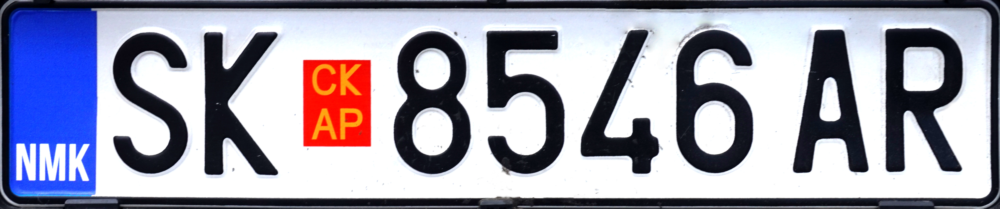

    <h2 class="section-title">{}</h2>
    <ul class="rule-list">
        <li>Domainnya adalah .mk</li>
        <li>Bahasa resmi adalah bahasa Makedonia (македонски јазик) yang memakai alfabet Kiril.</li>
        <li>Huruf Ќ・ќ dan Ѓ・ѓ hanya dipakai di Makedonia Utara.</li>
        <li>Bagian kiri plat nomor tampak sedikit merah.</li>
        <li>Ada bollard langsing dan membulat dengan tepian reflektor yang dicat hitam{}</li>
        <li>Guardrail berbentuk melengkung, berbeda dengan yang tajam di Serbia atau Montenegro.</li>
        <li class="no-evidence">Antena Google Car sering tidak terlihat.</li>
    </ul>
    {}

{}
{}

{}
Reflektor biasanya dicat hitam di sekelilingnya. Terdapat bollard bersudut tajam{} dan bollard langsing membulat{}. Guardrail tidak bersudut tajam dan antena Google Car mestinya tidak terlihat.
{}

METOKARA, <a href="https://creativecommons.org/licenses/by-sa/3.0" title="Creative Commons Attribution-Share Alike 3.0">CC BY-SA 3.0</a>, <a href="https://commons.wikimedia.org/w/index.php?curid=56952790">Link</a>

{}
Bagian kiri plat nomor tampak sedikit merah{}. Garis biru sering kali tidak ada.
{}

{}

By Upwinxp - Own work, CC BY 4.0, <a href="https://commons.wikimedia.org/w/index.php?curid=77624620">Wikipedia Commons(Link)</a>
{}

{}
Huruf Ќ・ќ dan Ѓ・ѓ dapat ditemukan (papan hitam di tengah memuat huruf Ќ).
{}

{}
{}

{}
TINEX adalah peritel lokal{}. Gerainya sangat terkonsentrasi di Skopje—mungkin strategi dominasi pasar?
{}

<iframe src="https://www.google.com/maps/embed?pb=!4v1686315288931!6m8!1m7!1srTCpo9hVCHjwqxsLsg_27g!2m2!1d41.97510302684993!2d21.45374083354337!3f213.89959290203691!4f9.107857485123375!5f1.6351547338655483" width="530" height="250" style="border:0;" allowfullscreen="" loading="lazy" referrerpolicy="no-referrer-when-downgrade"></iframe>

{}
{}

    <h2 class="section-title">{}</h2>
    <ul class="rule-list">
        <li>Di Ohrid Anda bisa menemukan taksi yang dicat biru muda dan putih{}.</li>
    </ul>

{}
{}

By Sharon Hahn Darlin - <a rel="nofollow" class="external free" href="https://www.flickr.com/photos/sharonhahndarlin/52396951461/">https://www.flickr.com/photos/sharonhahndarlin/52396951461/</a>, <a href="https://creativecommons.org/licenses/by/2.0" title="Creative Commons Attribution 2.0">CC BY 2.0</a>, <a href="https://commons.wikimedia.org/w/index.php?curid=123626652">Link</a>

{}
{}
