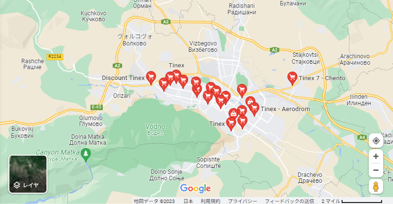

    <h2 class="section-title">{}</h2>
    <ul class="rule-list">
        <li>ドメインは.mk</li>
        <li>公用語はマケドニア語（македонски јазик）でキリル文字を使用する</li>
        <li>「Ќ・ќ」と「Ѓ・ѓ」は北マケドニア以外では使用されない</li>
        <li>ナンバープレートの左側付近が少しだけ赤く見える</li>
        <li>反射板の周りが黒色に塗られており細く丸いボラードがある{}</li>
        <li>ガードレールはセルビアやモンテネグロと異なり丸みを帯びている</li>
        <li>Google Carのアンテナが見えないことが多い</li>
    </ul>
    {}

{}
{}
{}
ナンバープレートの左側付近が少しだけ赤く見える。青いラインは無い場合の方が多い。
{}

<iframe src="https://www.google.com/maps/embed?pb=!4v1683488727497!6m8!1m7!1sEdQUhwPvCEpOWtH0MbnoJQ!2m2!1d41.99091810135219!2d21.46499973341666!3f20.31078082139549!4f-30.592458816852307!5f2.9083554603299264" width="295" height="295" style="border:0;" allowfullscreen="" loading="lazy" referrerpolicy="no-referrer-when-downgrade"></iframe>
<iframe src="https://www.google.com/maps/embed?pb=!4v1683488890983!6m8!1m7!1sgKxdD1yXh9tNwo2deS3DqA!2m2!1d41.99081838903857!2d21.46518823099309!3f202.19367154038568!4f-10.387930909500298!5f3.3140154436533846" width="295" height="295" style="border:0;" allowfullscreen="" loading="lazy" referrerpolicy="no-referrer-when-downgrade"></iframe>

{}

By Upwinxp - Own work, CC BY 4.0, <a href="https://commons.wikimedia.org/w/index.php?curid=77624620">Wikipedia Commons(Link)</a>
{}

{}
基本的に反射板の周りが黒く塗られており、角ばったボラードと細く丸いボラードがある{}。またガードレールが角ばっていない。
{}

<iframe src="https://www.google.com/maps/embed?pb=!4v1680354200981!6m8!1m7!1s8JLCET6LHx4XwuR--1pHzQ!2m2!1d41.77445223781045!2d20.86258415029428!3f244.64759863711743!4f-8.894598659661781!5f3.325193203789971" width="295" height="295" style="border:0;" allowfullscreen="" loading="lazy" referrerpolicy="no-referrer-when-downgrade"></iframe>
<iframe src="https://www.google.com/maps/embed?pb=!4v1683615532981!6m8!1m7!1sr3Dzyrpr3vs--ICyGtvqiw!2m2!1d41.94006930540755!2d21.6245100111042!3f243.73111582914936!4f-13.738625160745897!5f3.0989617672262404" width="295" height="295" style="border:0;" allowfullscreen="" loading="lazy" referrerpolicy="no-referrer-when-downgrade"></iframe>

{}
「Ќ・ќ」と「Ѓ・ѓ」の文字がある（真ん中の黒い看板にЌの文字がある）。
{}

{}
TINEXは北マセドニアの小売業者{}。なぜかスコピエにすごく集中して出店している。ドミナント戦略？
{}

<iframe src="https://www.google.com/maps/embed?pb=!4v1686315288931!6m8!1m7!1srTCpo9hVCHjwqxsLsg_27g!2m2!1d41.97510302684993!2d21.45374083354337!3f213.89959290203691!4f9.107857485123375!5f1.6351547338655483" width="530" height="250" style="border:0;" allowfullscreen="" loading="lazy" referrerpolicy="no-referrer-when-downgrade"></iframe>

{}
{}
