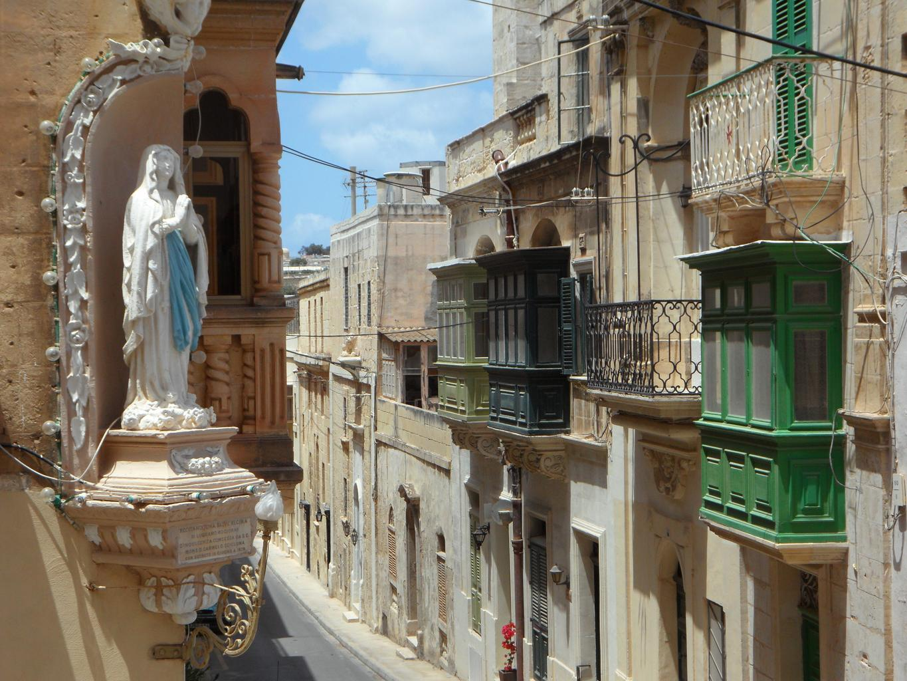
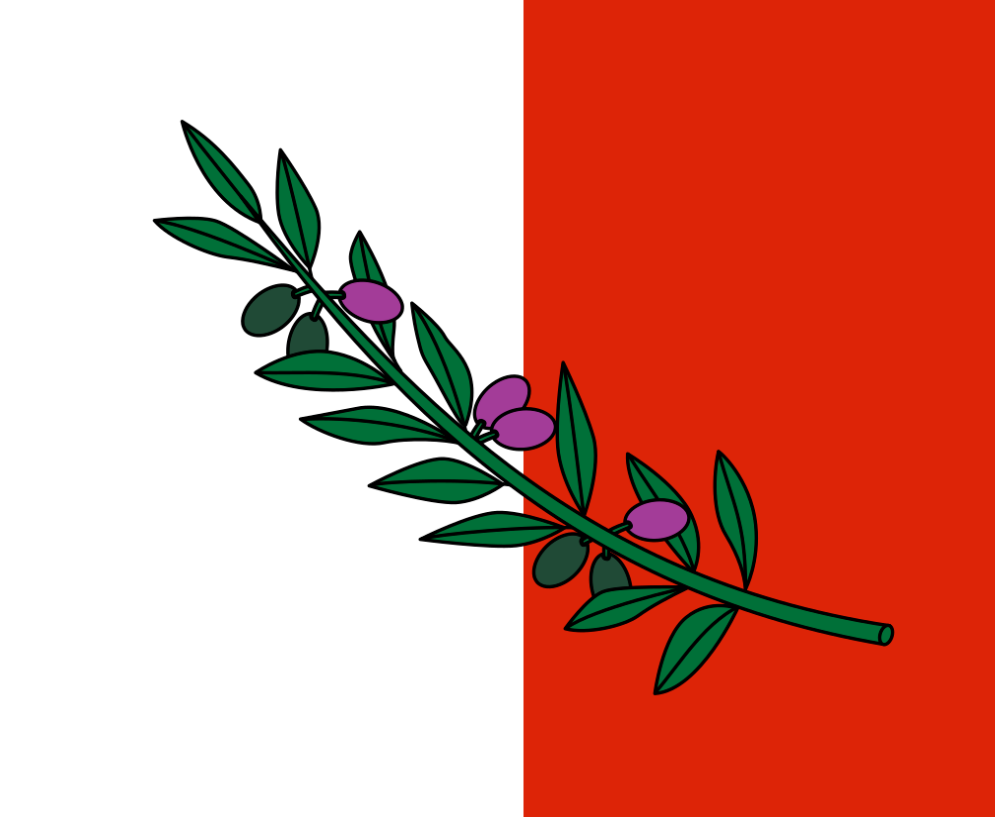

    <h2 class="section-title">{}</h2>
    <ul class="rule-list">
        <li>車は左側通行であり日本車が多くみられる</li>
        <li>ドメインは.mt</li>
        <li>通り名の看板にTRIQと書いてある</li>
        <li>公用語はマルタ語とイギリス英語</li>
        <li>石灰岩の産地であり家や壁が特徴的。薄い黄土色の石壁が島中に存在する。</li>
        <li>マルチーズはマルタ原産であり世界最古の愛玩犬として知られているという{{% by "https://ja.wikipedia.org/wiki/%E3%83%9E%E3%83%AB%E3%83%81%E3%83%BC%E3%82%BA" "wiki" "マルチーズ" %}}。ただし現地にはほぼいないらしい（<a href="https://note.interlink.blog/n/ncba2cd9e0679">出典</a>）...。</li>
    </ul>

{}
{}
{}
石灰岩を使った薄い黄土色の壁が島中に存在する。見た目が似ている石壁は{}や{}にも見られるので左側通行であることも確認する。
{}

By Alan C. Bonnici, <a href="https://creativecommons.org/licenses/by-sa/3.0" title="Creative Commons Attribution-Share Alike 3.0">CC BY-SA 3.0</a>, <a href="https://commons.wikimedia.org/w/index.php?curid=59000215">Link</a>

{}
白っぽい石でできた特徴的な建物が立ち並ぶ。バロック様式の建築が見られる{}。
{}

{}
通り名の看板にTRIQと書いてある
{}

By <a href="//commons.wikimedia.org/wiki/User:Pygar1954" title="User:Pygar1954">Pygar1954</a> - Own work, <a href="https://creativecommons.org/licenses/by-sa/4.0" title="Creative Commons Attribution-Share Alike 4.0">CC BY-SA 4.0</a>, <a href="https://commons.wikimedia.org/w/index.php?curid=118184266">Link</a>

{}
{}

    <h2 class="section-title">{}</h2>
    <ul class="rule-list">
        <li>通り名のプレートにある紋章を見れば地域が分かるけれど小さい国なので覚えるメリットは少ない</li>
        <li>基本的に西の標高が高く東の標高が低い</li>
        <li>港に多く船が泊まっているならば恐らく東側の港</li>
        <li>最南部のBirżebbuġaあたりはコンテナやタンクが多い{{% ref "https://en.wikipedia.org/wiki/Bir%C5%BCebbu%C4%A1a" "Wikipedia - Birżebbuġa" %}}</li>
    </ul>

{}
{}
{}
Rabatの町の紋章
{}

<iframe src="https://www.google.com/maps/embed?pb=!4v1688016496533!6m8!1m7!1s6wNHZYY4zm1wKWBe2t6Uvg!2m2!1d35.87682620465242!2d14.39919741634585!3f35.53437489022956!4f12.242743299431226!5f3.325193203789971" width="295" height="295" style="border:0;" allowfullscreen="" loading="lazy" referrerpolicy="no-referrer-when-downgrade"></iframe>

{}
{}
{}
船が港にたくさん停まっている→東側。コンテナターミナルがあるなら南部のBirżebbuġa周り。
{}

<a href="//commons.wikimedia.org/wiki/File:Location_Malta_EU_Europe.svg" title="File:Location Malta EU Europe.svg">Location_Malta_EU_Europe.svg</a>: *<a href="//commons.wikimedia.org/wiki/File:Location_Malta_EU_Europe.png" title="File:Location Malta EU Europe.png">Location_Malta_EU_Europe.png</a>: <a href="https://en.wikipedia.org/wiki/en:User:3meandEr" class="extiw" title="w:en:User:3meandEr">User:3meandEr</a>
derivative work: <a href="//commons.wikimedia.org/wiki/User:Trex" title="User:Trex">Trex</a> (<a href="//commons.wikimedia.org/wiki/User_talk:Trex" title="User talk:Trex">talk</a>)
derivative work: <a href="//commons.wikimedia.org/wiki/User:Bjankuloski06en" title="User:Bjankuloski06en">Bjankuloski06en</a> - このファイルの派生元： <a href="//commons.wikimedia.org/wiki/File:Location_Malta_EU_Europe.svg" title="File:Location Malta EU Europe.svg">Location Malta EU Europe.svg</a>:&amp;nbsp;, <a href="https://creativecommons.org/licenses/by-sa/3.0" title="Creative Commons Attribution-Share Alike 3.0">CC 表示-継承 3.0</a>, <a href="https://commons.wikimedia.org/w/index.php?curid=25170149">リンク</a>による

{}
{}
