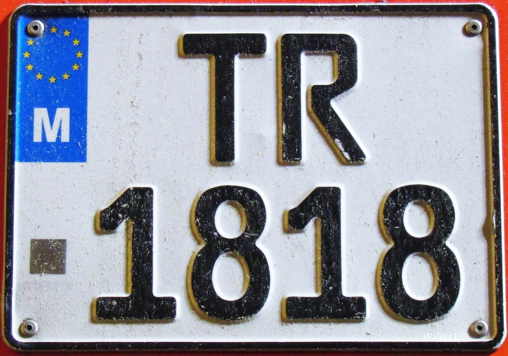

    <h2 class="section-title">{}</h2>
    <ul class="rule-list">
        <li>車は左側通行</li>
        <li>ナンバープレートはEUによくある背景白で左側が青いものが多い</li>
        <li>トレーラーや一部の車両はナンバープレートが太く左上だけが青い</li>
        <li>ドメインは.mt</li>
        <li>公用語はマルタ語とイギリス英語</li>
        <li>石灰岩の産地であり、家や壁が特徴的</li>
        <li>マルチーズはマルタ原産であり世界最古の愛玩犬として知られているという{{% by "https://ja.wikipedia.org/wiki/%E3%83%9E%E3%83%AB%E3%83%81%E3%83%BC%E3%82%BA" "wiki" "マルチーズ" %}}。ただし現地にはほぼいないらしい（<a href="https://note.interlink.blog/n/ncba2cd9e0679">出典</a>）...。</li>
    </ul>

{}
{}
{}
石灰岩を使った薄い黄土色の壁が島中に存在する
{}

<iframe src="https://www.google.com/maps/embed?pb=!4v1679668368631!6m8!1m7!1szvW6wnu1XpdR1QvIMk99Rg!2m2!1d35.8560548181086!2d14.41273861118275!3f276.1221585632379!4f0.29597480058619396!5f3.325193203789971" width="295" height="295" style="border:0;" allowfullscreen="" loading="lazy" referrerpolicy="no-referrer-when-downgrade"></iframe>

{}
トレーラーや一部の車両はナンバープレートが太く左上だけが青い
{}

<iframe src="https://www.google.com/maps/embed?pb=!4v1684784650741!6m8!1m7!1sr_gAazl4CG3VjnFA9q8XqA!2m2!1d35.90692738013305!2d14.48001084286474!3f30.936217141816787!4f-12.293292751863092!5f3.325193203789971" width="295" height="295" style="border:0;" allowfullscreen="" loading="lazy" referrerpolicy="no-referrer-when-downgrade"></iframe>
<iframe src="https://www.google.com/maps/embed?pb=!4v1684784796318!6m8!1m7!1sku5JXGS88qVO1byoMi6-EA!2m2!1d35.84203185210171!2d14.54634755571434!3f36.37530519310954!4f-9.733667515294911!5f3.325193203789971" width="295" height="295" style="border:0;" allowfullscreen="" loading="lazy" referrerpolicy="no-referrer-when-downgrade"></iframe>

{}

By <a href="//commons.wikimedia.org/wiki/User:Walser123" class="mw-redirect" title="User:Walser123">Walser123</a> - Own work, <a href="https://creativecommons.org/licenses/by-sa/4.0" title="Creative Commons Attribution-Share Alike 4.0">CC BY-SA 4.0</a>, <a href="https://commons.wikimedia.org/w/index.php?curid=84401176">Link</a>
{}

{}
{}
