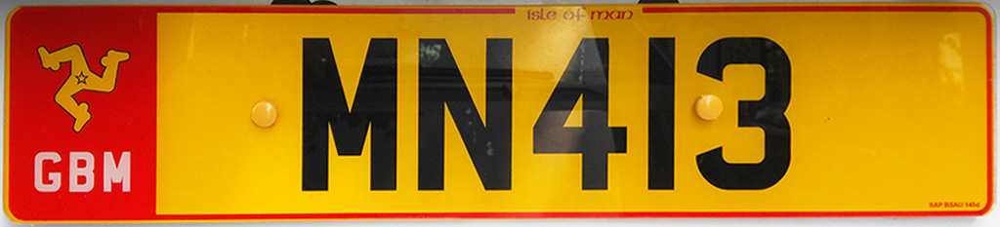

    <h2 class="section-title">{}</h2>
    <ul class="rule-list">
        <li>車は左側通行</li>
        <li>ドメインは.im</li>
        <li>ナンバープレートは左側が赤色で後ろのプレートが黄色</li>
    </ul>

{}
{}
{}
ドメインは.im。後ろが黄色いナンバープレートで左側に赤色のラインがある。
{}

<iframe src="https://www.google.com/maps/embed?pb=!4v1679138991147!6m8!1m7!1siUhod7cCOn5wmNiw_Jsknw!2m2!1d54.15647045019842!2d-4.488897953286526!3f352.13765715083855!4f-24.417657922667786!5f3.325193203789971" width="295" height="295" style="border:0;" allowfullscreen="" loading="lazy" referrerpolicy="no-referrer-when-downgrade"></iframe>
<iframe src="https://www.google.com/maps/embed?pb=!4v1686408771771!6m8!1m7!1sdXwoDTwpfKlnDt50JtrbjA!2m2!1d54.0898233912842!2d-4.74449622545797!3f342.8958615801431!4f-13.305441297488485!5f3.325193203789971" width="295" height="295" style="border:0;" allowfullscreen="" loading="lazy" referrerpolicy="no-referrer-when-downgrade"></iframe>

{}

By <a href="//commons.wikimedia.org/w/index.php?title=User:Lalpino&amp;amp;action=edit&amp;amp;redlink=1" class="new" title="User:Lalpino (page does not exist)">Lalpino</a> - Own work, <a href="https://creativecommons.org/licenses/by-sa/4.0" title="Creative Commons Attribution-Share Alike 4.0">CC BY-SA 4.0</a>, <a href="https://commons.wikimedia.org/w/index.php?curid=88521143">Link</a>
{}
{}
白色の停止線が見られるが{}では黄色で描かれている。
{}

<iframe src="https://www.google.com/maps/embed?pb=!4v1686409117515!6m8!1m7!1sOj_LMVtkaKPX2w8Q0y5zpg!2m2!1d54.08238091574675!2d-4.640365431205106!3f307.0398301232984!4f-25.753797002006664!5f2.5810773344004008" width="295" height="295" style="border:0;" allowfullscreen="" loading="lazy" referrerpolicy="no-referrer-when-downgrade"></iframe>
<iframe src="https://www.google.com/maps/embed?pb=!4v1686409173187!6m8!1m7!1s-FMNdqLd9qOkc_8_lQcjew!2m2!1d54.22219805919635!2d-4.68973052977538!3f134.0246345543752!4f-11.927489786910613!5f2.6915555887357256" width="295" height="295" style="border:0;" allowfullscreen="" loading="lazy" referrerpolicy="no-referrer-when-downgrade"></iframe>

{}
{}
{}
イギリスで見かけるものと同じボラードがある
{}

<iframe src="https://www.google.com/maps/embed?pb=!4v1681121037887!6m8!1m7!1s16LnwMHJjLYrrFhPSU3JGw!2m2!1d54.17153529412187!2d-4.613871803912569!3f113.52714938831821!4f-18.699174265819764!5f3.325193203789971" width="295" height="295" style="border:0;" allowfullscreen="" loading="lazy" referrerpolicy="no-referrer-when-downgrade"></iframe>

{}
{}
{}
緑色っぽいへんな模様がある
{}

<iframe src="https://www.google.com/maps/embed?pb=!4v1681121477195!6m8!1m7!1sC7dKsz76ul-WWwqyx9bzoQ!2m2!1d54.15605480381518!2d-4.482523373093878!3f2.6741820632657323!4f35.20678702489258!5f2.20218438606314" width="295" height="295" style="border:0;" allowfullscreen="" loading="lazy" referrerpolicy="no-referrer-when-downgrade"></iframe>
<iframe src="https://www.google.com/maps/embed?pb=!4v1681121519535!6m8!1m7!1sH4OgPJsIhTFyYYncZ_W91w!2m2!1d54.18485162935091!2d-4.649980519624544!3f316.5841606986218!4f35.48970650272469!5f2.4183447684454578" width="295" height="295" style="border:0;" allowfullscreen="" loading="lazy" referrerpolicy="no-referrer-when-downgrade"></iframe>

{}
{}